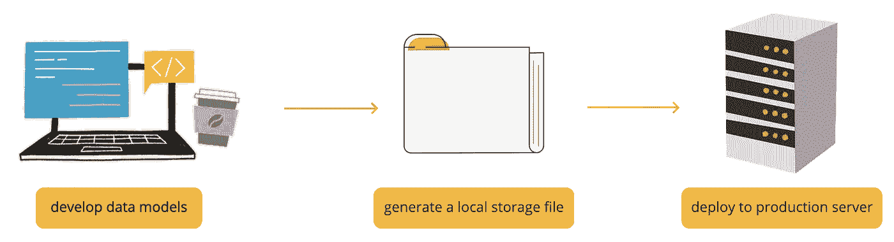
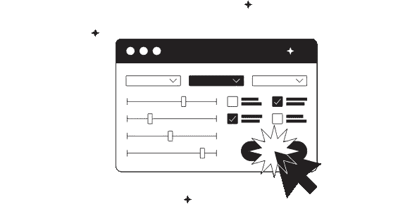

# 为 Flask Python Web 应用程序创建数据库

> 原文：<https://betterprogramming.pub/creating-a-postgresql-database-for-your-flask-web-app-ffa21fdf37b0>

## 使用 Python 的 SQAlchemy、ORM 和数据版本控制


来自[的](https://icons8.com/illustrations)[图标 8](https://icons8.com/illustrations/author/zD2oqC8lLBBA) 插图哎哟！

# 介绍

许多应用程序需要某种存储。也许你是一家在网上销售商品的企业，你需要保留一份清单。也许你正在建立一个论坛，需要跟踪每个人的帖子。我个人正在分发小说，需要准备好我的书籍和订阅清单。

在本文中，我们将了解如何使用 Flask 和 Heroku 为您的应用程序轻松设置 PostgreSQL 数据库。

如果你想开始用 Flask 构建你的应用，你可以在[我的起步助推文章](/building-a-web-app-a-starting-boost-9f037976f45f)中了解第一步。我还在这里提供了一个全栈 web 应用[的代码模板(在上面链接的文章中进行了剖析)。](https://github.com/chlolgr/flask-structure)

## 概观

为了让你阅读这篇文章时更有意义，让我们鸟瞰一下这些步骤。

您首先需要确定一个数据模型——您需要创建什么表来存储您的信息。通过为每个需要的表创建一个类，您可以用 Python 完成所有的数据建模。

然后，您可以使用我在代码模板中提供的脚本在本地实例化您的数据库。SQLAlchemy 库会将您的 Python 类转换成 SQL 语句，并在您的存储库中生成一个二进制文件来存储所有数据。对于这一步，两个 bash 命令就足够了。



来自[的](https://icons8.com/illustrations)[图标 8](https://icons8.com/illustrations/author/zD2oqC8lLBBA) 的插图哎哟！

一旦有了本地数据库，就可以测试数据移动，在路由函数中查询表，并确保一切都按照您希望的方式运行。您的本地数据库可以作为临时区域。

当你在你的机器上有了一个与你的应用程序一起工作的数据库，你可以运行在 Heroku 本地实例化它的相同脚本，并开始使用它将为生产生成的 PostgreSQL 数据库。

# 为您的数据建模

根据您需要存储的对象的复杂性，这可能需要几分钟到几个小时的思考时间。如果你像我一样，你只需要记录两件事，这是非常简单的。

## 带有 SQLAlchemy 的 ORM

使用 Flask 和 SQLAlchemy，您可以只使用 Python 来构建整个数据库。一旦您知道需要创建什么模型，您就可以将它们构建为 Python 类，而不需要一行 SQL。

对我来说，我有一个书单，然后有人报名阅读。我选择了最简单的方法来进行建模，尽可能使用最少的表:一个表用于图书，一个表用于订阅。这是我的`app/models.py`文件(为了简洁，去掉了几行):

每个表由一个继承自`sqlachemy.Model`的类表示。这构成了我们所说的对象关系映射(ORM ),它处理 SQL 表和 Python 类之间的转换，并允许您将表中的行作为类的实例进行操作。

按照惯例，您的类将带有一个带标题的单数名称，并在数据库中使用`__tablename__`属性被赋予一个小写的单数表名。

在您的类中，您可以将表列定义为类属性(相对于实例属性)。换句话说:不需要构造函数。所有的列都是`sqlalchemy.Column`实例，每个都有特定的类型——这也是来自`sqlalchemy`库中的一个类的实例。您可以在这里找到通用 SQLAlchemy 类型的列表[。](https://docs.sqlalchemy.org/en/14/core/type_basics.html#generic-types)


Python 模型生成的数据库图表(图片由作者提供)

我还添加了 unicity 约束，这种约束运行起来非常流行，并提供了一种有用的保护措施来防止重复的行和用户应该只执行一次的操作。您可以通过将它们作为参数添加到您的`Column()`启动程序中来创建约束——就像我对第 9 行和第 23 行的`primary_key`参数所做的那样——或者，如果它们跨越了几个将要成为的列，就用一个`__table_args__`属性来创建约束——就像我对第 30–32 行所做的那样，对`email, book_id`索引使用一个 unicity 约束。

## 翻译外键:Flask 关系

很容易看出 Python 类如何用 SQLAlchemy 对应 SQL 表。类的语法非常类似于`CREATE TABLE`语句的语法。然而，ORM 还会为您做一件事。

让我们放大上面代码示例中的第 27–28 行:

```
class Subscription(db.Model):
    [...]
    book_id = db.Column(db.Integer, db.ForeignKey('book.id'))
    book = db.relationship('Book', backref='book')
```

`book_id`属性是`book`表的外键，就像我们用 SQL 创建一个表一样。那么`book`属性是关于什么的呢？

[关系函数](https://docs.sqlalchemy.org/en/14/orm/basic_relationships.html#many-to-one)(这里是多对一的形式)将具有匹配`id`属性的`Book`类的实例链接到您的`Subscription`对象，这意味着您的`Book`实例将可以从所有将`id`存储在其`book_id`属性中的`Subscription`实例中访问。例如，你可以运行这样的代码:

```
>>> from app.models import Subscription
>>> s = Subscription.query.get(5)
>>> s
<Subscription 5>
>>> s.book
<Book 3>
>>> s.book.title
'The Picture of Dorian Gray'
```

# 部署您的模型

一旦定义了模型中的所有表，就需要实际创建数据库。为了拥有一个独立于生产环境的临时实例，您可以在您的计算机上创建一个本地数据库。


插图由[图标 8](https://icons8.com/illustrations/author/zD2oqC8lLBBA) 从[哎哟！](https://icons8.com/illustrations)

在`app/config.py`文件中，第`SQLALCHEMY_DATABASE_URI = os.environ.get('DATABASE_URL') or 'sqlite:///' + os.path.join(basedir, 'app.db')`行将根据当前环境为您的数据库定义正确的地址。如果`DATABASE_URL`是一个现有的环境变量(生产环境)，那就是你的应用程序将寻找你的数据的地方。否则，它将加载一个`app/app.db`文件(本地)。

我提供的代码将在您运行接下来的步骤时，在您的生产服务器上自动生成`DATABASE_URL`环境变量，并在您的机器上自动生成`app/app.db`文件。

## 生成本地数据库文件

您只需要运行带有正确参数的`manage.py`文件来启动并修改您的数据库。对于初始化(显然您必须首先运行它)，您可以运行(在 bash 中)`python manage.py db init`或`flask db init`。

然后，您应该会看到类似以下内容的内容:

```
Creating directory /absolute/path/to_your_repo/migrations ...  done
Creating directory /absolute/path/to_your_repo/migrations/versions ...  done
Generating /absolute/path/to_your_repo/migrations/script.py.mako ...  done
Generating /absolute/path/to_your_repo/migrations/env.py ...  done
Generating /absolute/path/to_your_repo/migrations/README ...  done
Generating /absolute/path/to_your_repo/migrations/alembic.ini ...  done
Please edit configuration/connection/logging settings in '/absolute/path/to_your_repo/migrations/alembic.ini' before proceeding.
```

您的数据库现在已经初始化。您现在在项目根目录下找到的 migrations 文件夹包含版本控制所需的文件。但是您的数据模型还不存在(即您的表不存在)。要部署它们，您可以运行(仍然是 bash) `python manage.py db migrate`或`flask db migrate`。然后你会看到(适应你自己的表):

```
INFO  [alembic.runtime.migration] Context impl SQLiteImpl.
INFO  [alembic.runtime.migration] Will assume non-transactional DDL.
INFO  [alembic.autogenerate.compare] Detected added table 'book'
INFO  [alembic.autogenerate.compare] Detected added table 'subscription'
Generating /absolute/path/to_your_repo/migrations/versions/8be207c95451_.py ...  done
```

当您运行迁移时，Alembic(处理数据模型版本控制的 Flask 扩展)将您更新的模型与您现有的模型进行比较，并概括变更，然后为部署进行设置。

你的桌子还没准备好使用！但是我们会成功的。最后一步是实际部署，使用`python manage.py db upgrade`或`flask db upgrade`运行。这将运行实际的`CREATE TABLE`语句，并显示:

```
INFO [alembic.runtime.migration] Context impl SQLiteImpl.
INFO [alembic.runtime.migration] Will assume non-transactional DDL.
INFO [alembic.runtime.migration] Running upgrade -> 8be207c95451, empty message
```

如果一切顺利，现在就可以填充和查询表了！✨


插图由 [Oleg Shcherba](https://icons8.com/illustrations/author/TQQ1qAnr9rn5) 从[哎哟！](https://icons8.com/illustrations)

每次您对您的模型进行更改时，您都需要再次迁移和升级。⚠️小心， [Alembic 不会跟踪你模型的所有变化](https://alembic.sqlalchemy.org/en/latest/autogenerate.html#what-does-autogenerate-detect-and-what-does-it-not-detect)；因此，即使有了版本控制，你也应该认真考虑如何组织你的数据。

## 在 Heroku 上创建 PostgreSQL 数据库

一些好消息:在 Heroku 上部署模型的步骤与生成本地二进制文件的步骤相同——您只需要直接从服务器上运行 bash 命令。

您不需要为 PostgreSQL 显式添加该插件，因为 Heroku 会自动为具有某些库的应用程序提供该插件(如 SQLAlchemy)。Heroku 还将为您生成您的`DATABASE_URL`环境变量，如果您计划从您的机器上读写数据库(即您不需要一个登台环境)，您可能希望将该变量复制到您的本地环境文件中。

您只需要提交您的更改并将其推送到您的`app/models.py`文件，同时确保 git 不会跟踪您的`migrations`文件夹和`app/app.db`文件(将它们添加到您的`.gitignore`)。

然后，您可以运行:

```
heroku run bash
>>> python manage.py db init
>>> python manage.py db migrate
>>> python manage.py db upgrade
```

你完了。

正如我提到的，您的`app/config.py`文件将根据您的环境处理正确数据库的选择(本地二进制文件与 PostgreSQL 实例)。确保不要将`migrations`文件夹混在一起，以避免冲突！

# 填充和查询您的数据

基本上有两种方法可以运行 DML 语句。您可以创建一个到数据库的连接并使用 SQL，也可以使用 ORM SQLAlchemy 提供的。我推荐使用 ORM，因为它免去了您的连接设置。

要在 SQL 上运行，您可以使用一个简洁的小函数，如下所示:

然后您可以运行插入和更新，或者使用常规 SQL 查询您的数据库(记住使用 PostgreSQL 语法)。

您也可以像这样查询您的数据库(如果您需要一个数据框架来进行进一步的操作，那就太好了):

```
import pandas as pd
from app import db
df = pd.read_sql(<YOUR-SQL-QUERY>, db.session.bind)
```

或者像这样运行插入或更新(特别有助于快速修复):

```
from app import db
db.session.bind.execute(<YOUR-SQL-STATEMENT>)
```

我们现在将介绍 ORM 方法。首先，你可以在官方文档的[中找到我在这篇文章中收集到的很多东西。](https://flask-sqlalchemy.palletsprojects.com/en/2.x/queries/)

## 选择

有了 ORM，您的模型类(从 Flask 模型类继承而来)有了供选择的内置函数。



Igor Kapustin 插图来自[哎哟！](https://icons8.com/illustrations)

让我们看看我会如何从书架上拿书。

如果我知道书的 ID(假设它在 AJAX 发送给我正在运行的函数的路径的参数中)，我可以简单地运行`Book.query.get(<book-id>)`来检索对象。我也可以把所有的书作为列表检索，用`Book.query.all()`；或者我可以用一种我只能称之为“python 化 SQL”的语法来过滤结果。

我的网络应用程序的一个最新功能是书架搜索栏。例如，如果你搜索“夏洛克·福尔摩斯”，你应该会找到《夏洛克·福尔摩斯历险记》。我现在保持简单(不允许拼写错误)，对书名进行简单过滤。

☝️:当用户发送一个带有搜索栏输入的表单时，我可以使用我的 orm 通过将输入转换成小写并使用`like`函数在我的数据库中模糊搜索来检索列表——这可以从典型的 SQL 语法中识别出来。

您可以在这里找到更多 SQL 功能的 SQLAlchemy 仿真[。当我需要的查询变得复杂时，我倾向于直接使用 SQL，因为我已经习惯了 it⁴.](https://docs.sqlalchemy.org/en/14/core/functions.html)

## 插入

使用 ORM 编写数据就像用 Python 创建对象一样简单。比方说我想把列夫·托尔斯泰的*安娜·卡列尼娜*加到我的`book`桌。我只需要创建一个`book`对象，就像这样:

在第 8 行，SQLAlchemy 将这本书添加到我的数据库中，但是只针对当前会话。如果我打开一个新的连接，这本书将不会在那里。第 9 行提交新行，并“永久地”插入它。我添加`try` / `except`子句的原因是，如果违反了任何约束，您的提交将不起作用。

当您试图提交一个违反您已经制定的规则的更改时，SQLAlchemy 在您收回您的错误之前不会容忍任何进一步的 DML 这就是我在第 10 行执行回滚的原因。

## 更新

运行更新包括简单地检索您想要更新的对象，用 Python 更新新值，并为您的数据库运行一次提交。

例如，如果我意识到我把《简·爱》归功于简·奥斯汀，我想澄清事实，我可以这样做:

```
from app import db
from app.models import Bookbook = Book.query.filter_by(title = 'Jane Eyre')
book.author_name = 'Charlotte Brontë'
db.session.commit()
```

**值得一提的是:**对于批量插入和更新，我也求助于 SQL。你可以[创建你所有的对象并将它们提交到一起](https://stackoverflow.com/questions/3659142/bulk-insert-with-sqlalchemy-orm)，但是我发现 SQL 连接更干净。

# 结论

Heroku 和 Flask 极大地简化了 web 应用程序中 PostgreSQL 数据库的使用。第一次部署时会遇到许多障碍，但是本文有望帮助您避开其中的大部分。


插图由[娜塔莎雷马克](https://icons8.com/illustrations/author/u7l2K4BCiAa9)从[哎哟！](https://icons8.com/illustrations)

在您的机器上有一个用于暂存的数据库，您可以开发您的模型，并在本地运行您的应用程序时测试它们。一旦您满意了，您可以使用完全相同的命令将它们部署到您的服务器上，从 Heroku CLI 运行。

始终注意不要混淆本地数据库和服务器数据库之间的迁移，否则您将不得不牺牲版本控制来让事情再次运行(我已经这样做了几次)。

如果你遇到任何问题，有任何疑问，或者找到了更聪明的方法，请告诉我！在以后的文章中，我将会介绍更多的全栈 web 应用细节。

# 笔记

1.  关系数据库[中表名的单数和复数之争在](https://stackoverflow.com/questions/338156/table-naming-dilemma-singular-vs-plural-names)上激烈展开，但与本次讨论无关。随你的便。
2.  如果您不熟悉 Python 类，并且您只是来进行 web 应用程序开发的，那么不要担心什么是构造函数或者为什么您不需要构造函数。你可以照着代码做。
3.  DML 代表数据操作语言，与数据定义语言(DDL)相对。DDL 包括诸如`CREATE`、`ALTER`和`DROP`之类的语句，这些语句有助于构建您的模型。DML 包括`INSERT`、`UPDATE`和`SELECT`语句，它们在您的模型中操作数据。
4.  我只在个人项目中使用 Flask。如果我是出于专业目的使用它，我可能更愿意付出努力，使用 ORM，如果这看起来是一个更好的解决方案。