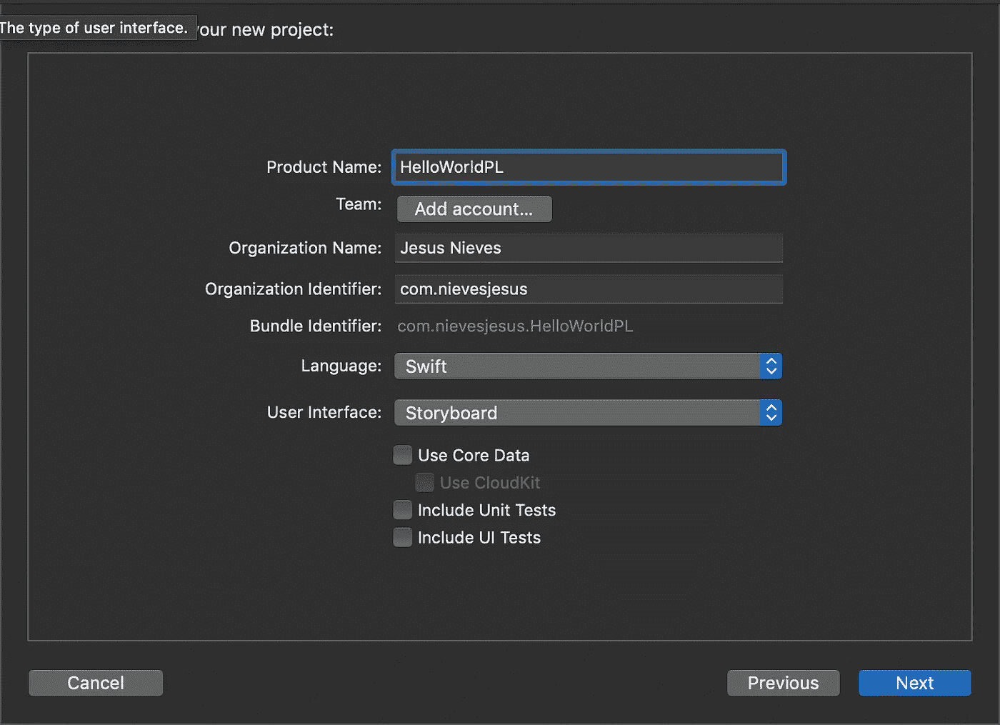
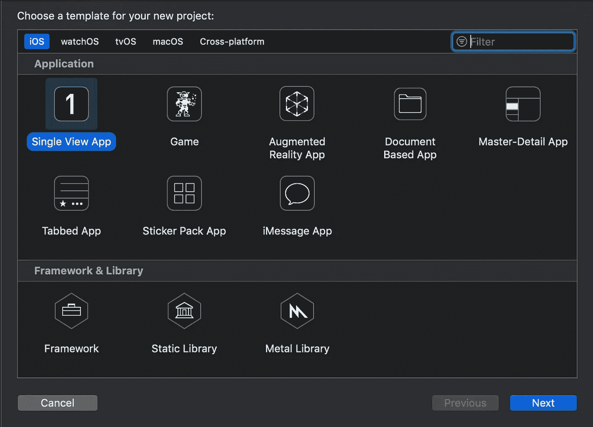
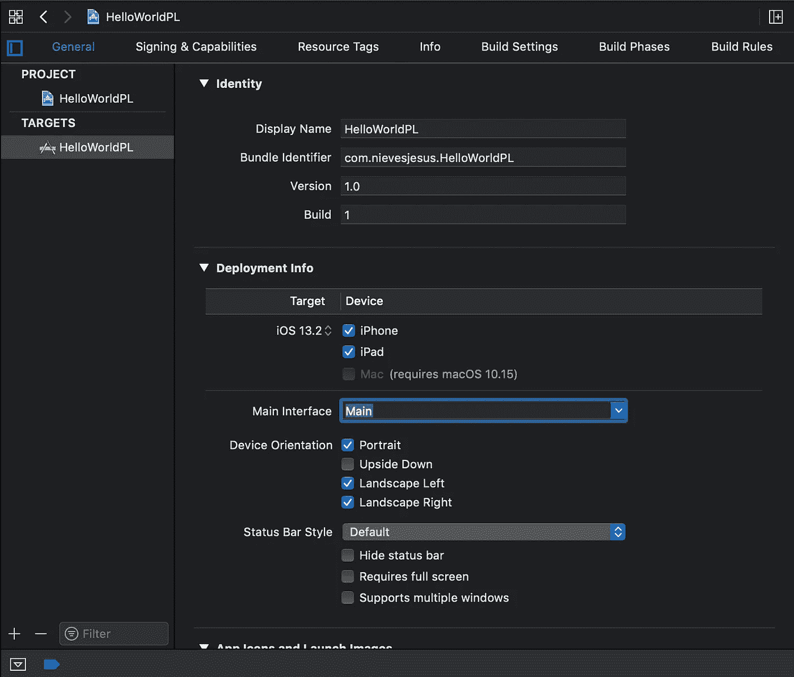
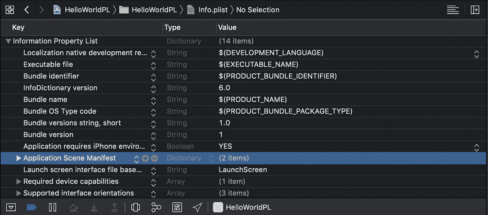
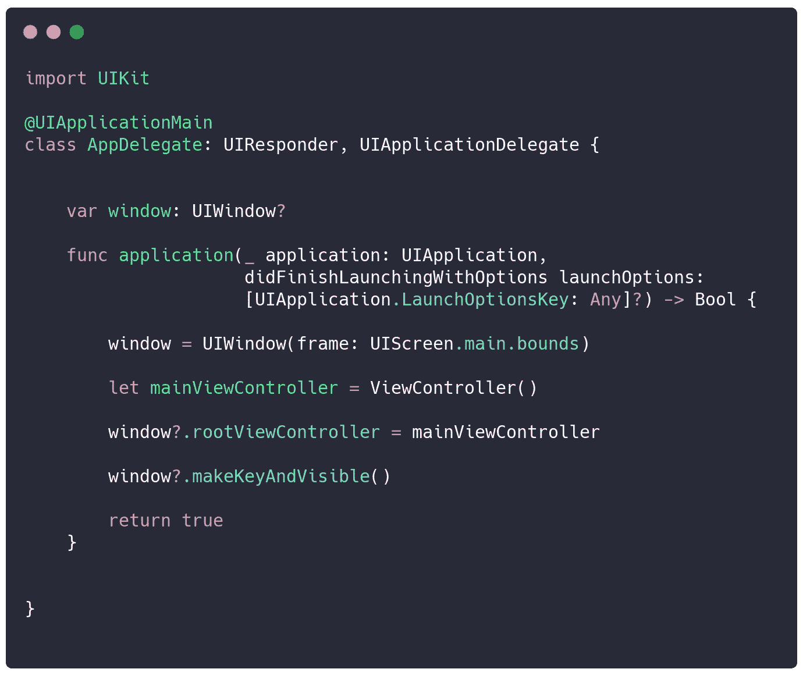

# 如何使用 Xcode 11 创建没有故事板的 iOS 项目

> 原文：<https://betterprogramming.pub/creating-a-project-without-storyboard-in-2020-and-without-swifui-82080eb6d13b>

## 创建一个没有 SwiftUI 和故事板的新项目

照片由 [Nikhil Mitra](https://unsplash.com/@nikhilmitra?utm_source=unsplash&utm_medium=referral&utm_content=creditCopyText) 在 [Unsplash](https://unsplash.com/s/photos/create?utm_source=unsplash&utm_medium=referral&utm_content=creditCopyText) 上拍摄

# 开始项目

我们必须清理我们的项目并删除故事板，以便只处理以编程方式创建的视图。在 Xcode 11 中，我们创建一个新项目，选择 Storyboard 而不是 SwiftUI。

选择“单视图应用程序”。

# 清理项目

当项目打开时，我们删除`Main.storyboard`文件，然后移除它的引用。

首先，在*常规*选项卡中，我们删除主界面区域中的“主”字。

然后，在我们的`Info.plist`中，我们把“应用场景清单”这一整节去掉。

一旦完成，我们去我们的`AppDelegate.swift`，删除所有的代码，并添加必要的代码来启动我们的`ViewController`，不需要故事板。

我们执行我们的项目，并看到一切都进展顺利…嗯，几乎一切，现在我看到一个空白的视图，没有其他的…

是时候以编程方式创建我们的视图，并至少看到一个漂亮的“Hello，World”了。

# 结论

为什么你一直这样做，而不是直接用 SwiftUI 做呢？

首先，SwiftUI 没有向后兼容性。我曾经开发过一些大公司的应用程序，它们试图给用户带来尽可能小的摩擦，为此，它们必须支持旧版本的操作系统。

SwiftUI 仅受新的操作系统版本支持。此外，我认为 SwiftUI 还没有完全准备好，还缺少一个转折(但这只是我的看法)。