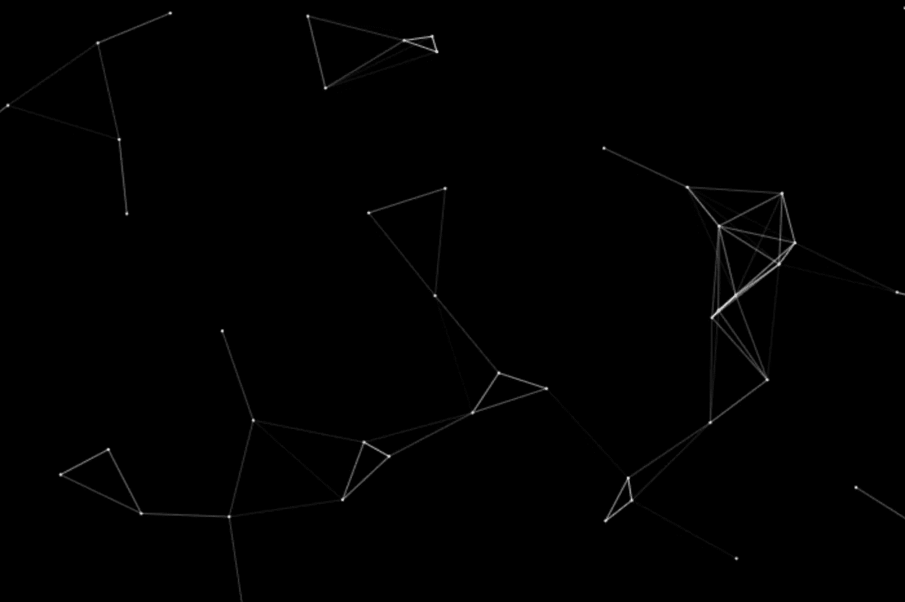
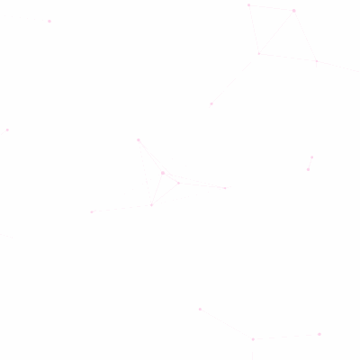

# 创建邻近图动画

> 原文：<https://betterprogramming.pub/creating-a-proximity-graph-animation-an-introduction-to-html5-canvas-and-the-animation-loop-45719d82d1a3>

## 2D HTML5 画布和动画循环介绍



图片来源:作者

我正努力充分利用这些隔离的日子，学习新东西成了我最喜欢的消遣。几天前，我在浏览[盖茨比](https://www.gatsbyjs.org/)教程时偶然发现了[如何绘制 QL](https://www.howtographql.com/) 。我真的很喜欢这个背景动画，我决定用 HTML5 画布复制它。



[如何绘制背景动画](https://www.howtographql.com/)

如果你好奇想看看最终的结果，我已经在 [GitHub](https://github.com/vdeantoni/proximity-graph-animation) 和 [CodePen](https://codepen.io/vdeantoni/pen/wvaEoxE) 上发布了一个[演示](https://proximity-graph-animation.netlify.app/)和源代码。

事不宜迟，我们开始吧。

# 目录

```
· [Let’s Define the Work](#f593)
· [Set Up the HTML and Canvas](#2c67)
· [Draw the Points](#5447)
· [Implement the Animation Loop](#1b35)
· [Move the Points](#cc7a)
· [Draw the Lines](#fe87)
· [Polish](#df84)
```

# 让我们来定义这项工作

动画的工作原理是以恒定速度在固定方向上移动点，并在任何两个彼此靠近的点之间绘制直线。

在此基础上，我们将工作分解为以下任务:

*   设置 HTML 和画布
*   画出要点
*   实现动画循环
*   移动点
*   画线
*   抛光剂

# 设置 HTML 和画布

我们将从创建一个带有`<canvas>`元素的基本 HTML 布局开始。

我们已经给了`<canvas>`元素一个 ID，我们将使用它通过 JavaScript 访问元素及其 [API](https://developer.mozilla.org/en-US/docs/Web/API/Canvas_API) ，以及像素中的`width`和`height`。

# 画出要点

有了`<canvas>`元素，我们可以开始使用 JavaScript 和 2D 渲染上下文 [API](https://developer.mozilla.org/en-US/docs/Web/API/CanvasRenderingContext2D) 在上面绘制东西。

上面的代码在画布中间画了一个半径为 1 像素的黑色圆圈。

如果你跟不上，你可以使用下面的代码笔:

我们现在将生成固定数量的 20 个点，随机放置在画布上。对于每个点，我们将创建一个对象，该对象最初包含该点的 x 和 y 位置。创建完成后，对象将被添加到一个列表中，我们稍后将使用该列表迭代并绘制每个点。

我们还创建了一个辅助函数，它依赖于`Math.random()`来生成一个给定范围内的随机数。当创建一个点时使用这个函数，允许我们在画布的边界内随机定位它。

是时候画点了。我们将对绘制点的代码做一些修改，并在迭代点列表时使用它。

把这些放在一起，我们就可以在画布上画出所有的随机点。

你可以用下面的代码笔看到它:

# 实现动画循环

我们知道这些点必须四处移动。为了实现这一点，它们需要被动画化。我喜欢引用的一个动画定义是:

> *“一部动画只不过是变化的可视化——一段时间内发生的变化。”—*[](https://www.oreilly.com/library/view/creating-web-animations/9781491957509/ch01.html)

*幸运的是，现代浏览器提供了一个非常方便的方法叫做`[requestAnimationFrame](https://developer.mozilla.org/en-US/docs/Web/API/window/requestAnimationFrame)`，我们可以用它来动画显示画布上的点。该方法将回调作为参数，供浏览器在重绘屏幕时调用。*

*回调是我们提供的一个函数，我们将使用它来处理点的位置，并确定两个点是否应该连接。回调通常每秒调用 60 次，或者每 1/60 秒调用一次(大约 16ms)。*

*一旦我们完成处理，浏览器将呈现一个新的框架，在新的位置上显示点和它们的连接。有了足够的帧数，我们的动画就会栩栩如生！*

*我们现在将创建动画循环。*

*就是这样。多亏了`requestAnimationFrame`，我们只需要四行代码，每当浏览器准备好渲染另一帧时，我们的`loop`函数就会被调用，同样，以每秒 60 帧的速度，每 16 毫秒渲染一帧。*

*用 JavaScript 实现动画循环时，需要考虑更多的事情。我推荐阅读关于[处理非活动标签](https://hacks.mozilla.org/2011/08/animating-with-javascript-from-setinterval-to-requestanimationframe/)和关于[计时问题](https://muffinman.io/javascript-animation-loop/)的内容，因为我不会在本文中讨论这些内容。*

# *移动点*

*当我们定义我们正在创建的动画时，我们说点以恒定的速度在固定的方向上移动。我们可以用一个 [2D 向量](https://www.intmath.com/vectors/3-vectors-2-dimensions.php)来表示一个点的方向和速度。*

*向量有水平(x)和垂直(y)分量，还有一个大小。这两个分量决定了指向的方向。通常用角度(度或弧度)来描述。幅度是向量的长度，或者在我们的情况下是点的速度，它决定了点在特定时间点在它“面对”的方向上移动的速度。*

*我们知道我们可以用角度和弧度来表示方向，但是我们用什么来表示速度呢？举个例子，我们可以说一辆汽车以每小时 60 英里的速度行驶，一个人以每秒 1.4 米的速度行走。我们在学校都学过一个简单的公式，定义速度等于距离除以时间。我们工作的距离和时间是多少？*

*你现在看到的屏幕是由像素组成的，我们可以用像素的数量来决定它的逻辑显示尺寸。这也是我们在定义`<canvas>`的宽度和高度时使用的单位:我们都设置为 400px。因为点会在画布和屏幕上移动，我们可以用像素作为距离的单位。*

*而且，正如我们上面提到的，浏览器会让我们每隔 16 毫秒处理一次动画。我们称之为帧持续时间，这是我们的时间单位。这样，速度就是每帧持续时间的像素。*

*实际值可以是我们想要的任何数字。我们可以尝试不同的值来确定什么是最好的。*

*现在，回到移动点。在基本三角学的帮助下，我们可以用两个方程计算已知方向和速度的点的位移:*

*x =速度* cos(方向)
y =速度* sin(方向)*

*如果我们将位移加到当前位置，我们将得到该点的下一个位置。*

*数学够了，我们来编码吧。*

*我们创建了一个名为`movePoint`的函数，给定一个点对象，现在有了两个新属性`s`和`d`，更新点的位置。这个函数将作为动画循环的一部分被调用。*

*我们还需要改变点的创建来设置两个新的属性。*

*我们设置`d`为 0 到 360 度之间的一个随机数，所以点会向随机方向移动，`s`为 1 px/fd。*

*把我们到目前为止所有的放在一起，我们应该有移动点！*

*请看下面的直播:*

*等等，为什么这些点会留下痕迹？这就是画布的工作原理。这是一个限制，一旦一个形状被画出来，它就保持不变。幸运的是，有一个简单的方法可以解决这个问题。我们所需要做的就是在动画循环开始时调用`[clearRect](https://developer.mozilla.org/en-US/docs/Web/API/CanvasRenderingContext2D/clearRect)(0, 0, canvas.width, canvas.height)`，它将清除画布上之前已经绘制的任何形状。*

# *画线*

*我们现在将画出连接任意两个足够近的点的线。当两点之间的距离小于 100 像素时，我们会说这两点足够近。*

*我们如何找到所有两点之间的距离小于或等于 100px 的点对？出于本文的考虑，我们将选择一种非最优但简单的方法。*

*对于每个点，我们将查看所有其他点，计算距离，并决定是否需要绘制一条线。*

*我们可以对这段代码进行一些性能改进，例如:*

*   *通过检查`other.x > point.x + CONNECT_DISTANCE`或`other.x < point.x — CONNECT_DISTANCE`或`other.y > point.y + CONNECT_DISTANCE`或`other.y < point.y — CONNECT_DISTANCE`来消除明显的点*
*   *记录连接，这样就不会画两次线，`point — other`和`other — point`*

*不考虑改进，只要我们有两个嵌套循环，时间复杂度仍然是 O(n ) *。*如果你有兴趣了解这个问题的更好、更复杂的解决方案，我推荐你阅读 Q[uad tree](https://en.wikipedia.org/wiki/Quadtree)、[k-d tree](https://en.wikipedia.org/wiki/K-d_tree)和[范围搜索](https://en.wikipedia.org/wiki/Range_searching)。*

*让我们看看我们在哪里:*

*不错！我们快到了。*

# *抛光剂*

*我们已经走了很长一段路。我们从一个空白的画布开始，现在我们有了四处移动的点，当它们足够接近时就可以画线了。*

*在本文中，我们还想做两件事:在点移出画布时恢复它们，并添加线条拉伸效果。*

*有几种方法可以实现前者。一旦点移出画布，我们就可以从列表中删除它们。然后，对于我们移除的每个点，我们在随机位置添加一个新的点。我们也可以在他们一到达边境就把他们反弹回来，或者我们可以“传送”到对面的地方 *à la* PacMan。*

*对于本文，我们将实现第一种方法，因为我们已经有了它的大部分代码。*

*在我们处理完动画循环中的下一个位置后，我们将删除出界的点。*

*除了将点创建循环移动到动画循环中做一些小的改动，我们还必须将`points`从`const`改为`let`。我们也将用`points.length`而不是`0`来初始化`i`。这样，我们总是会在删除一些点后立即添加新的点。*

*关于线条拉伸效果，如果你密切关注 [How To GraphQL](https://www.howtographql.com/) 背景动画，线条实际上会随着点彼此远离而拉伸变细。我们将尝试通过根据距离改变线条的不透明度来复制这一点。*

*完整的 JavaScript 代码:*

*这是一个现场演示:*

*感谢阅读，我希望你今天学到了一些新东西。*

*保重，我们下次再见！*