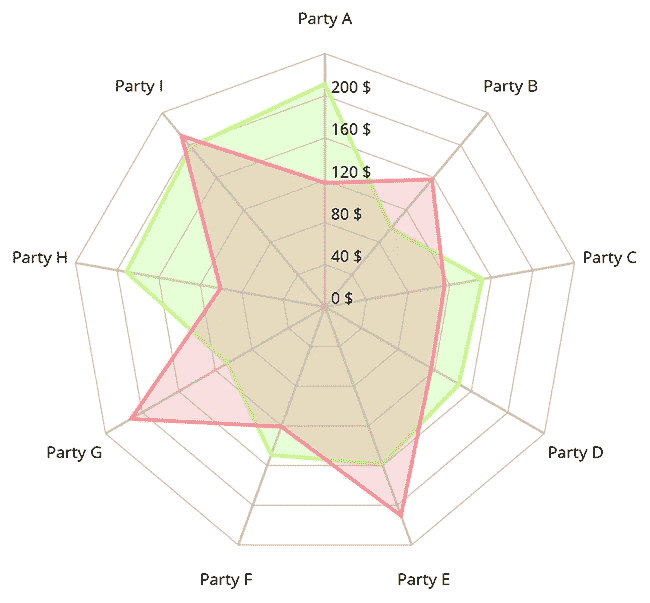
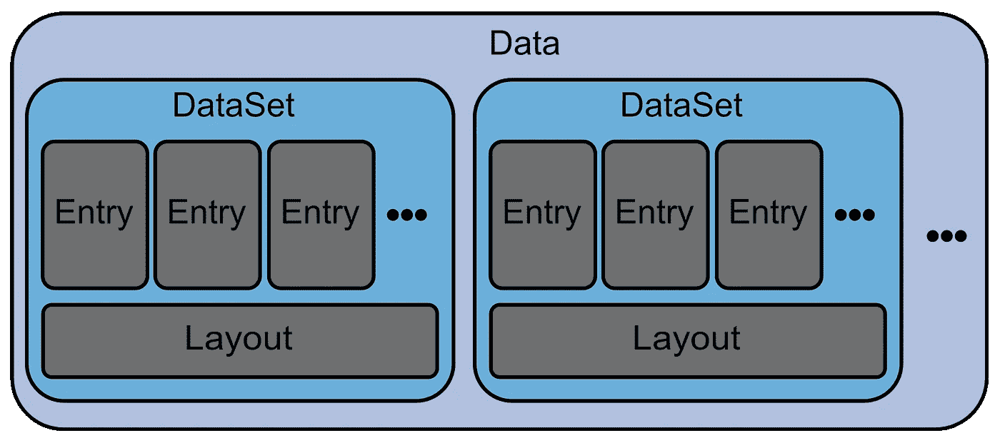
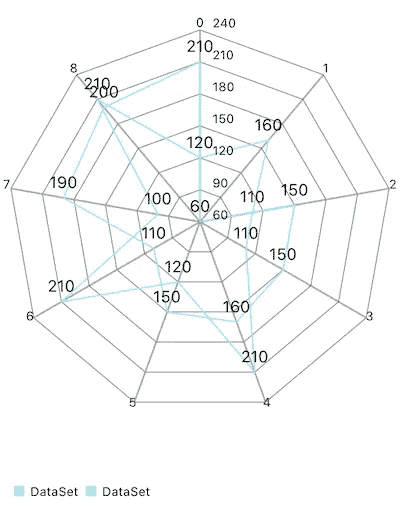
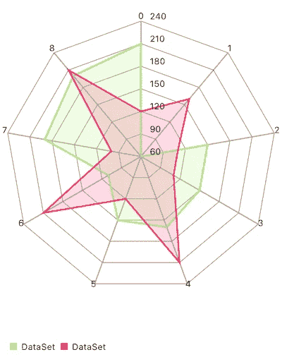
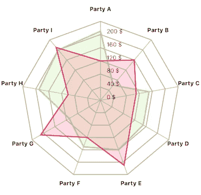

# 在 Swift 中创建雷达图

> 原文：<https://betterprogramming.pub/creating-a-radar-chart-in-swift-5791afcf92f0>

## 用框架图绘制数据

用[图表](https://github.com/danielgindi/Charts)制作的雷达图示例。

在本文中，我们将探讨如何在 Swift 中创建雷达图来绘制我们的数据。

雷达图是一种特殊的图表，具有网状结构和星形形式，因此，有时也被称为蛛网图或星图。上图就是一个很好的例子。

我们不会从头开始创建这样的图表，相反我们将使用框架[图表](https://github.com/danielgindi/Charts)，它包含八种不同类型的图表，包括这些雷达图。

为了了解如何使用这个框架，我们将尝试重新创建上面的图表，该图表包含在项目的自述文件中。

我们将从向普通雷达图添加一些数据点开始。最后，我们将通过添加颜色、配置轴和定义如何格式化标签来设置图表的样式。

**更新(03/24/2020):** 在最后一节中，我们将了解如何通过 SwiftUI 使用图表。

# 添加数据

让我们从向图表视图添加一些示例数据开始，通过定位一个普通的`UIView`并将其类设置为我们想要显示的图表视图(在本例中为`RadarChartView`),我们可以简单地通过 storyboard 将这些数据添加到视图控制器中。

我们可以通过从视图添加一个`IBOutlet`到我们的视图控制器来配置它。

为了显示这个`RadarChartView`中的数据，我们需要创建一个新的`RadarChartData`实例。这个类包装了一个或多个`RadarChartDataSet`对象，这些对象又包含了`RadarChartDataEntrie`对象的实例。

您可以将数据条目视为图表中的一个数据点。一个数据集将它们捆绑成组，并添加一些布局信息，例如连接一个组的每个条目的线条的颜色。

最后，数据对象为图表视图捆绑这些设置。

下图中可以看到这种层次结构:

为图表绑定数据的类结构。

为雷达图创建数据。

`// 1` —首先，我们创建两个`RadarChartDataSet`的实例，它们都包含我们将在图表中呈现的数据条目。第一个包含绿色区域的点，第二个包含红色区域的点。在这个例子中，每个`RadarChartDataEntry`只包含一个 double 值，但是您也可以添加一个图标并为一个条目定义任意数据。

`// 2` —我们通过将两个数据集传递给初始化器，将两个数据集包装在一个`RadarChartData`对象中。

`// 3` —最后，我们将`RadarChartView`的`data`属性设置为创建的数据对象。

这是添加数据条目后的图表外观:

具有两个数据集和默认布局的雷达图。

哦，这看起来真的不像我们想要的结果！但是通过在接下来的步骤中设计`RadarChartDataSet`和`RadarChartData`的样式，我们将得到一个好看的图表。

# 自定义数据集的布局

在这里，您可以看到包含红色区域条目的数据集的设置，但绿色区域的条目几乎完全相同:

设置 RadarChartDataSet 的样式。

`// 1` —我们首先将属性`lineWidth`从默认值`1`增加到`2`。这定义了连接这些点的线的宽度。

`// 2` —由于我们不想使用默认的浅蓝色，下一步是创建两种新颜色，一种用于线条，一种用于填充。您可以使用相同的颜色，但是通过使用具有较低 alpha 值的填充颜色，这两个区域将更加明显。这些颜色用于属性`colors`和`fillColor`。此外，我们需要将标志`drawFilledEnabled`设置为`true`。

`// 3` —这里要做的最后一件事是给数据集一个`valueFormatter`来格式化每个数据条目的标签。我们需要添加一个自定义格式化程序，因为我们不想在每个点的末尾显示确切的值。稍后将解释类`DataSetValueFormatter`，以及我们将在下一步中使用的其他值格式化程序。

带有样式化雷达图表数据集的雷达图。

这个看起来比上一个版本好看多了！既然两个数据集有不同的颜色和填充，我们可以更好地区分它们。在最后一步，我们将配置我们的`RadarChartView`。

# 配置图表视图

如果您将图表的当前状态与开头的示例进行比较，您会发现它们并不匹配。

x 轴的标签丢失，y 轴的标题是没有$符号的普通数字，并且轴的缩放比例不正确。在最后一步中，我们将通过配置`RadarChartView`来改变所有这些事情。

配置 RadarChartView。

`// 1` —如前所述，我们通过故事板添加了`RadarChartView`。

`// 2` —为了重新创建示例图表，我们定义了`webLineWidth`和`innerWebLineWidth`的值，T3 是从中心到标签的直线的宽度，而【】是连接 web 线的内部线条的宽度。

这里，值`1.5`似乎与示例中的相同。因为这已经是第一行宽度的默认值，我们可以在这里忽略它。

内部线条的默认值是`0.75`，因此，没有任何变化，它们会变细。此外，我们对两种类型的线条都使用了颜色`lightGray`。

`// 3` —在此图表中，不仅有一个 x 轴，实际上有九个，每个入口点一个。x 轴是从图表中心到边缘的网状线，我们需要改变标签的样式、位置和内容。

为此，我们需要做的第一件事是从`radarChart`获取对它们的引用。我们改变`labelFont`和`labelTextColor`以及位置。

为了将标签从图表上移开一点，我们设置了`xOffset`和`yOffset`的值。x 轴也有一个自定义的格式化程序，稍后会展示。

`// 4` —就像我们对 x 轴所做的一样，我们需要从图表中获取 y 轴。同样，我们设置了`labelFont`和`valueFormatter`，但是我们也将属性`labelCount`设置为值`6`以仅显示六个内部行。

通过禁用`drawTopYLabelEntryEnabled`，我们不显示图表的最高值，即`240 $`。你也可以禁用最低的 y 标签，但是因为`0 $`出现在例子中，我们也将保留它。

通过将`axisMinimum`设置为`0`，图表将具有正确的缩放比例，并且不再从`60`的最小值开始。

`// 5` —最后，我们设置额外的值，例如禁用旋转和隐藏图例，默认情况下是可见的。

为了显示和操作显示在轴和数据条目上的标签，我们使用了三种不同的值格式化程序。让我们看看它们是什么以及它们是如何工作的:

使用 ValueFormatter 操作图表中的标签。

`// 1` —我们使用的第一个格式化程序是`DataSetValueFormatter`，我们用它来不显示每个条目的值。这个类实现了协议`IValueFormatter`，并且只需要实现一个叫做`stringForValue(_:entry:dataSetIndex:viewPortHandler:)`的方法。

这看起来可能很复杂，但是因为我们不想显示任何标签，所以我们简单地返回一个空字符串。

`// 2` —我们使用`XAxisFormatter`在网页行的末尾添加每个数据条目的描述。

这个类实现了协议`IAxisValueFormatter`，它定义了一个与前面的格式化程序协议类似的方法。首先，我们通过将字母“A”到“I”附加到字符串“Party”来准备标题，然后我们返回给定值的标题。

`// 3` —我们使用的最后一个格式化程序是`YAxisFormatter`，它实现了与 x 轴相同的协议。它所要做的唯一任务就是将美元符号附加到每个内部 web 行标题上。

我们雷达图的最终状态。

嘿，终于看起来像它应该的那样了！

# 在 SwiftUI 中使用图表

之前我们通过故事板添加了`RadarChartView`。让我们看看如何将它与 SwiftUI 结合使用:

`// 1` —要从 SwiftUI 访问该视图，我们需要定义一个符合协议`UIViewRepresentable`的自定义结构。这个结构将创建并配置`RadarChartView`。

`// 2` —为了实现这个协议，我们需要添加一个`typealias`，它将我们想要包装的视图类型映射到`UIViewType`。

`// 3` —这个结构的主要部分是方法`makeUIView(context:)`。在这里，我们像以前一样创建和配置雷达图。

`// 4` —最后，我们需要告诉我们的雷达图应该显示哪些数据。这是通过方法`updateUIView(_:context:)`完成的。

# 结论

雷达图是以一种漂亮的方式向用户展示数据集的好方法。通过从图表自述文件中重新创建雷达图，我们接触了关于如何配置这样一个图表的许多设置和选项。

但仍有许多地方需要改进，例如创建和处理动画或使用自定义视图来突出显示选定的值。

# 资源

 [## Daniel gindi/图表

### 版本 3.4.0，同步到 MPAndroidChart # f6a 398 b Xcode 11/Swift 5(主分支)iOS >= 8.0(用作嵌入式…

github.com](https://github.com/danielgindi/Charts)  [## MPAndroidChart 文档-周编码

### JavaDoc 它存在！你可以在这里看一看。视频教程如果你对详细的视频教程感兴趣…

weeklycoding.com](https://weeklycoding.com/mpandroidchart-documentation/)  [## 雷达图

### 雷达图是一种以三维或二维图表的形式显示多元数据的图形方法

en.wikipedia.org](https://en.wikipedia.org/wiki/Radar_chart)  [## 如何为 SwiftUI 包装自定义 UIView

### Paul Hudson @twostraws 针对 Xcode 11.3 进行了全面更新，尽管 SwiftUI 在提供许多 UIKit 方面做得很好…

www.hackingwithswift.com](https://www.hackingwithswift.com/quick-start/swiftui/how-to-wrap-a-custom-uiview-for-swiftui)