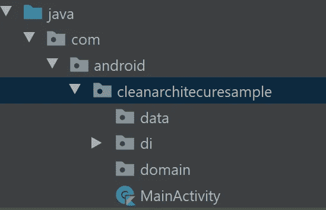
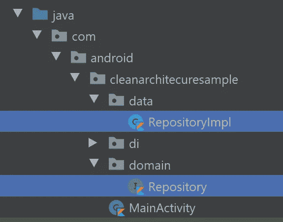
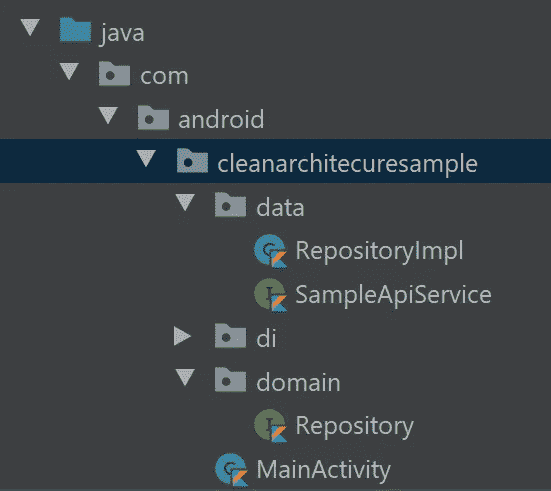
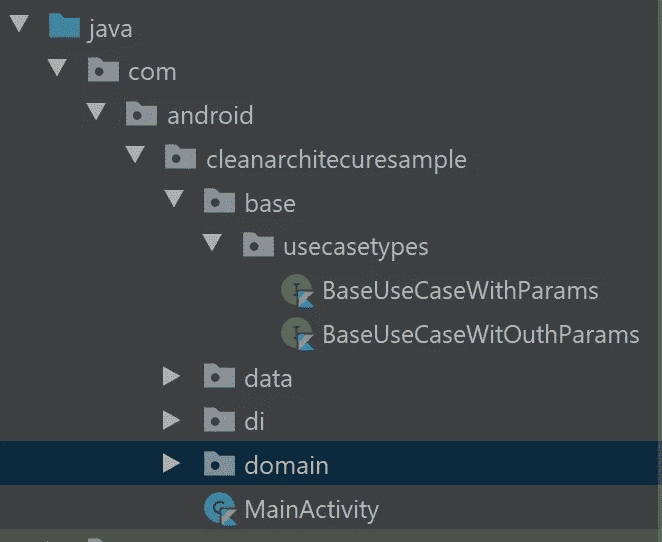

# 在 Android 中使用 Kotlin 协同程序创建存储库数据层

> 原文：<https://betterprogramming.pub/creating-a-repository-data-layer-with-kotlin-coroutines-in-android-1375ab79b6f0>

## 构建基于干净架构的 Android 应用的下一步


[拉拉·阿兹利](https://unsplash.com/@lazizli?utm_source=medium&utm_medium=referral)在 [Unsplash](https://unsplash.com?utm_source=medium&utm_medium=referral) 上的照片。

这是关于使用合适的干净架构构建 Android 应用程序的系列文章的第二部分。在今天的文章中，我们将通过创建一个存储库并讨论其实现和用例来关注领域和数据层。

# 快速回顾

在继续之前，我强烈推荐阅读本系列的第 1 部分，在其中我解释了为什么我们应该使用干净的架构以及如何使用 Dagger2 实现依赖注入。

*   【Android 清洁架构教程(第一部分)

这里，我选择使用协程而不是遗留的 RxJava 进行异步操作。我们正在用协程构建存储库和用例。为了实现网络请求，我们使用带有协程支持的[改型](https://square.github.io/retrofit/)。

# 存储库和用例

## 贮藏室ˌ仓库

存储库是一个简单的接口，它提供了访问委托给`Datasource`的数据的方法。简而言之，存储库是访问网络或本地数据库等数据源的抽象层。

如果你熟悉坚实的原则，你会知道高级模块不应该依赖于低级模块。两者都应该依赖于抽象。这里，我们将有两层:数据和域。

*   域:这包含应用程序的业务逻辑。它是独立的和最里面的模块。这是一个完整的 Java 模块。
*   数据:这包括领域层。它将实现域层公开的接口，并将数据分发到应用程序。

存储库接口位于域层之下，而存储库实现位于数据层之下，因此它可以委托给同样位于数据层之下的数据源。数据层可以依赖于域层，但反之则不然。这是将存储库接口保留在域层并将它的实现保留在数据层的原因之一。

## 用例

很长一段时间，我觉得用例是架构工作的额外负担。我这么想是愚蠢的。我们来看看为什么。

例如，假设您将存储库中的`doSomething`功能暴露给多个视图模型(例如 5-6 `ViewModels`)。如果将来那个函数的返回类型需要改变，我们将需要更新所有那些`ViewModels`中的代码。这是可以通过用例解决的问题。

一般来说，用例是从数据源(远程或本地)获取数据并将其返回给请求者的业务逻辑执行器。在我们的例子中，它是应用程序层。与存储库的每一个独特的交互都可以被视为一个用例。

我们将为与存储库的每次交互创建一个用例，而不是直接从 app 模块访问存储库。我们使用我们的应用程序模块中的这种交互(如前所述，5-6 `ViewModels`)来访问存储库。这样，如果您在数据源中进行任何更改，您可以在一个点上处理它们。

# 知识库模式

为了在架构级别创建存储库模式，我们必须在主应用程序目录下创建两个包— `data`和`domain`。看一看:



第一步是在域层内创建一个名为`Repository`的接口，并在数据层下创建一个名为`RepositoryImpl`的实现类:



这是一个简单的存储库模式，满足了干净架构所基于的坚实原则。下一步是创建数据源。出于本文的考虑，我只包括一个远程数据源。如果您对如何创建多个数据源(例如远程和本地)并管理它们感兴趣，我强烈推荐您阅读以下文章:

[](https://levelup.gitconnected.com/how-to-create-a-perfect-repository-using-kotlin-exclusive-features-61c3121f22df) [## 如何使用 Kotlin 独有的特性创建一个完美的存储库

### 组织您的数据和属性域图层

levelup.gitconnected.com](https://levelup.gitconnected.com/how-to-create-a-perfect-repository-using-kotlin-exclusive-features-61c3121f22df) 

正如我所说的，我们使用协程来执行异步操作，并改进以发出网络请求。为了序列化数据，我们使用了 [Gson](https://github.com/google/gson) 。要将这些库添加到您的项目中，请在应用程序级`gradle`文件的依赖关系节点下添加以下几行:

现在我们应该在数据层下创建一个 API 服务接口，作为远程数据源。在这个类中，我们将有`suspend`函数，使用 reform 触发网络请求。看一看:

```
interface **SampleApiService** {}
```

包结构如下所示:



## 依赖注入

在本系列的第一部分中，我们讨论了依赖注入——但只是在一定程度上。既然我们已经创建了一个经常充当依赖对象的数据源和存储库，我们需要使用 Dagger2 为这些组件实现依赖注入。

首先，我们需要创建一个返回远程数据源接口的函数。我们必须在本系列第一部分创建的`NetworkModule`类中完成这项工作:

现在我们可以将`SampleApiService`注入到存储库的实现中来触发适当的服务。看一看:

```
class RepositoryImpl **@Inject constructor(
    val sampleApiService: SampleApiService)** : Repository {

}
```

# 用例

用例只不过是与存储库的独特交互。每个用例为来自数据源的相应响应提供了一个空间，在将响应传递回请求者之前，可以在这里进行必要的修改(在我们的例子中，是`ViewModel`)。

为了简化过程，我们将创建一个基本用例，每个用例都可以扩展它来导入必要的功能。首先，让我们用一个函数创建一个基本用例，该函数返回一个可以交付给`ViewModel`的通用结果。

基本上，我们将创建两个通用用例——一个有参数，另一个没有参数。我们将在`base > usecasetypes`包下创建它们。看一看:



*   `P` —用例运行函数中要传递的参数类型。
*   `R` — 预期返回类型的结果类型。

为了更好地理解这一点，让我们创建一个简单的类并用`BaseUseCaseWitOuthParams`扩展它。记住用例是在领域层下创建的。看一看:

## 依赖注入

用例的唯一目的是与存储库交互，这意味着我们需要将存储库注入到用例构造器中。在此之前，我们需要在数据模块中的`di`目录下创建一个函数，该函数是在本系列的第 1 部分中创建的，返回类型为`Repository`。看一看:

现在我们可以在`SimpleUseCaseTest`中注入`repository`对象，如下所示:

现在我们已经完成了依赖注入的存储库设置和用例。

# 奖金

## GitHub 回购

导入项目并切换到`articles/repository_usecases`分支，查看与本文相关的代码:

[](https://github.com/SG-K/Clean-Architecture-Sample) [## SG-K/Clean-架构-示例

### 在 GitHub 上创建一个帐户，为 SG-K/Clean-Architecture-Sample 开发做贡献。

github.com](https://github.com/SG-K/Clean-Architecture-Sample) 

要了解有关高级 Android 开发和架构组件的更多信息，请阅读以下文章:

*   [“在 Android 中使用视图模型的最佳实践”](/best-practices-for-using-viewmodels-in-android-e986b25dc78f)
*   [“科特林的存储库中不再有实时数据”](/no-more-livedata-in-repositories-in-kotlin-85f5a234a8fe)
*   [《用 Kotlin 进行高级编程》](/advanced-android-programming-with-kotlin-5e40b1be22bb)
*   [《Android Clean 架构详细指南》](https://medium.com/android-dev-hacks/detailed-guide-on-android-clean-architecture-9eab262a9011)

目前就这些。希望你学到了有用的东西。感谢阅读。