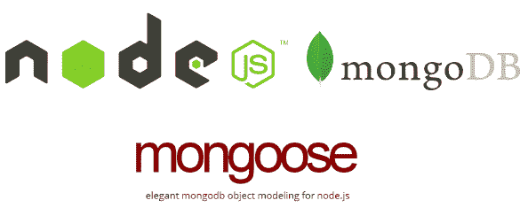

# 在 Node.js 中用 Mongoose 创建一个 REST 事务 API

> 原文：<https://betterprogramming.pub/creating-a-restful-transaction-api-with-mongoose-in-nodejs-15efa6015392>

## JavaScript 中带有类型的事务

# 安装

首先，我们需要导入 Mongoose 并将其连接到我们的本地或云数据库。然后，我们希望导出活动连接。让我们称这个文件为`mongoose.js`:

# 创造我们的猫鼬模型

接下来，是时候创建我们的模型了。对于事务 API，将涉及三个对象:购买商品的用户、正在购买的商品以及最后但同样重要的事务记录本身。

## 乘积模型

首先，我们将创建一个 mongose 模式，它基本上定义了对象的外观，然后它将被导出为一个 mongose 模型。我们把这个文件叫做`product.js`:

本质上，我们创建的模式将`Product`限制为只有价格、描述、名称和类别。或者，如果我们不需要一个产品有一个`category`属性，那么我们可以这样做:

# 用户模型

让我们继续讨论用户模型。我将把它叫做`user.js`——你可以根据需要随意更改它:

注意`history`属性是如何依赖于我们已经创建的`Product`模式的。

## 交易模型

最后，我们姑且称之为`transaction.js`:

注意，我传入了一个额外的参数`{ timestamps: true }`，它将在通过两个属性`createdAt`和`updatedAt`创建和/或更新对象时生成一个时间戳。

# 构建 API 路由

现在到了激动人心的部分——创建实际的 API！

首先，让我们将模型导出到一个新的 JavaScript 文件中，我将其命名为`server.js`。实际上，我们还将从 mongo 导入`ObjectID`,用于验证对象 id。我们还将使用一个名为`body parser`的中间件，它用于将 HTTP JSON 主体解析成可用的对象:

# 发布路线

这些是用于使用我们刚刚创建的三个 Mongoose 模型创建新对象的。用户和产品的`POST`路线是相似和直接的，但是对于我们的交易`POST`路线，我们同时更新用户的购买历史。

## 用户

## 产品

## 交易

# 获取路线

`GET`路线用于获取现有物体的信息。使用 GET routes 发送 JSON 请求体是不可能的——要发送参数，我们可以使用 URL 查询参数(即在 URL 中的`?`之后)或路由参数，我们可以分别使用`req.query`或`req.params`而不是`req.body`来访问这些参数。

## 用户

## 产品

## 交易

本质上，事务模型可以设计为与用户或产品路线相同。

# 删除路线

`DELETE`路由用于删除现有用户或对象。个人认为交易不需要`DELETE`路线。

## 用户

## 产品

# 修补/上传路线

这些用于更新现有用户或对象的信息。

## 用户

## 产品

就是这样！希望这能帮助任何试图在 Node.js 中使用 Mongoose 创建自己的 API 的人。

感谢阅读！