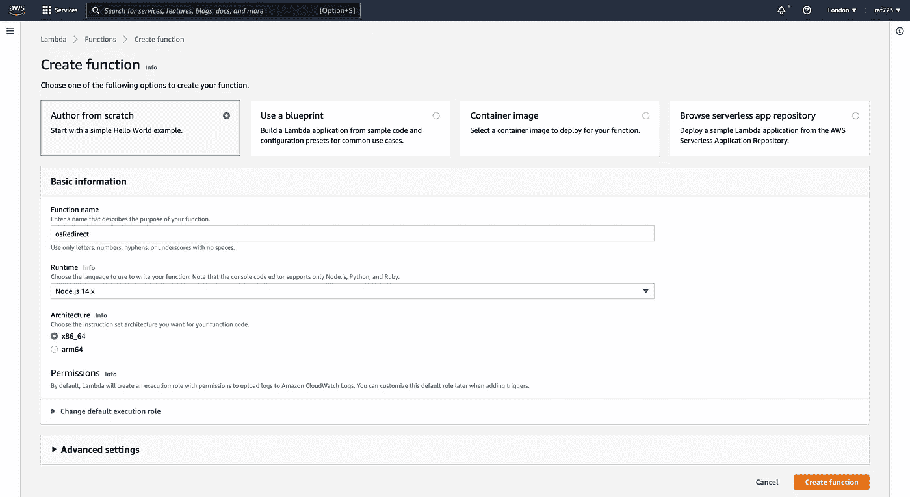
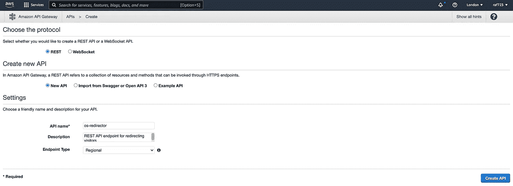
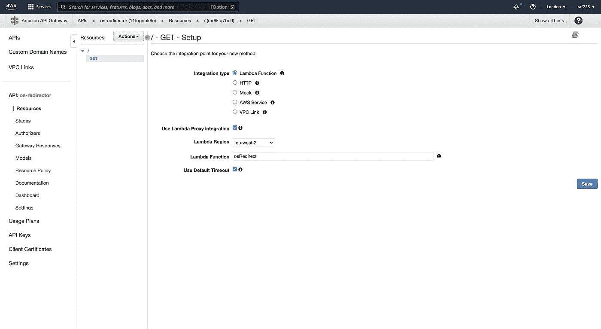
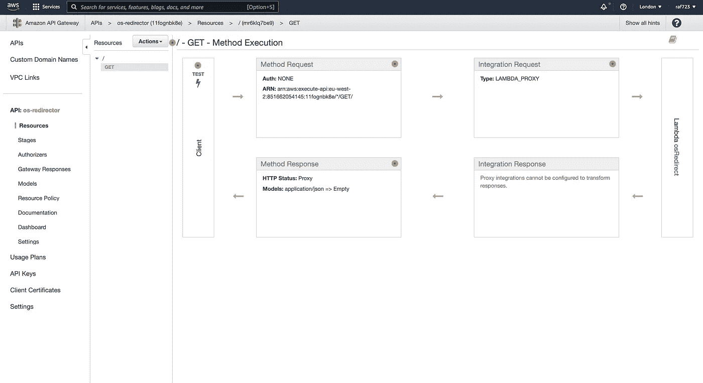
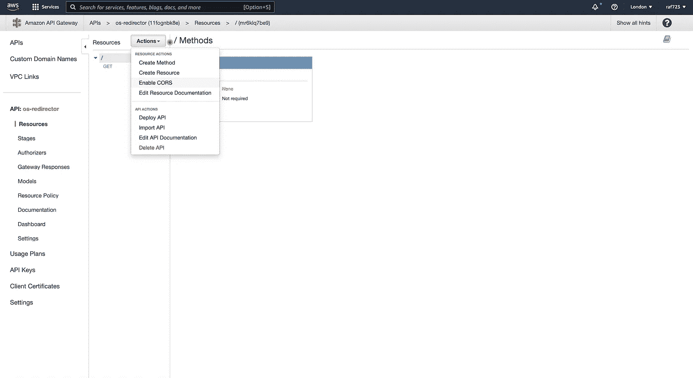
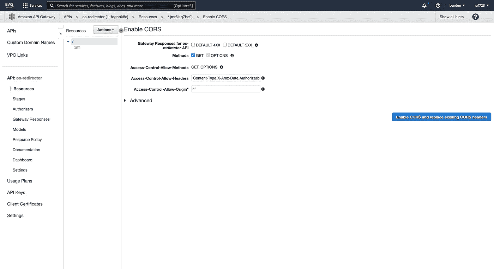
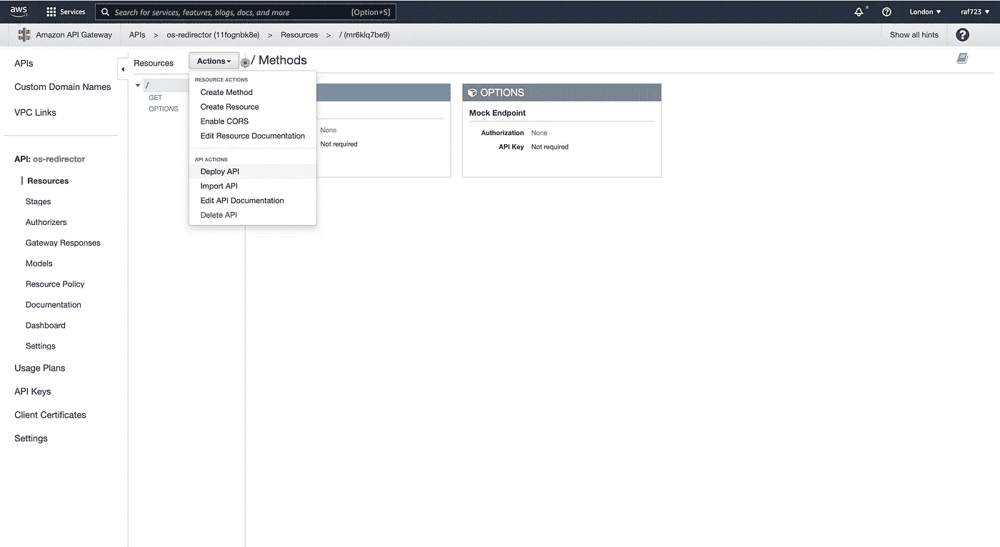
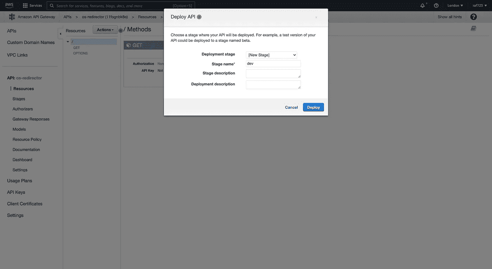

# 使用 AWS Lambda 和 API 网关创建无服务器重定向功能

> 原文：<https://betterprogramming.pub/creating-a-serverless-redirect-function-600816603d48>

## 相应地将用户重定向到 app store 和 web 登录页面


[杰克逊·苏](https://unsplash.com/@jacksonsophat?utm_source=medium&utm_medium=referral)在 [Unsplash](https://unsplash.com?utm_source=medium&utm_medium=referral) 上的照片

你已经创建了一个发布在应用商店上的应用，现在你想使用一个 URL 将你的用户重定向到他们各自的商店？你来对地方了。

在本文中，我将使用 AWS Lambda 和 API Gateway 来创建我们的无服务器功能。在另一篇文章中，我将通过在 DynamoDB 表中存储每个用户的访问来扩展我们在这里构建的内容，以创建一个 Jamstack 应用程序:

[](https://medium.com/@rafiulansari/creating-a-jamstack-app-50086e091cc7) [## 创建 Jamstack 应用程序

### Wtf 是 Jamstack？Jamstack 使用无服务器功能将前端和后端分开。从后端释放…

medium.com](https://medium.com/@rafiulansari/creating-a-jamstack-app-50086e091cc7) 

## **创建我们的 Lambda 函数**

*Lambda 是一项服务，它将负责根据访问者的操作系统重定向他们的逻辑。*



一旦我们上了 AWS 控制台，我们将前往 Lambda 服务。在这里，我们可以使用“创建函数”按钮来创建我们的 Lambda。让我们称之为`redirect`,并保留其余选项的默认选择。单击“下一步”后，我们将看到一个名为`handler`的方法:

```
exports.handler = async (event) => {
    // TODO implement
    const response = {
        statusCode: 200,
        body: JSON.stringify('Hello from Lambda!'),
    };
    return response;
};
```

`handler`可以接受附加参数:

```
exports.handler = (event, context, callback) => {}
```

*   `event`包含请求数据
*   `context`包含用于认证的用户信息
*   `callback`是我们可以用来创建响应的函数

出于我们的目的，我们只需要`event`和`callback`。我们想要做的是，分析客户端请求数据的用户代理(`event`)来确定重定向 URL。

> 用户代理是一个请求头，它允许一个特征串，该特征串允许网络协议对等体识别网络服务器的操作系统和浏览器。

一旦我们确定了重定向，我们使用一个`return`语句或者一个`callback`函数将这个 URL 传递到响应头的位置。此外，在响应中传递状态代码允许我们向客户端发送额外的信息——查看 [MDN Web 文档](https://developer.mozilla.org/en-US/docs/Web/HTTP/Status)以查看可能的响应状态代码列表。

为了这个项目即将到来的部分，我们将使用 302 代码代替 301。让我们点击“部署”,我们就有了重定向 Lambda 函数:

```
exports.handler = async (event, context) => {
    var redirectURL = "https://www.wali-app.co.uk"; const userAgent = event.headers["User-Agent"];
    switch (true) {
        case userAgent.includes("iPhone"):
            redirectURL = "[https://apps.apple.com/gb/app/wali/id1528328161](https://apps.apple.com/gb/app/wali/id1528328161)";
            break;
        case userAgent.includes("Android"):
            redirectURL = "[https://play.google.com/store/apps/details?id=com.thebutterflynetwork.wali](https://play.google.com/store/apps/details?id=com.thebutterflynetwork.wali)";
            break;
        default:
            break;
    }

    return {
        statusCode: 302,
        headers: { Location: redirectURL }
    };
};
```

## 设置我们的 API 网关

*API Gateway 是将客户端的请求传递给我们的 Lambda 并定义其响应的服务。*

转到 API 网关服务并创建一个 REST API。



在以下屏幕中，从“操作”下拉列表中选择“创建方法”。在新显示的下拉列表中，选择“获取”并单击复选标记。这将为我们提供一个将 API 连接到 Lambda 函数的表单。



因为我们不会配置我们的集成响应，所以让我们检查“使用 Lambda 代理集成”来快速引入我们的 Lambda 函数(这在下一段会更有意义)。

点击“保存”后，我们将看到方法执行流程。



*   方法请求:API 中向访问者公开的部分。它处理认证、输入体、头和查询字符串参数。
*   集成请求:API 正在集成什么——在我们的例子中，是一个 Lambda 函数。
*   整合响应:允许我们标准化来自整合的响应。这是禁用的，因为我们的 Lambda 已经以 API Gateway 要求的格式返回了一个响应。
*   方法响应:定义方法可以返回什么。它负责定义 API 返回的状态代码和响应主体。

让我们单击“方法响应”，展开 200 HTTP 状态，并将“访问控制允许起源”添加到“响应头”中，这样我们就不会遇到 CORS 错误。

返回上一屏幕，为顶级资源“启用 CORS”。



保持默认选择不变，并单击“启用 CORS 并替换现有的 CORS 标题”。



从 GET 方法的方法执行流中，我们可以测试我们的 API 并传入我们自己的查询参数——我们将跳过这一步，继续部署我们的 API。选择顶级资源后，我们从“Actions”下拉菜单中单击“Deploy API”。



瞧啊。我们将看到一个端点(`[https://11fognbk8e.execute-api.eu-west-2.amazonaws.com/dev](https://11fognbk8e.execute-api.eu-west-2.amazonaws.com/dev)`)，如果我们从桌面访问，它将把我们重定向到应用程序的登录页面。

如果我们从 Android 或 iOS 设备访问它，将分别重定向到 Play Store 或 App Store。

# 更进一步

在这个项目的下一部分，我们将通过使用现有的 Lambda 函数写入 DynamoDB 表来记录对 REST 端点的所有访问。

然后，我们将创建一个 Jamstack 应用程序，该应用程序调用另一个集成到新 Lambda 的 REST 端点，该端点通过操作系统返回访问者数量，以便我们在仪表板中直观地呈现。