# 使用 React.js 创建简单的应用程序

> 原文：<https://betterprogramming.pub/creating-a-simple-app-with-react-js-f6aa88998952>

## 使用 React 从头开始构建一个简单的任务跟踪应用程序


[Wix.com](https://www.wix.com/blog/design/2018/07/illustration-animation-web-design/)

# 什么是反应？

[React 文档](https://reactjs.org/)将 React 定义为:

> *“用于构建用户界面的 JavaScript 库”*

但是*库*在软件工程界是什么意思呢？我们经常听到术语*框架*用来描述其他开发者编写的解决问题和简单任务的代码。

具体说区别，一个框架对你的 app 有更多的控制权；它描绘了您的应用程序赖以生存的更广阔的图景，并规定了项目的架构。

另一方面，一个库通常有一个更窄的、*主要*用例，程序员可以链接他们的应用程序以获得对功能的访问。

React 在某些事情上非常好用——比如构建漂亮的网站和相当快速地设置 web 应用程序——但是对于其他事情，比如构建游戏，它可能不是最好的选择。

React 使开发人员能够为相对复杂的应用程序构建创造性的交互式 UI，这些应用程序需要在页面上呈现多个可重用的组件。

相反，React 在构建一个逻辑主要存在于一个组件中的游戏时增加的价值较少。

# 声明性的、基于组件的、可重用的

React 有三个主要特征:

*   它使用*声明性的*视图。
*   它建立在管理自己状态的组件上。
*   它的代码可以被不同的浏览器和技术重用。

让我们更详细地看看这意味着什么。

## ***宣示性***

有两种类型的编程—命令式和声明式。

*命令式*编程定义了实现预期结果的具体步骤(如何做事)。相比之下，*声明式*编程表达的是逻辑和数据流，没有明确列出命令或步骤(做什么)。

我们以做卷饼为例。

如果我们试图通过一种强制性的方法来做墨西哥卷饼，我们首先会得到我们的玉米粉圆饼，切蔬菜，煮肉，磨碎奶酪，将所有的配料放在玉米粉圆饼上，卷起来，然后上桌！

然而，声明性方法更像 Chipotle 的工作方式。顾客不需要经历制作玉米煎饼的每一个步骤；你只需要指定你想要什么样的蔬菜、蛋白质和奶酪，卷饼就是从这些原料中为你做的。

由于使用了声明式编程，React 应用程序使代码更容易预测和调试。此外，应用程序将知道何时根据数据或输入的变化重新呈现页面。

## ***组件***

React 应用程序是由组件构成的，这些组件实质上是 web 页面的可重用构件。

为了更好地理解，我们来看看 Airbnb 的主页，它是基于 React 构建的。


AirBnb 主页

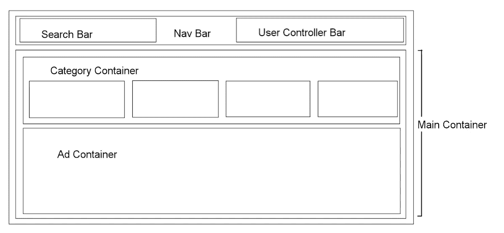

Airbnb 页面的组件结构

上图展示了 Airbnb 组件的大致结构。我们在顶部有一个*导航条*组件，其中包含子组件，如*搜索栏*和*用户控制器栏*(“添加列表”、“消息”…等等)。

在*导航栏*组件的正下方，您可能有一个*主容器*组件，它充当其子组件的父组件，例如*类别容器*(“我们能帮您找到什么？”section)和一个*广告容器*(“Airbnb Luxe 简介”部分)。

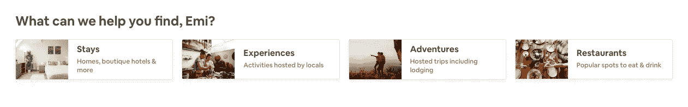

Airbnb 类别容器特写

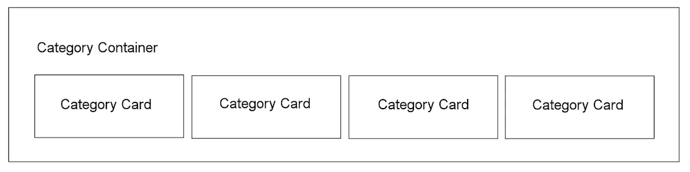

如果您看一下我们称之为*类别容器*的内部，这个组件包含多个子组件，显示各个类别(“住宿”、“体验”、“冒险”和“餐馆”)。

除了每张卡片上显示的信息之外，这些独立的卡片看起来几乎完全相同。这就是 React 中的组件变得有用的地方。

如果您编写了类别卡的单个组件，您可以重用相同的组件，但相应地提供不同的信息。

从概念上讲，组件有点像 JavaScript 函数，根据输入呈现不同的输出。在这种情况下，输出是呈现在页面上的 HTML。

组件的另一个重要概念是*状态*。

某些组件管理它们自己的状态，这些状态包含指示页面将呈现什么的信息。

类似于函数中声明的变量，状态只适用于它所属的组件，除非有目的地作为*道具*传递给其他子组件。

状态还充当我们的*唯一真实来源*，这意味着组件的信息将只保存在其状态内，而不会保存在其他地方。

我们把从父组件向下传递到其子组件的信息称为 *prop* 。你可以把 props 想象成 JavaScript 中的函数参数。

Props 可以采用任何 JavaScript 数据类型的形式——从简单的字符串到函数。程序员决定是否传递一个道具，这取决于在子组件中需要呈现或调用什么功能。

这里要记住的重要一点是，道具只能传承，不能传承。就像瀑布一样，道具可以下落，但不能克服重力向上移动。

## ***可重用***

因为 React 代码对于所有浏览器和所有技术(笔记本电脑、手机、平板电脑等)都是以相同的方式编写的。)，React 应用程序可以跨多个方面和平台进行编程。

例如，开发人员可以使用 React Native 轻松构建移动应用程序，React Native 是一个使用 React 的移动应用程序框架。

随着浏览器和设备之间的 web 响应和兼容性越来越重要，React 的可重用代码变得非常方便。

# 构建简单的任务应用程序

现在我们已经对 React 有了基本的了解，让我们来看看构建一个简单的 React 应用程序的步骤。出于这个练习的目的，我决定构建一个简单的任务跟踪器应用程序。

## **第一步**。 ***在你的终端上创建 React app***

在您的终端上，运行以下命令。这将在当前文件夹中创建一个新目录(`my-app`)。

在这个新生成的目录中，该命令会自动创建一个初始项目结构，并安装可传递的依赖项。在创建的多个文件夹中，您的 Javascript 代码将保存在`src`中。

```
npm init react-app my-app
```

## **第二步**。 ***启动 React app***

进入您新生成的目录(`my-app`)并运行`npm start`来启动您的应用程序。

这应该会自动在您的浏览器上打开一个 HTML 页面，看起来像下面的页面。

```
cd my-app
npm start
```

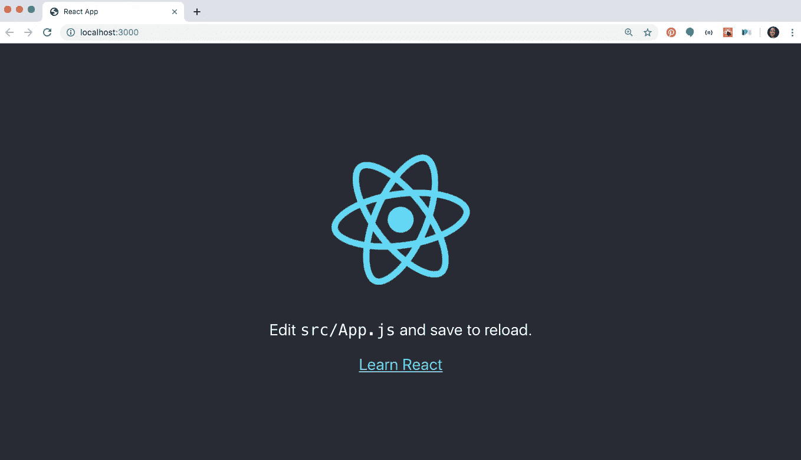

我没有写任何代码，我们已经有一个功能的网站！

如果我们查看`my-app`目录下的`src`文件夹，你会发现一个名为`App.js`的文件。

在应用程序初始化时，这个文件默认为下面显示的 HTML 代码，它呈现在主页上。

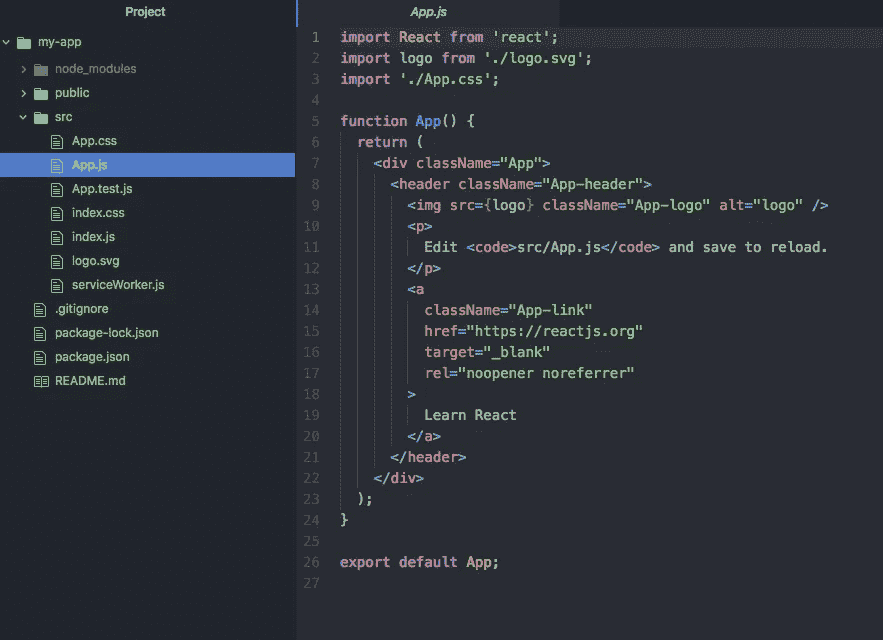

按照惯例，`App.js`充当 React 应用程序结构中最高级别的组件。

在同一个文件夹下，您还可以找到`index.js`文件，该文件保存了您的应用程序的配置，并包含了诸如 [React-Router](https://github.com/ReactTraining/react-router) 和 [React-Redux](https://react-redux.js.org/) 之类的依赖项(更多信息请参见另一篇博文。)

## **第三步**。 ***设置构件结构***

现在，是时候决定您的应用程序需要哪些组件了。下面，我为我的任务跟踪应用程序设计了组件结构。

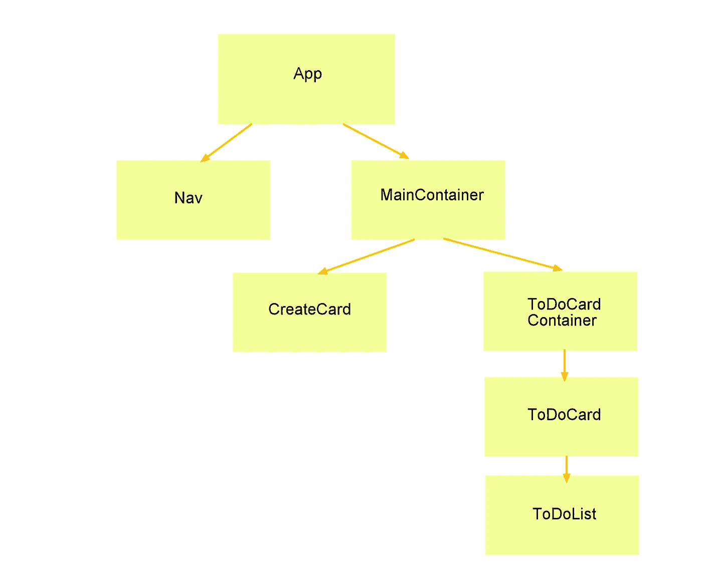

在 React 中，您将组件编写为 JavaScript 函数或类。

*功能性*(也称为*表象性*)组件通常呈现简单的 HTML，没有自己的状态。

相反，*类*组件有自己的单个或多个状态，也可以有所谓的[生命周期方法](https://reactjs.org/docs/state-and-lifecycle.html)。

通常，这两种类型由应用程序中各自的文件夹分开。开发人员可以选择如何组织文件，但是，这种约定使得可视化一般组件层次结构变得容易。

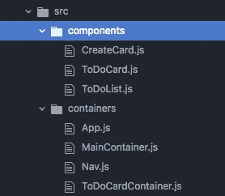

文件组织结构示例

## **第四步**。 ***使用 Rails API*** 设置后端

对于这个项目的后端，我使用 Ruby on Rails 创建了两个模型，卡片和列表。卡片有许多列表，一个列表属于一张卡片(一个简单的 has-many-belongs-to 关系模型)。

在这里，我不会详细介绍如何设置后端，但作为参考，请参见下面的命令行代码。

```
rails new my-app-api --api
rails g resource card title
rails g resource list description completed:boolean card:references
```

建立了基本的后端结构后，我现在为卡片和列表模型创建合适的控制器方法。

对于 Rails API，记得安装`[rack-cors](https://github.com/cyu/rack-cors)`(处理跨源资源共享的中间件。换句话说，您的前端能够访问后端生成的 API。

如果您使用它来组织 JSON 数据，请安装`active-model-serializer`。

```
//Gemfile
gem 'rack-cors'
gem 'active_model_serializers'bundle install
```

## **第五步**。 ***App 组件***

如前所述，`App`组件将是我的应用程序组件树的最高层次。

如果你回头参考我的组件层次结构图，`App`呈现了两个子组件:`MainContainer`和`Nav`。

我们先把`App.js`下面的这些“分支”写出来。

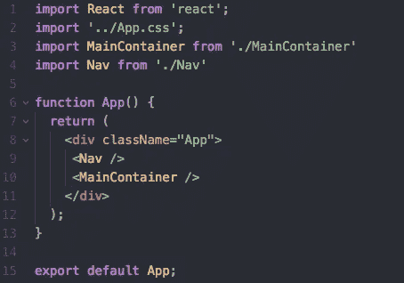

App.js

我的`App`函数的返回值看起来像 HTML…！

这实际上被称为[*JSX*](https://reactjs.org/docs/introducing-jsx.html)——JavaScript 的一种语法扩展，在 React 中用来描述 UI 应该是什么样子。

JSX 本质上允许开发者编写混合了 JavaScript 语法的 HTML 代码。嵌套在 div 标签(`<Nav />`和`<MainContainer />`)中的元素是我们希望`App`组件呈现的组件子元素。

组件只返回一个元素，这意味着无论返回值中有多少个元素，这些元素都必须放在一个元素标记下。

这里，我将`Nav`和`MainContainer`组件包装在一个`div`标签下。

分别位于文件顶部和底部的`import`和`export`允许访问不同文件之间的组件，因此也允许访问组件之间的组件。

在`App`组件中，我们需要访问`Nav`和`MainContainer`组件，所以我们直接从它们的相对路径导入它们。类似地，我们导出了`App`组件，以便`index.js`文件可以呈现整个应用程序。

## **第六步**。 ***导航组件***

我只需要用于演示的`Nav`组件，其中包含我的应用程序的徽标。所以，我把`Nav`组件做成了功能组件。

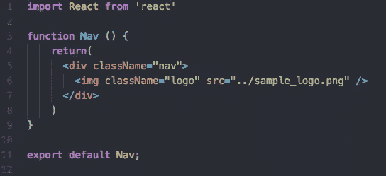

导航. js

就这样，网站会自动刷新我的新导航栏，取代默认的 React 主页。

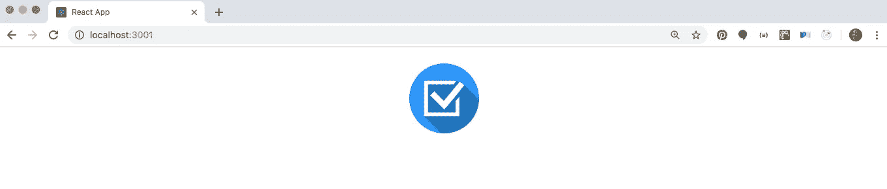

## **步骤 7。*创建卡片组件控制表单***

有了一个简单的不需要继承任何逻辑的`Nav`组件(它只会呈现一个 logo)，我们就不需要在`App`组件中包含整个应用程序逻辑。

当我们再次查看我们的组件层次结构时，`MainContainer`组件似乎是保存整个应用程序的大部分逻辑和状态的合理位置，这些逻辑和状态将作为道具传递给其子组件。

因此，应该将`MainContainer`组件设置为类组件。

最终，我们希望`MainContainer`向后端发出一个获取请求，检索所有已经创建的卡片，并将这些卡片传递给`ToDoContainer`进行渲染。

但是现在，我们还没有创建任何卡片！所以，让我们先研究一下`CreateCard`组件。

顾名思义，`CreateCard`组件呈现一个简单的表单，该表单将接受一个标题为*标题为*的用户输入，并将该输入发送到后端以创建一个`Card`的新实例。

React 中有两种类型的表单——受控的和非受控的(在这里了解更多信息)。

主要区别在于，在受*控制的*表单中，React 组件处理表单数据，而在不受*控制的*表单中，DOM 处理数据。

由于`CreateCard`组件呈现一个简单的表单，我们可以使用一个不受控制的表单。但是，养成编写受控表单的习惯是一个好习惯，因为在构建更复杂、更大规模的应用程序时，它允许更多的灵活性和附加功能。

受控窗体要求呈现窗体的组件保持自己的状态，以跟踪不断变化的输入。因此，我们将使用类组件来构建`CreateCard`组件。

输入将保存在组件的状态中。每次输入改变时，`CreateCard`组件的状态将反映更新的输入。

为此，我们首先将状态设置为空字符串输入。我们还需要在`CreateCard`类中有一个函数来处理输入的变化。

```
state = {
  input: ""
} handleInput = (event) => {
   event.persist()
   this.setState({
     input: event.target.value
   })
}
```

由于 React 使用事件池，这意味着事件的属性只在回调活动时存在，`event.persist()`允许我们引用事件来获取函数中相关的值和方法。

这里，我们需要`event.target.value`来捕获表单中输入的内容。`this.setState`是一个 React 方法，它将新状态设置为作为参数传入的任何内容。

每当表单识别到更新时，`handleInput`函数将`CreateCard`组件的状态重置为新的输入。

我们需要做的最后一件事是在呈现的表单中插入一个事件监听器，将表单链接到`handleInput`函数。

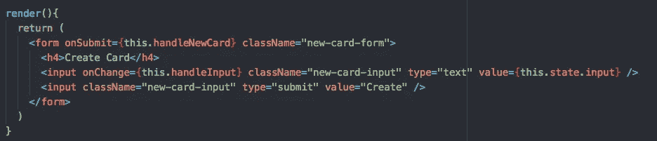

创建卡片. js

请注意，JSX 同时使用了类似 HTML 的代码和纯 JavaScript 代码，这些代码都包含在花括号内`{}`。

在输入标签中，我们有一个名为`onChange`的事件监听器，它指向我们上面写的`handleInput`函数的引用。`this`关键字指向父对象，在本例中是整个`CreateCard`类。

我们只指出了对`handleInput`函数的引用，只有当表单输入发生变化时才会被调用。

当我们`console.log`取出组件的状态时，我们可以观察到每次用户输入时，状态都会更新。

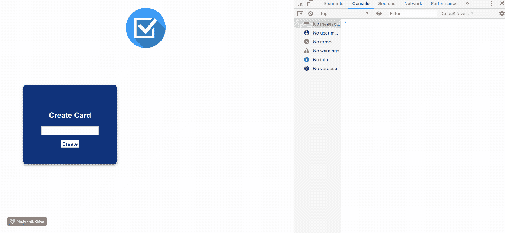

最后，当用户实际提交表单时，我们需要另一个事件处理程序。让我们再次看看我们的组件树。


当我们将输入从`CreateCard`组件传递到后端以创建一个新的`Card`实例，并最终添加这个新的卡片以在`ToDoCardContainer`下呈现时，我们需要整个逻辑生活在`MainContainer`组件下，这是`CreateCard`组件和`ToDoCardContainer`组件之间的最低共同祖先。

## **第八步。*主组件—新建卡片***

如上所述，我们最终希望`MainComponent`能够跟踪所有从我们后端呈现在页面上的卡片。

我们要做的第一件事是将状态设置为一个空的卡片数组。

```
state = {
  cards: []
}
```

接下来，我们将编写`createNewCard`函数，它最终将作为道具传递给`CreateCard`组件。

该函数负责将提交的输入提取到我们的后端，接收新创建的 card 对象，并将该对象添加到状态中的 cards 数组。

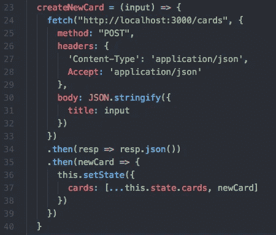

App.js

现在，我们将对该函数的引用作为道具传递给`CreateCard`组件。

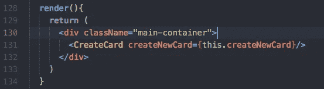

App.js

注意，我们没有调用`createNewCard`函数。我们简单地将*引用*传递给函数，当用户提交表单时将调用该函数。

回到我们的`CreateCard`组件内部，我们将编写另一个函数来首先阻止提交按钮的默认动作，并调用从`MainContainer`组件传递过来的`createNewCard`方法。

对于类组件，我们使用`this.props`访问所有属性，对于功能组件，我们只使用`props`(确保将*属性*作为函数的参数传递下去)。

由于我们的输入保存在`CreateCard`组件的状态下，我们只需将状态作为参数传递给`createNewCard`函数。

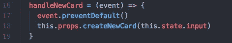

创建卡片. js

## **第九步。*从后端取数据—生命周期方法***

现在我们可以创建卡片了，让我们在页面上渲染它们吧！

如果我们回头参考我们的组件层次结构，`MainContainer`呈现了`ToDoCardContainer`，而 T5 又呈现了单个的`ToDoCard`组件。

首先，我们需要向后端创建一个获取请求，以获取所有现有的卡，我们最终会将这些卡传递给`ToDoCardContainer`。

请记住，获取请求是异步的。如果我们试图在获取请求返回之前呈现卡片，我们将得到一个错误，站点将无法加载。

这就是 React 的组件生命周期方法发挥作用的地方。

使用方法`componentDidMount`，我们能够在页面的初始呈现之后运行一个异步事件*。一旦获取请求完成，`this.setState`将触发重新渲染，并将从获取请求返回的适当数据显示在网页上。*

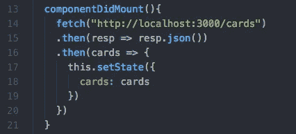

App.js

一旦我们在`MainContainer`的状态中保存了所有卡片的实例，我们将把它作为道具传递给`ToDoCardContainer`。

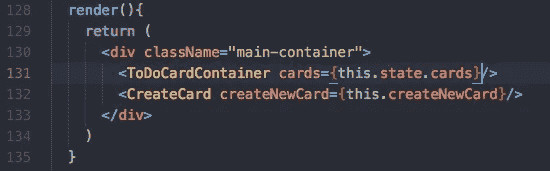

App.js

## **第十步。*ToDoCardContainer***

`ToDoCardContainer`组件单独负责渲染所有的`ToDoCard`组件。因此，我们将使它成为一个功能组件。

我们将所有的卡片作为道具传递下来，所以我们可以映射`props.cards`来为每个卡片对象创建一个`ToDoCard`组件。

由于`ToDoCard`组件需要每张卡片的信息(即卡片的标题，以及最终与每张卡片相关的列表)，我们将卡片对象作为道具传递下去。

传递一个`key`道具也是一个好主意，使用卡片的唯一 ID 来跟踪我们所有的`ToDoCard`组件。

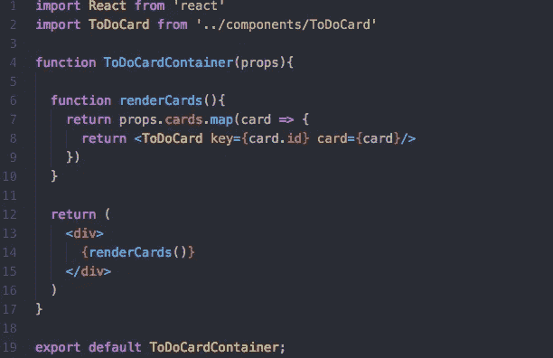

## **第十一步。*ToDoCard——渲染卡片***

首先，让我们看看可以在页面上呈现新创建的卡片。在`ToDoCard`组件中，我们返回一个包含卡片对象标题的`div`，它是作为道具从`ToDoCardContainer`传递过来的。

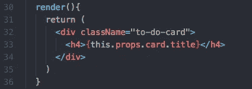

ToDoCard.js

酷！卡片现在呈现在页面上。

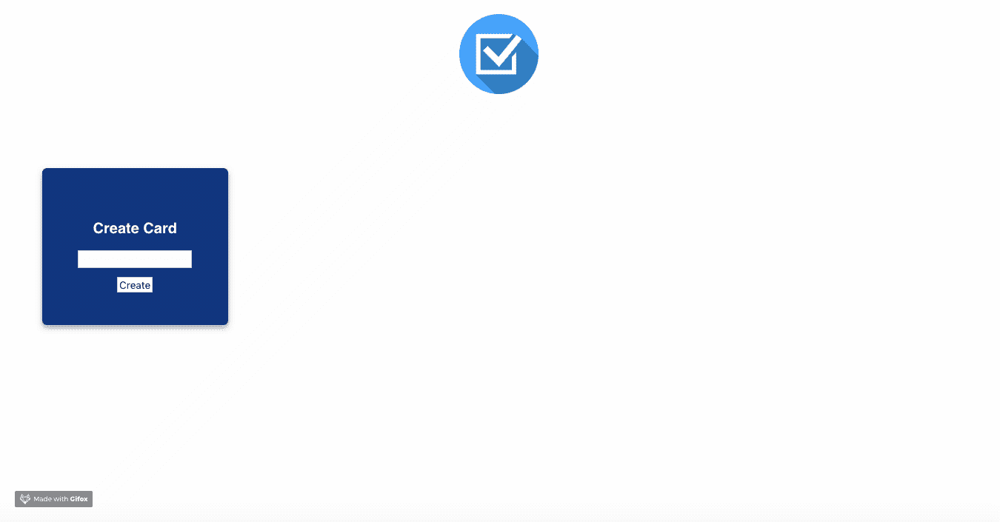

## **第十二步。*向卡片添加列表***

现在我们已经能够在 DOM 上呈现各个卡片了，让我们在每张卡片上添加另一个控件表单，允许用户为每张卡片添加一个列表项。

我们将使用与在`CreateCard`组件中相同的受控表单格式。输入状态将存在于`ToDoCard`下，但是提交功能将从`MainContainer`一直向下传递。

首先，我们将在`ToDoCard`中编写受控表单。

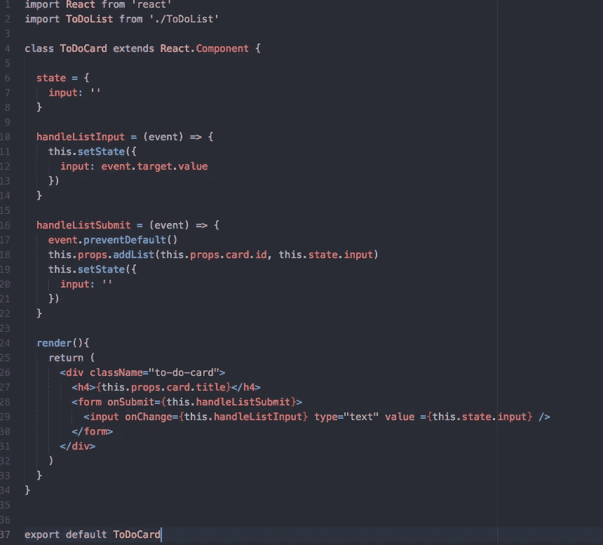

ToDoCard.js

`addList`回调函数应该使用输入(描述)和相关的卡 ID 创建一个新的`List`实例。

一旦在后端创建了新的列表并返回到前端，我们就需要将这个新的列表对象添加到`cards`状态中适当的卡片列表数组中。

为此，我们首先使用返回的列表对象的`card_id`找到相关的卡片。

```
const foundCard = {...this.state.cards.find(card => card.id === cardId)}
```

然后，我们将新的列表对象连接到那个卡的*的现有列表数组上。*

```
foundCard.lists = [...foundCard.lists, newList]
```

然后，我们映射存储在状态中的现有 cards 数组，用带有附加列表项的新的、更新的 card 对象替换有问题的 card 对象。

```
const newCards = this.state.cards.map(card => {
     if (card.id === cardId){
       return foundCard
     } else {
       return card
     }
})
```

最后，我们将`setState`中的卡片放到新的卡片数组中。

```
this.setState({
   cards: newCards
})
```

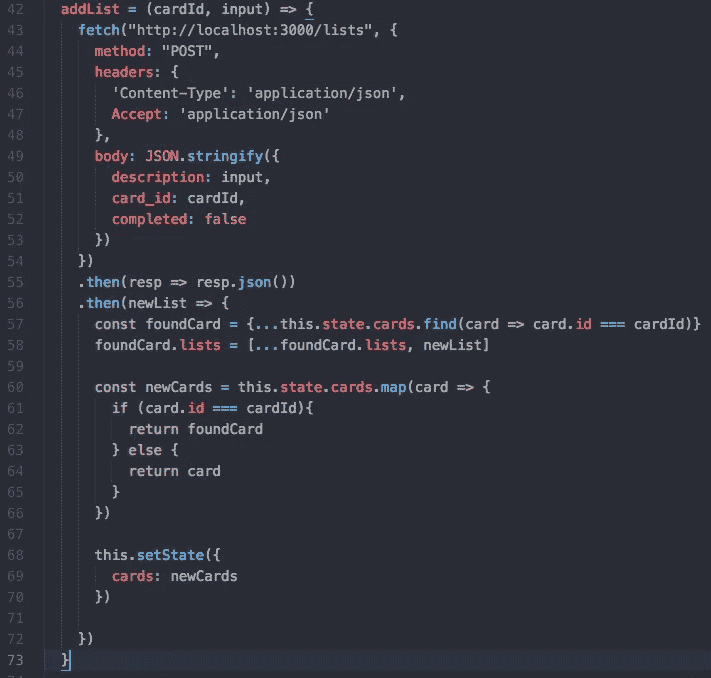

MainContainer.js

## **第十三步。 *ToDoList —每张卡的渲染列表***

太好了！现在我们可以在卡片上添加列表。

让我们看看是否可以在适当的卡片下呈现列表。

就像我们之前渲染单张卡片一样，我们映射每张卡片的列表(作为道具传递)来渲染一个`ToDoList`组件。

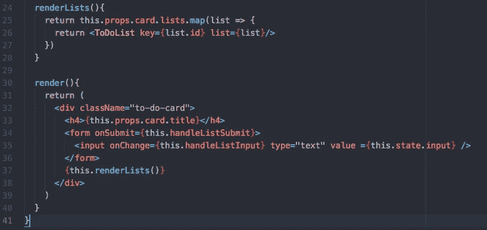

让我们看看这是否有效…

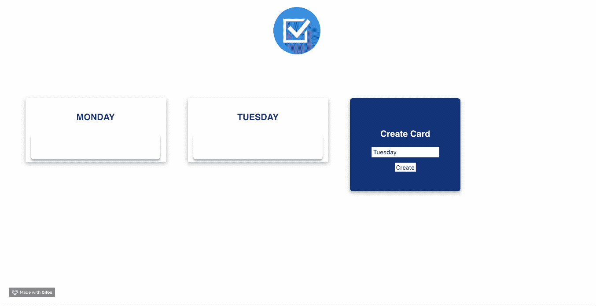

厉害！列表呈现在适当的`ToDoCard`下！

## **第 14 步。*核对清单项目***

作为我的最后一个功能，我希望用户能够点击一个列表项，并检查列表，如果它已经完成。

列表项有一个属性`completed`，初始化时设置为`false`。我们希望每当项目被点击时，将这个布尔值更新为`true`。

当我们改变列表对象的属性时，它在`MainContainer`的状态中被跟踪，我们将再次在我们的`MainContainer`组件中编写函数。

我们正在编写的函数将接受列表 ID 和卡 ID 作为它的参数。

我们首先要确定被点击的列表项的属性是`true`还是`false`。如果是`false`，我们要把状态改成`true`，反之亦然。

然后，我们传递这个新状态来更新(或发送一个`PATCH`请求)我们的数据库。

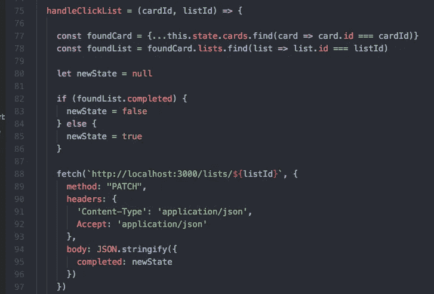

MainContainer.js

一旦后端更新并返回新的列表对象，我们必须更新我们的卡的状态以反映这一变化。这里，我们使用类似的映射技术来替换状态数组中更新的对象。

然而，由于列表是状态中的嵌套数组，我们需要首先创建一个新的更新列表数组，*然后*更新卡片数组。


MainContainer.js

我们可以将这个`handleClickList`函数传递给我们的`ToDoContainer`，然后传递给`ToDoCard`，最后传递给我们的`ToDoList`。

这样，每个`ToDoList`组件都将`handleClickList`函数作为其道具，并可以在每个事件发生时调用该函数。

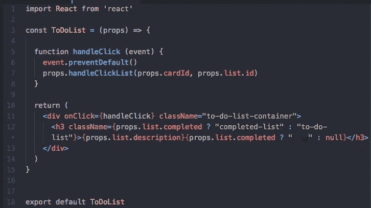

ToDoList.js

在包含`ToDoList`描述的`h3`标签中，我使用了[三元运算符](https://developer.mozilla.org/en-US/docs/Web/JavaScript/Reference/Operators/Conditional_Operator)来添加一些样式，以指示列表是否已经完成。

如果列表的完成属性是`true`，那么`h3`标签的`className`将是`completed-list`——显示一个勾号并删除描述。

否则，`className`将是`to-do-list`而没有额外的样式。

让我们来看看实际情况。

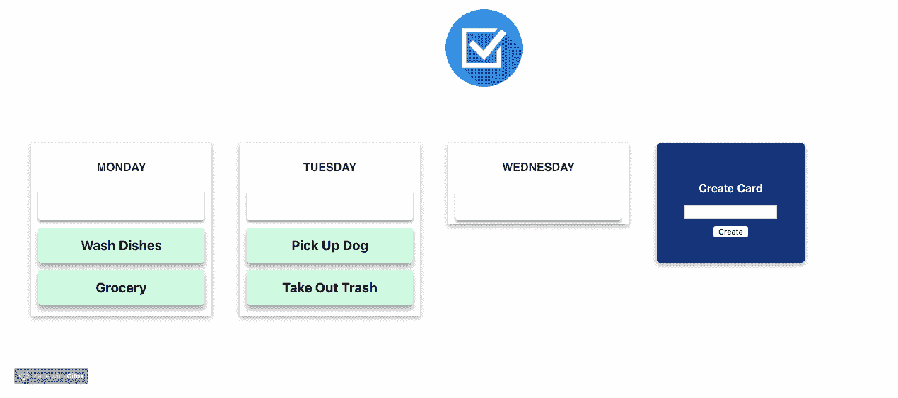

现在你知道了！一个简单的任务跟踪程序。

# 结论

虽然本文远非完整的 React 指南，但我想介绍 React 的核心支柱，并启发您尝试使用该库从头构建一个简单的应用程序。

从我的经验来看，自己创造东西，自己动手，是最好的学习方式。祝你好运，但最重要的是，玩得开心！

这里是 GitHub 上完整资源库的链接。随意克隆，仔细看看，甚至可能添加更多的功能！