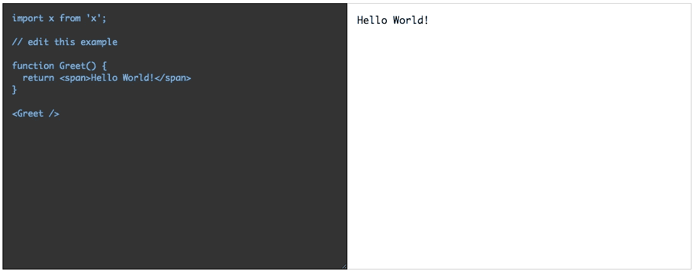
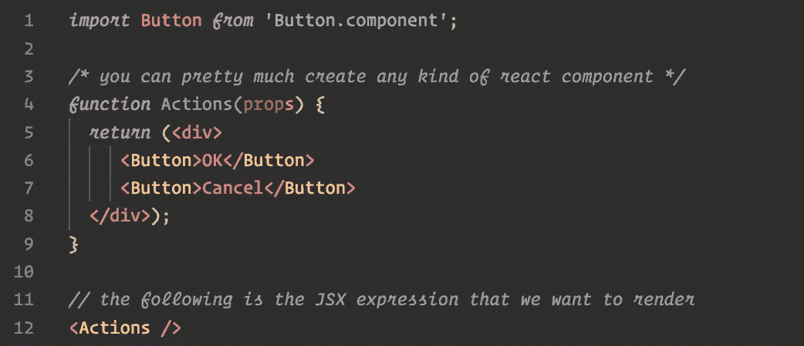
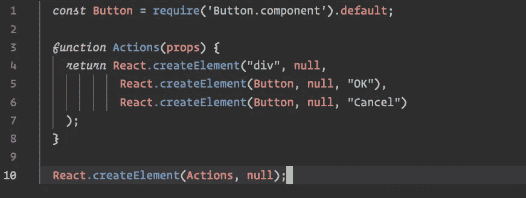
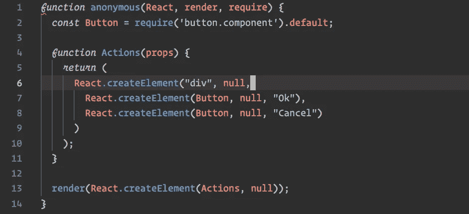
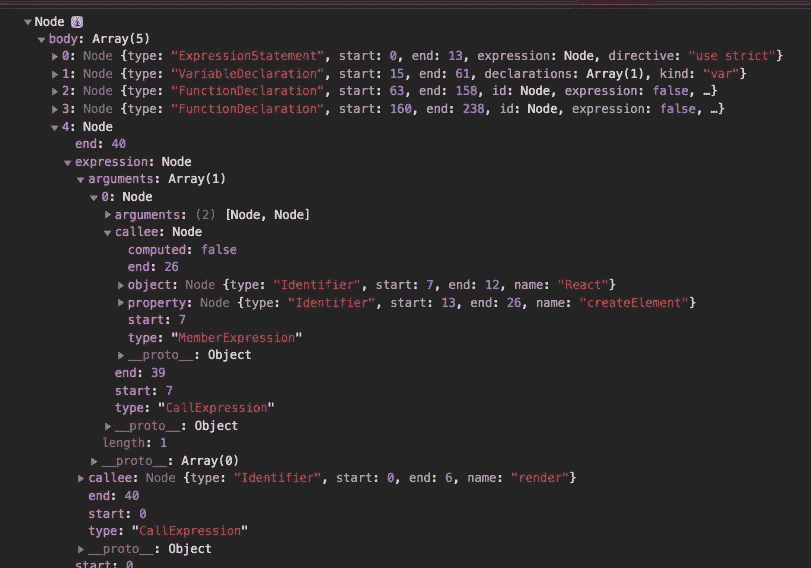

# 如何制作带实时预览的 React 组件编辑器

> 原文：<https://betterprogramming.pub/creating-a-simple-live-react-editor-a6cc17e77beb>

## 快速游乐场吃你的心了



最终演示

你有没有想过那些像 [codesandbox](https://codesandbox.com) 和 [codepen](https://codepen.io) 这样的 live react 编辑器是如何工作的？如果你曾经使用过 [semantic react](https://react.semantic-ui.com/) 或 [react styleguidist](https://react-styleguidist.js.org/) 你应该知道你可以在浏览器中通过实时预览与它们的例子进行交互。

这个周末，我终于把这些碎片拼凑在一起，创造了一个简单的工作解决方案。这篇文章是这个实验的概述。如果您不确定我们正在构建什么，我建议您滚动到本文的底部，首先与嵌入式 codesandbox 演示进行交互。

好了，让我们开始吧。

## 我们必须克服的挑战:

*   在浏览器中传输 JSX/ES6。
*   某种模块解析，所以我们可以将模块导入到编辑器中。
*   一些解析和修改 JavaScript 代码的方法。

## 使用的包:

*   `@babel/standalone`在浏览器中传输 JSX/ES6。
*   `acorn`将 JS 解析成 AST(不要担心我们的用例，AST 操作非常简单)。
*   `escodegen`将修改后的 AST 转换回 JS 代码。
*   `debounce`和`object-path`的各自用法。

# 战略

出奇的简单。以下是步骤:

1.  传输 JSX/ES6 代码
2.  从传输的代码体中找到一个 JSX 表达式语句。我们将在稍后讨论 AST 处理部分时深入探讨这一点。
3.  修改 JSX 表达式，使其包含在一个`render`调用中。
4.  创建一个新的包装函数，其中包含目前为止从上述步骤中生成的代码以及作为参数传递的所有依赖项。
5.  每当代码发生变化时，调用第四步中创建的函数

迷茫？别担心，让我们举一个实际的例子来说明这一点。

假设我们从下面的代码开始:



我们怎样才能让这段代码呈现在网页上的任意 DOM 元素上呢？

我们现在的任务是传输上述代码，解析所需的按钮组件，并在第 12 行呈现 JSX。

这是翻译版本:



下面是我们想要动态生成的内容:



一旦我们能够生成上面的函数，我们就可以用 React 模块对象、渲染函数和模块解析函数作为参数来调用它(按照这个顺序)。

另外，请注意，我们已经用 render 函数调用包装了 transpiled 代码的第 10 行。

我希望你现在明白了。让我们看一些代码:

```
import React from "react";
import ReactDOM from "react-dom";
import ObjPath from "object-path";

import * as Acorn from "acorn";

import { generate as generateJs } from "escodegen";
import { transform as babelTransform } from "@babel/standalone";

function isReactNode(node) {
    const type = node.type; //"ExpressionStatement"
    const obj = ObjPath.get(node, "expression.callee.object.name");
    const func = ObjPath.get(node, "expression.callee.property.name");
    return (
        type === "ExpressionStatement" &&
        obj === "React" &&
        func === "createElement"
    );
}

export function findReactNode(ast) {
    const { body } = ast;
    return body.find(isReactNode);
}

export function createEditor(domElement, moduleResolver = () => null) {
    function render(node) {
        ReactDOM.render(node, domElement);
    }

    function require(moduleName) {
        return moduleResolver(moduleName);
    }

    function getWrapperFunction(code) {
        try {
            // 1\. transform code
            const tcode = babelTransform(code, { presets: ["es2015", "react"] })
                .code;

            // 2\. get AST
            const ast = Acorn.parse(tcode, {
                sourceType: "module"
            });

            // 3\. find React.createElement expression in the body of program
            const rnode = findReactNode(ast);

            if (rnode) {
                const nodeIndex = ast.body.indexOf(rnode);
                // 4\. convert the React.createElement invocation to source and remove the trailing semicolon
                const createElSrc = generateJs(rnode).slice(0, -1);
                // 5\. transform React.createElement(...) to render(React.createElement(...)), 
                // where render is a callback passed from outside
                const renderCallAst = Acorn.parse(`render(${createElSrc})`)
                    .body[0];

                ast.body[nodeIndex] = renderCallAst;
            }

            // 6\. create a new wrapper function with all dependency as parameters
            return new Function("React", "render", "require", generateJs(ast));
        } catch (ex) {
            // in case of exception render the exception message
            render(<pre style={{ color: "red" }}>{ex.message}</pre>);
        }
    }

    return {
        // returns transpiled code in a wrapper function which can be invoked later
        compile(code) {
            return getWrapperFunction(code);
        },

        // compiles and invokes the wrapper function
        run(code) {
            this.compile(code)(React, render, require);
        },

        // just compiles and returns the stringified wrapper function
        getCompiledCode(code) {
            return getWrapperFunction(code).toString();
        }
    };
}
```

我们通过调用`createEditor`函数创建一个新的编辑器实例。该函数接受两个参数:

1.  将呈现结果的目标 DOM 元素。
2.  模块解析器回调函数。

这里的主力是`getWrapperFunction`。另外，请参考下面默认示例代码中生成的 AST 树的图像，以帮助您理解我们如何检测和修改程序体中的 JSX 表达式。



为了理解`isReactNode`和`findReactNode`函数是如何工作的，将代码与上面的 AST 进行比较。这里要记住的重要一点是，当我们用任意代码串调用`Acorn.parse`时，解析器将代码串视为完整的 JavaScript 程序，因此主体数组代表全局级别的语句。我们想在这里找到`React.createElement`语句。

现在让我们看看下面的例子:

```
import "./styles.scss";
import React from "react";
import ReactDOM from "react-dom";
import { createEditor } from "./editor";
import debounce from "debounce";

// default code 
const code = `import x from 'x';

// edit this example

function Greet() {
  return <span>Hello World!</span>
}

<Greet />
`;

class SandBox extends React.Component {
  state = {
    code
  };

  editor = null;

  el = null;

  componentDidMount() {
    this.editor = createEditor(this.el);
    this.editor.run(code);
  }

  onCodeChange = ({ target: { value } }) => {
    this.setState({ code: value });
    this.run(value);
  };

  run = debounce(() => {
    const { code } = this.state;
    this.editor.run(code);
  }, 500);

  render() {
    const { code } = this.state;
    return (
      <div className="app">
        <div className="split-view">
          <div className="code-editor">
            <textarea value={code} onChange={this.onCodeChange} />
          </div>
          <div className="preview" ref={el => (this.el = el)} />
        </div>
      </div>
    );
  }
}

const rootElement = document.getElementById("root");
ReactDOM.render(<SandBox />, rootElement);
```

# 你能在哪里使用这个？

这是一个非常有趣的实验，我认为技术在以下场景中非常有用:

*   组件文档。
*   在线 IDEs
*   作为一个简单动态 JSX 渲染

看你的了！

## 链接

现场试用(沙盒中的沙盒):

# 包扎

大概就是这样。

您可能已经注意到，我还没有实现模块解析器部分。这真的很简单，也很容易实现，所以我把它留给读者。

感谢您的阅读！