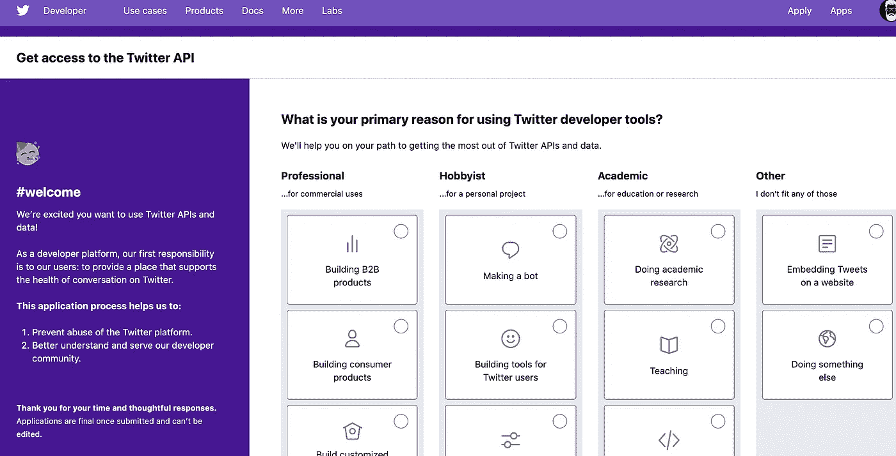

# 使用无服务器技术创建一个简单、低成本的 Twitter 机器人

> 原文：<https://betterprogramming.pub/creating-a-simple-low-cost-twitter-bot-utilising-serverless-technologies-a4044245f645>

## 让我们一起建造一个推特机器人


图片来源:【www.freepik.com/macrovector 

人们对 Twitter 机器人又爱又恨。对于转发与你正在寻找的东西相关的内容来说，它们可能是有用的，但是如果它们发太多或者如果它们发的是你不关心的东西，它们也可能是令人讨厌的。但是，您可以通过创建自己的 bot 来解决这个问题。

创建一个 Twitter 机器人相对简单。在真正的无服务器风格中，有可能以经济高效的方式构建自己的服务器。本文将重点关注在[节点](https://nodejs.org/en/)中创建一个 Twitter 机器人，托管在 [AWS Lambda](https://docs.aws.amazon.com/index.html?nc2=h_ql_doc_do) 中。

# 为什么没有服务器？

对 Twitter 机器人使用无服务器模式完全有意义。

## 触发器

触发器将基于 cron 作业。在真正的无服务器风格中，我将使用 Cloudwatch，并利用一个类似 cron 的表达式来触发我的 lambda。

这是我的活动，穿过[地形](https://www.terraform.io/docs/index.html):

```
resource aws_cloudwatch_event_rule every_one_hour {
  name                = "every-one-hour"  
  description         = "Fires every one hour"  
  schedule_expression = "rate(1 hour)"
}
```

Cloudwatch 事件规则将每小时运行一次。当它运行时，我希望它调用一个 lambda，所以我还需要设置一个事件目标。

```
resource aws_cloudwatch_event_target twitter_bot {  
  rule      = aws_cloudwatch_event_rule.every_one_hour.name 
  target_id = "lambda"  
  arn       = aws_lambda_function.lambda.arn
}
```

不要忘记设置允许功能执行:

```
resource aws_lambda_permission allow_cloudwatch_to_call_check_foo {
  statement_id  = "AllowExecutionFromCloudWatch"  
  action        = "lambda:InvokeFunction"  
  function_name = aws_lambda_function.lambda.function_name
  principal     = "events.amazonaws.com"  
  source_arn    = aws_cloudwatch_event_rule.every_one_hour.arn
}
```

# 代码

现在有了一个触发 lambda 的方法，我们现在需要一些代码让它运行。我选择 Node 作为框架，因为我真的很喜欢 JavaScript。用一大堆其他语言写这个也一样容易。

我将为这个项目使用的依赖项是(`package.json`):

然后我需要为 AWS Lambda 调用我的函数(`index.js`)创建入口点:

如您所见，所有的配置都是通过环境变量注入的。

`TwitterClient.js`:

我基本上是搜索一个标签，并试图过滤掉更多垃圾推文。

# 注册一个开发者账户

为了使用代码发送推文，您需要注册创建一个开发者帐户。此处讨论了该过程:

[https://apps.twitter.com/](https://apps.twitter.com/)



注册后，请确保存储:

*   访问令牌
*   访问令牌秘密
*   API 密钥
*   API 密钥机密

# 本地测试

为了测试这一切是如何工作的，我基本上手动调用处理程序，设置环境变量:

在`index.js`的结尾，我补充一句:

```
exports.handler();
```

并运行该函数，如下所示:

```
TWITTER_CONSUMER_KEY=xxxxU5FaJU3bgDz6nGt9xxxxx TWITTER_CONSUMER_SECRET=XXXXXXXXaQsdHuaC4h3oR3URRqYd0jnqoBVcd9HEV1XXXXXXXX TWITTER_ACCESS_KEY=0000000051433271300-XXXXXXXXRRUdtAMtHoAHIVXXXXXXXX TWITTER_ACCESS_SECRET=xxxxxxxxGalNApvG3yDwPtY2szibxW7TLEImXXXXXXXX FIND_HASHTAG=#serverless RETWEET_COUNT=5 npm start
```

这将搜索多达 30 条标签为#serverless 的推文，并转发其中的 5 条。

# 为 Lambda 构建

因为默认情况下 Node 会将它的包安装到`node_modules`目录中，所以只需要压缩目录并将其推送到 AWS。

同样，这对于 Terraform 来说是一件相当简单的事情。

# 结论

现在你有了:一个每小时转发一个特定标签的 Twitter 机器人！我希望这篇文章对你有所帮助。请在评论区留下任何反馈或问题。感谢阅读。