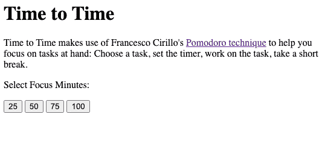
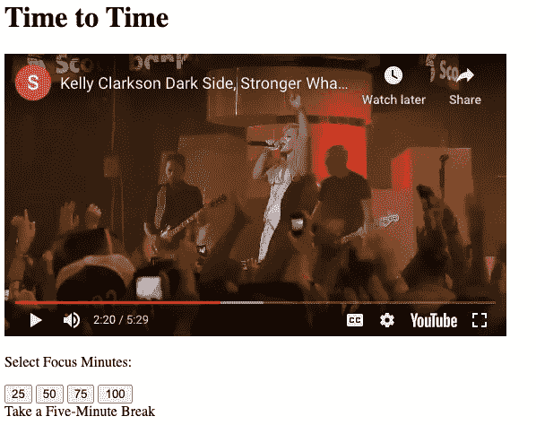

# 构建一个简单的番茄红素网络应用程序

> 原文：<https://betterprogramming.pub/creating-a-simple-pomodoro-web-app-a-beginners-guide-a30f98649977>

## 初学者指南


Tetiana SHYSHKINA 在 [Unsplash](https://unsplash.com?utm_source=medium&utm_medium=referral) 上拍摄的照片

在我们这个过度联系、充斥着通知的世界里，注意力似乎是一种货币，一种太容易被浪费却同样难以获得的货币。我一生都在学习，我可以证明，在任何学习领域，阻碍我进步的最大障碍就是分心。毕竟，似乎总有无尽的猫咪视频等着你去欣赏，有熟人的照片等着你去浏览，有电子邮件等着你去浏览，有通知铃声等着你去点击……你懂的。

帮助我的大脑克服这种持续不断的技术噪音带来的注意力分散的诅咒的是一种简单的时间管理技术，名叫[波莫多罗](https://francescocirillo.com/pages/pomodoro-technique)，归功于弗朗西斯科·西里洛。这个过程大致是这样的:1)选择一项任务，2)设置一个 25 分钟的计时器，3)将这 25 分钟专注于这项任务，并且只专注于这项任务，4)短暂休息，5)冲洗并重复。

当我不久前开始学习如何编码时，我知道一个利用番茄工作法的简单应用程序在我的尝试清单上。创建这个应用程序的过程教会了我很多关于如何操作文档对象模型，如何识别事件，以及如何在浏览器上创建动态变化，所有这些都不需要页面刷新。查看下面的应用程序的简短演示。

这款应用的设计归功于天才的多纳特·普拉纳。虽然样式对于让你的应用程序看起来像样和用户友好非常重要，但是为了节省时间，我将只向你介绍我是如何为这个单页应用程序创建功能的。您可以通过 [CodePen](https://codepen.io/nhtvng/pen/eYZJZqd?editors=1010) 访问源代码。请随意跟随。

# 规划过程:用户故事

首先，我头脑风暴用户故事，这是从用户的角度对我的应用程序功能的简单描述。作为用户，我希望:

1.  能够进入应用程序的页面，看到显示的几个选项的重点分钟选择
2.  点击聚焦分钟选项后，会显示一个倒计时
3.  能够取消我的焦点会议
4.  当我成功完成我的焦点会议时，奖励我一个随机的励志音乐视频
5.  可以选择完成另一个焦点会议或休息五分钟

# 开始 HTML:查看分钟选项

我的`index.html` 文件开始是这样的:

我创建了包含以下项目的元素:带有应用程序名称的主标题、描述、倒计时、取消按钮、视频、聚焦分钟按钮和休息选项。我给每个元素分配了唯一的 id，以便以后容易地引用它们，并且还将它们包装在`<div>` 容器中，以便于样式化。默认情况下，我隐藏了取消按钮和“休息一下”选项当链接到我的`index.js`文件时，我确保添加了“延迟”,以确保在运行任何 JS 代码之前先加载 HTML。

每个分钟按钮的 ID 和`take-break`跨度被设置为相应的分钟。稍后，ID 将被传递给一个负责设置适当开始时间的函数。我最初将分钟按钮 25 的 ID 设置为 0.05，以避免每次测试我的应用程序都要等待整整 25 分钟。

现在，用户可以看到以下内容:



用户故事 1:已完成。

# 看到一个倒计时显示

当用户点击一个焦点分钟选项时，应该会显示一个倒计时器，从指定的分钟开始计时。为了实现这一点，我使用了[事件委托](https://dmitripavlutin.com/javascript-event-delegation/)。首先，我创建了变量，并给它们分配了从 DOM 中选择的稳定元素。这允许我在代码中轻松地引用它们。

接下来，我给`selectionContainer`*添加了一个事件监听器，调用一个名为`renderCountdown()`的函数。实际上，我是在告诉浏览器，如果我在`selectionContainer`中点击的东西恰好是一个带有类`set-time`的元素，就开始倒计时。*

*通过使用助手功能`hideElements()`和*`unhideElements()`*，我能够轻松显示我希望用户看到的内容。这些函数利用了 [rest 参数](https://developer.mozilla.org/en-US/docs/Web/JavaScript/Reference/Functions/rest_parameters)，它允许您传递未知数量的参数。***

***接下来是应用程序的核心功能。`startCountdown()`以整数形式接收一个分钟变量，并在`countdownContainer`中显示一个变化的倒计时时钟。***

***首先，我编写了显示适当倒计时时间的逻辑，利用了`setInterval()`，它将运行您传递给它的任何回调函数，持续指定的毫秒数。(在这种情况下，我们告诉它让`totalTimeInSeconds`每过一秒就减 1)。用户现在会看到:***

******

***用户故事 2:已完成。接下来，出现了两个选项:如果计时器到达 0，以及如果用户单击 Cancel 按钮。在任一情况下，倒计时间隔应该停止，并且应该呈现音乐视频或者用户被带回到开始。***

# ***取消会话***

***如果用户取消会话，则调用功能`renderBackToStart()` 。该函数再次使用助手`hideElements()`和`unhideElements()`使用户再次看到以下显示:***

****

```
 **function renderBackToStart() {
  hideElements(countdownContainer, cancelContainer, videoContainer, takeBreak);
  unhideElements(description, selectionContainer, timeButtonsContainer);
}**
```

**用户故事 3:已完成。**

# **杀不死你的会让你变得更强**

**如果用户成功完成会话，我们调用`renderVideo()`函数，该函数从一组 URL 中取出一个随机视频 URL(附带指定的开始时间和自动播放参数),并使用`iframe`将其附加到`videoContainer`。是的，其中一首歌是心爱的凯莉·克莱森的更强。这算不算是一种祝贺的动力？**

**该功能还利用`hideElement()`和`unhideElement()`来显示选项，供用户开始另一个会话或休息五分钟。**

**用户看到的内容:**

****

**用户情景 4 和 5:已完成。嘣嘣。**

**通过开发这个应用程序，我了解到:**

1.  **通过使用`.querySelector()`、`.addEventListener()`、 `.setInterval()`等方法操作 DOM**
2.  **创建助手功能，并尽可能地将单个职责委托给每个功能**
3.  **使用 ES6 语法，如 rest 参数和 arrow 函数语法**

**谢谢你一直读到最后。我希望这有所帮助。为不断学习干杯，尽管路上有干扰！**