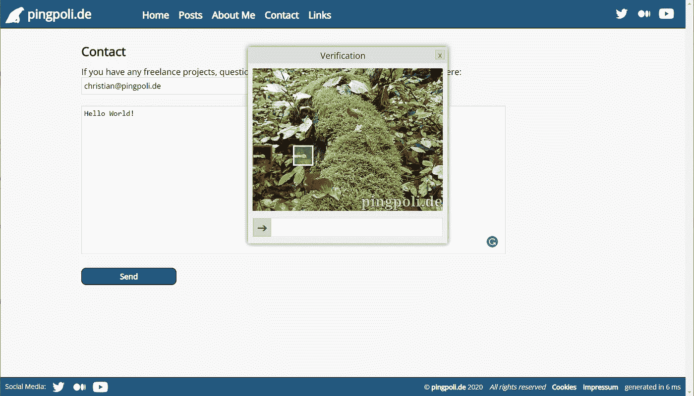
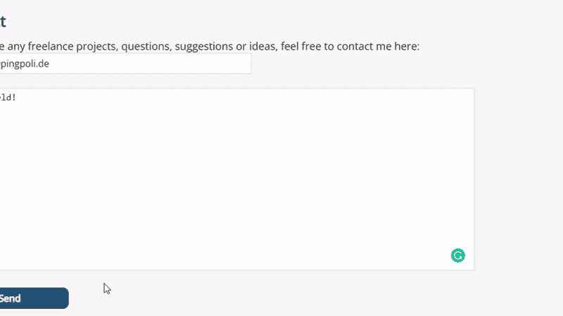

# 创建一个滑动验证码来阻止机器人发送联系请求

> 原文：<https://betterprogramming.pub/creating-a-slider-captcha-to-prevent-bots-from-sending-contact-requests-e77d32ce1094>

## 一个简单的 JavaScript 和 PHP 解决方案来消除垃圾邮件

创建一个滑块验证码，并将其添加到我的网站，以消除通过联系形式的垃圾邮件。图片作者。

很长一段时间以来，我一直通过网站上的联系方式收到非常烦人的垃圾邮件。提交联系请求只需要解一个简单的数学方程，但这并不十分有效。垃圾邮件发送者甚至懒得访问带有联系表单的页面。相反，他们计算出需要哪个 POST 请求，然后尝试随机数，直到他们猜出正确的解决方案。

因此，在每天删除多封垃圾邮件几个月后，我决定做点什么来对抗它，并创建了一个滑动验证码来减少垃圾邮件。

# 验证码类型

你可以找到许多不同类型的验证码。首先，有扭曲的单词或字符的验证码，这可能会阻止机器人，也可能不会阻止机器人，但对大多数人来说，它们也很难解决。还有一种是“点击所有有摩托车的图片”,还有一种是你只需要点击一个复选框,“算法”就会判断出你是不是人。

这两种情况都需要使用第三方解决方案，我会尽可能减少第三方工具的使用。

似乎最容易创建(也最不容易解决)的验证码类型是滑动验证码，你必须将图像中的拼图滑动到正确的位置。

# 创建滑块验证码

滑块验证码是一个有两个主要元素的弹出窗口:带有滑动拼图块的图像和它下面的滑块。我想让验证码尽可能容易使用，所以所有必需的元素都是在 JavaScript 类中动态创建的，不需要定义 HTML 元素。

对于图像和滑动拼图块，我使用了画布元素，因为它可以有效地重新绘制，而且我喜欢画布。虽然有默认的 HTML 滑块，但它们看起来很糟糕，所以我创建了一个自定义滑块元素，它只是另一个 div 中的一个 div。内部 div，即滑块旋钮，需要三个事件监听器，分别用于`mousedown`、`mousemove`和`mouseup`。

最有趣的一个是`mousemove`，我们需要计算出鼠标被点击后移动的距离，并使用这个偏移量来移动滑块和拼图块。当释放鼠标按钮(`mouseup`)时，我们必须检查拼图块是否在正确的位置，如果是，触发滑块验证码类的`onsuccess`回调，否则触发`onfail`。

以下是 slider captcha 类的完整代码:

*滑块验证码在起作用。图片作者。*

# 使用验证码防止垃圾邮件

如前所述，我的旧联系表单的最大问题之一是垃圾邮件发送者可以通过发送帖子请求而不访问页面来创建垃圾邮件。这是我想在新的基于验证码的解决方案中避免的事情。为此，使用 PHP 在服务器上创建两个随机位置值，并存储在会话中。这些位置然后被用于初始化滑块验证码。当它被正确求解时，值被添加到表单中并被提交。

当提交联系表单时，初始化并显示滑动验证码。

在服务器上，我们没有办法验证验证码的正确性。我们看到的只是一个 POST 请求，它可能是通过解决 captcha 发送的，也可能来自垃圾邮件发送者的脚本。但是，我们可以通过检查会话变量是否存在以及 POST 值是否与它们匹配来检查联系人页面是否被访问过。这使得猜测 POST 请求的正确值变得非常不可能。两个值的误差为 0.0001，有 1，000，000 种可能性。

在服务器端检查滑块验证码。

# 效果如何？

不幸的是，验证码并不完美。市面上的大多数解决方案都可以自动解决，即使其中一个现在无法解决，几个月后也不会。当你谷歌滑动条验证码时，首先出现的结果是自动解决它们的[方法](https://scraperbox.com/blog/solving-a-geetest-slider-captcha-with-puppeteer)。

这意味着我简单的自制解决方案也可以用一个脚本来规避。然而，与使用流行的第三方验证码相比，我的自定义解决方案具有优势。垃圾邮件发送者使用的脚本可能会破解市场领导者的验证码。

但是，能够解决一个流行的滑块验证码的同一个脚本不太可能也能解决我的。我的几乎肯定更容易打破，但它至少需要一点点的工作来做。

客观上，它不值得，因为我是唯一一个使用它的人。然而，也没有理由对我的旧解决方案进行逆向工程，所以我再次收到垃圾邮件可能只是时间问题。

我每天通过网站上的联系方式收到大量垃圾邮件，因为旧的基于数学的验证码无效。相反，我用 JavaScript 创建了一个新的 slider captcha，并使用 PHP 会话来防止垃圾邮件发送者猜测 POST 请求。

我肯定垃圾邮件发送者会在某个时候绕过新的解决方案，但至少现在，我没有从我的网站收到任何垃圾邮件联系请求。

*最初发布于*[*https://ping poli . de*](https://pingpoli.de/slider-captcha)*。*