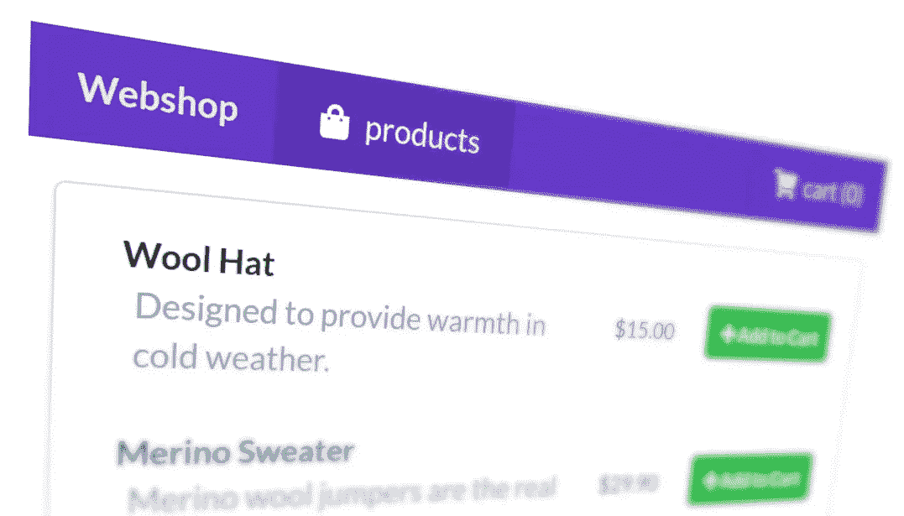
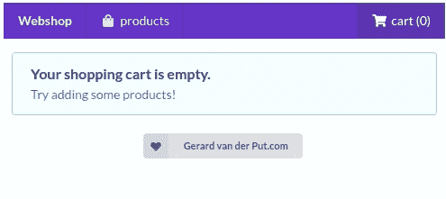
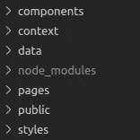
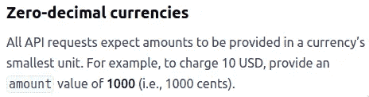
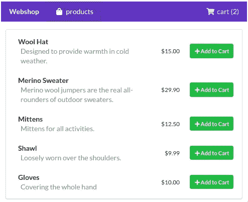
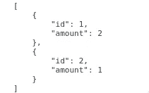
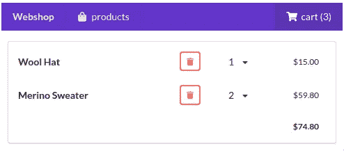

# 用 React 和 Next.js 创建一个小型网店

> 原文：<https://betterprogramming.pub/creating-a-small-webshop-with-react-and-next-js-82e2d7a291d6>

## 从头开始构建一个原型网店



我们今天要建造什么！作者照片。

人们现在可能已经厌倦了待办事项列表和计数器。今天，我们一起来搭建一个简单网店的原型。我们将一步一步地完成这个过程，我会试着解释我的思路。

我们将使用 Next.js。如果您从未使用过它，请不要害怕。它使用起来非常简单，在许多方面与 CRA (Create React App)非常相似，但具有更多开箱即用的功能，如基于文件的路由和 SSR(服务器端渲染)。



动画:我们的网上商店在行动。学习如何制作这个！

*注:该项目的文件可以在* [*GitLab*](https://gitlab.com/gvanderput/gerard-nextjs-basket) *上找到。*

# **设置**

创建新的 Next.js 项目:

```
$ npx create-next-app myProject
```

添加一些依赖项。我将使用`semantic-ui-react`,这样我们可以快速做出一个漂亮的布局:

```
$ yarn add semantic-ui-css semantic-ui-react
```

我也更喜欢使用 [Sass](https://sass-lang.com) ，一种 CSS 预处理器，它在常规 CSS(或者他们自己说的“具有超能力的 CSS”)的基础上增加了一层功能。为此，我们需要再添加一个依赖项:

```
$ yarn add sass
```

最后，我们的根目录包含这些文件夹:



创造那些还不存在的。我们很快就会看到它们的内容，从`data`目录开始。

## 产品数据

在我们店里，我们展示用户可以订购的产品。我们会将这些产品的信息存储在`data/products.json`文件中:

*注:* [*实际文件*](https://gitlab.com/gvanderput/gerard-nextjs-basket/-/blob/master/data/products.json) *包含五种不同的产品。*

在常规应用程序中，这些数据可能来自 API 或另一个远程数据源。像这样将它存储在一个单独的文件中，将使我们的应用程序足够灵活，如果需要的话，我们可以很容易地用一个远程源来替换它。

## 价格和货币

价格存储为以美分(或货币的最小单位)表示的货币金额的值。

另一个重要的细节是，价格存储为以美分表示的货币量的值。我强烈建议以这种形式传递价格。像 [Stripe](https://stripe.com) (一个受欢迎的[高价值的](https://techcrunch.com/2020/04/16/stripe-raises-600m-at-36b-valuation-in-series-g-extension-says-it-has-2b-on-its-balance-sheet/)支付处理器)这样的公司在你使用他们的 API 时也期待这样的价值:



来自[条带文档](https://stripe.com/docs/currencies)的部分。

我不会说这是一个标准，但也不是很远——尤其是当你的应用程序只支持*可收费金额时。我想做的唯一评论是:在处理和计算百分比时要小心。但是这个话题应该有自己的文章。*

## 渲染价格

存储价格是一回事。以用户友好的格式呈现它们是另一回事。我们将为此创建一个专用组件，这样如果需要的话，我们可以在整个应用程序中轻松地调整它(`components/MoneyFormat.jsx`):

几年前，我们使用像 [currency-formatter](https://www.npmjs.com/package/currency-formatter) 这样的库来做这件事。但是浏览器已经进化了，我们可以愉快地使用本地 API，比如在这个例子中使用的,[国际化 API](https://developer.mozilla.org/en-US/docs/Web/JavaScript/Reference/Global_Objects/NumberFormat) 。

*注意:请注意我们是如何强制执行以美元为单位的渲染价格的。如果你想了解更多关于国际化和本地化的内容，你可以阅读我关于这个特定主题的文章*[](https://medium.com/swlh/how-to-build-internationalized-next-js-applications-deed12bca063)**。**

## *渲染产品*

*是时候创建我们的第一页了。我们的索引页面将列出所有产品:*

**

*我们显示了它们的名称、描述、价格，以及一个将产品添加到我们购物车的按钮(稍后会有更多关于那个技工的内容)。*

*`page/index.js`的内容:*

*除了第 15 行之外，代码说明了一切:我们将值`withProducts`传递给组件的初始属性。这是一个 Next.js 机械师。它允许我们向组件发送属性并启用 SSR(更多信息可以在文档中找到)。*

*你现在不用太在意这个机械师。请记住，无论`withProducts`返回什么(它是一个函数),都将作为属性出现在我们的组件中。*

*`withProducts`在`data/api.js`里面是这样定义的:*

*注意`withProducts`是一个*异步*函数。这意味着我们也可以执行*花时间执行*的代码，比如用基于承诺的 API 获取数据:*

```
*const products = await fetch('https://...');*
```

*最后但同样重要的是，我们在一个单独的文件中创建这个函数(我们也可以用我们的页面组件定义直接在文件中定义它)的原因是我们可以很容易地在其他页面上重用这个逻辑。这正是我们稍后将在购物车页面上做的事情。*

*无论如何，我们现在正在我们的索引页上呈现我们的产品。*

## *购物车状态*

*我们看到绿色的`Add to Cart`按钮。当我们点击它们时，代码方面会发生什么？答案很简单:我们将相关产品添加到我们的`Cart`状态。*

*我们的状态(数据对象本身，它是一个数组)具有以下结构:*

**

*购物车状态数组*

*上图中的状态包含两项。每个项目都包含一个产品 ID 和一个金额。该金额允许多次将同一产品添加到我们的购物车中。这是所有大供应商(看着你，亚马逊)为了刺激一次购买更多物品而使用的流行机制。让我们拥抱它。*

*在我们看如何用一个 reducer 操作这个状态之前，让我们初始化一个 React [上下文](https://reactjs.org/docs/context.html)，它将保存我们的初始状态(`context/cart.js`):*

*我们用`pages/_app.js`内部的`CartProvider`包装我们的主要组件:*

*这里有几点需要注意。*

*首先，我们的初始状态是一个空数组(代表一辆空的购物车)。然后我们创建一个新的上下文，它的`Provider`保存当前状态和一个调度函数作为它的值。当前状态和调度函数是通过从 React 调用`[useReducer](https://reactjs.org/docs/hooks-reference.html#usereducer)`钩子创建的。如果你对`useReducer`不熟悉，我建议在继续之前先读一点。*

*不过，理解它的功能并不难。`useReducer`退货:*

*   *当前状态。*
*   *调度功能。*

*dispatch 函数允许我们通过执行动作来操纵当前状态。让我们看看那个。*

**注意:我们使用* `*useReducer*` *和上下文的组合来进行状态管理和状态属性注入。你可能会说有更好的替代方法，比如 Redux，我完全同意！事实上，如果我要创建一个成熟的网络商店，我更喜欢 Redux。你可以在我最近的文章* *中阅读更多关于我的想法。**

## *行动*

*还记得由我们的`Product`组件呈现的绿色`Add to Cart`按钮吗？下面是来自`components/Product.jsx`的相关代码:*

*我们通过调用`useContext`钩子来注入我们的调度函数。当用户点击按钮时，我们进行调用:*

```
*dispatch({ type: "ADD_ITEM", payload: { id } })*
```

*这被称为*分派一个动作——在本例中是*一个`ADD_ITEM`动作。发出呼叫将通知减速器我们的状态。减速器负责操纵我们的状态。在本文的前面，我们已经注释掉了 reducer 函数的主体，但是现在我们可以看看它的一部分(`context/cart.js`):*

**注:查看资源库* *中的* [*完整文件。*](https://gitlab.com/gvanderput/gerard-nextjs-basket/-/blob/master/context/cart.js)*

*代码应该不言自明。`ADD_ITEM`动作(以及另外两个动作`ADJUST_AMOUNT`和`REMOVE_ITEM`)操纵我们的状态。换句话说，他们*更新我们的购物车*。*

## *渲染购物车*

*关于购物车的渲染，我就不赘述了:*

**

*我们购物车中的三件商品。*

*它呈现购物车中的产品，对于每个产品，它呈现一行，其中包含:*

*   *一个`remove from cart`按钮(调度`REMOVE_ITEM`)。*
*   *一个`change amount`下拉菜单(调度`ADJUST_AMOUNT`)。*
*   *所选金额的总价。*

*最后，一行包含购物车中商品的总价。*

# *结论*

*当然，这并不是一个完整的网店。但是通过展示和解释达到这一点所需的所有小步骤，我希望我已经给了你一些关于如何在开发一个网店 *—* 或任何应用程序时思考的知识，真的是*。**

*这个项目的文件可以在 [GitLab](https://gitlab.com/gvanderput/gerard-nextjs-basket) 上找到。*

*感谢您的宝贵时间！*