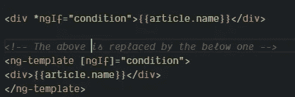
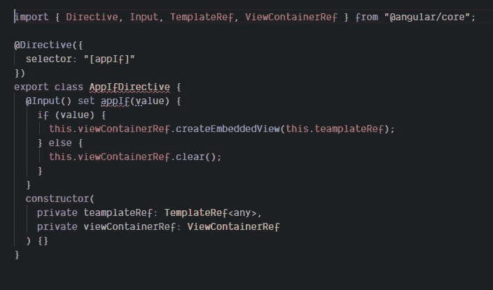
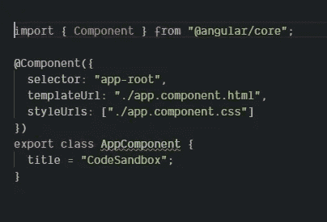
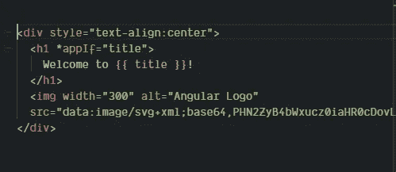

# 如何在 Angular 中创建一个类似 ngIf 的结构指令

> 原文：<https://betterprogramming.pub/creating-a-structural-directive-similar-to-ngif-in-angular-4709bac8044b>

## 什么是结构指令？

照片由[卡勒姆·威尔](https://unsplash.com/@callumlwale?utm_source=unsplash&utm_medium=referral&utm_content=creditCopyText)在 [Unsplash](https://unsplash.com/s/photos/shapes?utm_source=unsplash&utm_medium=referral&utm_content=creditCopyText) 上拍摄

结构指令负责 HTML 布局。它们通常通过添加、删除或操作元素来改变 DOM 的结构。

结构化指令以一个`*`字符为前缀。当 angular 看到一个`*`前缀指令时，它将把`*ngIf`属性翻译成一个`<ng-template>` 元素，环绕在主机元素周围，如下所示:

下面是一个 ngIf 指令的副本，我们在这里检查指令的输入是否存在(这里我不检查类型，所以如果值是`0`，那么它将不会显示)。如果存在，那么使用`viewContainerRef` 我们创建一个`EmbeddedView`，在`ng-template`中传递模板。

app.if.directive.ts

这里我们在组件中定义了一个`title`属性:

应用程序组件

然后，我们将标题作为输入传递给`app.component.html`中的`appIf` 指令。

app.component.html

最后，我们在`app.module.ts`中声明该指令。

应用程序模块

浏览器中显示的输出如下:

浏览器中的输出