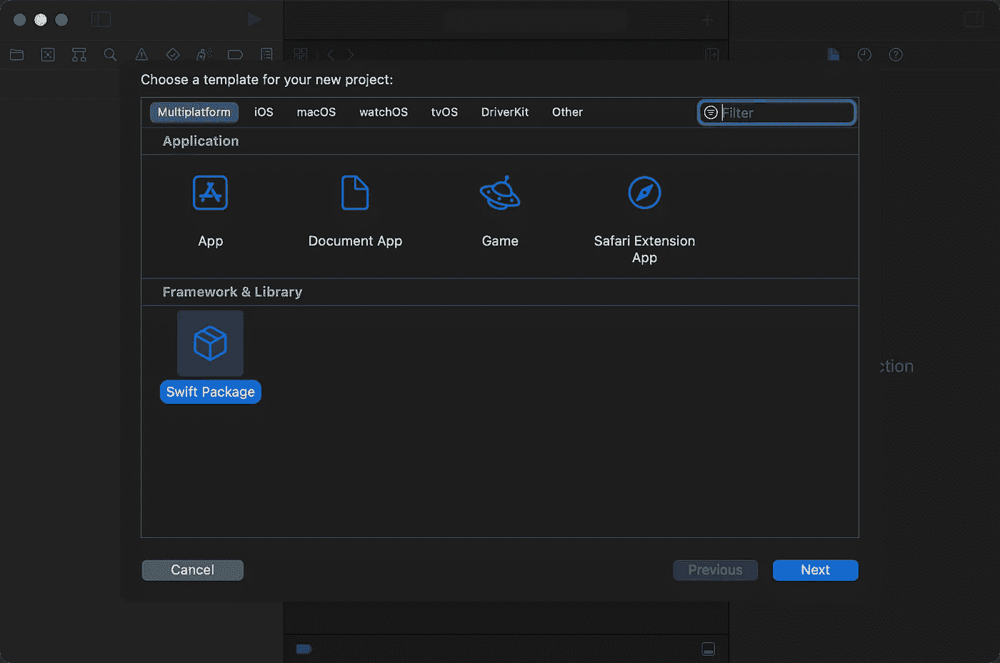
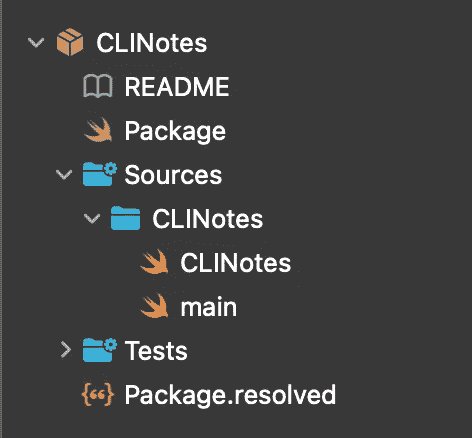
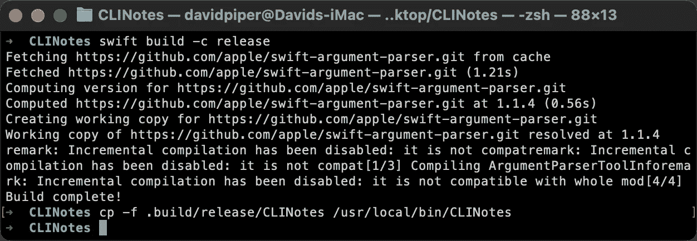
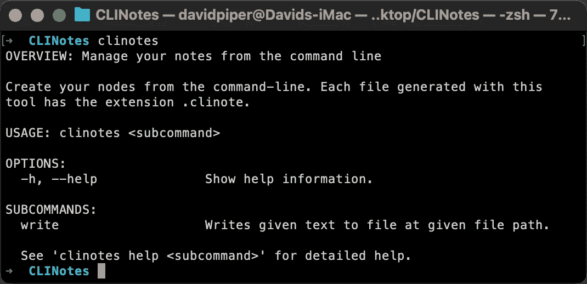
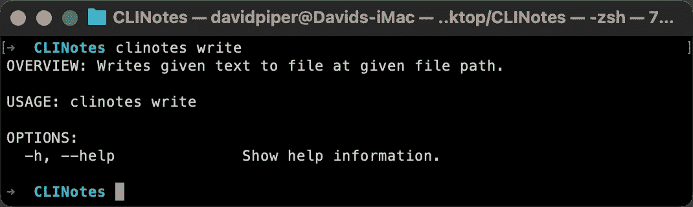
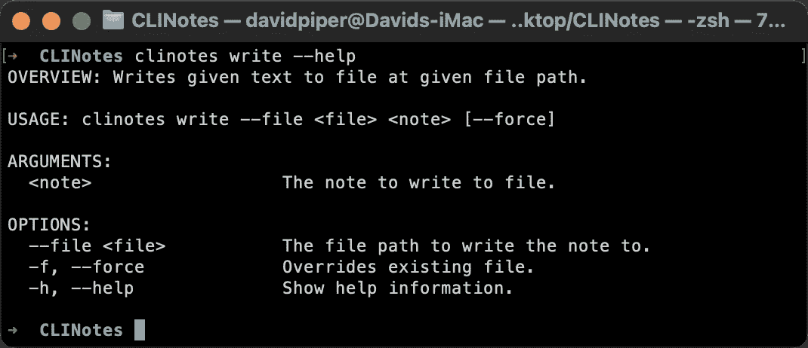
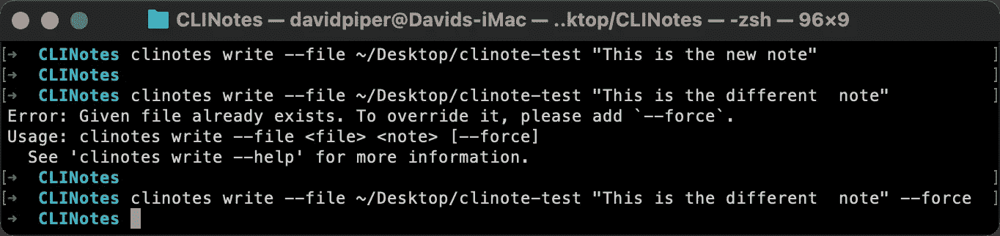
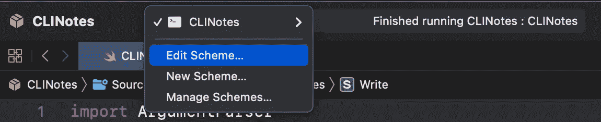
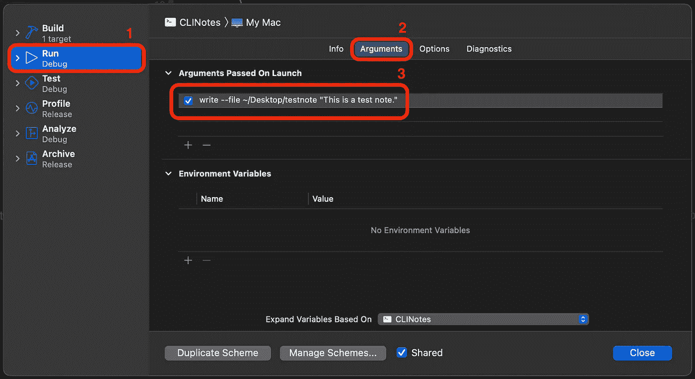

# 用 ArgumentParser 创建一个 Swifty 命令行工具

> 原文：<https://betterprogramming.pub/creating-a-swifty-command-line-tool-with-argumentparser-a6240b512b0b>

## 将笔记保存为文件！

Volodymyr Hryshchenko 在 [Unsplash](https://unsplash.com?utm_source=medium&utm_medium=referral) 上拍摄的照片

作为 iOS 开发者，我们每天都在使用终端。很难想象没有 Git 或 CocoaPods 这样的命令行工具的编程。

苹果让使用 Swift 创建自己的命令行工具变得超级简单。在本教程中，让我们深入了解苹果的 ArgumentParser 框架，并学习如何自己创建一个命令行工具。

我们将看一个简单的例子，并理解创建一个伟大的命令行工具所需的所有部分。最后，我们将讨论作为一名 iOS 开发人员，这将如何使您受益。

# 入门指南

在本教程中，我们将构建一个命令行工具，使您能够从终端写笔记。它看起来会像这样:

`clinotes write --file /path/to/save/note/to "This is a note" --force`

你可以在我的 GitHub 页面查看完成的项目:

 [## GitHub — DavidPiper94/CLINotes

### 这是一个展示如何使用苹果 ArgumentParser 框架的示例项目。通过…将您的笔记保存为文件

github.com](https://github.com/DavidPiper94/CLINotes) 

或者，您可以跟随并自己构建项目。在深入研究代码之前，我们需要为我们的命令行工具创建一个新项目。打开 Xcode，创建一个新项目，并选择 Swift 包:

点击下一步。在下一步中，将项目命名为 CLINotes，然后单击 Create。这将生成一个具有给定名称的新包。

打开`Package.swift`，用以下代码替换其内容:

这将一个名为`CLINotes`的可执行文件定义为我们包的产品。它还向我们的项目添加了依赖关系`ArgumentParser`。

最后，在组 Sources 中的组`CLINotes`内创建一个名为`main.swift`的新文件，暂时保留为空。我们过会儿会看一看它。

您的项目现在看起来应该与此类似:

现在一切都设置好了，我们将在接下来的两个部分中开始定义我们的第一个命令和子命令。

# 定义命令

苹果的 ArgumentParser 框架允许我们将命令行界面定义为简单的 Swift 类型。所有命令和子命令都被定义为结构，它可以有属性和方法。

它们需要符合`ParsableCommand`，该协议是所有命令的基础。让我们从定义我们的第一个命令开始！打开`CLINotes.swift`并用以下代码替换其内容:

事情是这样的:

我们从定义顶层命令开始。这是一个名为`CLINotes`的结构体，它符合`ParsableCommand`。

`// 2` —我们将把文件扩展名`.clinote`添加到我们的文件中，这样就可以识别由我们的命令行工具创建的笔记。因为我们将在多个地方使用它，所以我们将它存储在属性`fileExtension`中。

`// 3` —接下来，我们创建一个`CommandConfiguration`。它定义了很多关于你的命令的信息。它可以有许多不同的属性，让我们来看看:

*   `commandName`:这是您输入命令行来执行命令的名称。如果未设置，将根据结构名称自动生成名称。默认值为`nil`。
*   `abstract`:简短的描述应该是一行。更长的描述，可以用`discussion`。默认值是一个空字符串。
*   `usage`:描述如何使用该命令。如果没有设置，自动生成的用法说明将用于帮助消息。默认值为`nil`。
*   `discussion`:如果你对你的命令有比一行代码`abstract`更多的话，你可以通过这个属性来说。默认值是一个空字符串。
*   可以对您的命令进行版本化。定义该命令在命令行工具的哪个版本中可用。默认值是一个空字符串。
*   `shouldDisplay`:显示或隐藏帮助信息中的命令。默认值是`true`，所以如果没有改变，会显示一个命令。
*   `subcommands`:子命令列表。使用子命令来指定命令，使它们更易于使用。看完`CommandConfiguration`我们再来看看如何使用它们。默认值是一个空数组。
*   `defaultSubcommand`:当用户没有输入子命令时，可以定义子命令。默认值为`nil`。
*   `helpNames`:这定义了请求帮助的标志名(一种输入类型，我们将在后面的章节中讨论不同的类型)。默认值为`-h`和`--help`。因此，如果用户输入您的命令名，例如`-h`，他们将会看到帮助消息。

都有一个合理的默认值。因此，它们都不是必需的，您很少会用到所有这些属性。通常`commandName`、`abstract`和——如果需要的话——`subcommands`足以提供用户需要的所有信息。

# 添加子命令

让我们添加一个子命令来进一步指定我们的命令行工具的功能。不过，在`CLINotes.swift`中，用下面的代码替换它的内容:

`// 1`——我们不需要`CommandConfiguration`的很多属性。在我们的示例`commandName`、`abstract`和`discussion`为我们的命令行工具的用户提供了有用的信息。因此，我们保留它们并删除其余的。此外，我们将当前添加的新命令添加到`subcommands`。

`// 2`—子命令也是符合`ParsableCommand`的结构，就像我们之前创建的顶层命令一样。我们将新的`Write`命令放在我们的`CLINotes`命令中。A `CommandConfiguration`提供了更多信息。

# 构建和运行命令行工具

现在我们已经准备好了命令，让我们构建并运行我们的程序。

但是还有最后一件事要做。打开`main.swift`，将其内容替换为以下代码:

`main.swift`是执行我们命令行工具的主要入口点。通过调用顶层命令中的`main()`，我们开始解析并执行输入到命令行中的命令。

接下来，打开终端，移动到项目目录并执行以下命令:

`swift build -c release`

这将构建命令行工具，并在构建目录中创建一个可执行文件。我们可以从那里调用它，但是每次我们想要使用命令行工具时，使用这个路径是非常不方便的。因此，让我们首先将它移动到一个更容易访问的不同位置。为此，请执行以下命令:

`cp -f .build/release/CLINotes /usr/local/bin/CLINotes`

这会将可执行文件放在二进制目录中，并使其可以从任何地方访问。

这两个命令的输出应该如下所示:

仍然在终端中，通过输入以下命令来测试您的命令行工具:

`clinotes`

您将看到以下输出:

您可以从`CommandConfiguration`中了解到这里展示的许多内容:

*   `OVERVIEW`显示了我们在`abstract`中设置的内容。
*   它的下面是`discussion`。
*   因为我们没有覆盖属性`usage`，所以它在`USAGE`中显示默认值。
*   ~显示了一个获得帮助的选项，因为我们没有更改`helpNames`的默认值，它是`-h`和`--help`。
*   `SUBCOMMANDS`列出了一个子命令，就是我们的`Write`子命令。

我们还可以执行`write`子命令，这将产生以下输出:

我们还不能做太多。让我们在下一节中通过添加输入和实现一个`run`方法来保存我们的笔记来改变这一点。

# 添加输入

是时候为我们的命令添加输入了。为此，我们将向命令添加属性，这些属性可以是参数、选项或标志。

参数是位置输入，这意味着它们在命令中有一个固定的位置，不能以任何其他顺序排列。

选项被命名为输入。您需要在值之前键入他们的名称。这看起来有点像`--file /path/to/file`。这要求您记住输入名称，并使命令更冗长，但更灵活，更容易理解。

标志是二进制输入。它们可以添加到命令中，也可以不添加。上面截图中的选项`--help`就是一个例子。你可以看到它要么存在，要么不存在。

将命令行工具的输入视为一个名称和值的元组，您可以这样看待三种不同类型的输入:

*   自变量:唯一值
*   选项:名称和值
*   标志:仅名称

您需要为选项和标志使用一个名称。有五个不同的选项来命名它们:

*   `short`:仅使用输入名称的第一个字符。例如，在`helpNames`中使用此选项时，在`CommandConfiguration`中，显示帮助的标志名称将是`-h`。另一个很好的例子是用于启用详细输出的`-v`。
*   `long`:这要求你使用一个属性的全名。求助，是`--help`。它被转换成小写字母和连字符来分隔较长的名称。
    一个叫`filePath`的楼盘，长名叫`--file-path`。
*   `shortAndLong`:这是`helpNames`的默认值，它允许你使用短格式和长格式，所以在这个例子中是`-h`和`--help`。
*   `customShort`和`customLong`:这两个选项允许你自定义输入的名称。

现在是时候给我们的`Write`命令添加一些属性了。在其属性`configuration`下添加以下代码:

`// 1` —首先，我们添加输入`filePath`，这是保存注释的路径。我们用`customLong`来定义它的名字为`file`。短名称(`-f`)会与我们将添加的最后一个输入冲突，因为`force`也以 f 开头。因此，我们只使用长版本。默认的长名称是`--file-path`，为了更方便的输入路径。我们提供自定义名称。

`// 2` —因为参数是位置输入，所以我们不需要定义名称选项。相反，我们只添加了`help`来向用户解释如何使用这个输入。

`// 3` —为了不意外覆盖现有文件，在写入已经存在的文件路径时，需要使用`-f`或`--force`。

考虑一个好的子命令结构，并使用参数、选项和标志来创建一个可用的命令。

构建并再次运行命令行工具。进入`clinotes write --help`，你会看到这个输出:

但是，即使提供了所有属性的值，也不会发生任何事情。我们仍然需要添加代码来实际保存文件。我们将在下一节中这样做。

# 执行命令

我们还不能用命令行工具做太多事情。要改变这一点，请将此方法添加到属性`force`下的`Write`结构中:

`run`是解析命令后自动执行的。事情是这样的:

`// 1` —我们想给我们的命令行工具创建的笔记添加一个通用的文件扩展名。因此，在向文件系统写入内容之前，我们需要将它附加到用户输入的文件路径中。

`// 2` —我们使用字符串上的`write(toFile:automatically:encoding)`将注释写到给定的文件路径。我们现在使用`try?`来消除任何错误。这将在下一节讨论如何处理错误时有所改变。

构建可执行文件并运行命令。我们现在能够从终端为我们的笔记创建文件。但是我们不要就此打住。我们还需要关注另一个重要部分——验证和处理错误。

# 验证输入

接下来，让我们探索如何验证输入。在定义命令行工具时，考虑验证是一个重要的部分。虽然你可以试着让你的程序听起来尽可能的好，但是可能会有一些方法输入无效的输入。

Swift 的类型系统已经处理了很多错误。尝试为 int 类型的选项输入一个字符，您会看到一个错误。但是对于其他无效输入，您需要自己进行验证。现在让我们来看看如何做到这一点。

可能出现两种类型的错误:验证错误和运行时错误。验证错误在`validate`中抛出，并阻止`run`被执行。但是如果用户提供的所有输入都是有效的，那么在执行`run`时，您可能仍然会遇到问题。这些是运行时错误。

将此方法添加到`run`方法上方的`Write`结构中:

`// 1` —实现方法`validate`。当执行命令行工具来验证输入时，它将被自动调用。如果有任何事情不符合预期，您可以抛出一个错误。

`// 2` —我们不希望我们的命令行工具的用户错误地覆盖一个文件。因此，在运行该命令之前，我们希望确保添加了标志`--force`。如果路径中有文件，则应保存新的注释。

`// 3` —如果用户试图覆盖一个现有的文件，我们抛出一个`ValidationError`，其中包含一条向用户解释错误的消息。

像前面一样构建命令行工具，并尝试覆盖现有的注释。您将看到与此类似的内容:

很方便，对吧？

接下来，让我们看看运行时错误。首先添加这个新结构:

它代表运行时发生的错误。

现在，用以下代码替换`run`方法:

`// 1` —我们现在使用`do`和`catch`，而不是使用`try?`在向文件写注释时消除错误。

`// 2`—当出现任何问题，笔记无法保存时，我们抛出一个`RuntimeError`，让用户知道操作失败。

恭喜，命令行工具完成了！🥳

# 调试命令行工具

由于没有一个软件可以避免错误，我们需要一种方法来调试命令行工具，就像任何其他应用程序一样。由于我们在命令行中运行可执行文件，它不会在断点处中断，也不会在 Xcode 的控制台上打印任何内容。

我们需要一点技巧来做到这一点。首先，我们需要编辑方案。单击目标客户，并在下拉列表中选择编辑方案…。

接下来，切换到左侧菜单中的 Run (1)并选择 tab Arguments (2)。在启动时传递的参数中，添加以下命令:

`write --file /Desktop/testnote "This is a test note."`

在 Xcode 中运行命令行工具时，这会使用给定的参数执行 write 子命令。

现在，在`Write`结构中为`validate`添加一个断点。

在 Xcode 中构建并运行应用程序。它将执行您刚刚定义的命令，并在断点处停止。

这就是调试命令行工具的方法。您可以在我的 GitHub 上找到完整的项目:

 [## GitHub — DavidPiper94/CLINotes

### 这是一个展示如何使用苹果 ArgumentParser 框架的示例项目。通过…将您的笔记保存为文件

github.com](https://github.com/DavidPiper94/CLINotes) 

# 作为 iOS 开发者如何受益？

虽然我们看了一个相当简单的小例子，但是您现在已经知道了构建更复杂的命令行工具的一切。

有很多例子可以让你创建自己的工具来简化你的开发工作流程。例如，管理应用程序的资源，如图像和字符串。

另一个很好的用例是创建一个命令行工具来控制和配置您的 iOS 应用程序。要了解更多有关如何通过终端在运行时与您的应用程序通信的信息，请查看我在 2022 年 iOS 全球开发者峰会上的演讲，我在演讲中展示了我们在 Scalable Capital 如何创建和使用命令行工具:

# 资源

 [## 证明文件

### 编辑描述

apple.github.io](https://apple.github.io/swift-argument-parser/documentation/argumentparser)  [## GitHub — DavidPiper94/CLINotes

### 这是一个展示如何使用苹果 ArgumentParser 框架的示例项目。通过…将您的笔记保存为文件

github.com](https://github.com/DavidPiper94/CLINotes) 

感谢阅读。敬请关注更多内容。