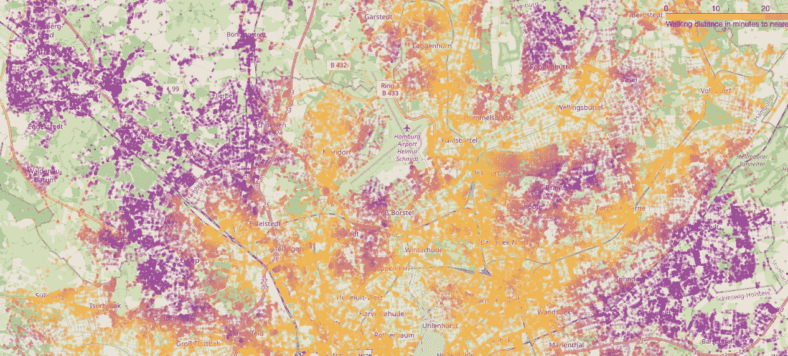
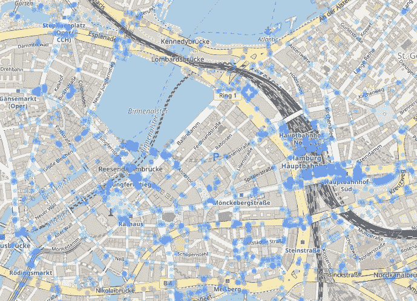
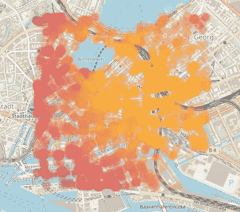
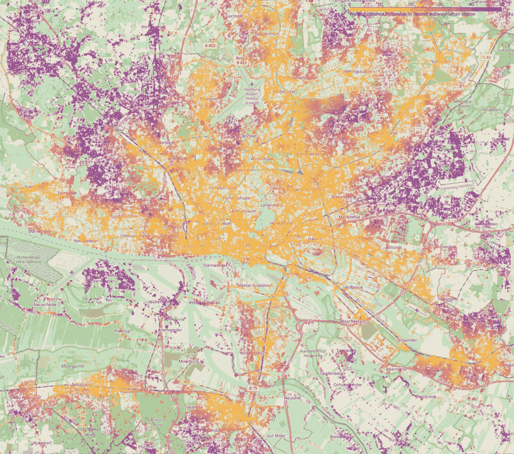

# 用 Python 创建整个城市的旅行距离地图

> 原文：<https://betterprogramming.pub/creating-a-traveling-distance-map-for-a-whole-city-with-python-f2e063272832>

## 同时使用多个点的图形网络和叶图的等时线绘图

汉堡公共交通的可用性|图片由作者提供

计算从你的位置到你能到达的所有地方的距离被称为等时线，如果你想知道在特定时间内你能到达什么地方，这是非常有用的。但是，如果您想反过来创建一张地图，显示从一系列感兴趣的点到城市中所有点的旅行距离，该怎么办呢？本教程将向您展示如何自己创建这样的等时线图！

您可以在这个 streamlit 应用程序上找到结果的概述:[到汉堡基础设施的步行距离](https://doppelfelix-isochron-hamburg-streamlitbikes-over-the-day-awtwm5.streamlitapp.com/Walking_Distances_to_Infrastructure)。

# **创建图形网络**

创建图形网络相当容易。首先，安装并导入所需的库。

接下来，我们为起始地址创建图，给出一个节点列表，这些节点本质上是简化的街道交叉口。之后，我们将其转换为 GeoPandas 数据帧，以绘制生成的节点。

`dist`是用于创建图表的从起始位置的距离。

`network_type`是您要使用的交通工具类型，其他选项有:`all_private`、`all`、`bike`、`drive`、`drive_service`。

我们可以使用下面的代码在一张叶子地图上查看我们的网络:

带有我们创建的节点的叶子图|图片由作者提供

## 为每个感兴趣的点创建等时线

现在是有趣的部分:为每个感兴趣的点创建等时线，并计算到每个新创建的节点的距离。在这种情况下，我们将使用汉堡市所有地铁站的位置。为了使用这些位置，我们必须为每个坐标元组找到最近的节点。这在 osmnx 函数`nearest_nodes`的帮助下很容易实现。

为了计算实际距离，我们需要将网络投影到地图上。变换因纬度而异。([Wikipedia:Map projection](https://en.wikipedia.org/wiki/Map_projection))我们将使用`project_graph`函数的默认设置来这样做。

现在，我们已经可以为单个兴趣点(POI)创建一个距离数组。如果我们使用 networkx 函数`shortest_path_length`并且只提供一个源，它将计算到所提供的图中所有其他节点的最短距离。

我们字典的结构应该是这样的:

我们已经可以继续这样做，并从中创造一个情节。这将需要一些工作，虽然，因为我们需要自己创建一个彩色地图，以直观的方式在叶地图上很好地呈现距离。

我们自己创建了一个彩色地图，每一分钟都有从 1 到 50 的步骤。在一个小的映射函数的帮助下，我们重写了字典函数来包含颜色代码而不是距离。现在，我们的图形中的每个节点都有了颜色，可以再次绘制叶子图。

彩色节点取决于与兴趣点的距离(越亮越近)|图片由作者提供

## 使用所有感兴趣的点

还记得我们想要使用几个兴趣点来创建我们的地图吗？我们快到了。为了迭代我们的 POI 列表，我们希望确保始终保持最小的距离。出于这个原因，我编写了一个小的自定义字典类，它只更新小于现有值或尚不存在的值。

这样，我们最终可以遍历所有 POI，并创建一个包含每个节点和到任何 POI 的最小距离的字典。

有了这个新的`node_distances`，我们只需重复上面的步骤，即绘制颜色和创建叶子图，瞧，我们有了最终的图:

步行即可到达汉堡最近的地铁站(15 公里渲染距离)|图片由作者提供

希望你喜欢这个小教程！如果你有兴趣，你可以在这里找到整本笔记本。