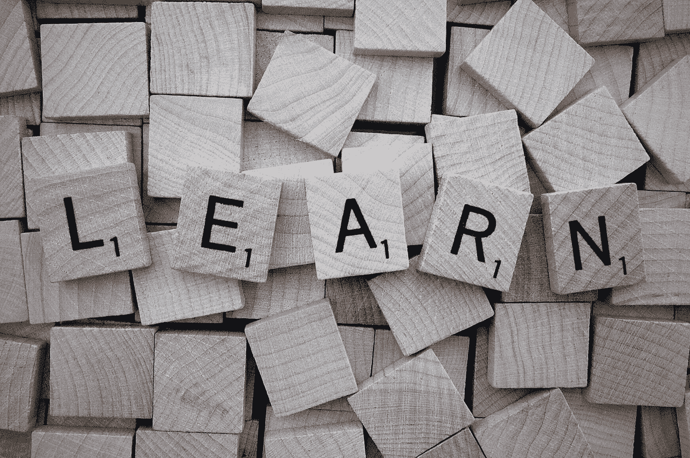
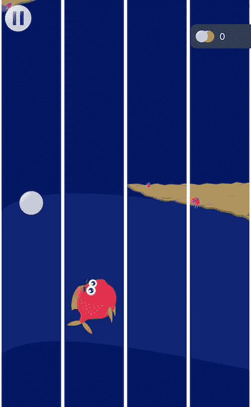
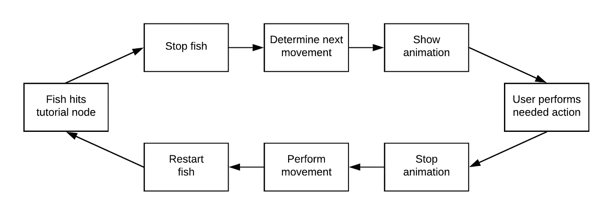

# 为精灵游戏创建教程

> 原文：<https://betterprogramming.pub/creating-a-tutorial-for-a-spritekit-game-f10f2228e414>

## 循序渐进的方法

图片来自 [Pixabay](https://pixabay.com/?utm_source=link-attribution&utm_medium=referral&utm_campaign=image&utm_content=1820039) 的 [Wokandapix](https://pixabay.com/users/Wokandapix-614097/?utm_source=link-attribution&utm_medium=referral&utm_campaign=image&utm_content=1820039)

目前，我和妻子正在开发一个小游戏。玩家控制一条鱼，这条鱼需要在从深海游上来的途中躲避障碍物。这条鱼只能在四个泳道内游泳，正如你在这张图片中看到的:

鱼弗雷迪可以在这四条泳道中游泳，需要躲避障碍物。

玩家可以通过向左或向右滑动来切换车道。你会猜测这个概念并不难理解，我们也是如此。但是当测试用户玩的时候，他们中的一些人不明白他们需要做什么。因此，我们决定将第一级转化为教程。由于我找不到如何添加教程的教程，我将描述我们采取的方法。

教程级别的每个步骤都由两部分组成。首先，鱼需要停在一个特定的点上，同时用户得到他们必须做什么的提示。第二，用户完成滑动手势后，鱼需要进行所需的动作。

# 1.教程节点的设置

我们通过在场景中添加节点来标记鱼应该停留的点。每个节点的名称都以`tutorial_node_`开头，后面是教程中步骤的编号。这些节点是在方法`setupNodes`中准备的，当场景被移动到一个视图时会调用这个方法。

设置教程节点

1.  将节点添加到场景编辑器后，我们需要在代码中访问它们。我们可以通过从场景中获取周围的`world`节点并遍历其子节点来做到这一点。
2.  现在我们可以访问节点，我们需要准备它们。我们把他们弄清楚，这样他们就不会在游戏中被看到，我们为他们每个人都创建了一个`SKPhysicsBody`，这样他们就可以被鱼击中。每个物体的大小和位置都与节点本身相同，并获得一个`categoryBitMask`值，以将它们标记为教程中涉及的节点。最后，通过将`isDynamic`属性设置为`false`，节点不会受到重力的影响，将会停留在原来的位置。

# 2.处理与教程节点的联系

为了检测播放器和教程节点之间的接触，我们需要实现`didBegin`方法，这是`SKPhysicsContactDelegate`协议所要求的。

处理玩家与教程节点的联系。

1.  作为参数传递的 contact 对象包含 contact 中涉及的两个元素`bodyA` 和`bodyB`。通过在`categoryBitMask`中将两者结合起来，我们可以检查哪些节点发生了冲突。
2.  在鱼和教程块的例子中，我们需要展示教程的下一部分。
3.  首先我们让鱼停下来。它只会在用户完成教程的这一部分后继续游动。
4.  我们通过使用一个叫做 node `(withCategory:)`的小助手函数从 contact 中提取 tutorial 块。它是`SKPhysicsContact`的扩展，检查 bodyA 或 bodyB 是否有教程`categoryBitMask`并返回正确的 body。现在我们可以检查教程块的名称。因为我们在场景编辑器中列举了它们，所以我们知道玩家当前处于教程的哪一步。在本例中，我们将只探索第一步。
5.  每当鱼开始接触一个教程节点，我们就决定鱼要执行的下一个动作。第一步，鱼需要游到最左边的泳道。我们还展示了一个动画来形象化用户必须做的动作。

您可以看到，我们通过使用两个函数`calculateNeededMovement(current:destination:)`和`showSwipeNeededAnimation(for:)`来实现这一点。让我们看看它们是如何工作的。

这些通道由以下枚举表示:

您在第一幅图像中看到的四条泳道由这些值表示。

一个动作包括鱼应该移动的方向和鱼在给定方向上必须做的许多鱼线转换。

struct Movement 封装了一个方向和朝该方向前进的多个步骤。

为了构造一个移动实例，我们将鱼的当前位置`SwimmingColumn`和鱼应该移动到的目的地传递给方法`calculateNeededMovement(current:destination:)`。它切换两者并返回相应的移动对象，例如，如果鱼当前在最左侧的泳道中，需要移动到中间左侧的泳道，它需要向右移动一步。这个移动被存储在变量`calculatedMovement`中，一旦用户滑动就被执行。

在这个例子中，获得下一个动作就像切换所有可能的组合一样简单。

注意:另一种方法是推迟计算玩家的下一步行动，直到用户已经触发了恢复。这将消除将计算和执行下一个动作分开的需要，这似乎是一个更好的方法。但是，仍然有状态需要存储，主要是教程的哪个点被触发了。此外，将这些步骤分开也有一些好处。当到达教程点时，SpriteKit 除了显示动画之外没有其他事情要做，因此有足够的资源来计算下一步。在这样一个小游戏中，这似乎无关紧要，但是想象一下，你有多个敌人，玩家需要以最好的方式绕过他们。甚至可能会有一个人工智能来寻找到达下一个地点的最短路径。这可以在游戏等待玩家下一步行动时完美完成。如果这种计算发生在用户执行恢复游戏所需的操作之后，可能会有性能问题。

在`didBegin(contact:)`方法中可以看到，在下一个动作确定后，我们想给用户展示一个动画，说明他们需要做什么。在其他情况下，您可能还想显示提供更多信息的文本。

向用户展示如何处理这个动画。

下面是我们如何一步一步添加动画:

1.  因为我们希望在用户滑动时移除动画节点，所以我们将它存储在一个变量中。
2.  当设置动画时，我们首先确保我们接收到了一个有效的运动。否则，我们将不显示任何动画。当用户需要向左滑动时，我们希望指示器从显示屏的右侧开始。否则，应该从左侧开始。因此，我们根据方向，用-100 或 100 的 x 偏移创建它的位置。该位置存储在一个变量中，以将动画中的节点重置为其起始点。
3.  现在我们创建一个填充的白色圆圈，它将是动画节点，指示用户需要在特定方向上滑动。
4.  最后，我们可以设置动画。该动画由四个不同的动画组成，按顺序执行，并将永远重复。首先，我们向用户需要滑动的方向移动指示器。一旦完成，节点将淡出，移回其原始位置，并淡入。

# 3.处理用户的滑动

我们可以通过使用一个`UIGestureRecognizer`来检测滑动。我们首先移除先前创建和存储的指示器节点来停止动画。接下来，它使用一种叫做`executeMovement`的方法，实际执行我们之前确定的运动。最后一步是重启鱼。

在教程节点被鱼击中后处理用户的滑动。

方法`executeMovement`仅在给定方向移动鱼。这样重复`numberOfSteps`次。在我们的游戏中，左右移动包括一个动画来切换线条，改变鱼的精灵和其他被忽略的东西。

执行先前确定的运动。

这就是我们如何构建我们的教程水平。在这张图片中，您可以看到我们为向用户展示他必须做的事情而经历的所有步骤的摘要:

添加教程步骤的操作。

如果你想给你的游戏增加一个教程等级，我希望你可以用这个例子！如果您有问题或想建议更好的方法，请留下评论。