# 使用 Streamlabs 聊天机器人创建 Twitch 命令脚本

> 原文：<https://betterprogramming.pub/creating-a-twitch-command-script-with-streamlabs-chatbot-step-by-step-a9f8cccd680d>

## 创建 Twitch 命令的分步指南


卡斯帕·卡米尔·鲁宾在 [Unsplash](https://unsplash.com?utm_source=medium&utm_medium=referral) 上的照片

**注意**:这篇文章仍然非常有用，但是你可以在这里找到一个更小的系列[，这里许多不必要的文字被清理掉，文章更加集中在每个主题上。](https://nintendoengineer.medium.com/how-to-create-a-twitch-command-script-for-streamlabs-chatbot-part-1-the-necessities-5ce937ae8183)

你在这里可能是因为你想做一个[抽动](https://help.twitch.tv/s/article/chat-commands)的命令。这是一个很酷的小功能，可以给你的视频聊天增添趣味，对我来说，是给别人的视频聊天增添趣味。

对于偶然发现这种想法的人:“等等，什么？抽动命令？”Twitch 命令是在查看器聊天中设置的触发器，调用时通常会自动返回一条消息。

这主要是为了唤起更多的兴趣，吸引更多的观众。

如果你属于前一类人，并且一直在网上寻找创建这样一个命令的简单指南，不久前我也是你。

背景故事时间！

在几个月的时间里，我在 Twitch 上和一个非常酷的流光交了朋友:[the sylchemist](https://twitch.tv/theslychemist)。

在看到这个人投入到工作中的时间和努力以及总体的友好态度后，我决定把帮助他发展渠道作为一个个人目标。

作为一名. NET 开发人员，我提供了我的服务，他问我是否能为他创建一个命令。我想这不会很难，只是一点谷歌和 Python 编程，没什么大不了的。于是，我说:“当然！”

我希望你读的时候脑子里有摩根·弗里曼的画外音。

我对了一半(还是错了一半？)，因为有一些[文档](https://github.com/AnkhHeart/Streamlabs-Chatbot-Python-Boilerplate/wiki)可用，但不足以让您立即投入使用。

不要害怕！这篇文章是我帮助你做到这一点的尝试，这样你就不必经历我在启动和运行我的第一个 Twitch 命令时所经历的一切。

这个帖子看起来很大，但其中大约一半是可选的奖励材料，放在*附录 A* 和 *B* 中。

# 必需品

为了能够跟随，你需要几样东西:

*   一个 [Twitch](https://www.twitch.tv/) 账号——用于在发布前测试你的命令。你可能已经有一个了，不然你为什么会在这里？
*   这将处理和运行您的命令，并为调试提供日志记录，这是您最需要的。使用您的 Twitch 帐户登录机器人和流媒体工具。
*   一个可以编译 Python 的 IDE。我使用 [Jetbrains PyCharm 社区版，](https://www.jetbrains.com/pycharm/download/#section=windows)因为它既免费又非常好。它有内置的智能感知，它知道 PEP 8 的样式规则，这有助于保持你的代码干净，如果你需要，你可以很容易地测试你的方法。你可以随意使用你选择的代码编辑器，只要它能编译 Python。与在记事本中编码相比，这将为你节省相当多的愚蠢的错误。
*   [Python 2.7.13](https://www.python.org/downloads/release/python-2713/) 。是的，Python 在撰写本文时是 3.7.4 版本，但 Streamlabs Chatbot 可以与 2.7.13 版本的编译器一起工作。不要射杀信使。之后，打开 Streamlabs 聊天机器人，前往*脚本*部分。点击右上角的设置图标，将路径添加到`Python27\Lib`文件夹(不是 *Libs* )。如果让 Python 用默认设置安装自己，它应该在`C:\Python27\Lib`中:

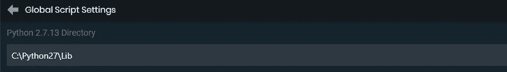

在本练习中，您可以忽略 API 键字段。

*   在这篇文章中，至少假设了一些基本的编程技能。这是一篇关于创建 Twitch 命令的文章，所以我不会深入到变量和方法/函数调用以及它们是如何工作的。在继续之前，您应该熟悉这些条款。

# 我们在建造什么？

所以，显然我们要写一些代码，但是我们实际上在构建什么呢？

因为这是设置和发布命令的基础，所以我们保持简单。让我们创建一个命令，当被查看者调用时，返回一条消息，说明这个人实际上来自外太空的可能性。

这个例子很复杂，但是不要担心，它远没有听起来那么难。

# 基本设置

所有的 Streamlabs Chatbot (SC)命令都有一些你需要正确实现的基础，以便它在用户界面中作为一个可运行的脚本出现，更不用说运行它了。

这些是:

## 文件命名

对于作为 SC 脚本的 Python 脚本，格式应该是`command_StreamlabsSystem.py`。

因此，让我们首先创建一个`mulder`目录，并在该目录中创建`mulder_StreamlabsSystem.py`。


穆德似乎是这个命令的合适名字。

您可以自由选择在哪里创建这个目录，只要它的名称与命令的名称相同。

专业提示:如果你在你机器的内部 SC 脚本目录中创建它，当我们进入测试/发布阶段时，它将节省大量的导入和更新工作。

在 Windows 上，您可以在以下位置找到它:

```
C:\Users\USERNAME\AppData\Roaming\Streamlabs\Streamlabs Chatbot\Services\Scripts.
```

## 基本结构

SC 不会在脚本部分显示您的脚本，除非它至少包含以下内容:

*   脚本信息——这是一组全局变量，SC 使用它们来填充`Scripts`部分中的一些字段。让我们将这些添加到我们的空脚本中:

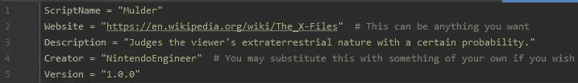

你不必包括评论(灰色部分)。

*   脚本初始化器——`Init()`*方法由 SC 在每次脚本被(重新)加载到`Scripts`部分时运行。在`Script Information`下添加以下内容(为清洁起见，先添加一条新线):*

**

*你的 IDE 可能会抱怨大写的“I ”,但是 SC 希望这样。*

*   *脚本执行:每次在 Twitch 视频聊天中输入任何命令时，SC 都会运行`Execute(data)`方法。我们稍后将讨论如何只过滤`mulder`命令。`data`参数由 SC 自动传递，包含发送者和消息的信息。让我们把这个添加到我们的脚本中:*

*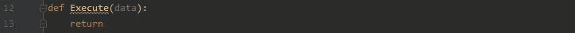*

*是的，是的，大写的 E，我们知道。*

*   *脚本迭代逻辑:`Tick()`方法在脚本每次运行时运行，顾名思义，就是每次运行。即使聊天中没有输入数据或任何内容，这种逻辑也会运行。它只是连续运行。让我们将它添加到我们的脚本中:*

**

*我们不会在我们的例子中使用它，但是在创建更高级的命令时它会很有用。*

*对！现在我们得到了我们需要的，所以 SC 至少会承认我们的努力。您的文件现在应该是这样的:*

*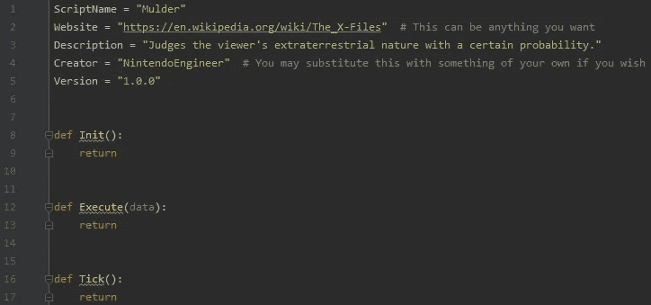*

*基于 PEP 8，PyCharm 建议在方法之间新增两行，所以我只是照着做。*

*如果您的文件看起来不像这样，请确保进行必要的调整。*

## *加载脚本*

*如果您之前利用了专业技巧，这将是小菜一碟。只需打开 SC，转到`Scripts`部分，它应该已经在那里了:*

*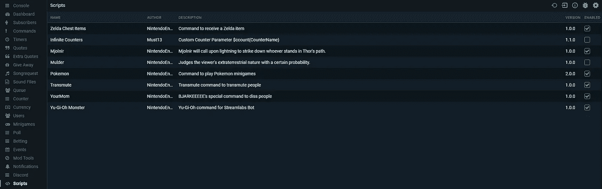*

*看莫特在那里发光！*

*您可以看到`Mulder`命令和我的一些其他命令(要实时查看它们，请查看[the sylchemist](https://twitch.tv/theslychemist)的流)。*

*它们都在同一个`SC Scripts`文件夹中，所以当我创建它们的时候它们会自动出现。*

*如果它没有出现，试着点击右上角的重新加载按钮。如果它仍然没有出现，请检查前面的所有步骤或尝试下面的选项。*

*如果你没有遵循专业建议，你将不得不绕远路:*

*   *使用您喜欢的工具压缩`mulder`目录。*
*   *转到 SC 中的`Scripts`部分，点击右上角的*导入*按钮(左起第二个按钮)。*
*   *转到保存`.zip`文件的地方，选择它进行导入。*
*   *它现在应该出现在列表中。*

*公平的警告:如果你像这样加载命令，当你不得不调试代码时，它会变得非常乏味非常快。您将更改代码，压缩文件，导入它，然后您可以测试它。*

*如果修复不起作用，你可以从头再做一遍。遵循*基本设置*部分给出的建议可以避免这种情况。然后，它变得像点击重新加载按钮一样简单。*

# *实现逻辑*

*现在我们已经有了基础，是时候给我们的脚本添加一些功能或逻辑了。*

*我们的命令逻辑放在`Execute(data)`方法中，当聊天中发布消息时，SC 会调用该方法。*

*有一些问题需要考虑，但我会指导你完成，所以让我们开始吧！*

*还记得我说过聊天中的任何命令(或者消息)都会触发我们的`Execute(data)`方法吗？*

*因为我们只想响应命令`“!mulder”`，所以我们应该验证消息中的第一件事实际上是这样说的。我们使用为此传递的`data`参数，因为它包含一些我们可以利用的[属性和方法](https://github.com/AnkhHeart/Streamlabs-Chatbot-Python-Boilerplate/wiki/Data-Object)。*

*一种这样的方法是`data.GetParam(int id)`。我们将使用它来获取消息中的第一个内容，并验证它是否等于`“!mulder”`。如果没有，我们什么都不做。但是说够了，让我们来实现它:*

*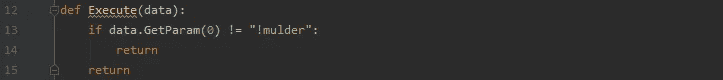*

*Python 使用从零开始的索引，所以消息中的第一件事是在索引 0 处。*

*我们的命令应该基于概率来声明某人是否是外星人。*

*我们来介绍一下那个概率，给它一个 10%左右的值，那么每十个人里面，其实就有一个是外星人。该死的。*

*此外，决定某人是否是外星人是一个单独的微观责任，我们可以委托给一个实用方法。*

*让我们将该方法添加到`Tick()`方法下，并为其添加概率:*

**

*目前看起来不错！*

*现在，我们需要加强这一点，如果某人是外星人，就让它返回`True`，如果不是，就让它返回`False`。*

*Python 有原生的随机方法，但是它们似乎不太适合 SC。我们将使用 SC 提供的随机功能，即`[Parent.GetRandom(int min, int max](https://github.com/AnkhHeart/Streamlabs-Chatbot-Python-Boilerplate/wiki/Miscelaneous)` [*)*](https://github.com/AnkhHeart/Streamlabs-Chatbot-Python-Boilerplate/wiki/Miscelaneous) 返回一个 0 到 100 之间的值。*

*如果我们得到一个低于或等于我们概率的值，我们返回`True`，否则，我们返回`False`(你可以忽略父错误):*

*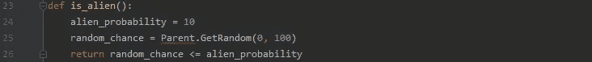*

*random _ chance≤alien _ probability 已经等于 True 或 False，所以我们用它作为返回值。*

*根据结果，我们将向聊天室发送两条消息中的一条。*

*为了使事情更清晰，让我们引入另一个实用方法来处理发送消息:`send_message(message)`。您可以在`is_alien()`方法下添加以下内容:*

**

*看起来不太像，但从长远来看，它将使我们的代码更易读。你能想象到处都是红色的曲线吗？*

*我们将在两个可能的消息中使用触发该命令的查看者的用户名。*

*因为我们必须从`data`参数中获取，并且我们不想违反 DRY 原则(不要重复自己)，所以让我们引入一个变量来保存用户名:*

*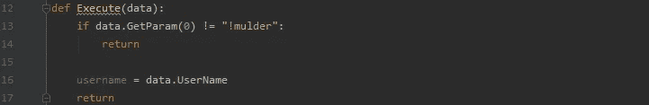*

*我们将引用用户名变量，而不是每次都从数据中获取。*

*现在，我们需要根据`is_alien()`响应发送消息。添加该逻辑完善了我们的命令逻辑:*

*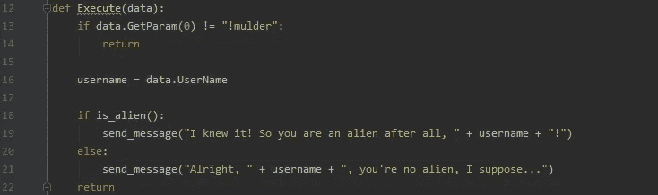*

*看你走了！你是一个支持抽搐指令的创造者。*

# *尝试一下*

*首先，转到 SC 的`Scripts`部分，像以前一样重新加载脚本，并确保通过选中右边的框来启用`Mulder`命令。*

*完成后应该是这样的:*

**

*好东西！*

*现在，前往 SC 的*控制台*部分(左上)，在聊天中键入`!mulder`并点击回车。*

*魔法随之而来！穆德正在评判你的本性。试了几次，他终于发现我不是这个星球的人:*

*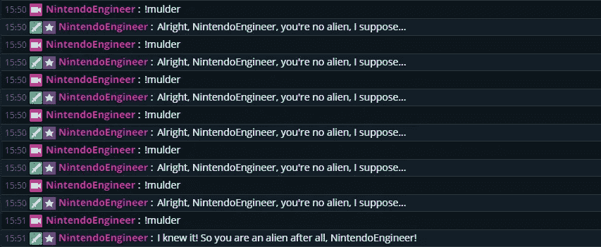*

*就因为我不需要氧气生存…穆德喜欢反应过度。*

*我可以祝贺你写了你的第一个 Twitch 命令脚本吗？这是我为智能化学家创建命令的基本流程。你可以在这里停下来，运行，并创建一组命令，你可以自由地这样做。*

*然而，如果你想从网上随便找一个人那里得到更多的建议——也请阅读接下来的几节，至少是关于调试代码的部分。这将被证明是一个救命恩人。*

# *附录 A:调试*

*我知道，我知道，这不是最性感的话题。*

*脚本应该只是像你编码时想象的那样工作，这应该是它的结束。我在编码时经常有这种想法，因为几乎没有什么东西是一蹴而就的。*

*甚至上面的示例项目也需要我做一些调整才能正确完成，因为会发生一些愚蠢的错误(别担心，脚本会像图中所示的那样工作，我只是必须先修复我的)。所以，让我们开始用 SC 调试吧。*

## *记录*

*这就是我要给你看的全部内容。记录你的脚本在做什么，什么时候做，这是找出 bug 可能藏在哪里的最快方法(准备好苍蝇拍)。*

*幸运的是，SC 有自己的日志方法:`Parent.Log(string command, string message)`，我们将使用它。*

*我们开始吧。*

*首先，log 方法看起来有些庞大，因为我们将不止一次地使用它，所以让我们创建一个实用方法来包装它。*

*额外的好处是，我们不需要在每次想要记录一些东西时都指定命令。它保持不变，这样做可以让我们保持干燥:*

**

*您可以将它一直放在底部，send_message 方法的下面。*

*我注意到我们在两个不同的地方使用了字面命令名，这违反了 DRY 原则，所以让我们解决这个问题。*

*将一个全局变量添加到我们已有的变量中，并用该变量替换所有的`“!mulder”`实例:*

*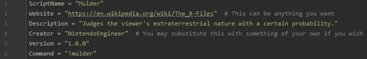*****

*现在，让我们给我们正在使用的方法添加一些日志语句:*

*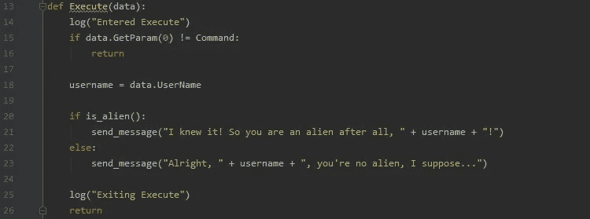**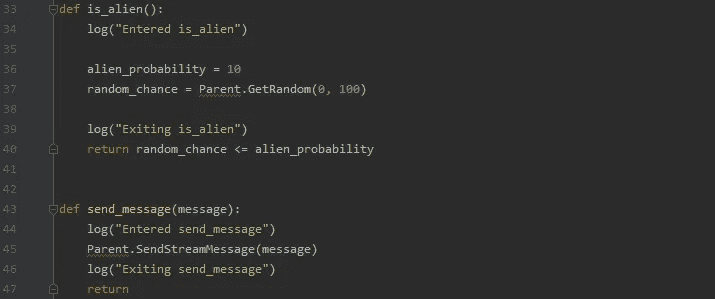*

*好事正在这里发生。在 SC 中重新加载脚本，然后通过单击右上角的中间图标移动到日志窗口:*

**

*圆形的“信息”按钮。*

*清除右上角带有重新加载符号的窗口，并移动到 SC 的*控制台*部分。再次输入`!mulder`，返回日志窗口。*

*它应该向您显示流经不同方法的日志:*

*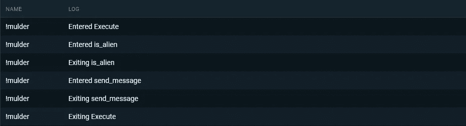*

*我看不错！*

*程序中有很多地方可能出错，在调试这些问题时，使用日志来确定位置将会节省大量时间。*

*随着您继续创建更高级的命令，您将认识到在哪里以及如何放置日志来验证正确的值正在被传递，或者检查您需要的方法是否被实际调用。*

*你可以用日志做很多事情。*

# *附录 B:很高兴有*

*这里有一些你可以添加到你的命令中的好东西，让它看起来更酷一点，但是它们并不是创建你的命令所必需的。*

## *增加冷却时间*

*你可能不希望你的命令在任何时候都能被所有人使用，即使它们很棒。你可能有一个繁忙的聊天，或者有人可能是一个巨魔和垃圾邮件的命令。*

*这就是冷却的用武之地。SC 有几个[手柄](https://github.com/AnkhHeart/Streamlabs-Chatbot-Python-Boilerplate/wiki/Cooldown-Management)用来添加和检查用户或命令的冷却时间。我将在这里展示用户特定的冷却时间。*

*它包括两个小的补充:*

*在`Execute(data)`方法的末尾添加用户冷却时间，使用`data.User`获取查看器的用户 ID，并将 30 秒指定为冷却时间:*

**

*这应该会减少触发器的数量。*

*现在，在`Execute(data)`方法的开始，在命令检查中，包含了一个对用户冷却时间的额外检查。*

*如果用户在冷却期间再次调用这个命令，我们不想执行我们的逻辑。加上那点逻辑:*

*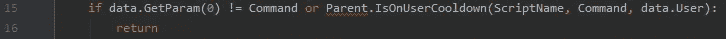*

*现在巨魔们被挫败了！*

*检查我是否能在彼此之后立即触发该命令会产生一个有希望的结果。该命令不执行，因为我在过去 30 秒内触发了它:*

**

*我想他上次得出错误的结论后一定哑口无言了。*

*现在你知道如何添加用户冷却时间了。*

*为命令本身增加一个冷却时间有一个相似的流程，简单的交换用户冷却方法和命令冷却方法。*

## *添加用户界面*

*你可能见过也可能没见过 SC 中某些命令的界面，控制器可以在其中更改脚本中使用的值。它看起来像这样:*

*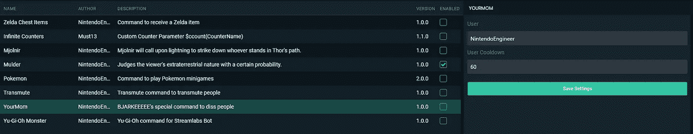*

*巨大的额外好处是，冷却时间和其他值可以在脚本之外更改，根本不用接触脚本。*

*这节省了相当多的工作，并使不习惯脚本的人更容易处理脚本。*

*我想在我们的剧本中加入这一点，所以让我们开始吧:*

*首先，让我们在与 Python 文件相同的文件夹中创建`UI_Config.json`文件。获得正确的命名，创建它并在 IDE 中打开它:*

*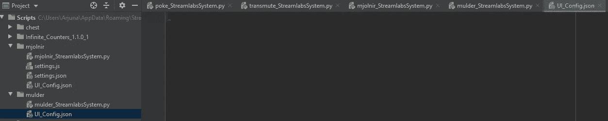*

*这里有点空…*

*SC 在他们的 [GitHub Wiki](https://github.com/AnkhHeart/Streamlabs-Chatbot-Python-Boilerplate/wiki/Creating-UI-Config-File) 页面上记录了文件的格式和选项。首先，我们必须选择我们的值将被转储到的文件的名称和类型，以便在我们的脚本中使用。*

*将以下内容添加到文件中:*

*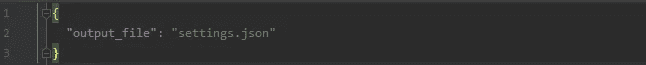*

*注意括号和引号。*

*我们的脚本需要两个值:百分比形式的概率和秒形式的冷却时间。两者都是数字，所以我们需要一个数字框。*

*让我们添加这些内容并填写字段:*

*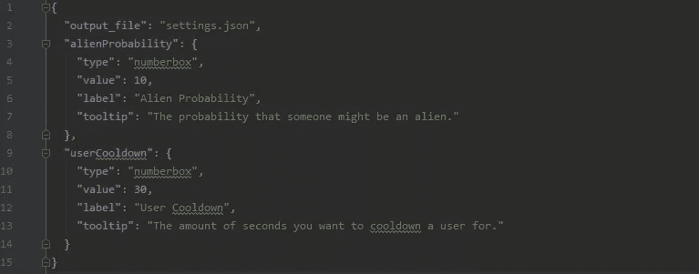*

*value:初始值，label:出现在框上方的内容，tooltip:当鼠标悬停在它上面时。*

*保存文件，返回 SC 中的*脚本*部分并重新加载脚本。*

*当你现在点击`Mulder`命令时，它显示了我们全新的用户界面:*

*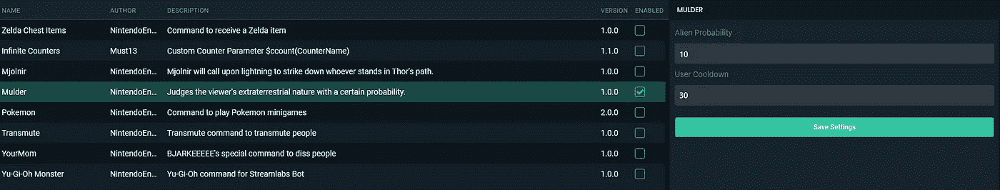*

*这是什么！？你的莫特在进化！*

*我们还没到那一步，朋友。还记得我们定义的输出文件吗？点击 UI 中的*保存设置*，返回 IDE。*

*您应该看到创建了两个新文件:*

*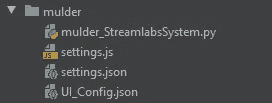*

*到目前为止，一切顺利。*

*我们对`settings.json`文件感兴趣，这是我们定义的文件。如果打开它，您会看到我们定义的值及其数据:*

*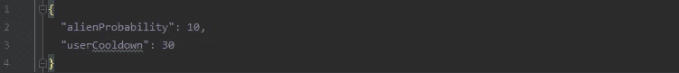*

*这是由 SC 自动生成的。不错吧。*

*我们现在想使用这些动态更新的值，而不是文件中的硬编码值。为此，我们需要导入一些库来帮助读取这个设置文件。*

*在全局脚本信息变量上方添加以下内容:*

*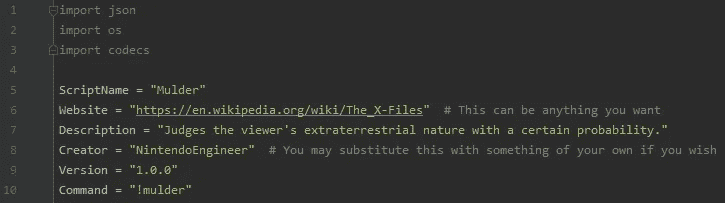*

*我们接下来会用到这些。*

*在加载文件之前，我们需要一些东西来存储这些变量。为此，让我们创建一个全局设置对象:*

*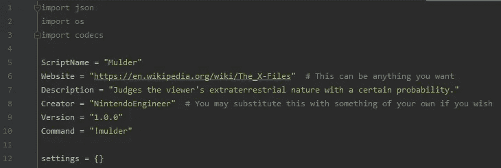*

*开始是空的，接下来我们将加载值。*

*当脚本被(重新)加载时，我们只想一次性读取这些值。没有必要在每次脚本执行时都读取它们。*

*哪种方法在每次(重新)加载时只运行一次？你记得！这是`Init()`方法。让我们开始一步一步地给它添加逻辑。*

*首先，我们需要让 Python 知道我们将要改变我们的全局设置对象:*

**

*现在 Python 知道当我们在方法中使用它时，我们指的是全局设置对象。*

*我们需要访问`settings.json`文件。*

*由于它与我们当前所在的脚本在同一个位置，我们可以请求 Python 获取我们现在所在的目录的路径，以供以后使用:*

*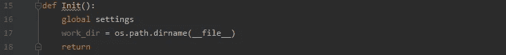*

*只要再久一点，你就能做到！*

*那好吧。现在，让我们开始有趣的部分:读取文件并将内容存储在我们的设置对象中。*

*我们将使用之前定义的工作目录来构造文件的完整路径，并使用实际的文件名来连接它。确保文件名与`UI_Config.json`中定义的文件名完全相同:*

*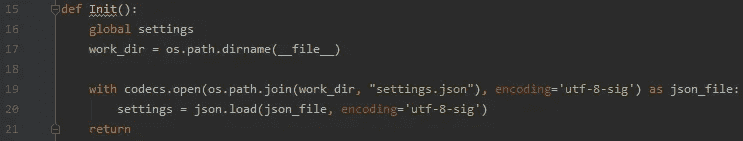*

*我们已经加载了设置！*

*太好了！现在我们已经加载了设置，我们可以使用该对象来访问 UI 中定义的值。*

*让我们将硬编码的值替换为对应的动态引用(确保拼写与`UI_Config.json`文件中的拼写相匹配):*

***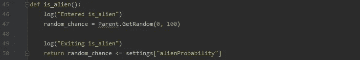*

*考试时间！前往 SC，转到*脚本*部分并重新加载脚本。*

*在控制台中调用该命令会产生我们之前得到的结果，但是现在我们可以从脚本外部动态地更改我们的值:*

*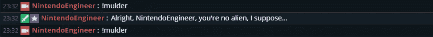*

*一样，但不一样？*

*额外的好处:我们可以在试图读取我们的设置文件时捕捉到一个可能的错误。在我们当前的场景中，读取错误会导致脚本中断，但是如果我们捕获并处理这个错误，我们就能够构建一个回退。*

*这是更干净的处理方式。以下代码捕获任何错误或 Python 行话中的异常，记录错误以供研究，并提供回退值，以便脚本可以继续运行，同时您可以冷静地调查发生了什么:*

**

*确保拼写正确！*

*这就是你如何融入用户界面！*

# *结束了*

*我想说的就是这些，这是真的，但我明白所有这些步骤对一个新人来说似乎很令人生畏。不过，不用担心。创建一些命令后，这将成为你的第二天性，我保证。*

*这是创建 Twitch 命令脚本的“基本”步骤。*

*仅此而已吗？是和不是。是的，这是你如何建立一个命令脚本，不，你可以在 Python 中做更多的事情。*

*选择几乎是无穷无尽的。对于不同的基本、半高级和极度高级命令的集合，看一看[the sylchemist](https://twitch.tv/theslychemist)的流。我的大多数命令在那里都是可见的。*

*根据这篇文章的表现，如果有人对更先进的技术感兴趣，我会再写几篇文章，展示如何播放音乐，让查看器超时，甚至使用全局状态来“记住”查看器和他们以前的操作。*

*感谢您的阅读，请记住:真相就在那里…*