# 在 AWS CLI 中创建具有自动缩放功能的 VPC

> 原文：<https://betterprogramming.pub/creating-a-vpc-with-autoscaling-in-aws-cli-45708c953ab5>

## 使用 CloudWatch 设置扩展策略


由 [Jukan Tateisi](https://unsplash.com/@tateisimikito?utm_source=medium&utm_medium=referral) 在 [Unsplash](https://unsplash.com?utm_source=medium&utm_medium=referral) 拍摄的照片

这个项目的目标是创建一个具有自动缩放组的 VPC。我将在两个实例上安装 apache，并在 CPU 利用率超过 40%后使用 CloudWatch 进行扩展。

## **先决条件:**

*   IAM 用户的 AWS 帐户
*   适当的 IAM 权限

首先，我们将创建一个 cidr 为 10.10.0.0/16 的 VPC。使用以下命令:

```
aws ec2 create-vpc --cidr-block ***10.10.0.0/16***
```

您的屏幕应该是这样的:

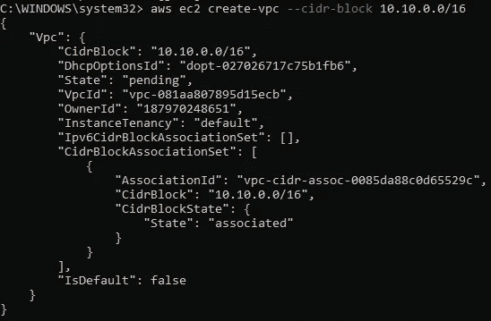

确保复制下 VpcId。我个人在 Windows 上使用记事本应用程序，并将 ID 存储在那里以备后用。如你所见，我的 VPC ID 是`vpc-081aa807895d15ecb`

接下来，我们将为 VPC 创建子网。

我使用以下网站来确定子网地址:

 [## IPv4 的 IP 子网计算器|在线子网掩码计算器-24x7 站点

### 子网划分有时会出现网络变得太大而难以管理，性能指数创历史新低的情况…

www.site24x7.com](https://www.site24x7.com/tools/ipv4-subnetcalculator.html) 

这里是我的 cidr 块和 16 个子网的结果，这将允许 4091 个 IP 地址。子网掩码/20 就足够了。

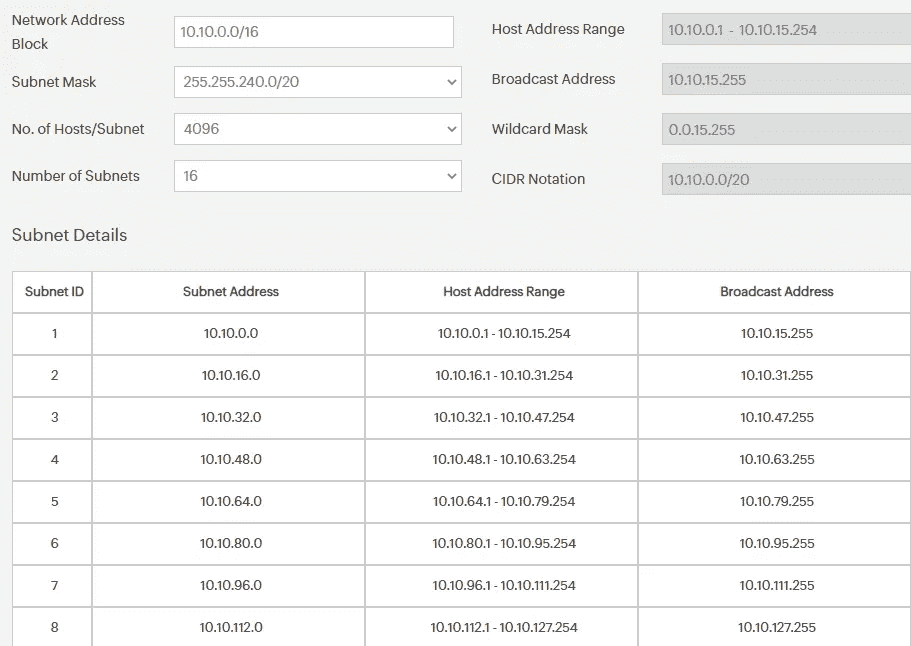

我将使用前两个子网 id 创建两个公共子网。为此，请使用以下命令:

```
aws ec2 create-subnet --vpc-id ***vpc-081aa807895d15ecb*** --cidr-block ***10.10.0.0/20***
```

在您输入上面的命令后，您的屏幕将看起来像这样:

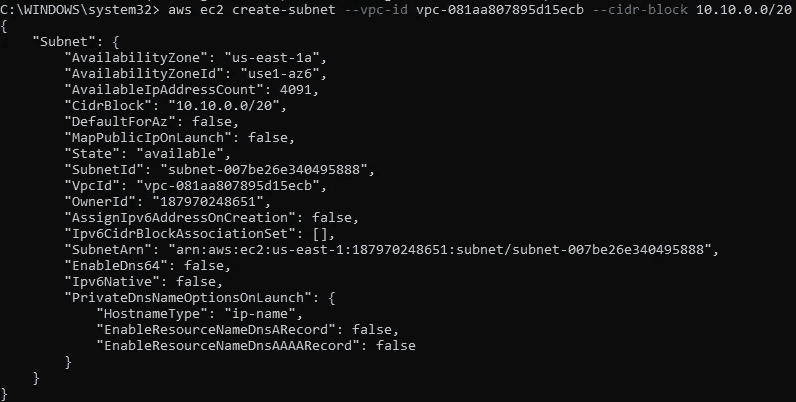

复制您的子网 Id。重复该命令，但确保指定不同的可用性区域。我的第一个子网位于 AZ us-east-1a，因此对于我的下一个子网，我将把它放在 us-east-1b。请注意，我使用的是第二个子网 ID 中的地址

```
aws ec2 create-subnet --vpc-id ***vpc-081aa807895d15ecb*** --cidr-block ***10.10.16.0/20*** --availability-zone ***us-east-1b***
```

完成后，您可以通过键入以下命令来列出子网:

```
aws ec2 describe-subnets --filters "Name=vpc-id,Values=***vpc-081aa807895d15ecb***"
```

您应该会看到关于您创建的两个子网的信息。确保记下两个子网 id。

我们将必须修改子网属性，以便所有进入我们子网的实例都被分配一个公共 IPv4 地址。对每个子网使用以下命令:

```
aws ec2 modify-subnet-attribute --subnet-id ***subnet-007be26e340495888*** --map-public-ip-on-launch
```

一旦为两个子网都完成了这一步，就可以再次描述子网，并注意输出显示“MapPublicIpOnLaunch”:true

接下来，让我们为 VPC 连接一个互联网网关。首先，我们必须创建一个互联网网关。在 CLI 中，键入:

```
aws ec2 create-internet-gateway
```

输出应该如下所示:

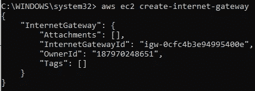

复制 InternetGatewayId，并在下一个命令中使用它将网关连接到您的 VPC。

```
aws ec2 attach-internet-gateway --vpc-id ***vpc-081aa807895d15ecb*** --internet-gateway-id ***igw-0cfc4b3e94995400e***
```

您的屏幕不应有任何输出，这表明 Internet 网关已成功连接到 VPC。要查看附件，请使用您的网关 ID 输入以下命令:

```
aws ec2 describe-internet-gateways --internet-gateway-ids ***igw-0cfc4b3e94995400e***
```

您应该看到您的网关已连接到您的 VPC

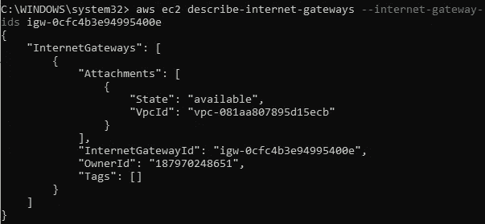

附上

当我们创建子网时，AWS 会自动将其与 VPC 的默认路由表相关联。让我们来描述这个路由表:

```
aws ec2 describe-route-tables --filters "Name=vpc-id,Values=***vpc-081aa807895d15ecb***"
```

确保记下 RouteTableID:

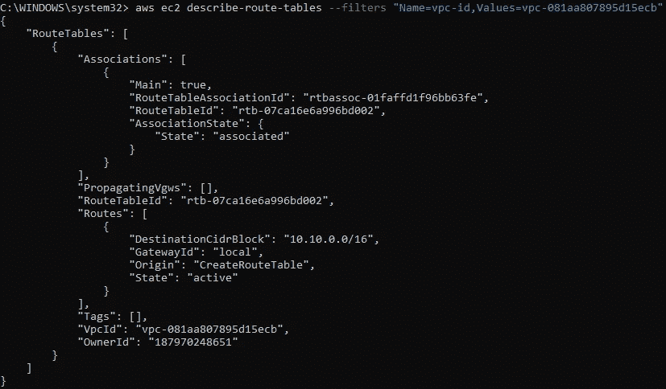

主路由表不包含到 internet 网关的路由。我们需要创建一个自定义路由表，其中包含将出站流量发送到 internet 网关的路由。

要为 IPv4 流量创建自定义路由表，请输入以下命令:

```
aws ec2 create-route --route-table-id ***rtb-07ca16e6a996bd002*** --destination-cidr-block ***0.0.0.0/0*** --gateway-id ***igw-0cfc4b3e94995400e***
```

您应该会收到以下输出:

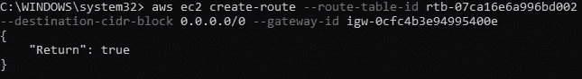

让我们再次描述路由表，以确保我们的新路由是关联的:

```
aws ec2 describe-route-tables --route-table-id ***rtb-07ca16e6a996bd002***
```

在输出中，您将看到 CreateRoute 处于活动状态:

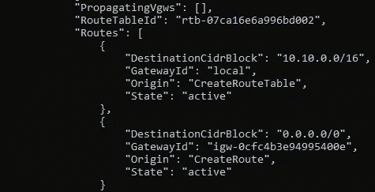

每个子网必须与一个路由表相关联。子网隐式地与 VPC 的主路由表相关联。我们创建的两个子网都与路由表相关联。要在 CLI 中查看，请尝试以下命令:

```
aws ec2 associate-route-table --subnet-id ***subnet-007be26e340495888*** --route-table-id ***rtb-07ca16e6a996bd002***
```

我对每个子网运行了两次上述命令，收到的输出如下所示:

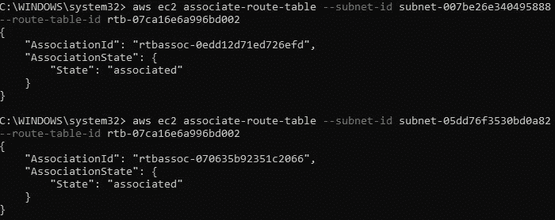

与路由表相关联的子网

现在，我们将创建一个新的安全组，并添加允许来自互联网的入站流量的规则。然后，您可以将该安全组与公共子网中的实例相关联。

```
aws ec2 create-security-group --group-name ***vpc-sg-traffic*** --description "***VPC SG Traffic***" --vpc-id ***vpc-081aa807895d15ecb***
```

记下您从上述命令的输出中看到的 GroupId。

接下来，我们需要向安全组添加规则，以允许传入流量。

以下命令将添加一个安全 ID 组为 ***sg-00d5f5f589f2a3bce 的 HTTP(端口 80)访问规则。*** 允许所有人访问:

```
aws ec2 authorize-security-group-ingress --group-id ***sg-00d5f5f589f2a3bce*** --protocol tcp --port 80 --cidr 0.0.0.0/0
```

要允许端口 22 上的所有入站流量，请对同一安全组中的实例启用 SSH:

```
aws ec2 authorize-security-group-ingress --group-id ***sg-00d5f5f589f2a3bce*** --protocol tcp --port 22 --cidr 0.0.0.0/0
```

要在 CLI 中查看您的安全组的更改，您可以运行以下命令:

```
aws ec2 describe-security-groups --group-ids ***sg-00d5f5f589f2a3bce***
```

因为我们将在实例上安装 apache 和 AWS 压力工具，所以我们将创建一个脚本来引导实例。使用以下文本进入 vim 或您选择的文本编辑器。在 Windows 中，您必须找到保存的脚本文件并复制路径，以便稍后启动 EC2 实例时使用。

```
#!/bin/bash
sudo yum -y update
sudo yum -y install httpd
systemctl start httpd
systemctl enable httpd
amazon-linux-extras install epel -y
yum install stress -y
```

接下来，我们将为自动扩展创建启动配置:

```
aws autoscaling create-launch-configuration --image-id ***ami-0c02fb55956c7d316*** --instance-type ***t2.micro*** --key-name ***keypairweek7*** --security-groups ***sg-00d5f5f589f2a3bce*** --user-data ***file://"C:\Users\mjcdy\OneDrive\Documents\User Data\apache_stress.sh"*** --launch-configuration-name ***lauchconfig***
```

我使用了现有的密钥对。我还使用了与 us-east-1 区域相关联的 AMI。要找到合适的空闲层 AMI，可以键入以下命令:

```
aws ec2 describe-images --owners amazon --filters "Name=name,Values=amzn2-ami-hvm-2.0.????????.?-x86_64-gp2" "Name=state,Values=available" --query "reverse(sort_by(Images, &Name))[:1].ImageId" --region us-east-1 --output text
```

创建启动配置后，您可以查看描述:

```
aws autoscaling describe-launch-configurations
```

接下来，我们可以创建一个自动缩放组:

```
aws autoscaling create-auto-scaling-group --auto-scaling-group-name ***autoscaling*** --availability-zones ***us-east-1a us-east-1b*** --vpc-zone-identifier ***"subnet-007be26e340495888, subnet-05dd76f3530bd0a82"*** --launch-configuration-name ***lauchconfig*** --max-size ***5*** --min-size ***2***
```

*   如果您可能注意到了，我将我的启动配置命名为“lauchconfig”确保在创建自动缩放组时使用相同的拼写，否则您将收到一个错误。
*   另外，第一次运行这个命令时，我没有使用 vpc-zone-identifier。我的实例不会启动，因为我没有指定要利用哪些子网。

在您创建了自动缩放组之后，您将需要启用指标收集，以便您可以使用 CloudWatch 来监控您的实例。使用以下命令:

```
aws autoscaling enable-metrics-collection --auto-scaling-group-name ***autoscaling*** --granularity ***"1Minute"***
```

接下来，我们需要应用一个目标跟踪伸缩策略，告诉 Amazon EC2 Auto Scaling 在应用程序的负载发生变化时动态地改变组中正在运行的 EC2 实例的数量。下面的 JSON 文件是一个目标跟踪配置，它将平均 CPU 利用率设置为 40%。保存这个文件，并确保复制路径，因为我们将在下一个命令中使用它。

```
{
  "TargetValue": 40.0,
  "PredefinedMetricSpecification": 
    {
      "PredefinedMetricType": "ASGAverageCPUUtilization"
    }
}
```

您要运行来添加扩展策略的命令是:

```
aws autoscaling put-scaling-policy --auto-scaling-group-name ***autoscaling*** --policy-name ***cpu40-target-tracking-scaling-policy*** --policy-type ***TargetTrackingScaling*** --estimated-instance-warmup ***60*** --target-tracking-configuration ***file://"C:\Users\mjcdy\OneDrive\Documents\cpuutilization.json"***
```

您看到的屏幕看起来会像这样:

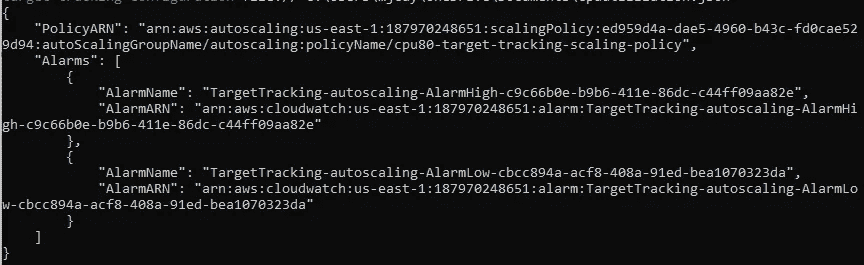

警报已创建

我们可以使用以下命令查看实例是否已经启动:

```
aws autoscaling describe-auto-scaling-groups --auto-scaling-group-name ***autoscaling***
```

接下来，您可以检查 Apache 服务器是否已安装并激活，从每个实例中复制您的公共 IPv4 地址，通过键入以下命令可以找到该地址:

```
aws ec2 describe-instances --query "Reservations[*].Instances[*].PublicIpAddress" --output=text
```

接下来，在地址栏中键入以下内容:

```
http://***public_ip_address***
```

如果您看到这样的屏幕，那么您的 Apache web 服务器已经启动并正在运行:

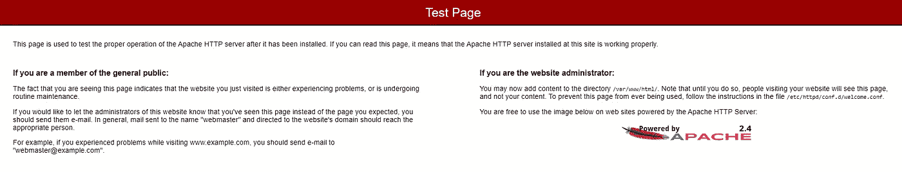

最后…

我们将进入 AWS 控制台。前往 CloudWatch，您应该会发现我们之前使用自动缩放 put-scaling-policy 创建的警报:

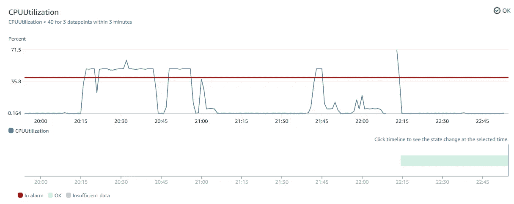

我之前做了一些压力测试，然后重新初始化了警报

*   我曾尝试在 CPU 利用率超过 80%后，使用 CloudWatch 运行扩展策略进行扩展。这不起作用，因为我的自动缩放策略适用于 2 个实例。每个实例的 CPU 利用率只能达到 50%。

SSH 到您的一个实例中:

```
ssh -i "C:\Users\mjcdy\OneDrive\Documents\KeyPair\keypairweek7.pem" ec2-user@***public_ip_address***
```

在 Windows 中，确保使用密钥对的文件路径。

现在让我们进行一次压力测试！

在 EC2 实例中，输入命令:

```
sudo stress --cpu 1 --timeout 300
```

在 AWS 控制台中，您应该看到 CloudWatch 警报在几分钟后响起，一个新的 EC2 实例启动，并且您的自动缩放组中的实例增加。

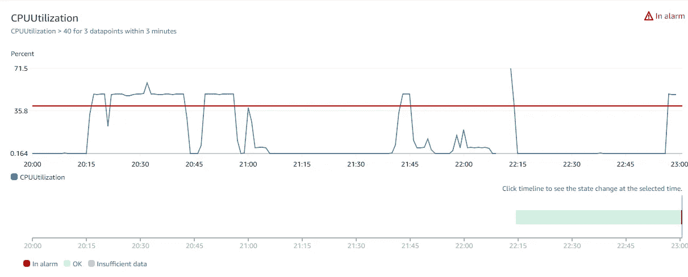

超过阈值

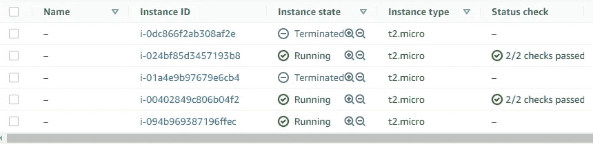

结果创建了第三个实例

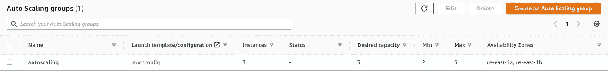

3 个实例而不是 2 个

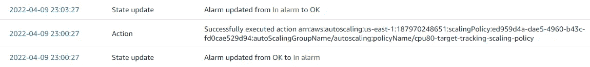

自动缩放已执行

如果你已经走了这么远，恭喜你。记住终止任何可能产生额外费用的资源！感谢您的阅读。