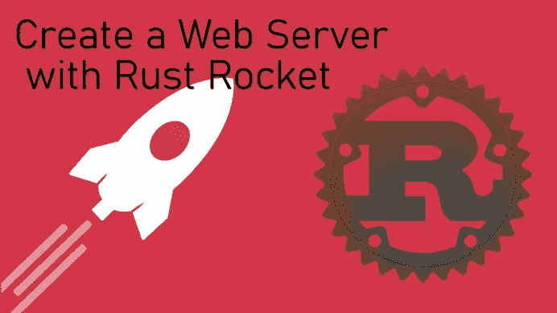
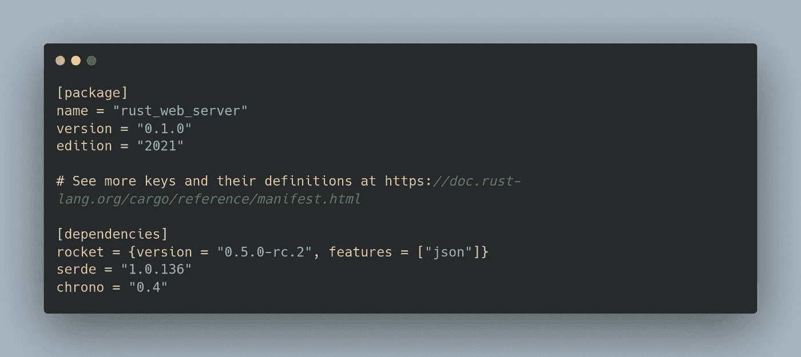
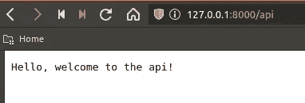
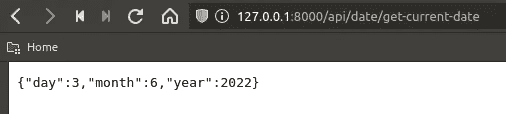
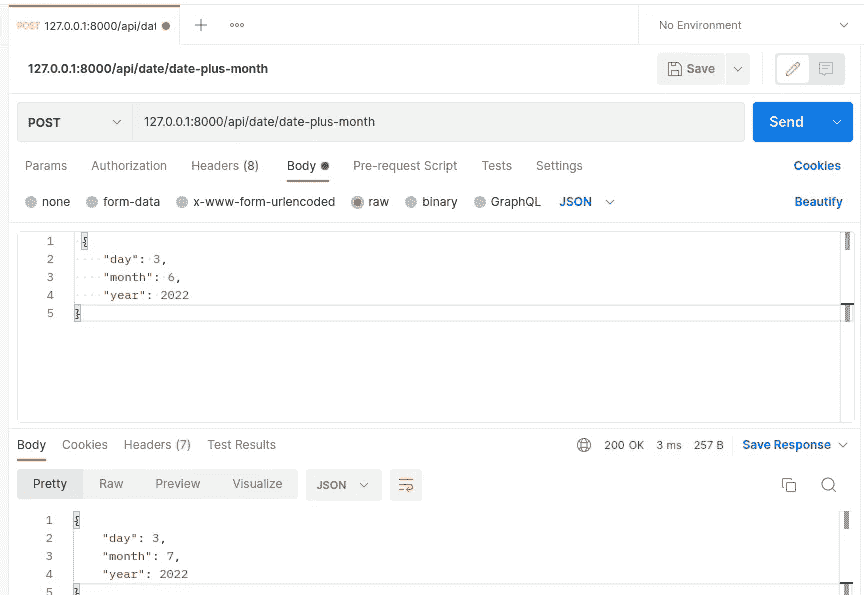

# 使用 Rust Rocket 创建 Web 服务 API

> 原文：<https://betterprogramming.pub/creating-a-web-server-using-rust-rocket-1e4939e582df>

## 在本教程中，我们将介绍如何使用 Rust 的 Rocket web 框架来创建一个简单的 web 服务器



作者图片

Rust 是一种非常通用的语言，从游戏引擎到整个网站都有很多应用。Rust 也有一个活跃而健康的社区，开发了许多有用的软件包。在本教程中，我们将看到其中一个名为 Rocket 的包，它将自己描述为:

> “Rust 的 web 框架使编写*快速*变得简单，保护 web 应用程序而不牺牲灵活性、可用性或类型安全性”

我出身于一个专业背景的人，一旦你习惯了一些东西，我发现 Rust 的火箭很容易掌握——其中大部分都与 Rust 作为一种语言有关，而不是框架本身。

在本教程中，我们将创建一个简单的 web 服务器，它使用 Rocket 返回关于当前或未来日期的信息，但是当您更熟悉 Rust 时，这将使您能够创建更高级的 web 服务器/应用程序。这个 web 服务器将处理简单的 GET 和 POST 请求，因此我们可以更好地理解 Rocket 如何处理接收和返回信息。

这是一个火箭教程，所以我将假设一些初学者的知识，但你可能会跟随，即使你还不舒服。如果你还没有，一定要安装货物，锈包管理器。如果你还没有，更多关于货物的信息可以在这里 *找到 [*。*](https://doc.rust-lang.org/book/ch01-03-hello-cargo.html)*

如果您希望只是有一个示例可以遵循，那么最终的代码可以在本教程的末尾找到。

# 安装

首先，我们需要使用 Cargo 创建一个新项目。如果您安装了 cargo，可以从命令行使用以下命令来完成此操作:

```
$ cargo new rust_web_server --bin
```

这将为我们生成 Rust 二进制程序的基础。该命令创建的新目录应该如下所示:

```
rust_web_server/
├─ src/
│  ├─ main.rs
├─ Cargo.toml
```

`Cargo.toml`文件是我们添加依赖项的地方。在我们的例子中，我们希望添加 Rocket、Serde (Serde 将用于反序列化 JSON 请求)和 Chrono(一个时间库)。添加了这些依赖项后，您的`Cargo.toml`应该看起来像这样:



Cargo.toml

如果你愿意，你可以把你所有的代码放在`main.rs` 文件中，但是我喜欢把它分开，这样感觉起来更有条理，尤其是当你开始添加更多的路线和功能的时候。您可以根据自己的喜好构建它，但我将使用以下结构:

```
rust_web_server/
├─ src/
│  ├─ main.rs
│  ├─ routes/
│  │  ├─ mod.rs
│  │  ├─ date.rs
│  ├─ services/
│  │  ├─ mod.rs
│  │  ├─ date.rs
├─ Cargo.toml
```

routes 文件夹是我们为 GET/POST 请求编写代码的地方，而 services 文件夹是我们存储每个路由所需的任何逻辑的地方。在 Rust 中，我们可以把相关的东西拆分成模块，需要用`mod.rs`文件来告诉编译器那个模块包括什么。

# 火箭基础

现在，您需要运行 cargo build 命令来安装依赖项。完成后，打开`main.rs`,我们就可以创建 web 服务器了。我们将从`main.rs`的一条路线开始，这样我们可以看到 Rocket 是如何工作的，但是我们将把它移动到 routes 文件夹中合适的位置。继续删除文件中的当前内容，并替换为以下内容:

main.rs

在这段代码中，我们正在导入 Rocket。然后我们在`/`声明一个 GET 路由，这意味着无论我们在哪里装载它，它都是默认路由。在 Rocket 中，我们总是用结构`[#type(“/location”)]`声明路由，后面跟着一个函数，它处理任何逻辑并返回我们想要发送回来的值。在这个例子中，我们返回字符串`Hello, welcome to the api!`。

最后，我们使用`#[launch]`启动 web 服务器，并声明 rocket 函数，如上所示。在此功能中，我们可以在某个位置安装路线，例如默认的`/`或`/api`。无论我们在这个位置安装了什么路线，都可以通过到那个位置加上路线的位置来访问。因此，在我们的示例中，我们将通过前往`server_address/api/`来访问我们的路线。

这是 Rust 的 Rocket web 框架工作的基础。如果您运行命令`cargo run`，它应该编译并启动 web 服务器(可能在`127.0.0.1:8000`)。现在，如果您在浏览器中打开一个新标签并导航到该地址，您将得到一个 404 错误。这是因为我们在/api 位置安装了我们的路由。如果您将/api 添加到地址的末尾(`127.0.0.1:8000/api`，那么您应该会看到我们的`say_hello()`函数返回的消息。



结果

现在我们已经看到了 Rocket 是如何工作的，让我们将路线移动到适当的位置，并添加一些实际的逻辑。

# Rocket 获取请求和响应

在`routes/date.rs`里面，我们来添加一条新路线。该路径将以 JSON 格式返回当前日期。然而，实际的逻辑将在`services/date.rs`中，而`routes/date.rs`将只处理请求。

路线/日期

这里，我们创建一个`Date`结构，它可以被序列化和反序列化为 JSON。然后，我们在`/date/get-current-date`创建一个`GET`路由，通过调用`services/date.rs`中的`get_current_date()`函数并将其转换为 JSON，返回一个 JSON 序列化的 `Date`对象。

要实际使用这条路线，我们需要进入`routes/mod.rs`并添加一行:

```
pub mod date;
```

这让编译器知道我们想要使用`date.rs`模块。对`services/mod.rs`做同样的操作。

服务/日期

在我们的日期服务中，我们使用 Chrono——Rust 的时间库。为了使用我们的`date`对象，我们需要从我们的 date route 导入它。然后，我们创建返回类型为`Date`的函数`get_current_date()`。我们使用 Chrono 获取当前的 UTC 时间，然后从中获取年、月和日。最后，我们将它分配给一个名为`current_date`的`Date`对象，并将它返回给我们的 route，route 将把它转换成 JSON，并将 JSON 返回给调用 route 的任何地方。



结果

# 火箭发布请求和响应

现在我们已经了解了如何使用 Rust 的 Rocket 创建 GET 请求，您可能想知道我们如何使用 API 调用中发送的数据。为了向您展示如何操作，我们将创建一个 POST 路由，该路由将获取表示日期的 JSON 数据，并返回一个月后的日期。

就像我们的`get-current-date`路线一样，让我们在`routes/date.rs`中创建一个日期加月份的路线。

路线/日期

这个 POST 请求看起来与我们之前的 GET 请求有点不同。`format = ‘json’`部分告诉 Rocket，它只希望发送 JSON 数据。`data = ‘<date>’`告诉 Rocket 在关联函数中期待一个名为 date 的变量，该变量将把数据发送到路线。

服务/日期

在我们的 date_plus_month 服务中，我们接受一个类型为`Json<Date>`的可变日期变量，这意味着它是 JSON，但必须与我们的 date 结构具有相同的结构。然后，我们在现有月份的基础上增加一个月，如果超过了 12，则将其设置为 1，这意味着如果超过了 12 月，则将其设置为 1 月。在这种情况下，我们还要加上一年。然后，我们将它赋给一个新的 Date struct，就像我们对 GET route 所做的那样，连同其他 JSON 值一起，并将它返回到在 route 中调用它的地方，在那里它被转换成 JSON 并返回给调用者。

现在，只要确保将它添加到`main.rs`中的`routes!`宏中。

main.rs

在运行了`cargo run`之后，我们可以使用 [Postman](https://www.postman.com/) 通过发送与我们的`Date` struct 相同的 JSON 来测试路由。



邮递员结果

如你所见，成功了！我们发送了日期 03/06/2022，并获得了 03/07/2022。

以下是所有的最终代码:

main.rs

路线/车型和服务/车型

路线/日期

服务/日期

# 摘要

现在，您对如何在 Rust 的 Rocket web 框架中处理请求和响应有了基本的了解。当然，您可以创建比我们在这里所做的更高级的 web 服务器和 API，但是它是如何完成的仍然与此非常相似。

我希望这个例子已经帮助你更好地理解 Rocket 是如何工作的，并且你现在可以使用你的新知识创建令人惊奇的 web 服务器！