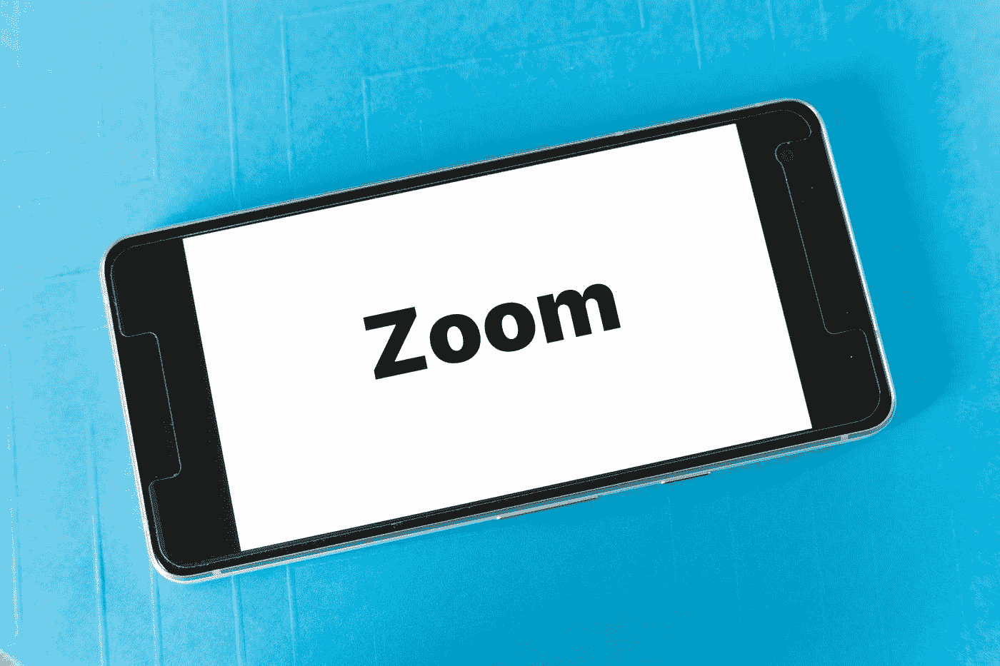
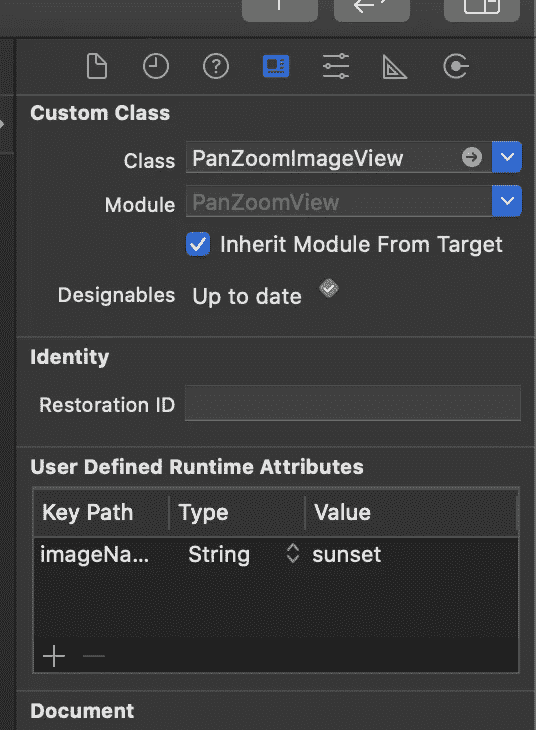
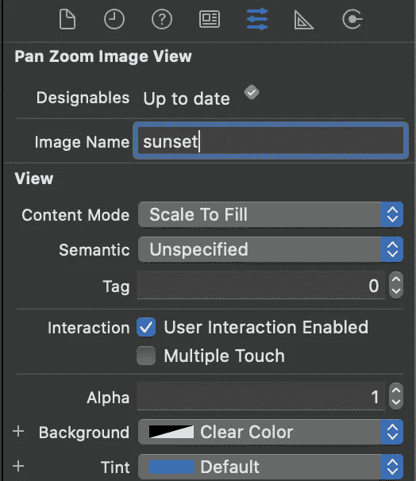

# 在 Swift 中创建可缩放图像视图

> 原文：<https://betterprogramming.pub/creating-a-zoomable-image-view-in-swift-c5ce67f17b2e>

## 将缩放功能添加到 iOS 应用程序的分步指南

马库斯·温克勒在 [Unsplash](https://unsplash.com?utm_source=medium&utm_medium=referral) 上拍摄的照片

没有什么比完美的图像更能让你的应用大放异彩了。但是，如果你想让你的应用程序用户真正参与到图片中并与之互动呢？也许他们想放大，平移，真正掌握像素？

在本教程中，我们将构建一个可缩放、可平移的图像视图来实现这一点。

# 这个计划

他们说一张图片胜过千言万语——但这并不需要一千行代码！对于我们的可缩放图像视图，我们将利用`UIScrollView`的缩放和平移功能。本质上，我们将在一个`UIScrollView`中嵌套一个包含我们图像的`UIImageView`，它将处理所有的缩放、平移(和点击！)我们扔向它的手势。

# 创建一个`PanZoomImageView`

让我们首先创建一个继承了`UIScrollView`的`PanZoomImageView`类。我们将用一个作为子视图添加的`UIImageView`来初始化这个类。我们希望能够通过编程和接口构建器来使用`PanZoomImageView`，所以让我们处理不同的初始化器并创建一个公共的 init:

在`commonInit()`中，我们将图像视图居中并设置其高度和宽度，而不是将其固定在父视图上。这样，滚动视图将从图像视图中获取其内容大小。

# 设置滚动视图

我们需要实际设置我们的滚动视图，使其可缩放和可平移。这包括设置最小和最大缩放级别，并指定当用户放大时使用的`UIView`(在我们的例子中，它将是图像视图)。让我们设置滚动视图(为清晰起见，添加一些注释):

在这里，我们设置最小和最大缩放级别，确保滚动指示器是隐藏的(我们不想让它们破坏我们美丽的图像！)，然后我们将`PanZoomImageView`类设置为滚动视图委托。Xcode 可能会开始抱怨，因为`PanZoomImageView`还不符合`UIScrollViewDelegate`——让我们接下来这么做:

这非常简单——我们希望我们的图像是缩放和平移时显示的视图，所以我们只需返回我们的`imageView`。

# 树立我们的形象

太好了！我们在一个`UIScrollView`中嵌套了一个`UIImageView`，一切都应该是可滚动和可平移的。然而，我们实际上如何树立我们的形象呢？我们将通过向我们的类中添加一个`imageName`字符串，并在字符串改变时更新`UIImageView`来实现这一点。我们还将把`imageName`标记为`@IBInspectable`，这样就可以通过界面构建器对其进行设置:

好了，我想我们已经准备好使用我们的新类了！打开 Main.storyboard 并添加一个视图，按照您喜欢的方式将其固定到父视图。接下来，选择视图，导航到 Identity Inspector，并将类设置为`PanZoomImageView`。

导航到属性检查器，您应该看到“图像名称”属性(这代表我们设置为`@IBInspectable`的`imageName`字符串！).在此处键入您要在视图中嵌套的图像的名称。

是时候建造和运行了！一切正常，您应该会看到如下内容。尝试平移和缩放(如果您正在使用模拟器，请按住“option”键)——您将获得一个全新的图像视角！

# 以编程方式初始化视图

这在使用界面构建器时非常有用——但是如果您想以编程方式初始化视图呢？让我们向类中添加另一个初始化器，这样我们就可以用代码设置图像名称:

注意，我们在这里不需要调用 common init`()`——当我们调用`init(frame: .zero)`时，它会在不同的初始化器中被调用

就是这样！我们现在可以通过传递一个图像名以编程方式初始化我们的视图，如下所示:

让我们从整体上看一下我们的类:

# 双击手势(可选)

可缩放视图的一个常见功能是双击以放大和缩小。这是对我们类的一个相对简单的添加，所以接下来让我们添加它。我们将创建一个`UITapGestureRecognizer`并在用户双击时使用它来改变滚动视图的缩放比例:

就是这样！我们现在可以双击来放大/缩小我们的图像。

# 最后的想法

这是一个很棒的可重用类，只要你想让一个图像可缩放，你就可以把它取出来。添加这种额外的功能可以真正帮助人们关注你在应用程序中显示的图像，这通常是用户期望和需要的功能。

这也不仅仅适用于图像视图——如果你想使`UIView`可缩放，你可以采用同样的方法，用`UIView`代替图像名初始化你的类。要尝试的东西！

*最初发表于*[*【https://www.brightec.co.uk】*](https://www.brightec.co.uk/blog/creating-a-zoomable-image-view-in-swift)*。*