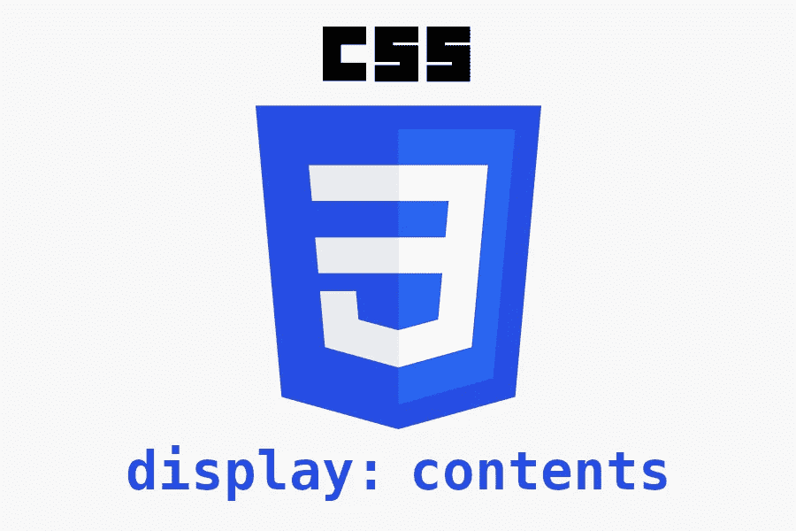
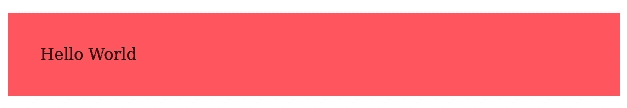
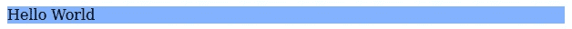
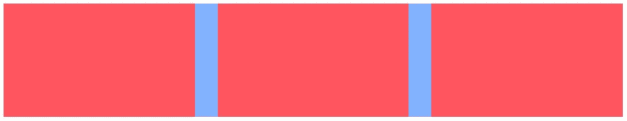
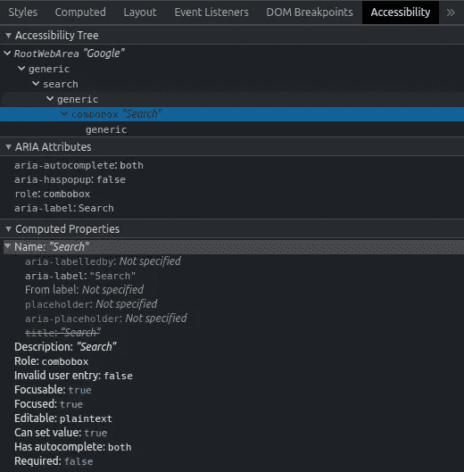
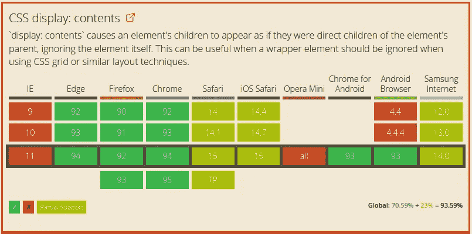

# 使用 CSS 显示内容创建可访问的标记

> 原文：<https://betterprogramming.pub/creating-accessible-markups-with-css-display-contents-9cdba5f1eaa8>

## 用这个 CSS 特性改进你的 HTML 标记



作者创建的标题

CSS display 属性最常见的用法是定义元素的外部和内部布局。我们最常用的是块、内联元素、flex 和 grid。

在`CSS Display Module Level 3`中可以找到`display`属性的所有规范。截至 2021 年 9 月，一个新的财产`contents`可以在那里找到。在那之前很久，它被添加到 Firefox 中，后来被证明是一个成功的实验。

这是什么？它是如何工作的？它可以投入生产使用了吗？

在这篇文章中，我们将研究为什么这个新功能会改变游戏规则，以及它将如何影响用户和他们的可用性。

# 它是如何工作的？

让我们首先深入研究 CSS 规范，以获得正式的定义:

> 元素本身不生成任何框，但是它的子元素和伪元素仍然生成框，文本也照常运行。出于框生成和布局的目的，元素必须被视为在元素树中被其内容所替换(包括其源文档子元素及其伪元素，如::before 和::after 伪元素，它们通常在元素的子元素之前/之后生成)。”—[csswg.org](https://drafts.csswg.org/css-display/#valdef-display-contents)

**TL；DR:** 通过使用`display: contents`元素不会产生一个特定的盒子。相反，它会将其伪框和子框替换为其父框的子框。

在`contents`之前，只有一个选项可以控制一个元素是否会生成任何盒子:`display: none`。使用它意味着元素及其后代不会生成框或文本串。

## 基本行为

为了更好地理解这个新的显示属性值，让我们从一个简单的例子开始。我们将通过将这个新的显示应用到一个具有填充和背景色的 div 来显示结果。

让我们看看下面的代码:

它输出以下结果:



上面代码的布局结果

如果我们将显示修改为`contents`，就像这样:

```
.content {
  **display: contents;**
  background: #ff555e;
  padding: 2rem;
}
```

让我们看看结果:



上面代码的布局结果与显示内容

属于`.content`的填充和颜色。为什么？因为`.content`是不渲染的，它的子节点是直接作为`.container`的子节点放置的。

## 伪元素和事件是如何受到影响的？

在前面的例子中，我们已经看到了元素是如何从布局中消失的。但是它仍然会出现在标记中。这对它的事件和伪类有什么影响？

*   **伪元素**:不受影响。它们将按预期工作，因为它们对 div 的内容有影响，而对布局没有影响。
*   **状态事件** : 不配合显示内容。因为 div 不会被渲染，所以它们没有任何效果。像 hover 这样的伪类不会有什么影响。
*   **事件点击**:即使元素没有被渲染，它仍然存在于 DOM 中。可以绑定事件，因为它们将传播到它们的子节点。如前所述，标记仍然存在于 DOM 中。

# 它闪耀在哪里？

第一个例子并不令人印象深刻。好像都不值得。它不是为那个特定的场景准备的。`display: contents`是为了与 Flex 和 Grid 结合使用。为什么？

那两个布局刚好能作用在一级子上。现在有了显示内容，我们可以让子节点成为 Flex/Grid 布局的一部分。

让我们看一个例子:

让我们看看结果:



上面代码的布局结果

注意所有的`.element` div 是如何参与 flex 布局的，即使它们不是`.container`的第一级子元素。

⚠️不要搞错了，这不是子网格的替代物。这一特征服务于完全不同的目的。

# 为什么重要？

所以我们看到了它是如何工作的，但不知道为什么。为什么不删除这个父元素呢？布局结果将是相同的。这到底是怎么回事？这都是关于 HTML 语义标记的。

正如我们之前看到的，Grid 和 Flex 只能与第一层的子节点交互。这种限制的问题在于它规定了我们的语义 HTML。布局约束迫使我们产生可读性较差的 HTML 代码。这最终会损害设备的可访问性。为什么？

HTML 标记被转换成 DOM 树。然后，浏览器基于此创建一个可访问性树。特定于平台的可访问性 API 使用该树为需要辅助技术的用户提供更好的体验。产生一个清晰而全面的标记意味着浏览器能够更好地帮助用户。

如何检查呢？您可以访问`developers tools > Elements > Accessibility` Chrome 开发工具中的可访问性选项。让我们来看看谷歌的输入搜索是什么样子的:



检查谷歌输入搜索输入文本的标题

让我们看看我们的标记是如何改进的。我们现在能够从这一点出发:

到这个更正确的标记:

我们可以将列表包装在一个`<ul>`标签中，这比我们的第一次尝试在语义上更加正确。我们的 CSS Flex/Grid 布局不再限制我们的标记。

# CSS 对它的支持是什么？

下面我们可以看到当前支持的截图。只有`70%`完全支持和`23%`部分支持，说明它的支持度有点低。



caniuse.com

这是什么意思？这应该被认为是一个渐进的增强。我们仍然应该预见到浏览器可能不会实现这个特性并提供一个后备。像`CSS Supports`这样的工具可以帮助我们根据可用的功能定制用户体验。

# 最后的想法

我希望这篇文章能帮助您看到这个特性的价值。它帮助我们将标记从布局的限制中解放出来。多年来，我们一直面临这些限制的困扰。

我们不应该忽视可及性。这是一个应该得到更多关注的重要话题。我们有责任让我们的内容达到最大化。

干杯。如果你喜欢你所读到的，看看下面这个故事:

[](/mastering-css-before-and-after-ecf1d59d9a3d) [## 掌握 CSS ::before 和::after

### 深入研究 CSS 中的::before 和::after 伪元素

better 编程. pub](/mastering-css-before-and-after-ecf1d59d9a3d)