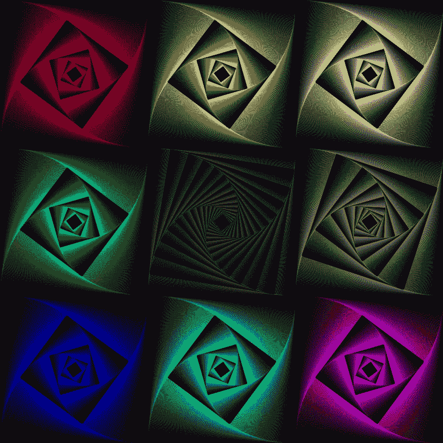
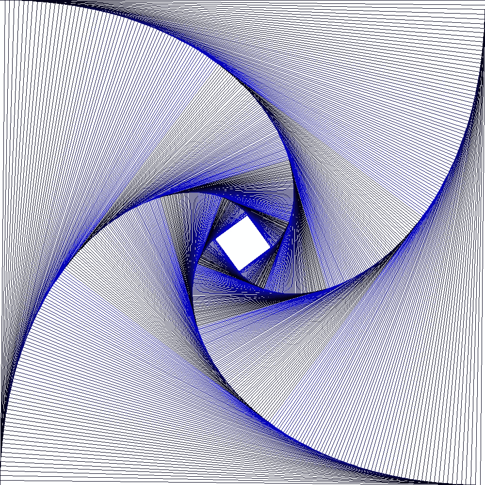
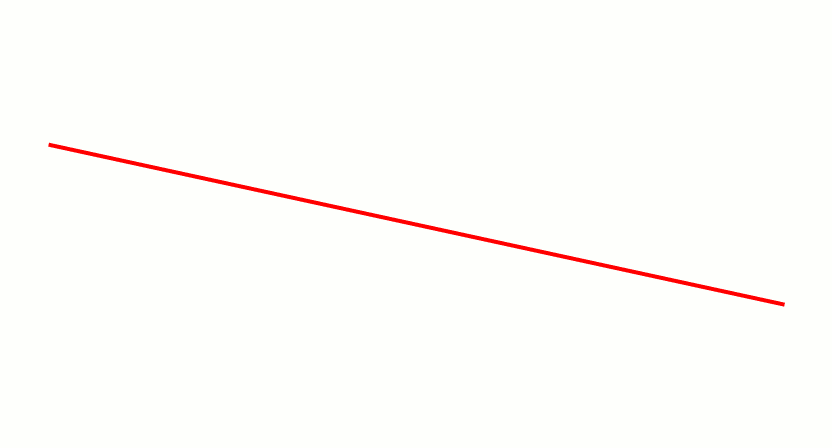
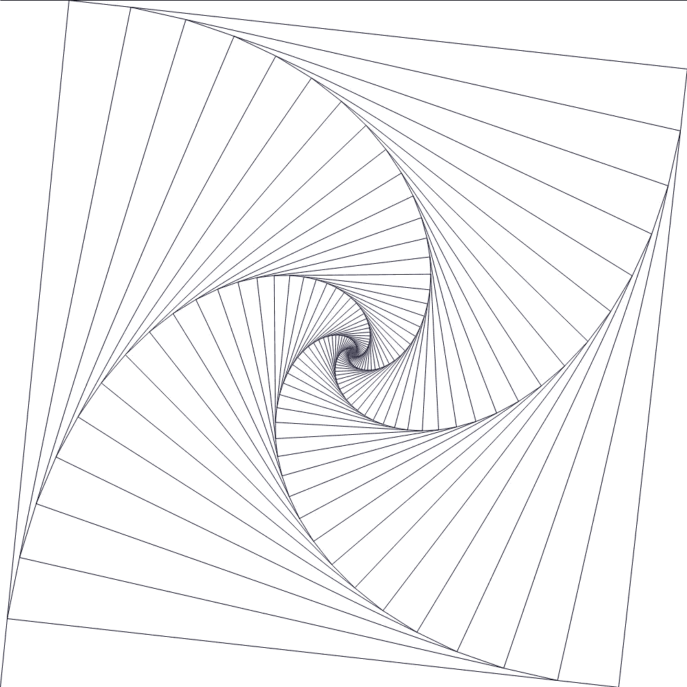
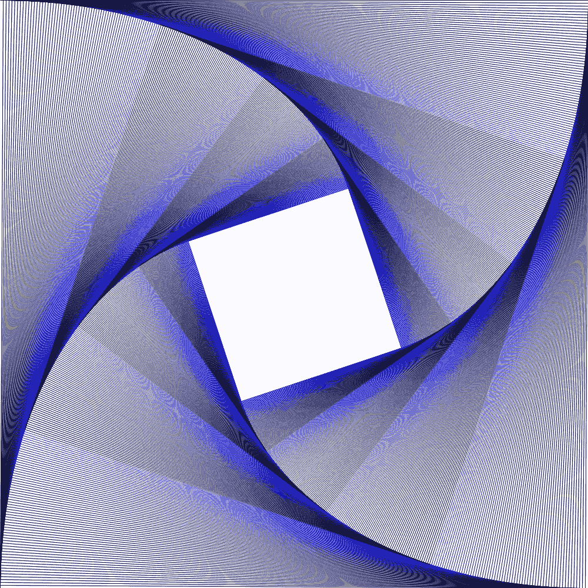
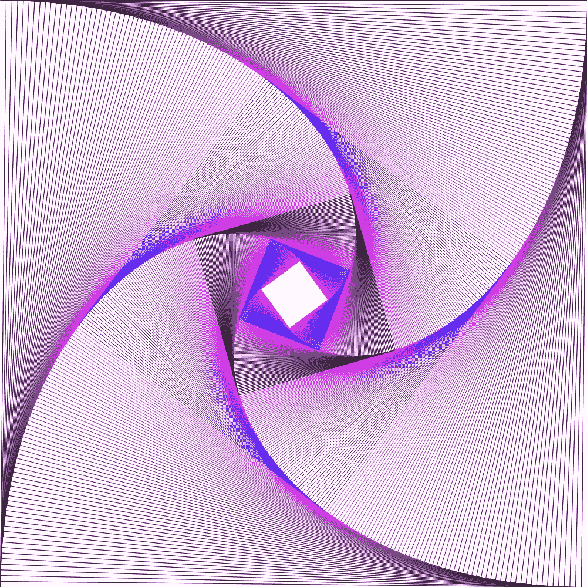
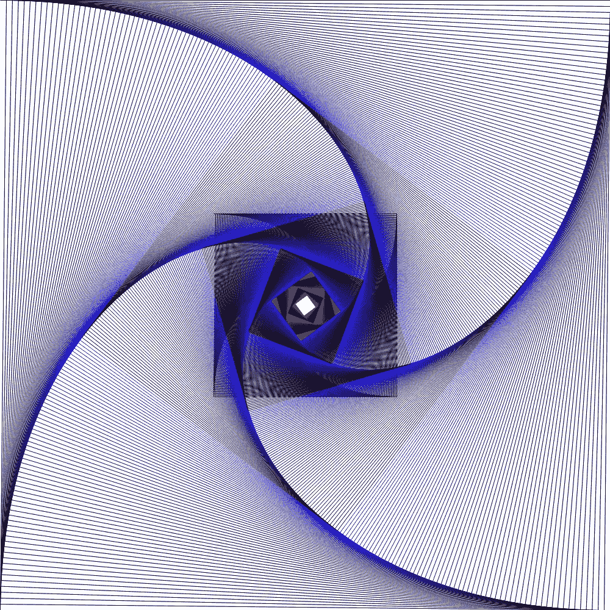
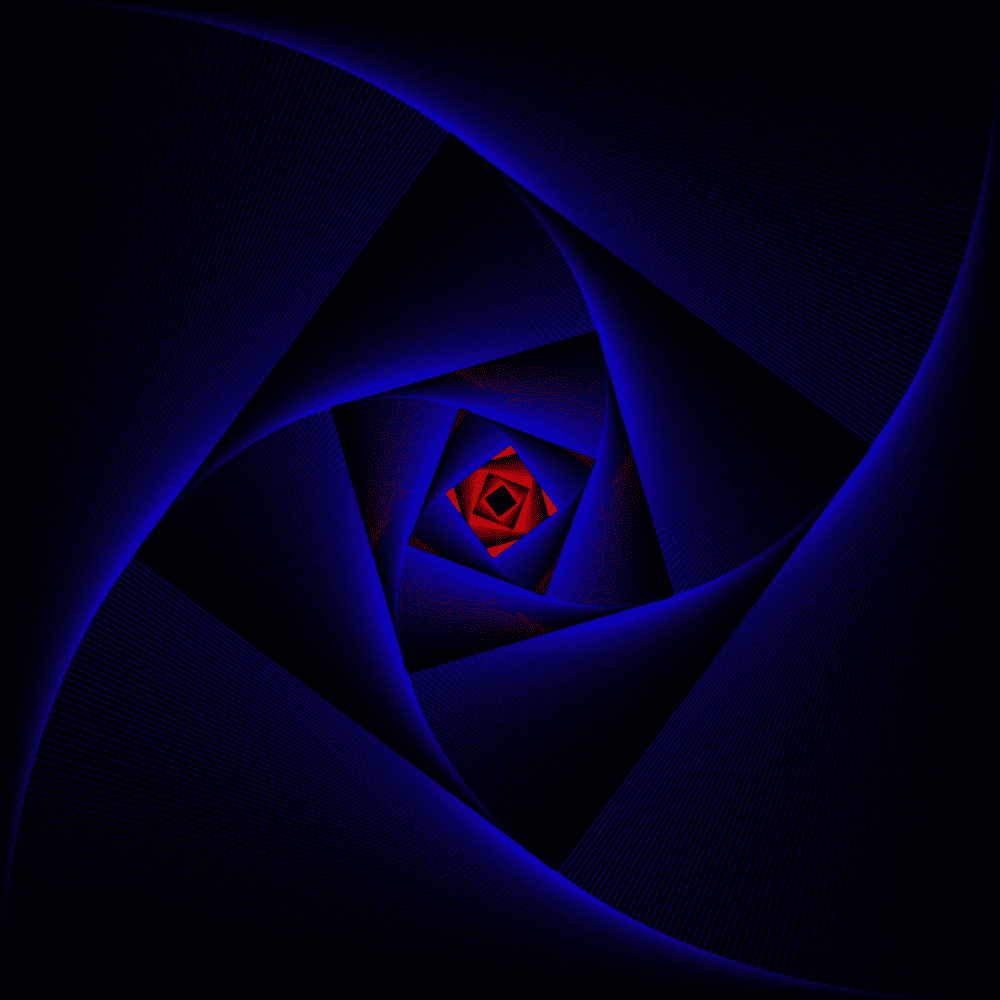

# 用 Python 创作算法艺术

> 原文：<https://betterprogramming.pub/creating-algorithmic-art-with-python-edb5c5ea0a87>

## 通过创造美丽的东西来探索你的创造力



马丁·托马斯递归生成的图像

算法定义的图像是美丽的。有大量的例子，甚至是在没有计算机的情况下创建的。关键的一点是，你对如何创建图像有一个清晰的正式定义。看完这篇文章，你就知道怎么塑造上面的形象了。开始吧！

# 用枕头画线

Python 图像库(PIL)是第一个广泛使用的允许创建图像的 Python 库。由于自 2006 年以来没有更新，叉枕诞生了。您可以通过以下方式安装

```
pip install pillow
```

画线的工作原理是这样的:

你可能会注意到这条线看起来并不好看。看起来好像里面有“台阶”。如果你用`draw.line`创建上面的图像，它看起来会像这样:



创建了带有锯齿伪像的图像。图片作者:马丁·托马斯

你看到的问题叫做[混叠](https://en.wikipedia.org/wiki/Aliasing)。这实质上意味着不是线的每个点都精确地映射到一个像素。有些像素可能包含 10%的线条，而 90%的像素不是线条。解决这个问题的方法叫做反走样。[吴晓林的直线算法](https://en.wikipedia.org/wiki/Xiaolin_Wu%27s_line_algorithm)解决了这个问题。



Dnttllthmmnm 创建的小林吴线算法的可视化(来源:[维基共享](https://en.wikipedia.org/wiki/File:LineXiaolinWu.gif))

幸运的是，Stackoverflow 用户 toastie 已经为我们实现了它( [link](https://stackoverflow.com/a/5709655/562769) )。

# 图像生成算法

上图的想法很简单:

1.  我们从矩形的四个点开始
2.  我们从点 1 到点 2 画一条线
3.  我们将点 1 向点 2 移动一个给定的百分比。

现在用“我”代替 1，用“i+1”代替 2。就是这样。

您可以通过分别插值 x 和 y 坐标来移动线上的点:

# 把所有的放在一起

你只是想自己尝试一下吗？给你:

# 调整参数

让我们用图像来找点乐子。



使用 10%而不是 1%会增加白色量。图片由马丁·托马斯提供。



如果你到 0.5%，坐标到达中心需要更长的时间。图片作者:马丁·托马斯

您可以操纵获取颜色的方式:



在颜色的确定上更有创造性。图片作者:马丁·托马斯



在这样的矩形中添加这样的重复定义的矩形。图片作者:马丁·托马斯



使用黑色背景代替白色背景。图片作者:马丁·托马斯