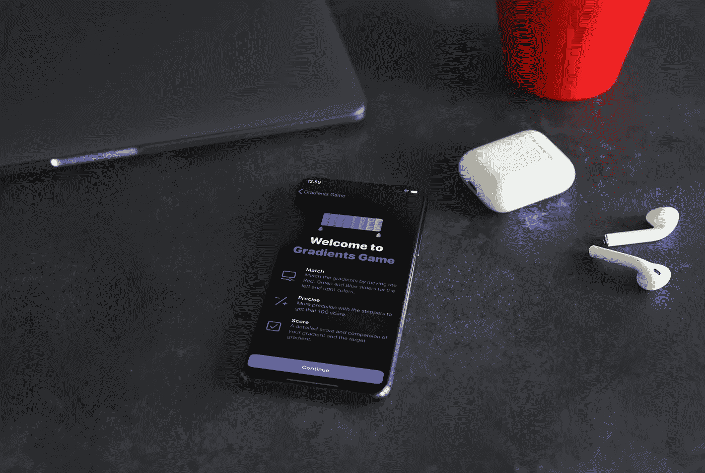
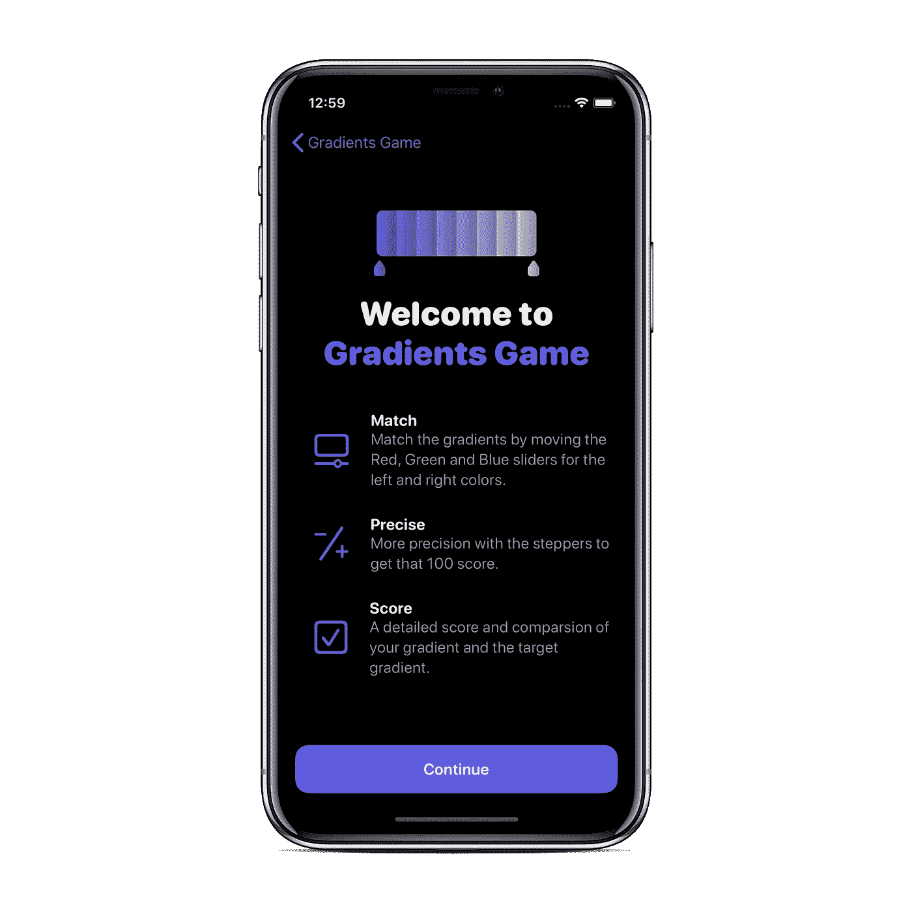
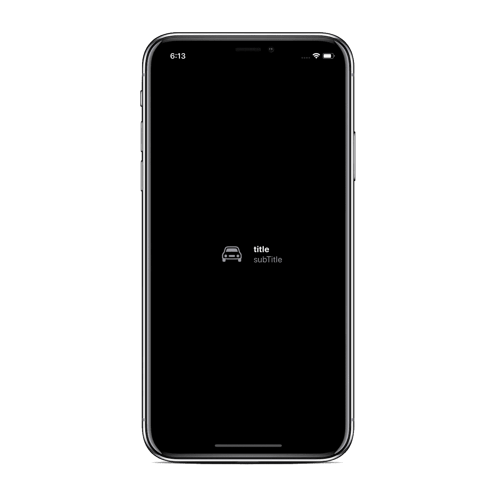
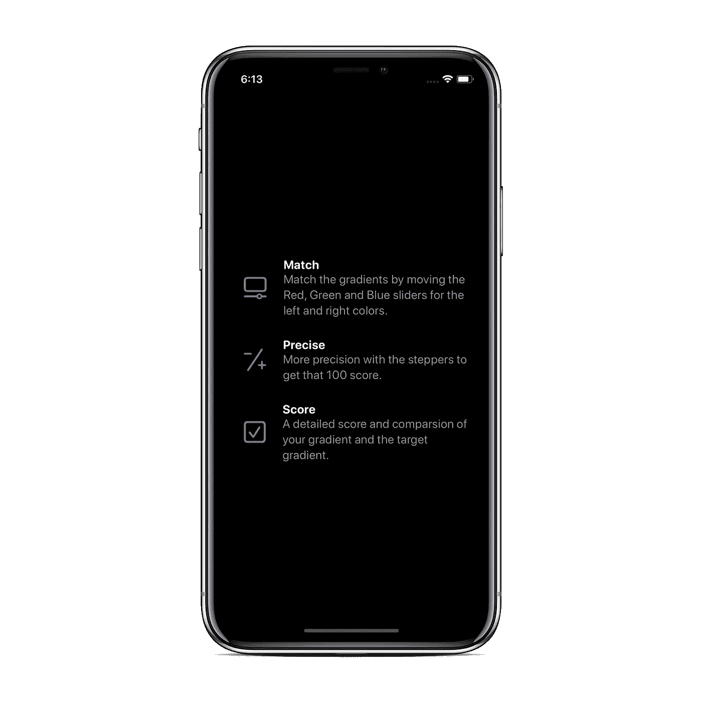
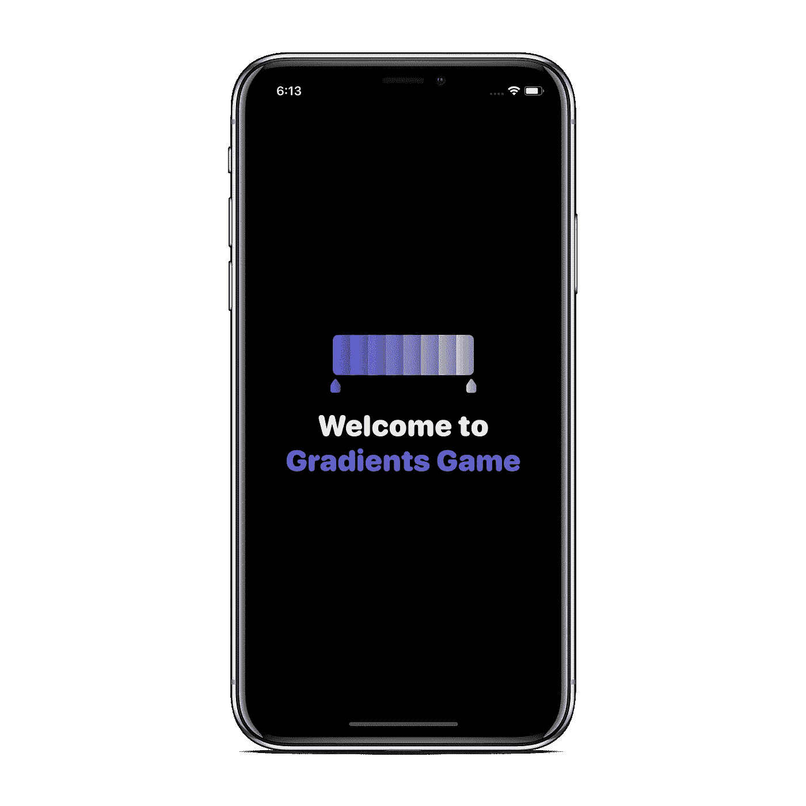
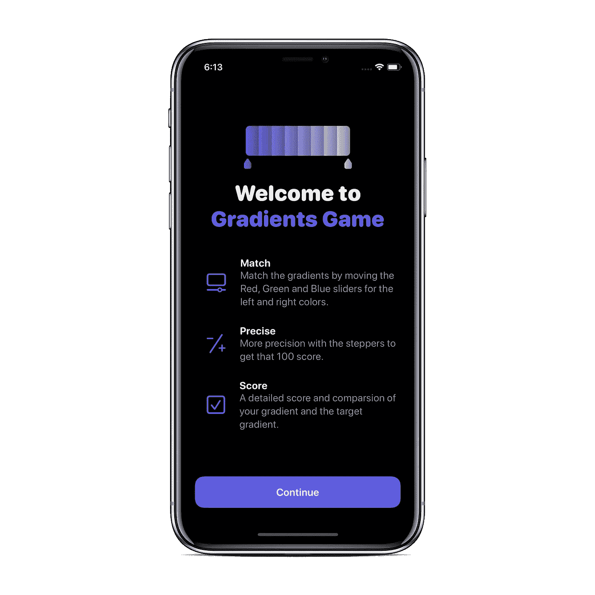

# 在 SwiftUI 中创建一个类似苹果的闪屏

> 原文：<https://betterprogramming.pub/creating-an-apple-like-splash-screen-in-swiftui-fdeb36b47e81>

## 让你的应用看起来更专业

由[模仿者](https://mockuper.net)生成的模型

你可能见过漂亮的“欢迎使用股票”闪屏，介绍苹果股票应用的功能。

嗯，我们将使用 SwiftUI 中的可重用视图来创建类似的东西。

我最近推出了我的第一个应用，[渐变游戏](https://apps.apple.com/us/app/gradients-game/id1479784361)，实现了闪屏。

看起来是这样的:

我们将构建一个相同的屏幕，以便您可以在自己的 SwiftUI 应用程序中使用它。

我们将把用户界面分成两部分:

*   顶部的图像和欢迎标题
*   信息视图

让我们首先从信息细节开始，因为这是在我们的例子中使用可重用视图的最好例子。

# 信息视图

特定功能的突出显示通常包含一个符号或一个图像来表示，一个精确的标题，以及一个副标题来提供更多的解释信息。

创建一个单独的视图来显示这三个组件。这样，我们将能够为任何我们想要的特性重用视图，并在将来补充它。

在本文中，我们将使用 SF 符号，因为它们非常容易使用并且非常灵活。

我们有垂直布局的标题和副标题，所以将其嵌入到 VStack 中。将整行嵌入 HStack，图像在左侧。

您可以根据自己的需求定制不同颜色和尺寸组合的代码。

下面是它的样子:

接下来，我们将使用一个容器来包含这些行。您应该将数据作为模型，但是为了简单起见，让我们将它添加到视图本身中。

# 标题视图

标题由应用程序的徽标和名称组成。通常，该名称根据整个应用中使用的原色进行着色。

# 把所有东西加在一起

我们在两者之间添加了一个`Spacer()`,这样一切都完美契合。

使用的自定义修饰符的代码:

# 结论

您可以添加动画，使其更具互动性。

我将很快就此添加另一篇文章，因为 iOS 13.2 中有一些错误，使得在 SwiftUI 中处理动画很困难。