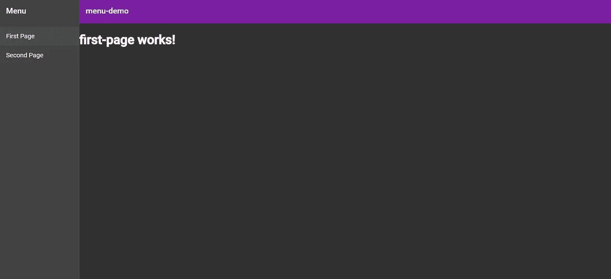
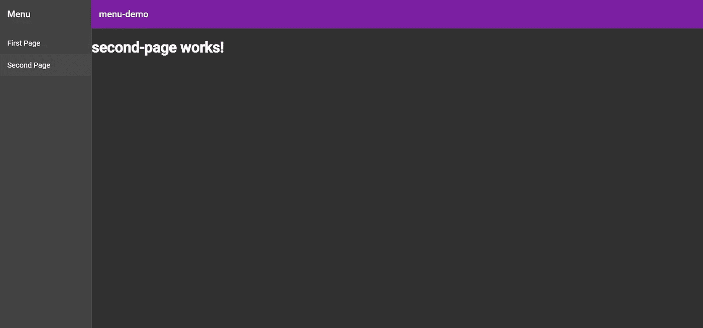

# 使用材质 UI 在 Angular 中创建应用程序范围的菜单

> 原文：<https://betterprogramming.pub/creating-an-application-wide-menu-in-angular-using-angular-material-ui-a-simple-tutorial-for-a3c1df1be33d>

## 让我们创建一些通用导航


[日出照片](https://unsplash.com/@sunrisephotography?utm_source=unsplash&utm_medium=referral&utm_content=creditCopyText)拍摄于 [Unsplash](https://unsplash.com/s/photos/menu?utm_source=unsplash&utm_medium=referral&utm_content=creditCopyText)

[Angular](https://angular.io/) 是一个非常强大的框架，用于构建健壮、快速、响应的应用程序。

当我第一次踏入 Angular 的世界时，我发现即使我以前有过 HTML、CSS、JS 等方面的经验，Angular 也有一个相当陡峭的学习曲线。

也就是说，我想制作这个介绍性教程来支持任何想开始使用 Angular 的人，因为我相信它是任何开发人员的必备工具！

所以，对于刚开始学习 Angular 的人，我希望这能对你有所帮助。

本教程将带你一步一步地了解如何使用 [Material-UI](https://material-ui.com/) 框架创建一个菜单，并使用 routing 在两个不同的组件间导航。

假设您的机器上安装了 Angular，让我们开始创建一个新项目，使用:

```
ng new menu-demo
```

要在项目中启用路由，请在看到以下提示时选择“y”选项:

```
? Would you like to add Angular routing? (y/N)
```

**注意:**通过生成路由模块，可以在创建项目后启用路由，但这种方式简单得多，因为一切都是自动为您配置的(稍后您会感谢我的！).

作为 Angular 框架的一个很好的补充，Google 创建了 Angular Material-UI 框架。

这使得开发人员可以轻松地实现一个简单的交互式 UI，使您的应用程序更具吸引力。

要将角度材质集成到项目中，请导航到项目目录，并使用以下内容导入框架:

```
ng add @angular/material
```

这个命令将自动包括你的项目需要使用的所有必需的依赖到角度材料，所以换句话说，眼不见，心不烦！

一旦 Angular 材质包成功安装，它将提示您选择一个预建或自定义的主题来集成到您的项目中。

这完全取决于你，因为它将决定你的应用程序将遵循的配色方案(我最喜欢的是紫色/绿色主题，但嘿，这只是我的)。

另外，如果你不喜欢你选择的主题，你可以随时改变它！接下来，您需要对以下提示回答*是*:

```
? Set up HammerJS for gesture recognition? Yes
? Set up browser animations for Angular Material? Yes
```

[“hammer js](https://hammerjs.github.io/)”用于支持手势(缩放、旋转、滑动等。)，而“角度材料的浏览器动画”使您能够简单地将动画集成到您的应用程序中(动画按钮状态，平滑从布线组件的过渡，等等)。).

这两个安装都不是必需的，但是请注意，如果你不安装“角材料的浏览器动画”，你将禁用角材料使用的大量动画，这将是可悲的，但选择最终是你的。

现在，我们可以通过 Angular CLI 生成一个预定义菜单(包括一个工具栏和一个侧面导航菜单)来开始使用 Angular 材质:

```
ng generate @angular/material:material-nav --name="nav-menu"
```

该命令将通过访问角度材料包生成一个新的菜单组件。我们需要给组件起一个名字(我给我的命名为`nav-menu`)。

一旦您运行这个命令，组件将会生成，您将会看到一个名为`nav-menu`的文件夹，其中包含了与新菜单组件相关的所有文件。

生成的`nav-menu.component.html`文件应该是这样的:

```
<mat-sidenav-container class="sidenav-container">
  <mat-sidenav #drawer class="sidenav" fixedInViewport
      [attr.role]="(isHandset$ | async) ? 'dialog' : 'navigation'"
      [mode]="(isHandset$ | async) ? 'over' : 'side'" 
      [opened]="(isHandset$ | async) === false">
    <mat-toolbar>Menu</mat-toolbar>
    <mat-nav-list>
      <a mat-list-item href="#">Link 1</a>
      <a mat-list-item href="#">Link 2</a>
      <a mat-list-item href="#">Link 3</a>
    </mat-nav-list>
  </mat-sidenav>
  <mat-sidenav-content>
    <mat-toolbar color="primary">
      <button
        type="button"
        aria-label="Toggle sidenav"
        mat-icon-button
        (click)="drawer.toggle()"
        *ngIf="isHandset$ | async">
        <mat-icon aria-label="Side nav toggle icon">menu</mat-icon>
      </button>
      <span>menu-demo</span>
    </mat-toolbar>
    <!-- Add Content Here -->
  </mat-sidenav-content>
</mat-sidenav-container>
```

确认成功创建了菜单组件后，再创建两个组件。我们将使用这些组件，通过在它们之间切换来测试我们的应用程序，同时让菜单始终在页面上:

```
ng generate component first-pageng generate component second-page
```

这将创建另外两个文件夹，每个文件夹中包含每个组件所需的文件。

如果我们分别打开第一页和第二页文件夹中的`first-page.component.html` 和`second-page.component.html` 文件，您应该会看到:

```
<p>first-page works!</p>
```

并且:

```
<p>second-page works!</p>
```

我们现在准备好布线组件了！我们首先打开`app-routing.module.ts` 文件，它应该包含类似如下的内容:

```
import { NgModule } from ‘@angular/core’;
import { Routes, RouterModule } from ‘@angular/router’; const routes: Routes = [];@NgModule({
imports: [RouterModule.forRoot(routes)],
exports: [RouterModule]
})
export class AppRoutingModule { }
```

我们现在想要导入我们创建的第一页和第二页组件(**注意:**我们不导入`nav-menu`组件，因为我们永远不会在它和另一个组件之间切换——它将一直存在于页面上)。

接下来，我们将向`routes`数组添加路径，这将分别提供到第一个和第二个路径的路径。您的最终`app-routing.module.ts`文件应该如下所示:

```
import { NgModule } from ‘@angular/core’;
import { Routes, RouterModule } from ‘@angular/router’;
import { FirstPageComponent } from ‘./first-page/first-page.component’;
import { SecondPageComponent } from ‘./second-page/second
page.component’; const routes: Routes = [
{ path: ‘first-page’, component: FirstPageComponent },
{ path: ‘’, redirectTo: ‘/first-page’, pathMatch: ‘full’ },
{ path: ‘second-page’, component: SecondPageComponent }
];@NgModule({
imports: [RouterModule.forRoot(routes)],
exports: [RouterModule]
})
export class AppRoutingModule { }
```

**注意:**数组中的第二个路径是这样的，当 URL 中有一个空路径时，它被重定向到首页组件，这意味着在加载时，它和菜单一起将是默认加载的组件。

快好了！现在，我们需要返回到`nav-menu.component.html`文件并对其进行一些小的调整。因为我们只处理两个组件，所以可以随意删除第三个锚(`<a>`)元素。

在剩下的两个锚元素中，我们需要为每一个指定`routerLink`元素，这基本上告诉 Angular 当你点击链接时如何响应(在我们的例子中，响应是在第一页和第二页组件之间切换)。

此外，在注释行“Add Content Here”的正下方，我们需要添加`router-outlet`指令，该指令将根据路由器的当前状态填充不同的内容(即，如果我们当前被路由到第一页组件，那就是将被加载到屏幕上的组件内容)。

该文件的最终版本应该类似于:

```
<mat-sidenav-container class=”sidenav-container”>
  <mat-sidenav #drawer class=”sidenav” fixedInViewport
      [attr.role]=”(isHandset$ | async) ? ‘dialog’ : ‘navigation’”
      [mode]=”(isHandset$ | async) ? ‘over’ : ‘side’”
      [opened]=”(isHandset$ | async) === false”>
    <mat-toolbar>Menu</mat-toolbar>
    <mat-nav-list>
      <a mat-list-item routerLink=”/first-page”>First Page</a>
      <a mat-list-item routerLink=”/second-page”>Second Page</a>
    </mat-nav-list>
  </mat-sidenav>
  <mat-sidenav-content>
    <mat-toolbar color=”primary”>
      <button
        type=”button”
        aria-label=”Toggle sidenav”
        mat-icon-button
        (click)=”drawer.toggle()”
        *ngIf=”isHandset$ | async”>
        <mat-icon aria-label=”Side nav toggle icon”>menu</mat-icon>
      </button>
      <span>menu-demo</span>
    </mat-toolbar>
    <! — Add Content Here →
    <router-outlet></router-outlet>
  </mat-sidenav-content>
</mat-sidenav-container>
```

最后，为了结束我们的应用程序，我们导航到`app.component.html` 文件，并将其内容替换为:

```
<app-nav-menu></app-nav-menu>
<router-outlet></router-outlet>
```

还记得我说过我们不需要在路由中包含菜单组件，因为它会一直出现在屏幕上吗？

这是通过在`app.component.html`文件中包含`app-nav-menu`组件来实现的，因为我们将菜单组件定义为在整个应用程序中保持不变。

最后但同样重要的是，让我们看看我们创造了什么！

我们可以运行命令:

```
ng serve --open
```

这将在本地为我们的应用程序提供服务(默认为端口 4200)，用`— open`标志自动打开浏览器并显示端口的内容。

瞧啊。加载后，我们将看到:



首页组件的页面视图

如果我们单击菜单中的*第二页*按钮，将加载第二页组件，并从第一页组件中移除内容。我们将会看到:



第二页组件的页面视图

我们完了！现在有趣的部分来了，构建应用程序的主体，添加更多的组件、服务，并学习更多关于 Angular 的功能和通用性！

我希望这个教程对你有帮助！