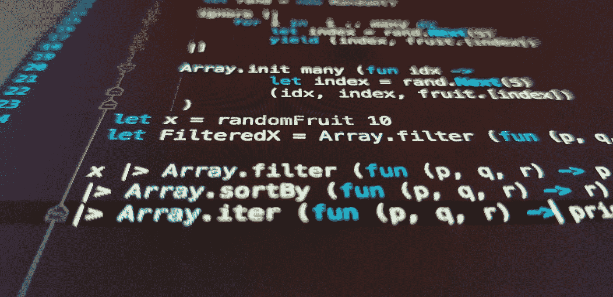

# 创造一种深奥的编程语言——标记化

> 原文：<https://betterprogramming.pub/creating-an-esoteric-programming-language-tokenization-539d80a16214>

## 源代码如何被分析并转换成计算机友好的格式:令牌



照片由[伊利娅·波什科夫](https://unsplash.com/@boshkov?utm_source=medium&utm_medium=referral)在 [Unsplash](https://unsplash.com?utm_source=medium&utm_medium=referral) 拍摄

如果你是一名软件开发人员，你可能在某个时候想知道你的源代码是如何执行的。在本系列的前一篇文章中，我已经定义了一种新的[深奥的编程语言](https://en.wikipedia.org/wiki/Esoteric_programming_language)的语法。现在，是时候通过解释器用代码实现它了。如果你错过了上一个故事，我建议你去看看，因为从现在开始，我假设你熟悉这门语言。

我已经在另一篇文章“[编程语言解释器如何执行你的代码](/how-language-interpterers-execute-your-programs-450a6837dee4)”中讨论了解释器如何在高层工作。我强烈建议您在继续之前检查一下，这样您就不会因为不知道每个步骤的目的而迷失在代码中。

如果您对完整的注释代码感兴趣，请查看该项目的 [GitHub 库](https://github.com/nic-obert/reverse-language)。

# 定义主要类别

首先，我们必须定义我们将要使用的结构。先说最重要的一个:令牌。如果您还记得关于解释器的文章，令牌基本上由类型、优先级和值组成。

我已经将`TokenType`定义为一个包含所有可能类型的枚举类。我会在需要的时候讨论它们，所以现在不要担心它们的意义。

而下面的片段就是`Token`类。我决定省略调试方法，比如字符串表示，以免文章变得不必要的长。为此，您可以在 GitHub 上查看源代码。

关于我之前所说的令牌，这个类定义了另外两个属性:`source_location`和`children`。它们是特定于实现的属性，分别表示标记在源代码中的位置，以及哪些子标记应该是语法树中运算符标记的操作数。我们将在后面详细讨论这些概念。

为了获得令牌类型优先级，我们必须索引包含优先级的查找表。如果你不熟悉查找表，我建议你看看这篇文章:“[用查找表和哈希表去除过多的 If-Else 语句](/get-rid-of-excessive-if-else-statements-with-lookup-and-hash-tables-c7dbed808996)”。简而言之，我们利用枚举的整数值来索引包含相应值的数组，在本例中，是令牌类型优先级。

# 正在准备令牌化

我不打算解释如何从文件中加载源代码，因为每个人都应该能够做到这一点。一旦有了字符串格式，就可以开始处理它了。

不过，在此之前，定义一个全局变量是有用的，这样就可以从程序中的任何地方访问源代码，而不必将它作为参数传递给每个函数。为此，我创建了一个名为`State`的静态类，并设置了源代码属性:

首先，我们必须定义一些有用的变量来存储记号赋予器的状态。

`base_priority`是一个令牌拥有的优先级，因为它在代码中的位置，例如，如果它被括在括号中。

`parenthesis_depth`和`square_bracket_depth`跟踪嵌套的圆括号和方括号。

`token`是当前正在构建和处理的令牌，其中`tokens`是源代码包含的令牌列表。

`source_location`表示当前令牌在源代码中的位置。`SourceLocation`类定义如下，其中`line_start`是行首字符的索引，`line_number`是行号。

`can_be_comment`和`is_comment`，显然，跟踪当前源代码位置是否在注释中。

# 标记化

对源代码字符串进行标记化是从遍历它的每个字符开始的。

对于每个字符，我们必须检查它属于哪种标记。`is_identifier_start()`函数检查当前字符是否是标识符(如变量名)的第一个字符，定义如下:

然后我们会遇到一个 match-case 语句，相当于其他编程语言中的 switch-case 语句，它将单个字符映射到标记。注意，在字符被处理后，总是有一个`continue`跳转到循环的开始。这是因为如果每一次检查都失败了，意味着字符不能被处理，因此你应该抛出一个错误。不用担心错误的实现；我们稍后将讨论它们。现在，您只需要知道程序终止并将错误细节打印到控制台。

如您所见，每个字符都表示一个新令牌的开始，但是它没有被添加到令牌列表中，因为可能需要额外的信息来完成其值或确定其类型。例如，我们不能马上知道字符`3`是数字 3，还是一个更大数字的一部分，比如 345。

因此，我们必须在标记化循环的开始包含特定的处理程序，我在这里留下了`# ...`标记。

基于当前的令牌，我们现在可以完成构建了。首先，让我们检查它是否是一个评论，如果是，忽略它:

然后，我们必须根据当前的令牌类型来处理新字符。因此，如果定义了当前的令牌，我们就根据其类型来处理字符，以完成令牌的构建。例如，如果最后一个字符是一个`‘3’`，因此是一个`TokenType.NUMBER`，那么下一个字符很可能也是一个数字。

相反，对于字符串，跟随在`‘“‘`字符之后的每个字符都将是字符串的一部分，直到下一个`‘“‘`。

现在有些运算符像`++`和`+=`是由多个字符组成的。因此，如果我们在源代码中遇到字符`+`，我们不能保证这个标记是一个`TokenType.PLUS`。事实上，它也可以是一个`TokenType.INCREMENT`或一个`TokenType.ASSIGNMENT_ADD`的第一个字符。

剩下唯一需要检查的是当前令牌是否是一个标识符(也称为变量名)。该算法类似于您检查数字的方式，这意味着可以作为标识符一部分的每个字符都将被分组到单个标记中。

标识符被定义为字母数字字符和下划线的序列，但是它们不能以数字开头，正如我们已经在`is_identifier_start()`函数中看到的。

下面是处理标识符和关键字的代码:

在得到单词的所有字符后，我们要检查它是否是一个关键字，像`if`或`continue`。为了实现这一点，我们查看了一个字典(又名 map ),其中包含了该语言定义的所有关键字及其`TokenType`。

如果这个单词是一个关键字，那么当前的令牌类型就变成了关键字所代表的类型，例如，标识符`while`就变成了`TokenType.WHILE`。如果关键字是一个文字布尔值，比如`true`和`false`，当前令牌就变成了一个`TokenType.BOOLEAN`，它的值由文字关键字决定。如果单词不是关键字，就把它当作标识符，什么都不做。

最后，我们必须清理最终未挂起的标记，并检查是否所有括号都已被关闭。如果一切正常，返回令牌列表。

# 标记化错误

到目前为止，我已经讨论了在源代码无效的情况下引发错误，例如，如果一个括号没有结束，应该相应地引发一个错误。在这种情况下，错误是收集关于环境的特定数据集并在终止程序之前向控制台输出有用消息的函数。

错误模块如下所示:

如你所见，误差函数比我们目前看到的更多。它们将在解释的下一阶段使用。

下面演示了源代码如何转换成一系列标记:

```
# Source code
;123 = myVar# Tokens in the format <type: value (priority)>
[<SEMICOLON: None (0)>, <NUMBER: 123 (0)>, <ASSIGNMENT: None (3)>, <IDENTIFIER: myVar (0)>]#Source code
;1 4 + = myNumber# Tokens
[<SEMICOLON: None (0)>, <NUMBER: 1 (0)>, <NUMBER: 4 (0)>, <PLUS: None (8)>, <ASSIGNMENT: None (3)>, <IDENTIFIER: myNumber (0)>]
```

# 结论

总结一下，在本文中，我们已经介绍了源代码标记化在较低层次上是如何工作的。注意，这种方法可能不是最有效的，但它是从纯文本中获取一系列标记的一种简单方法。

在下一篇文章中，我将介绍如何将使用该算法生成的标记序列解析成抽象语法树。敬请期待下一集。与此同时，您可以检查这个解释器的 [GitHub 库](https://github.com/nic-obert/reverse-language)，在编写本文时，它只缺少`continue`和`break`语句的处理程序。

感谢阅读！