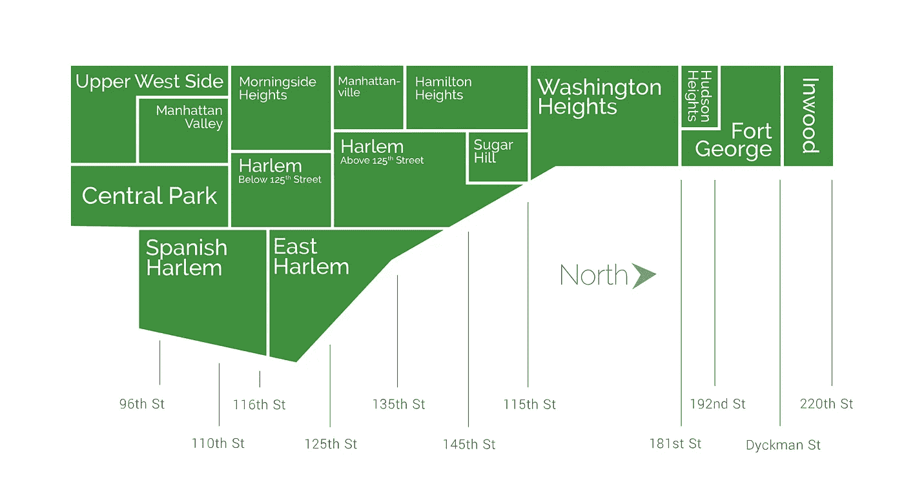
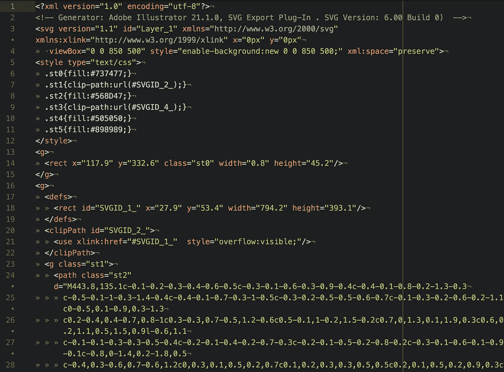
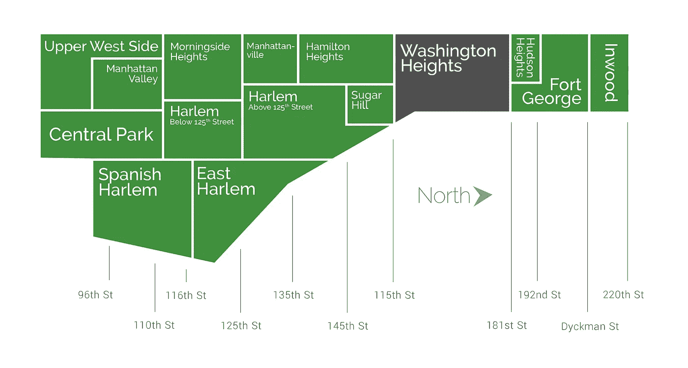
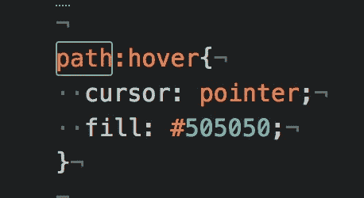
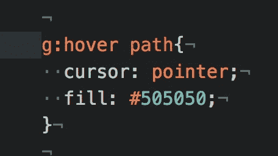
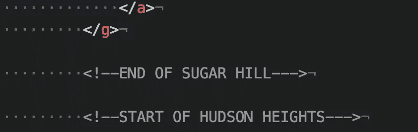
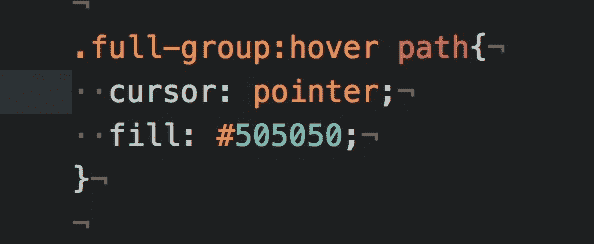

# 使用 SVG 和 CSS 创建交互式地图

> 原文：<https://betterprogramming.pub/creating-an-interactive-map-using-svg-and-css-94a688c11bd6>

## 制作具有悬停高亮显示的地图

图片由波西米亚房地产集团提供

我非常喜欢目前工作的一点是，我总是被推动着去发现新事物和开发新功能。我的新挑战是:给定一张社区地图的图片，开发交互功能，用户可以将鼠标悬停在地图的特定部分(社区)上来突出显示它们。

在我们深入研究代码之前，有两个重要的考虑事项:

1.  图像的文件类型应该是 SVG(实际上我不确定这是否可以用其他文件类型实现，除非你合并其他图像。如果我错了，请留下评论！)
2.  理解 SVG(组、路径等)。)

SVG 是以 XML 格式编写的可缩放矢量图形图像。与 JPEG 和 PNG 等其他文件类型不同，当您缩放页面或调整页面大小时，SVG 文件不会损失任何质量。它们是用 XML 编写的，是一种基于网络的图片格式，这使它们能够根据网页来调整自己的配置*，因此它们的分辨率/质量不会受到影响。从这个角度来看，如果你在文本编辑器中查看一个 PNG 或 JPEG 文件，你会看到图像本身。另一方面，当您查看 SVG 时:*

很疯狂，对吧？

您可以在`**`标签中使用 SVG 作为图像源，就像您使用任何其他图像文件一样:

但是 SVG 的美妙之处在于，您可以将 XML 直接写入 HTML，并将其全部包含在一个`*<svg>*`标签中！

当您可以将文件用作 img 标签的 src 时，为什么要粘贴成千上万行代码(取决于图像的大小和复杂程度)？

在大多数情况下，你不会。通过将 SVG 用作 img 标签的 src，您仍然可以获得可缩放图像的好处，而不必将文件的代码直接包含在 HTML 中。

在这种情况下，我们引用的文件需要由用户操作。图像的某些部分需要改变，但图像的其余部分保持不变。像这样:

图片由波西米亚房地产集团提供

我们是这样做的。

首先，您需要理解 SVG 中的不同元素。有很多，但是为了这篇博客，我们将集中讨论三个(关于所有 SVG 属性的完整列表，请查看[这一页](https://developer.mozilla.org/en-US/docs/Web/SVG/Element))。您拥有包含所有数据的`<svg>`标签。然后是代表组的`<g>`标签。这些组将组成不同细节的图像的不同部分分开。例如，图像的一部分代表东哈莱姆的绿色部分。另一部分是一些字母(如“a”)中圆圈部分的绿色。这是需要记住的重要一点。

不同组内的不同部分称为路径(`<path>`)。你可以看到上面的`<path>`标签包含了*大量的*信息。由于这些路径只是 XML 标签，我们可以使用 CSS 给它们一个悬停动画。

很简单，对吧？

你能想象我们会遇到什么问题吗？

还记得我说过每条路径代表图像的不同部分吗？好吧，如果我们为每一条单独的路径制作一个悬停动画，这意味着只有那一部分会被突出显示，而组中的其他路径不受影响。

那么我们为什么不为这些组设置一个悬停状态呢？因为这些团体本身并没有任何数据。他们的孩子(路径)拥有所有的图像信息。

因此，我们可以尝试将悬停分组应用于路径，如下所示:

让我们试一试！

哦不。

为什么会这样？我们将它应用于一个组中的所有路径。问题是:所有的群体都被安置在一个更大的*群体*中，你猜对了。

*那我们现在怎么办？*

嗯，这需要一点时间，但我所做的是遍历每个组，找到一个组(代表一个街区)从哪里开始，下一个组从哪里开始。然后，我将所有这些资产打包到一个更大的组中，并给它一个名为 *full-group* 的类。

完整组包括包含路径的较小的组

基本上，我寻找具有最多数据的路径，它代表了图像的大部分部分，然后我从那里开始计算。我标记了一个邻域的开始和结束位置，然后在全组课堂中包装了整个部分。

然后，我将悬停动画添加到全组类的所有路径中。

然后*转眼间！*

对于 SVG 图像的特定部分，我们有一个独立的悬停动画！

在此 *将您的免费媒体会员升级为付费会员，每月只需 5 美元，您就可以收到来自各种出版物上数千名作家的无限量无广告故事。这是一个附属链接，你的会员资格的一部分帮助我为我创造的内容获得奖励。谢谢大家！*

# 参考

 [## SVG 教程

### 组织良好，易于理解的网站建设教程，有很多如何使用 HTML，CSS，JavaScript 的例子…

www.w3schools.com](https://www.w3schools.com/graphics/svg_intro.asp)  [## 如何制作美国各州和首都的交互式响应 SVG 地图

### 制作一个互动和响应的地图比你想象的要容易得多。在本教程中，我们将从一个简单的…

websitebeaver.com](https://websitebeaver.com/how-to-make-an-interactive-and-responsive-svg-map-of-us-states-capitals#making-it-responsive)  [## SVG 元素引用

### SVG 绘图和图像是使用各种元素创建的，这些元素专用于构造、绘图…

developer.mozilla.org](https://developer.mozilla.org/en-US/docs/Web/SVG/Element)