# 创建一个稳健的 NFT 市场

> 原文：<https://betterprogramming.pub/creating-an-nft-marketplace-solidity-2323abca6346>

## 只用了 200 行代码

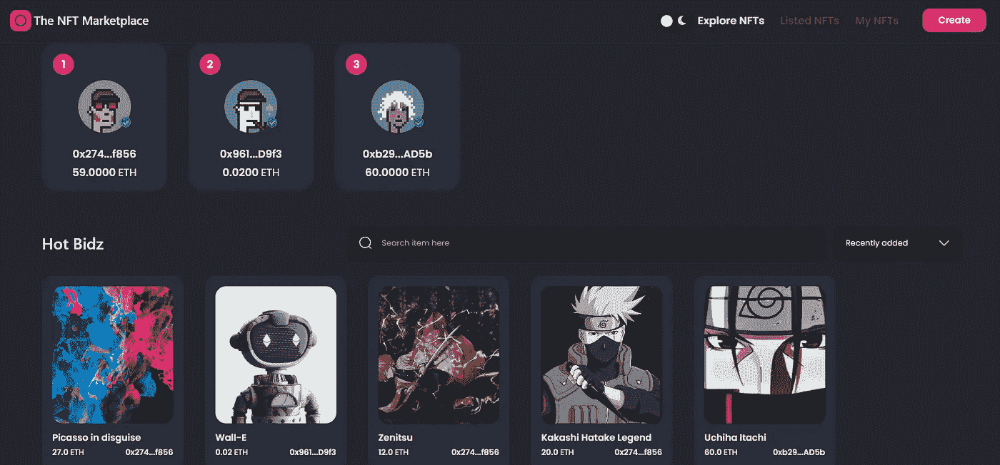

> **Web 3.0** 有潜力永远改变我们所知的互联网*。
> —阿德里安(精通 JavaScript】*

在这篇博客中，我将解释可靠性以及如何用 200 行代码创建一个 NFT 市场。

然而，这是一份聪明的合同。**智能合约可以定义为一个实体，它可以发送和接收货币( *crypto* )，而不仅仅是网络上的用户。这是一段管理你的钱以及你如何引导它执行特定功能的代码——因此，是区块链上的程序！**

**这些程序一旦部署就不能修改，并且是最终版本。我们不要深入讨论智能合约的许多有益方面，因为有许多方面，而且时间是相对的。**

# **从应用程序的演示开始—**

1.  **连接我们的`metamask` 钱包(*即使你没有 metamask 帐户或对此一无所知，你也可以继续阅读此博客:|* ，*只要假设它是一个在线钱包***

**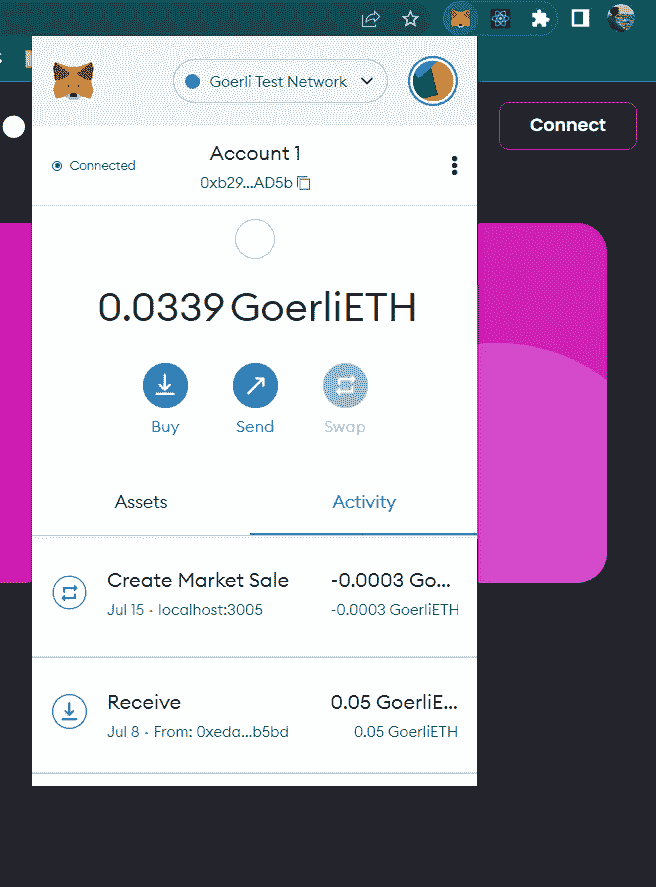**

**与 metamask 钱包连接**

**2.创建一个 NFT**

**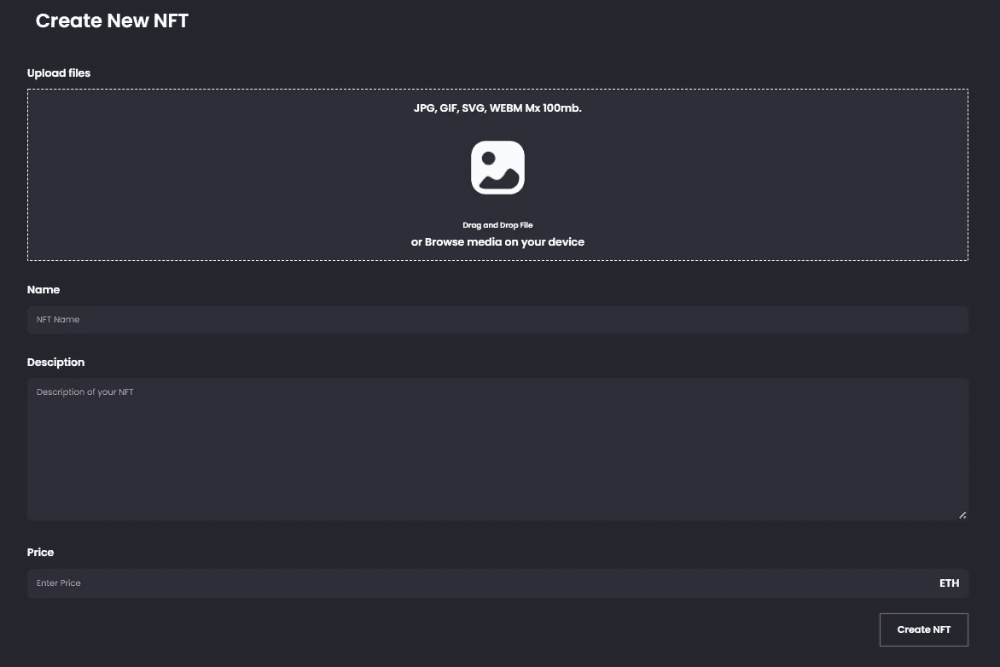**

**创建一个 NFT 页面(缩放 50%，以适应此处)**

**上传您的图像并填写详细信息。**

**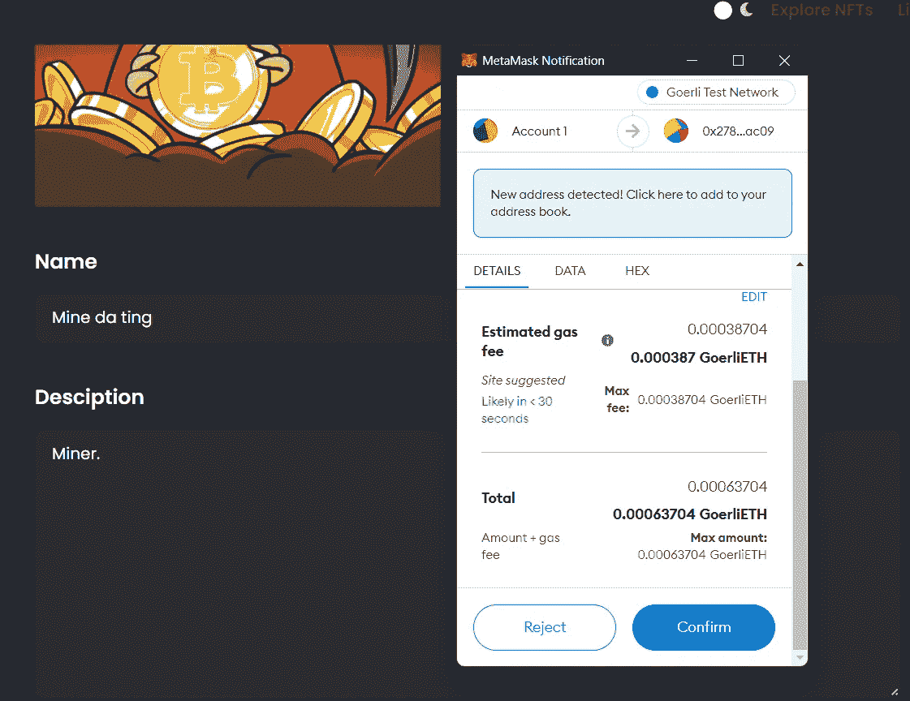**

**metamask 确认将 NFT 上市。**

**你将向市场的所有者发送 0.00025 以太作为刊登费。上图是对交易的批准，*把它想象成输入您的 PIN 码或在线交易的 OTP。***

**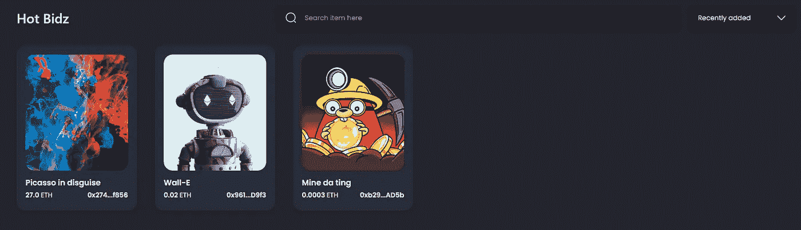**

**你的图像现在在市场上，瞧！**

**3.我们买下你列出的那辆 NFT 吧。现在，我们将改变我们的 metamask 帐户，因为让我们现实一点，我们不能购买自己的 NFT。**

**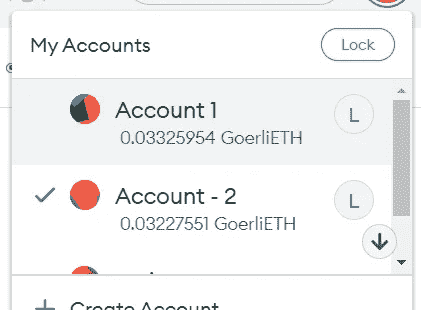**

**切换元掩码上的帐户。**

**4.买下 NFT。**

**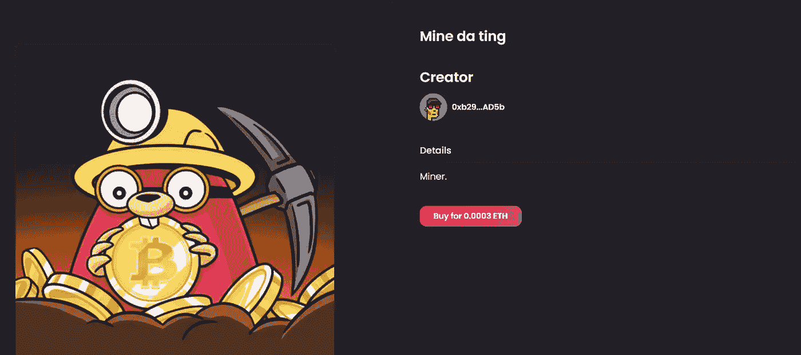**

**NFT 详情页面。**

**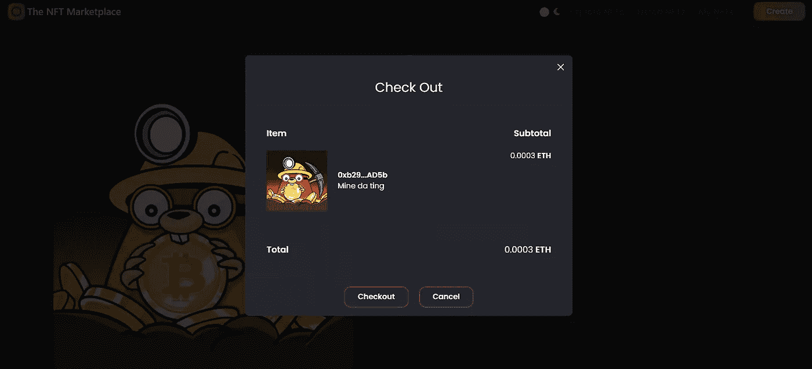**

**结账确认**

**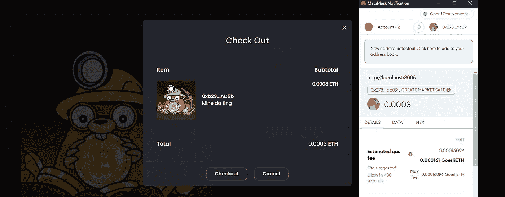**

**购买 NFT 的确认。**

**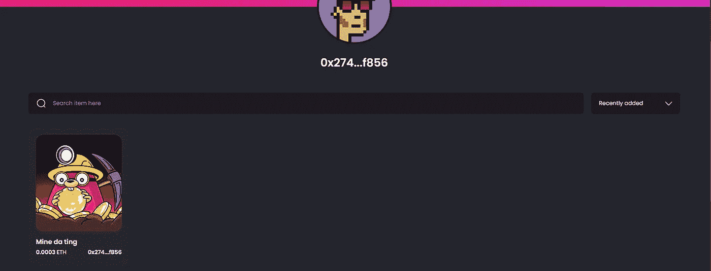**

**现在，您可以在 NFT 详细信息页面查看您是否已经购买了 NFT。**

**既然演示已经结束，我们可以从 solidity 代码开始了。**

# ****坚固性代码****

**对于初学者来说，如果你懂 JavaScript，那么你会很容易理解 solidity 的代码。以太坊的智能合约是用 solidity 编程的，solidity 是一种面向对象的高级语言。**

**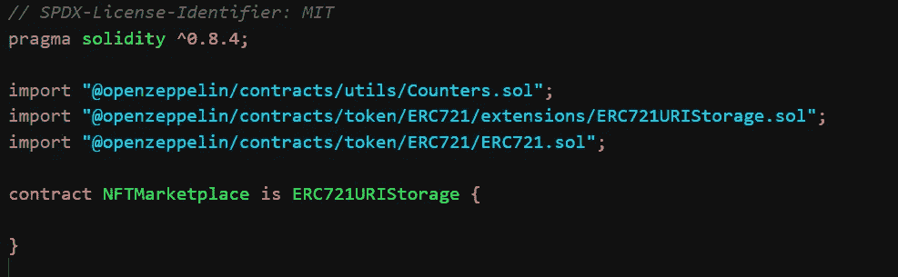**

**开始代码。**

**让我们一行一行地检查这段代码:**

**第 2 行——在写合同之前，必须提到可靠性版本。这里我们将使用版本 0.8.4。**

**第 4、5、6 行——就像任何其他语言一样，这里我们导入了其他契约，我们用它们来构建我们的代码，把它们想象成库。
`Counters.sol`:保持一个——(将进一步讨论)的计数器。
`ERC721.sol`:非功能性翻译相关合同的写作标准。
`ERC721URIStorage.sol`:为了继承`_tokenURI`，应该解析成一个 JSON 文档**

*****第 8 行*** —定义继承`ERC721URIStorage`(另一个合同)的合同`NFTMarketplace` ，我们不继承 ERC721.sol，因为`ERC721URIStorage`已经继承了。这些合同是由。**

**`using Counters for Counters.Counter;`**

**初始化我们继承的计数器。**

```
Counters.Counter private _tokenIds; 
Counters.Counter private _itemsSold;
```

**这里，契约记录了两个变量 tokenIds 和 itemsSold。每当我们调用`_tokenIds.increment();`时，`_tokenIds`的值将从 1 → 2 递增，对于`_itemsSold`也是如此。**

```
uint256 listingPrice = 0.00025 ether;
```

**指定上市价格，每当有人想创建自己的 NFT，并在市场上列出，他们支付上市费即。0.00025 ETH。这里的`uint256` 是一种数据类型。u →无符号，int →基数为 256 的整数。**

```
address payable owner;
```

**称为所有者的地址类型变量(只接受地址)。这里定义为`payable`，表示该地址可以参与交易。**

```
constructor() ERC721(“Metaverse Tokens”, “METT”) {
   owner = payable(*msg.sender*);
}
```

**每当调用我们的契约时，都会调用一个构造函数。在我们的例子中，我们需要调用两个构造函数——我们的契约和 ERC721.sol 契约，因为我们从它继承了。**

**在这个构造函数中，我们告诉契约，所有者是调用契约的人，但是在区块链中，我们通过地址来传递，从而得到发送者的地址，`msg.sender` 是一个内置参数，接受调用/调用契约的帐户的地址。**

**长话短说，我们通过定义 owner 变量来通知契约我们(`*msg.sender*`)是所有者！当我们部署我们的契约时，它接收我们的地址，所以只有我们拥有所有权。咳……**

**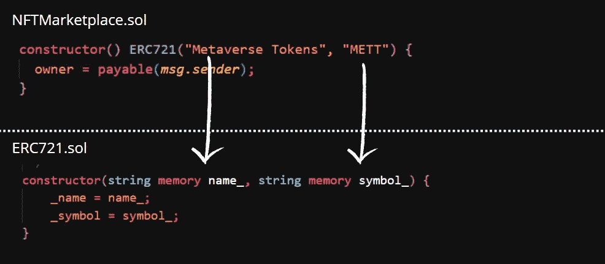**

**在调用 ERC721 的构造函数时，我们需要调用它，因为它想被 ie 调用。它需要的参数。**

```
struct MarketItem {
   uint256 tokenId;
   address payable seller;
   address payable owner;
   uint256 price;
   bool sold;
}
```

**创建结构市场项以存储各种类型的数据。**

*   **`tokenID` →参与销售的代币 Id**
*   **`seller` →存储卖家地址**
*   **`owner` →存储所有者的地址(如果创建了一个 NFT，最初它属于市场，即合同地址)**
*   **`price` →NFT 的价格**
*   **`sold` →布尔值(真/假)表示 NFT 是否售出。**

```
mapping(uint256 => MarketItem) private idToMarketItem;
```

**`mapping` —实性的另一种数据类型。它存储一个键(一种数据类型)及其对应的值(也是一种数据类型)，因此是键-值对。**

```
mapping ( <data-type> => <data-type/structure>/ ) visibility name;
```

**在这种情况下，我们将一个`uint256` 数据类型映射到这里的`struct MarketItem.`，可见性是私有的，这意味着它只能从契约内部调用，而不能从外部调用。**

```
function updateListingPrice(uint _listingPrice) public payable {
     require(owner == *msg.sender*);
     listingPrice = _listingPrice;
}function getListingPrice() public view returns (uint256) {
     return listingPrice;
}
```

**好吧，让我们加快速度。**

*   **`updateListingPrice()` —接受一个 uint → `_listingPrice`作为参数，并更新当前的列表价格。
    `getListingPrice()` —返回合约当前挂牌价的返回函数。**

**在这里，require 是一个在其下的代码运行之前运行的条件。所以理论上，如果除了所有者之外的其他人调用上述函数，它就不会运行。**

**正在绕道…**

**你一定想知道什么是私有的，公共的，等等。是。**

*   **public、private、internal、external →这些只是给予每个函数/变量的可见性类型，告诉契约谁可以调用这些函数/变量以及从哪里调用。**
*   **`public` →谁都可以叫。**
*   **`private` →只能在合同内调用，不能由合同外的任何人调用。**
*   **`external` →可以由继承具有外部可见性的函数的契约调用。**
*   **`internal (default )`→只能在声明它们的合同中访问，也可以从派生合同中访问。**

**继续讨论合同…**

```
function createToken(string memory tokenURI, uint256 price) public                                                                                                                                       payable returns (uint) { _tokenIds.**increment**();
   uint256 newTokenId = _tokenIds.**current**();
   **_mint**(*msg.sender*, newTokenId);
   **_setTokenURI**(newTokenId, tokenURI);
   **createMarketItem**(newTokenId, price);
   return newTokenId;}
```

**如何在 JavaScript 中调用该函数:**

```
**createToken**(url, price, { value: listingPrice.toString() })
```

*   **`_tokenIds.increment()` —将合同中`_tokenIds`的值增加 1。**
*   **`**uint256 newTokenId = _tokenIds.current()**` —将合同中`_tokenIds`的当前值存储到变量`newTokenId`中。**
*   **`**_mint(msg.sender, newTokenId)**` **—** 这个`_mint()`函数继承自 ERC721.sol 契约。这是用来铸造一个新的合同和区块链令牌。**

**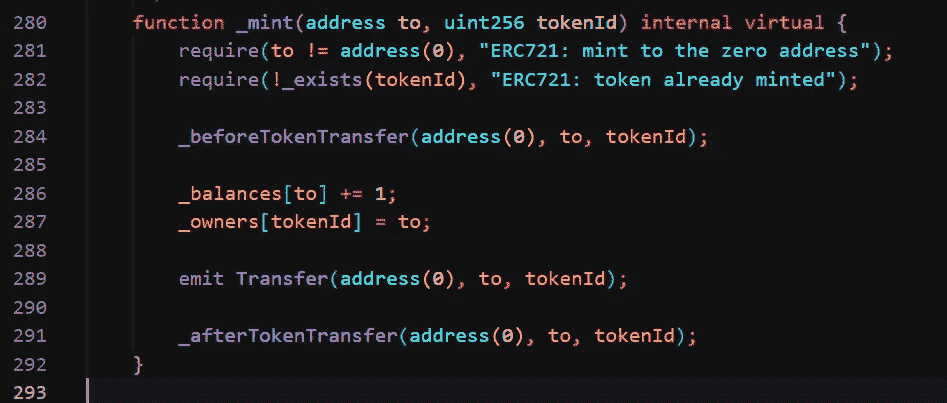**

**ERC721.sol 中的 _mint 函数**

**`**_setTokenURI**(newTokenId, tokenURI)` —这个`_setTokenURI()`函数也继承自 ERC721URIStorage.sol 契约。这用于设置令牌 URI，并检查令牌是否已经存在。**

**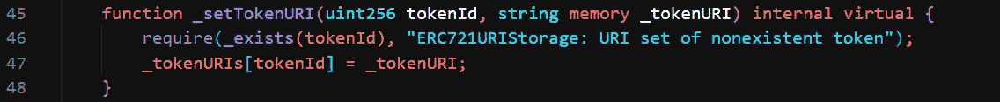**

**ERC721URIStorage.sol 合同中的 _setTokenURI 函数**

**`createMarketItem(newTokenId, price)` —这是合同内的功能，接下来会解释。
`return newTokenId` —返回新的令牌 ID。**

**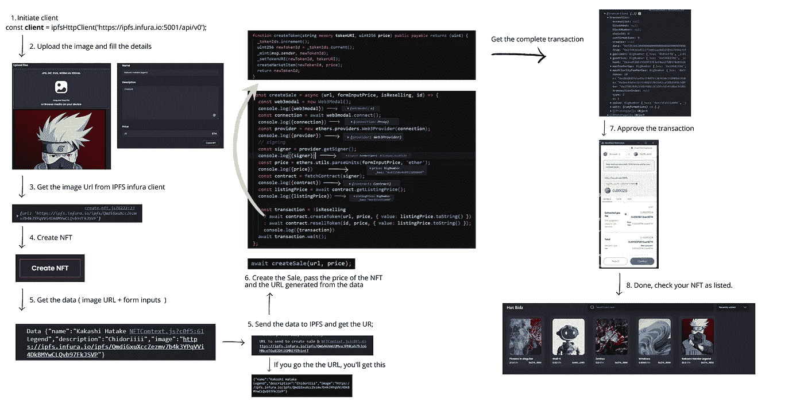**

**概述 NFT 是如何铸造的。**

**最后，该函数将 0.00025 ETH(挂牌费)作为挂牌价格转移到合同中。**

**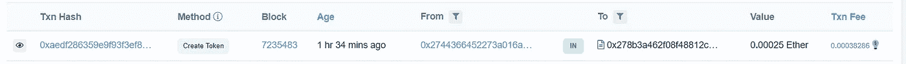**

**截图自 goerli.etherscan.io**

```
function createMarketItem(uint256 tokenId, uint256 price) private {**require**(price > 0, “Price must be at least 1 wei”);**require**(*msg*.value == listingPrice);**idToMarketItem**[**tokenId**] = **MarketItem**(tokenId,payable(*msg.sender*),payable(address(*this*)),price,false);_transfer(*msg.sender*, address(*this*), tokenId);**emit**  MarketItemCreated( tokenId , *msg.sender*, address(*this*),price,false);}
```

**上面的函数由`createToken` 函数调用，一旦一个令牌被创建，它需要在市场上，为此我们调用这个函数。注意我们在这里是如何提到可见性是私有的，这告诉契约它只能从契约内部被调用**

**前两行检查要在市场上列出的令牌的价格是否应该大于 0，以及随函数一起发送的金额是否应该正好等于列出费用。0.00025 乙醚。**

**下一行`**idToMarketItem**[**tokenId**] = **MarketItem** (tokenId, payable(*msg.sender*) ,payable(address(*this*)),price,false)`，如上所述，idToMarketItem 是一个映射，它将结构 MarketItem 映射到一个特定的键，这里是`tokenId`。所以对于一个特定的令牌 ID，我们有它所指向的结构。我们可以像上面提到的那样传递结构体的参数。**

**`payable(msg.sender)` —调用合同的钱包地址。
`payable(address(this))` —合同地址。
`price` —NFT 的价格。
`false` —指布尔`sold`。**

**`_transfer(*msg.sender*, address(*this*), tokenId);` —这也是一个从 ERC721.sol 契约继承的函数。它用来表示代币从一个地址转移到另一个地址。在这种情况下，这是从`msg.sender` → `address(this)`的转移。**

**`emit MarketItemCreated(tokenId,*msg.sender*,address(*this*),price,false);` —这发出一个事件。事件就像契约中的日志，通知是否发生了什么事情。为此，我们需要在代码中定义事件`MarketItemCreated`。**

```
event MarketItemCreated (
     uint256 indexed tokenId,
     address seller,
     address owner,
     uint256 price,
     bool sold
);
```

**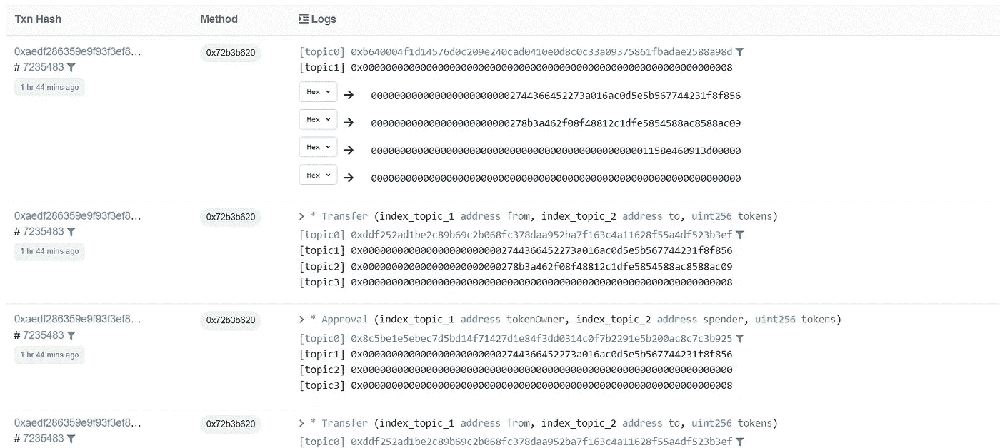**

**在 goerli.etherscan.io 上创建的事件 MarketItemCreated 日志**

```
function **resellToken**(uint256 tokenId, uint256 price) public payable {
     require(idToMarketItem[tokenId].owner == *msg.sender*);
     require(*msg*.value == listingPrice);
     idToMarketItem[tokenId].sold = false;
     idToMarketItem[tokenId].price = price;
     idToMarketItem[tokenId].seller = payable(*msg.sender*);
     idToMarketItem[tokenId].owner = payable(address(*this*));
      _itemsSold.decrement();
      _transfer(*msg.sender*, address(*this*), tokenId);
}
```

**几乎类似于`createToken`函数，这个函数已经有了指定数据的 IPFS URL。所以在我们的代码中，我们只是将所有者从我们的地址更改为契约的地址。除此之外，我们还提到了 NTF 的新价格，同时将出售的`bool` 改为`false`。**

**最后，我们将变量`_itemsSold`减 1，最后，我们从我们继承的`ERC721.sol`契约中调用`_transfer` 函数来转移所有权。**

```
function createMarketSale(uint256 tokenId) public payable { uint price = idToMarketItem[tokenId].price;
   address payable creator = idToMarketItem[tokenId].seller;
   require(*msg*.value == price);
   idToMarketItem[tokenId].owner = payable(*msg.sender*);
   idToMarketItem[tokenId].sold = true;
   idToMarketItem[tokenId].seller = payable(address(0));
   _itemsSold.increment();
   _transfer(address(*this*), *msg.sender*, tokenId);
   payable(owner).transfer(listingPrice);
   payable(creator).transfer(*msg*.value);}
```

**这个函数处理从一个地址到另一个地址的资金转移。这就产生了市场销售——当有人购买 NFT 时就会发生这种情况。
`.transfer()` —内置传输密码的功能。**

```
function fetchMarketItems() public view returns (MarketItem[] memory) {uint itemCount = _tokenIds.current();
uint unsoldItemCount = _tokenIds.current() - _itemsSold.current();
uint currentIndex = 0;
MarketItem[] memory items = new MarketItem[](unsoldItemCount);
for (uint i = 0; i < itemCount; i++) 
    {
      if (idToMarketItem[i + 1].owner == address(*this*)) 
       {
         uint currentId = i + 1;
         MarketItem storage currentItem = idToMarketItem[currentId];
         items[currentIndex] = currentItem;
          currentIndex += 1;
       }
    }
return items;}
```

**在这个返回函数中，我们获取合同当前拥有的 NFT— `idToMarketItem[i + 1].owner == address(*this*)`。**

**为此，我们首先创建一个名为`items`的临时数组`MarketItem` ，并给它一个固定的大小`unsoldItemCount`，这是通过用合同中当前售出的商品数量`_itemsSold.current()`减去当前索引`_tokenIds`得到的。**

**然后，我们遍历该数组，并应用条件来检查 NFT 的所有者是否是合同，如果是，则将 NFT 的详细信息推送到创建的临时数组中(`items`)。最后返回数组`items`。**

**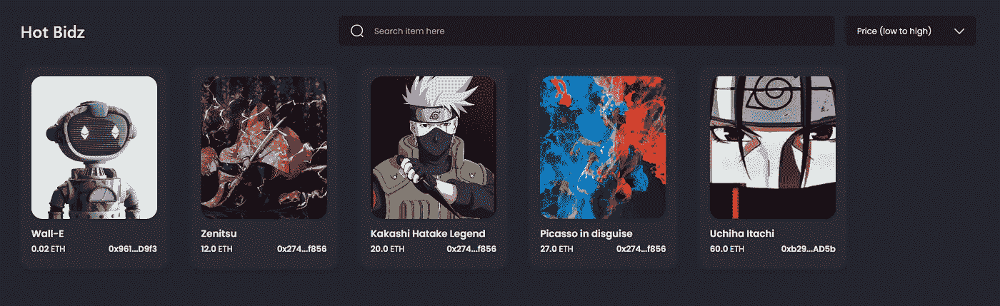**

**市场项目**

```
function fetchMyNFTs() public view returns (MarketItem[] memory) {uint totalItemCount = _tokenIds.current();
uint itemCount = 0;
uint currentIndex = 0;
for (uint i = 0; i < totalItemCount; i++) {
    *// check if nft is mine* if (idToMarketItem[i + 1].owner == *msg.sender*) 
    {
     itemCount += 1;
    }
  }MarketItem[] memory items = new MarketItem[](itemCount);for (uint i = 0; i < totalItemCount; i++) {
     if (idToMarketItem[i + 1].owner == *msg.sender*) 
     {
      uint currentId = i + 1;
      MarketItem storage currentItem = idToMarketItem[currentId];
      items[currentIndex] = currentItem;
      currentIndex += 1;
      }
    }
return items;
}
```

**类似于上面的函数，这里我们增加一个额外的步骤，即。为了找到我们拥有的 NFT 的数量我们遍历所有 NFT 的列表。**

**这样做是为了提供临时数组`items`，其大小为`itemCount`。**

**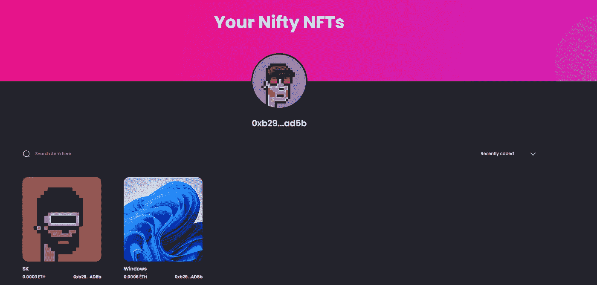**

**我的 NFTs**

```
function fetchItemsListed() public view returns (MarketItem[] memory) {uint totalItemCount = _tokenIds.current();
uint itemCount = 0;
uint currentIndex = 0;for (uint i = 0; i < totalItemCount; i++) {
    if (idToMarketItem[i + 1].seller == *msg.sender*) {
      itemCount += 1;
    }
  }MarketItem[] memory items = new MarketItem[](itemCount);for (uint i = 0; i < totalItemCount; i++) {
    if (idToMarketItem[i + 1].seller == *msg.sender*) {
      uint currentId = i + 1;
      MarketItem storage currentItem = idToMarketItem[currentId];
      items[currentIndex] = currentItem;
      currentIndex += 1;
     }
   }
return items;}
```

**这里也类似于上面的函数，我们得到我们正在销售的 NFT 的列表，`idToMarketItem[i + 1].seller == *msg.sender*` *。***

**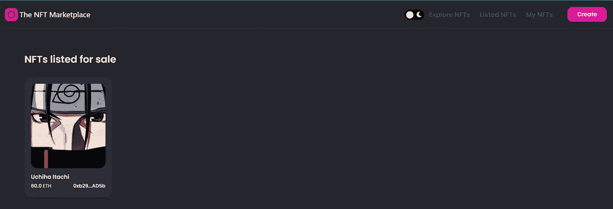**

**列出的非功能性测试。**

**这是完整的可靠性代码。**

```
[https://gist.github.com/Khanisic/ac54144abd4eea043ff31953a98ab29f](https://gist.github.com/Khanisic/ac54144abd4eea043ff31953a98ab29f)
```

# **链接**

*   **[Github](https://github.com/Khanisic/nft_marketplace)**
*   **[Vercel 部署的链接](https://nft-marketplace-khanisic.vercel.app/)**

```
Special thanks to Adrian from [Javascript Mastery](https://www.youtube.com/c/JavaScriptMastery) who taught me this project in his [course](https://javascript-mastery.teachable.com/p/nft-marketplace) NFT Marketplace.
```