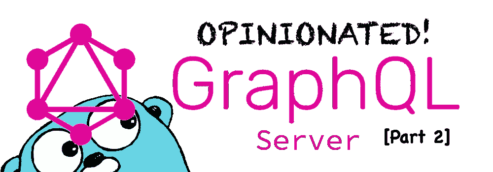

# 创建自以为是的 Go GQL 服务器—第 2 部分

> 原文：<https://betterprogramming.pub/creating-an-opinionated-go-gql-server-part-2-f049e4a9afe1>

在这一部分中，我们将把 [gqlgen](https://gqlgen.com/getting-started/) 生成的服务器添加到我们的项目中，并开始`gql`运行！而且，我们将会比第一部中的动作快得多。

 [## 创建自以为是的 Go GQL 服务器—第 1 部分

### 项目设置和初始步骤

medium.com](https://medium.com/better-programming/creating-an-opinionated-gql-server-part1-8fad071e525f) 

# 将 gqlgen 添加到项目中

现在，我们可以使用 gqlgen 来初始化我们的服务器的 gqlgen 生成的文件:`go run github.com/99designs/gqlgen init`

这将初始化 gqlgen 服务器。然而，我们必须进行修改以适应我们的项目布局。移动几个文件并编辑`gqlgen.yml`文件。

*   `generated.go`(保存 gqlgen 生成的 [GraphQL](https://graphql.org/) 服务器代码的文件。)
*   `resolver.go`(保存查询和变异的解析器。)
*   `schema.graphql`(gqlgen 生成的示例模式，我们将对其进行修改。)
*   `server/server.go`(我们将转储存根服务器，但我们将使用处理程序。)
*   `models_gen.go`(生成的模型文件，以`schema.graphql`为基础)。)

现在，我们将要做一些可能违背直觉的事情。

让我们删除所有这些新文件，除了`gqlgen.yml`。相信我，我们会把它们找回来，放在它们该在的地方。

有关 gqlgen 配置的更多信息，请阅读文档。

接下来，我们需要做的是修改`gqlgen.yml`文件，就像这样:

所以，我想自动生成 gqlgen 文件。

让我们创建一个脚本，命名为:

为什么我还要删除解析程序文件？

当然是为了让它重生。如果我们要改变模式，很可能我们也要更新解析器。

当项目很小的时候，最好把它们都放在一个文件中，但是我们要把解析器放在它们自己的文件中，并且把这个文件`internal/gql/resolvers/generated.go`作为 gqlgen 代之间的临时文件。这有点乏味，但以后会有回报的。

好了，现在我们需要定义一个 gql 模式文件，这样我们就可以使用我们的脚本在正确的位置重新生成 gqlgen 文件。

`$ mkdir -p internal/gql/schemas`

然后，您可以编辑一个`schema.graphql`文件`$ vi internal/gql/schemas/schema.graphql`，并在上面粘贴以下内容:

不要担心 gql 的细节，我们将在下一部分使用 [OpenID](https://openid.net/) 规范对这个模式进行更多的改进。

现在，让我们抓住`internal/gql/resolvers/generated.go`，稍微编辑一下，返回一个被嘲笑的用户:

让我们将 GraphQL 服务器中间件绑定到我们的服务器。

在`internal/handlers/gql.go`中创建一个文件，并将其粘贴到:

现在，我们可以这样修改`pkg/server/main.go`:

因此，通过新的修改，我们设置了新的`ENV`变量:

这些决定了我们的服务器将在哪里监听 GraphQL 处理程序，并为我们已经定义的查询和变化提供服务。

现在尝试运行该程序:

我们现在可以看到 GraphQL 请求被重定向到它们的处理程序！

让我们导航到 [http://localhost:7777](http://localhost:7777) 。

我们已经有了一个正常运行的 GQL 服务器，让我们试着查询一下。

我们现在可以看到，一切都在按预期运行。

现在让我们继续做更好的事情，重构代码，使其更加有序。

# 重构代码

正如我之前提到的，我有一个为 gqlgen 组织代码的有效方法。

这将有助于将代码组织成小文件:

*   `{entity_plural}.go`用我们的`gqlgen.sh`脚本生成的解析必须为每个`entity`(用户、帖子、评论，等等)单独复制。
*   这个很有趣。一旦我们将 [GORM](https://gorm.io/) 添加到我们的项目中，并且有了数据库结构，我们将不得不*将这些 GQL 输入类型*转换成要存储在`db`中的数据库表示。反之亦然，例如从`db`到`GQL`返回查询。
*   然后，我将从`internal/gql/resolvers/generated/generated.go`生成的内容移动到`internal/gql/resolvers/main.go`，并从我们可能有的实体方法中对其进行修剪。我是这样离开的:

从现在开始，这个文件将不再有任何生成的更改，我们将更改一些东西，是的，但是那将在第 3 部分中完成:

 [## 创建自以为是的 Go GQL 服务器—第 3 部分

### 这是一个系列的一部分，不适合初学者，但您可以从一开始就检查它:

medium.com](https://medium.com/@cmelgarejo.dev/creating-an-opinionated-go-gql-server-part-3-ca9f71980131) 

我还没有找到一种不用递归导入就能把文件夹结构组织成文件夹的方法，所以前缀将有助于组织`resolvers`文件夹中实体的文件名。

我的 TOC 迫使我这样做。

如果你有更好的安排方式，请告诉我。

# 密码

所有的代码都可以在[库](https://github.com/cmelgarejo/go-gql-server/tree/tutorial/part-2)中找到。

 [## cmelgarejo/go-gql-server

### 用 Go 制作的自以为是的 GraphQL 服务器。创建一个帐户，为 cmelgarejo/go-gql-server 的开发做出贡献…

github.com](https://github.com/cmelgarejo/go-gql-server/tree/tutorial/part-2)