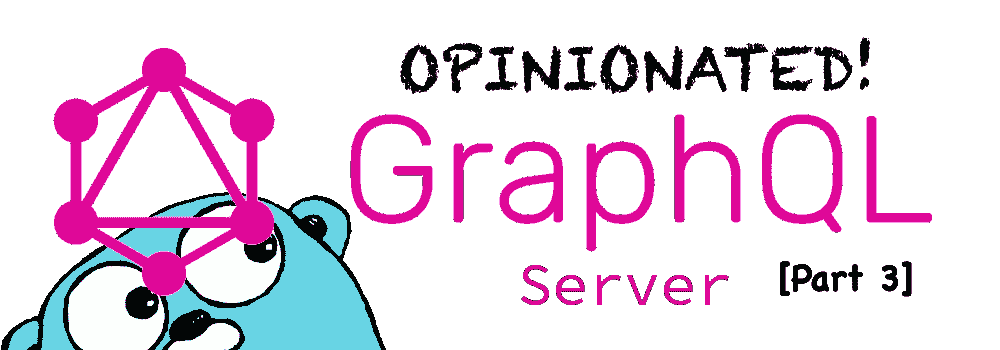
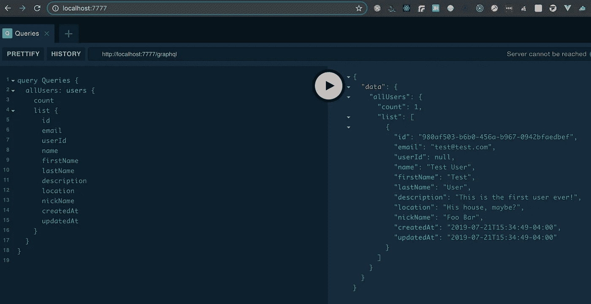
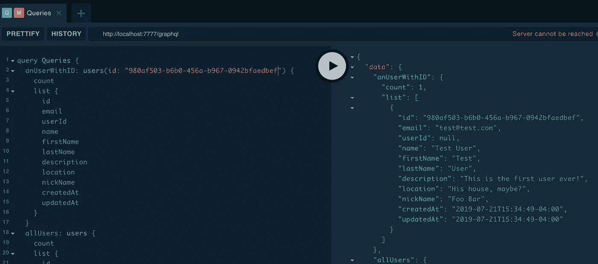
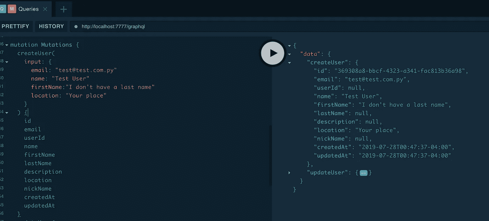
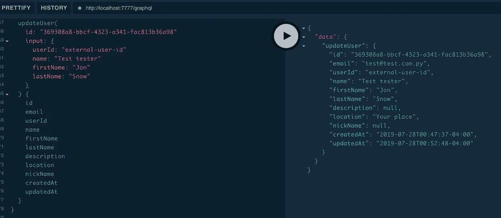
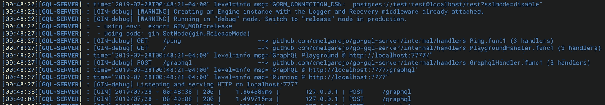

# 创建自以为是的 Go GQL 服务器—第 3 部分

> 原文：<https://betterprogramming.pub/creating-an-opinionated-go-gql-server-part-3-ca9f71980131>

这件作品是一个系列的一部分。它不适合初学者，但你可以从第一部分[开始查看](https://medium.com/better-programming/creating-an-opinionated-gql-server-part1-8fad071e525f)

 [## 创建自以为是的 Go GQL 服务器—第 1 部分

### 项目设置和初始步骤

medium.com](https://medium.com/better-programming/creating-an-opinionated-gql-server-part1-8fad071e525f) 

可以复习一下怎么上到这一部分。

和往常一样，代码在 [GitHub](https://github.com/cmelgarejo/go-gql-server/tree/tutorial/part-3) 中。

今天我们将为我们的项目添加一个 GORM 和一个数据库。我选择的 RDBMS 是 [PostgreSQL](https://www.postgresql.org) 。你可以使用 [MySQL](https://www.mysql.com/) ， [SQLite](https://www.sqlite.org/) ，只要 GORM 支持，你喜欢哪个就用哪个。

如果你错过了，你也可以看看第二部。在这篇文章中，我会以更快的速度继续，查看代码中的注释以获取更多信息。

# 将 GORM 添加到项目

让我们将 GORM 添加到我们的项目中:

`$ go get -u github.com/jinzhu/gorm`

我们需要移民；让我们加上 [Gormigrate](https://gopkg.in/gormigrate.v1) :

`$ go get gopkg.in/gormigrate.v1`

我不希望 id 像`int`的那样容易被发现。现在，任何人都可以在`deleteUser(userId: 1)`上发送一个突变，这应该会增加另一层复杂性，以减少我们愚蠢的 API 的攻击面。

添加来自`gofrs`的 UUID 套餐:

`$ go get github.com/gofrs/uuid`

并且，我们将设置`db`模型来使用 UUIDs 作为主键。

# 潜入戈尔姆

现在，让我们在我们的项目中设置`GORM`，使用下面的指令。

首先，让我们为所有东西创建一个入口点`db`，在这里我们可以初始化和设置数据库连接。

我们把这个代码放在`internal/orm/main.go`吧。

你可能已经注意到了`internal/logger`日志包——我们将在奖金部分深入探讨。现在，你甚至可以使用`import "log"`包。

# 移民

在`migration.ServiceAutoMigration`中调用的迁移服务，我们将在`internal/ocm/migration/main.go`中保存:

首先，我们看到几个更依赖于迁移的包:`internal/orm/migration/jobs`和`internal/orm/models`。

# 定义模型

让我们首先设置可以添加到`updateMigration`功能中的模型，从而定义`user.go`。

但是第一，我对我所有的车型都有一个特殊的要求；我希望它们中的一些可以被软删除(而不是从表中删除),而一些则被彻底销毁。当我们使用 GORM 时，我们可以通过使用`gorm.Model` struct 来创建 struct，或者定义我们自己的 struct，我们将这样做。

还有一件事。`gorm.Model`也使用自动递增的数字 id，但是我喜欢把事情复杂化，所以我想使用 UUIDs 作为主键。

让我们用基础模型的两个版本创建一个`internal/orm/models/base.go`模型文件:一个带有`hard`delete；另一个带有`soft` delete:

现在，有了这些基本模型，我们可以为我们的服务器定义我们需要的任何其他模型，所以这里是`internal/orm/models/user.go`:

由于我们将通过`[Goth](https://godoc.org/github.com/markbates/goth)`使用外部服务进行身份验证，并将其用于身份验证流，所以现在我们没有密码列。

好了，我们现在需要用至少一个用户来播种这个表。我们将使用[or migrate](https://gopkg.in/gormigrate.v1)pkg 并准备一个迁移作业文件。姑且称之:`internal/orm/migrations/jobs/seed_users.go`。

现在我们已经设置好了一切，我们可以修改我们的`cmd/gql-server/main.go`。

还有，`pkg/server/main.go`:

[GraphQL](https://graphql.org/) 处理程序也应该接收`ORM`实例，因此我们可以使用解析器`internal/handlers/gql.go`中的数据库连接:

此时，让我们修改`Resolver`结构的`internal/gql/resolvers/main.go`以使用`ORM`实例:

哦，对了！让我们修改我们的`internal/schemas.graphql`来反映数据库模型:

你可能已经注意到我是如何返回`users`查询的。

这是因为我们可能需要将记录的`count`返回到一个网格中，例如，我想在将来进行过滤和搜索，这就是`list`的用武之地

没有单用户查询，这是为什么呢？我要`KISS`一直(不是你，别那样看着我！)，这就是为什么我们将使用相同的查询来检索单个特定的记录，或者一组记录。

现在，让我们用一个选项来修改`scripts/gqlgen.sh`，在`internal/gql/resolvers/generated/resolver.go`重新生成解析器函数，这样您就可以将任何新的查询或变异解析器复制到它自己的文件中。

从`internal/gql/resolvers/generated/resolver.go`、有`"not implemented"`死机的`func`中取出需要的部分，并删除除`package resolvers`行之外的所有内容，否则，将会影响`func`定义。

因此，最后，我们可以为用户创建特定的解析器。一个包含所有`internal/gql/resolvers/users.go`的新文件:

你可能想知道`tf`包是什么。

还记得我在第 2 部分提到的`transformations`文件和文件夹吗？好了，这里是我们需要将 GQL 输入的*转换为数据库`user`结构的地方，以便轻松地将其保存在数据库中，并将其从数据库转换回解析器的 GQL 返回结构:*

回到`users.go`解析器，我已经将助手`func`从解析器中分离出来，以使它们尽可能的最小和最可读。

在下一个[部分(4](https://gist.github.com/cmelgarejo/PART4.md) )中，当我们需要为解析器插入认证和权限时，将解析器传递给助手函数比仅仅传递 ORM 更有意义。

嘿，现在我们可以从数据库中查询和变异我们的用户了！

数据库中的特定用户:

我们总是可以创造一个新的:

并更新它:

好的，正如承诺的那样，让我们通过添加几个包来增强我们的小项目。

# 奖金部分

## **记录器包**

包含的`import "log"`包对我们来说已经足够了，但是我找到了这个结构良好的包，名为 [logrus](http://github.com/sirupsen/logrus) ，并为它创建了一个包装器，以便在整个项目中使用，我创建了文件`internal/logger/main.go`:

现在，我们有了一个具有良好特性的可扩展日志包。

## 使用 Realize 在更改时添加服务器重装

如果你对每次修改都要重启服务器感到烦恼…我已经在 Node.js 中开发了一段时间，我真的很想念`[nodemon](https://www.npmjs.com/package/nodemon).`

谢天谢地，我们在 Go 中有更好的东西:

`$ go get github.com/tockins/realize`

在此之后，您将拥有`$GOPATH/bin/realize`中的`realize`可执行文件以供使用。创建一个`.realize.yml`文件，或者在项目的根目录下运行`$GOPATH/bin/realize init`，以交互方式创建它。

这是我的`.yml`文件:

这应该足以在我们接下来制作的脚本中运行它。将`scripts/run.sh`复制到`scripts/dev-run.sh`并修改如下:

另外，将`run.sh`改为:

好了，现在你可以用`.scripts/dev-run.sh`运行我们的项目，并在你每次修改 Go 文件时重新加载它！整洁，对不对？

同样，在本系列的最后一部分中，所有的代码都可以在[库中找到，这里是](https://github.com/cmelgarejo/go-gql-server/tree/tutorial/part-3)！如果您有问题、批评或意见，请提出来，让我们一起了解更多！

还有，现在延续到这里了！

 [## 创建自以为是的 Go GQL 服务器(第 4 部分)

### 在我们的项目中加入哥特元素

medium.com](https://medium.com/better-programming/creating-an-opinionated-go-gql-server-part-4-e9d9a7bb442a)