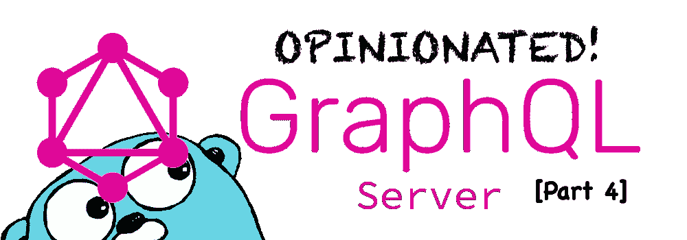
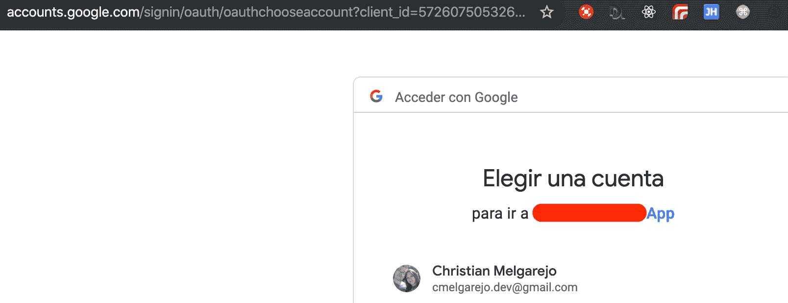
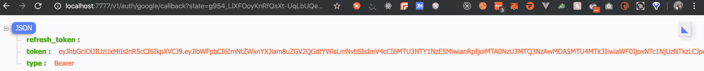
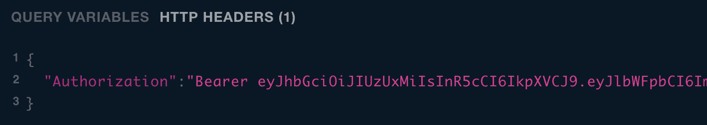
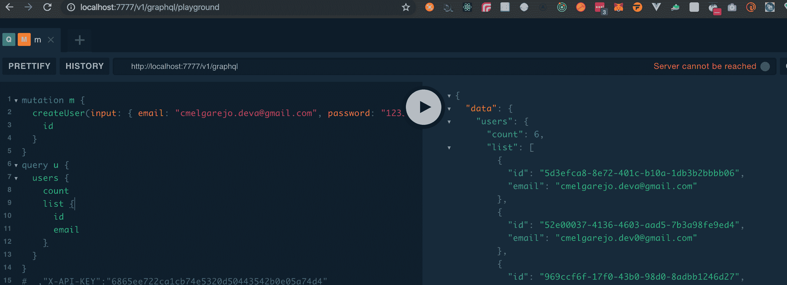

# 创建自以为是的 Go GQL 服务器(第 4 部分)

> 原文：<https://betterprogramming.pub/creating-an-opinionated-go-gql-server-part-4-e9d9a7bb442a>

## 在我们的项目中加入哥特元素

第四部！

这是一个系列的一部分。它不适合初学者，但他们也欢迎！你可以在这里查看其他部分:

*   [第一部分](https://medium.com/better-programming/creating-an-opinionated-gql-server-part1-8fad071e525f)
*   [第二部分](https://medium.com/better-programming/creating-an-opinionated-go-gql-server-part-2-f049e4a9afe1)
*   [第三部分](https://medium.com/better-programming/creating-an-opinionated-go-gql-server-part-3-ca9f71980131)

并复习如何到达这一部分。一如既往，第四部分的所有代码都在 GitHub。

今天，我们将添加 [Goth](https://github.com/markbates/goth) 和用户 [Auth0](https://auth0.com/docs/users) 作为我们的身份验证提供者，通过 Google 和/或脸书连接用户——或任何使用 OAuth2 的身份提供者。

# 添加哥特

让我们把哥特加入我们的项目:

`$ go get -u github.com/markbates/goth`

我们可以开始在我们的服务器代码中引用 Goth，有几个步骤可以将 Goth 完全集成到应用程序的流程中。

首先，我想保持配置尽可能的干净，从`cmd/go-gql-server`中的 go-gql-server 定义开始。为此，我在`pkg/utils/types.go`中创建一个配置类型:

这样，我们可以使用在服务器中实例化 Goth 所需的配置属性，我们还可以创建一种方式，在`utils/types.go`中以有序的方式键入所有配置:

您会注意到，现在，我们甚至可以在这里对端点进行版本化，所有这些都来自配置文件`.env`(repo 中也有`.env/example`文件)。

因此，我们可以在`serverconf`变量中添加一个提供者列表，以及所有不同的配置，并将服务器配置从`cmd/go-gql-server/main.go`传递到`pkg/server/main.go`:

现在，回到流程中，我们必须为我们的服务器创建处理程序来管理经过身份验证的路径。

为授权处理创建适当的中间件已经完成，让我们在服务器包中创建一个名为`auth` `pkg/server/routes/auth.go`的路由:

正如您可能已经注意到的，现在路由接收了`ServerConfig`结构，这样，我们可以使用`VersionedEndpoint`方法为我们的服务器构建版本化路径。

`/:provider`路径指的是你想要认证的提供者，现在配置好了，我只是添加了 Google 和 Auth0，但是由于 Goth 采用了很多提供者，你可以在`providers` *的 config 数组结构中随意添加自己的。*

现在，创建`internal/handlers/auth`中间件和处理程序来工作:`internal/handlers/auth/main.go`:

这里我们看到，我们将提供者处理程序添加到请求的当前上下文中，以便处理它下游的 auth。

怎么会？嗯，绑定认证中间件`internal/handlers/auth/middleware/main.go`:

你可能再次注意到，在这里，我们也想使用 API 密钥来验证请求，这些将在我们这边处理，为机器对机器的通信和与我们的 [GraphQL](https://graphql.org/) API 的集成生成足够安全的 API 密钥。

同样，这个中间件所做的就是试图获取由我们的提供者生成的 JWT 令牌，并试图根据我们的`users`记录进行认证。

这可能来自 cookie、标头或事件、querystring 参数，根据需要或由我们的客户实现。

实施这一切的实际授权中间件处理方法在`internal/handlers/auth/middleware/auth.go`中:

这里，对用户的真正搜索是在`FindUserByJWT`中搜索 JWT 令牌，在`FindUserByAPIKey`中搜索 API 密钥。如果发送，这些函数将驻留在`internal/orm/main.go`中。

还有一个`UpsertUserProfile`方法，它将概要文件保存到我们的数据库中，这样我们就可以在`user_profiles`检索它。

继续 auth 流，下面是通过 oAuth 提供者路由登录/注销的处理程序`internal/handlers/auth/handlers.go`:

这将允许我们转到`http://localhost:7777/v1/auth/:provider`，因为我们已经配置了`google`和`auth0`，我们将在 API 中创建一个用户！

现在，您必须在 [GCP](https://console.cloud.google.com/) 正确配置一个应用程序，然后按照`cmd/go-gql-server/main.go`中的指示填写提供商所需的数据，这将允许您使用该提供商。

导航到`http://localhost:7777/v1/auth/google`并进行测试:

很抱歉是西班牙语，但这是谷歌应用程序通常的 OAuth2 同意屏幕。

如果你完全正确，这将会发生:

然后，我们有一个用户注册/在已经做了所有的工作！

现在，在操场上使用代币`[http://localhost:7777/v1/graphql/playground](http://localhost:7777/v1/graphql/playground)`

并在我们的服务器上运行查询或变异。

有了这个，我们整合了所有！

*   `gqlgen`
*   `goth`
*   `gorm`

这个怎么样:下一步我们将建立一个 RBAC 层，这样我们可以确定哪些角色/用户可以访问我们的 API 中的信息。

当心那件事！同样，和前面的部分一样，所有的代码都可以在[库中找到，这里是](https://github.com/cmelgarejo/go-gql-server/tree/tutorial/part-4)！如果您有问题、批评或意见，请提出来，让我们一起了解更多！