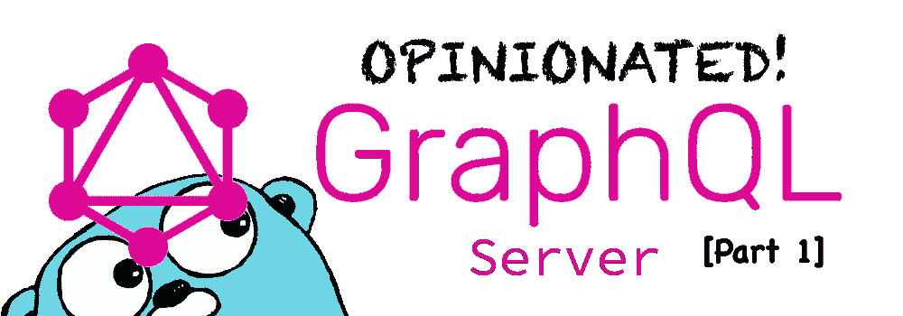

# 创建自以为是的 Go GQL 服务器—第 1 部分

> 原文：<https://betterprogramming.pub/creating-an-opinionated-gql-server-part1-8fad071e525f>

## 项目设置和初始步骤

让我们使用 [Gin-gonic](https://gin-gonic.com) web 框架、用于 OAuth2 连接的 [Goth](https://github.com/markbates/goth) 、作为 DB ORM 的 [GORM](http://gorm.io) 以及用于构建 GraphQL 服务器的 [GQLGen](https://gqlgen.com/) 来创建一个自以为是的 GraphQL 服务器。

这个项目假设你至少有基本的 Go 知识，安装了 Go 1.12+和 VSCode(首选)或类似的 IDE。

# 项目设置

我们将遵循该服务的 Go 标准项目布局。看一下说明书。它坚持己见，是一个很好的基础，尽管我们可能会偏离它的指导方针一点点。

首先在我们想要的任何地方创建一个目录:

让我们用以下内容创建整个项目布局:

`internal/gql-server`将保存 gql 服务器的所有相关文件。

`cmd/gql-server`将为服务器存放`main.go`文件，这是将所有文件粘合在一起的入口点。

因为我们使用的是 Go 1.12+，所以你可以使用`$GOPATH/src`路径之外的任何目录。我们想使用`go modules`来初始化我们的项目。我们必须跑:

# 编写我们的 web 服务器

现在我们可以开始向我们的项目添加包了！让我们从获取我们的 web 框架开始:`gin-gonic`

来自 gin-gonic.com:

> **什么是杜松子酒？Gin 是一个用 Golang 编写的 web 框架。它有一个类似 martini 的 API，性能更好，速度提高了 40 倍。如果你需要性能和良好的生产力，你会喜欢杜松子酒。**

让我们开始创建 web 服务器。

在`cmd/gql-server`中创建一个`main.go`文件:

并粘贴以下占位符代码:

如果你`go run cmd/gql-server/main.go`这个代码，它将调出一个 Gin 服务器监听 [locahost:7777](http://localhost:7777/ping) ，并在浏览器中打印出一个 *OK* 。有用！

现在，让我们使用已经存在的目录结构、`script`、`internal`和`pkg`文件夹来重构这段代码:

怎么样？一行代码就让我们的服务器用完了`pkg`文件夹。

现在我们可以用一个脚本来构建服务器:

跑步前，确保你:

现在我们可以开始构建我们的服务器，就像这样:

16M 的独立服务器，我认为还不错，这可能是其 docker 图像的大小！

好了，现在来试试已经建成的东西:

这是相当快的速度，39(微秒)秒。

我们可以进一步改进我们的服务器代码，让配置从一个`.env`文件加载。让我们为我们的服务器创建一些`utils`:

代码基本上是不言自明的。如果一个`ENV` var 不存在，程序会死机。我们需要这些来运行。现在，改变

-**pkg/server/main . go**to this:

我们看到它是如何作为一个精心设计的项目开始成形的！

我们仍然可以做一些事情，比如使用这个脚本在本地运行服务器:

这将设置`ENV`var 和`go run`服务器。

也可以添加一个`.gitignore`文件。运行`git init`，将原点设置到您自己的存储库中，然后`git push`它:)

这个项目将在第二部分中继续，我们将添加服务器的`GQLGen`部分！

 [## 创建自以为是的 Go GQL 服务器—第 2 部分

### 我们现在将 GQLGen 生成的服务器添加到我们的项目中，并开始 gqling 了！而且，我们将移动更多…

medium.com](https://medium.com/better-programming/creating-an-opinionated-go-gql-server-part-2-f049e4a9afe1) 

所有代码都可以在 [GitHub 资源库](https://github.com/cmelgarejo/go-gql-server/tree/tutorial/part-1)中获得。