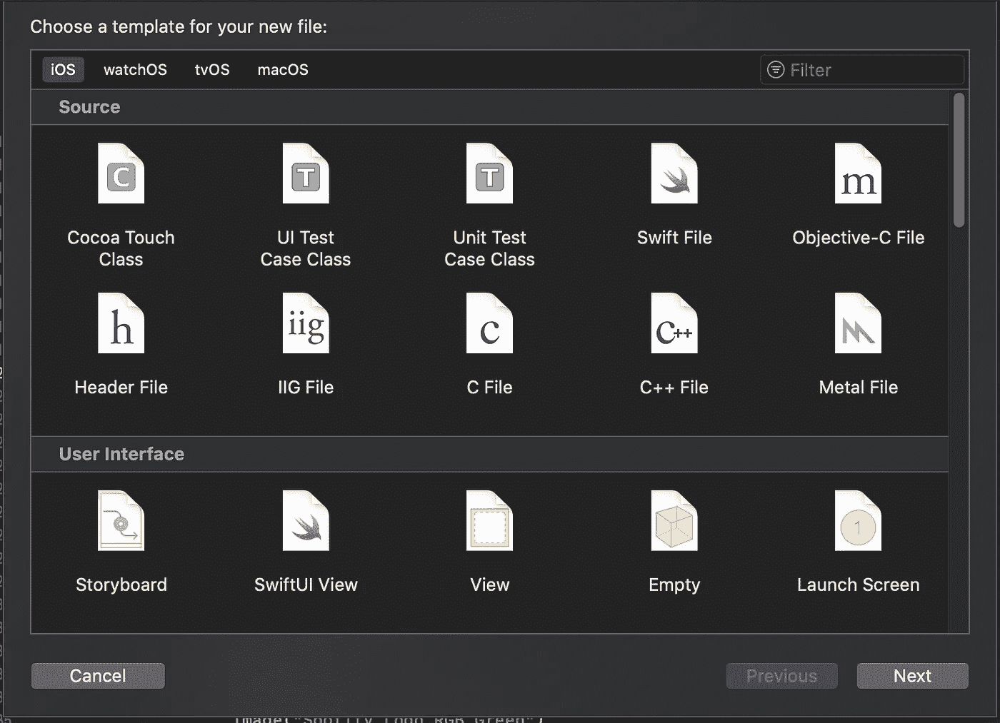
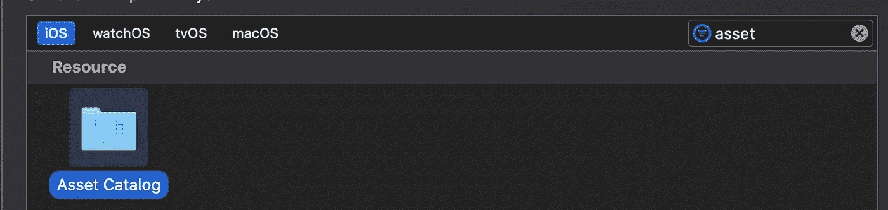
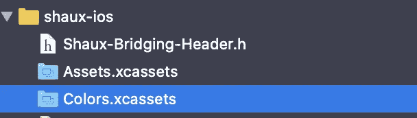
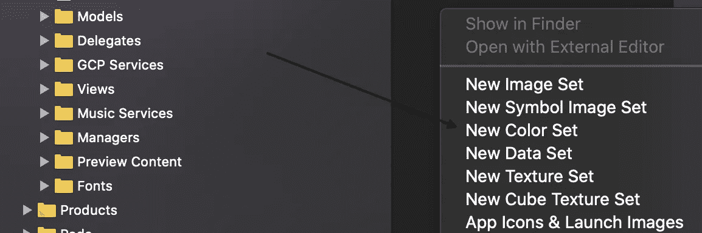
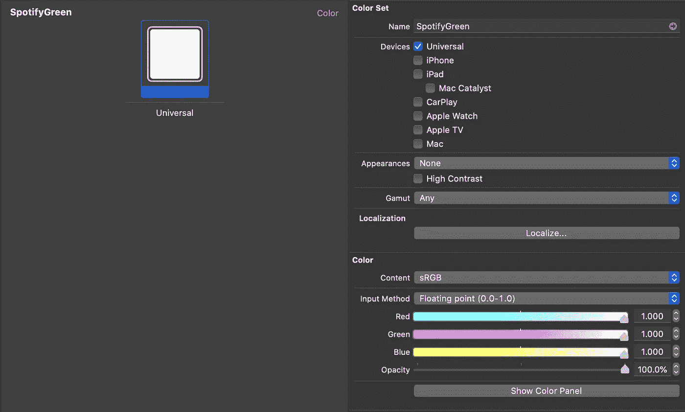
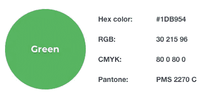
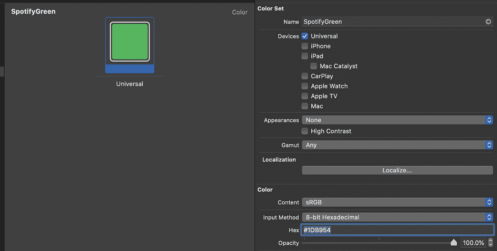

# 在 SwiftUI 中创建和管理颜色

> 原文：<https://betterprogramming.pub/creating-and-managing-colors-in-swiftui-4c3a85f557ff>

## 让 iOS 开发更美

由 [Pierre Bamin](https://unsplash.com/@bamin?utm_source=unsplash&utm_medium=referral&utm_content=creditCopyText) 在 [Unsplash](https://unsplash.com/s/photos/color-swatch?utm_source=unsplash&utm_medium=referral&utm_content=creditCopyText) 拍摄的照片。

你有没有见过华丽的 iOS 用户界面，并想知道他们是如何创建所有这些颜色并在应用程序中管理它们的？您是否需要添加设计规范提供给您的自定义颜色，但不知道从哪里开始？本文将教您如何在 SwiftUI 应用程序中创建自定义颜色并管理它们。

让我们从首先谈论如何创建自定义颜色开始！

# 创建自定义颜色

## **资产目录**

首先，我们打开 Xcode，做一些记账。我们总是希望确保志同道合的数据被分组在一个地方。我敢肯定，如果你上过大学或者上过任何 OOP 课程，你现在已经有了这样的想法，但是这个概念是一个基本的 SWE 实践。因此，为了加强自定义颜色的分组，我们将为它们创建一个资产目录。

如果这是您第一次使用资产目录，您需要知道它们包含将在应用程序中使用的某种形式的资产—无论是图像、数据、颜色、大小等。如果你想了解更多关于资产目录的信息，请查看[苹果的文档](https://developer.apple.com/library/archive/documentation/Xcode/Reference/xcode_ref-Asset_Catalog_Format/index.html#//apple_ref/doc/uid/TP40015170-CH18-SW1)。

好，让我们创建资产目录。为此，键入(⌘ + n) 告诉 Xcode 您想要创建一个新文件。这将调出如下所示的模式:

新文件弹出窗口。

然后在右上角的过滤栏中键入“资产”。这将给你留下一个看起来像蓝色目录的文件。下面应该是资产目录:

双击它，然后将文件命名为 Colors，以表明这是应用程序中颜色的资源目录。

一旦你这样做了，你应该在你的根文件夹下看到一个名为`Colors.xcassets`的文件:

厉害！现在，我们已经准备好将我们的自定义颜色添加到您的资产目录中！

## 自定义颜色集

令人欣慰的是，Xcode 使得开发人员可以非常容易地将自定义颜色集添加到他们的资源目录中。首先，我们想要通过双击文件来打开资产目录。接下来，我们需要创建一个新的颜色集。颜色集允许我们在应用程序中将名称与颜色关联起来。

例如，如果你有一个应用程序，你认为它可能会有不同的配色方案变化，你可以使用颜色集来命名这些颜色，比如`backgroundColor`、`foregroundColor`等等。然后，我们可以在应用程序中使用命名的颜色，当我们将来需要改变颜色时，只需在一个位置更新它们！很可爱，对吧？

好的，那么我如何开始使用颜色组呢？

为此，右键单击文件导航右侧的黑色条，然后选择新建颜色集:

创建新的颜色集。

该文件将被添加到您的资产目录中，默认名称为 Color *。*让我们继续把这个名字改成更具描述性的名字，这样你团队中的开发人员就会根据它的名字很好地理解这种颜色是什么。因为我正在开发一个使用 Spotify 的应用程序，所以我需要使用 Spotify 著名的黏糊糊的绿色。

就像我之前说的，根据颜色的位置或用法来命名颜色也是非常容易接受的，并且在项目中经常使用！因此，如果应用程序中的每个页眉都使用一种颜色，那么将颜色集命名为`headerColor`是有意义的。

描述性颜色集命名。

好了，现在自定义颜色的结构已经完成，我们也有了一个颜色集，让我们给应用程序添加一些独特性吧！

首先，点击大方块。这将在你的项目右边弹出属性检查器(如果没有弹出，点击 Xcode 右上角最右边的按钮)。现在，您的屏幕上应该会出现这样的内容:

SpotifyGreen 资产检查员。

我们可以看到 Xcode 为我们提供了一大堆在应用程序中创建自定义颜色的选项。首先，我们需要定义我们的颜色在什么颜色空间。现在我不是一个平面设计师，但我已经经历了足够多的麻烦，设计师的颜色在应用程序上看起来不一样，因为颜色空间没有正确定义。大多数情况下，它们将在 sRGB 设计，所以如果你自己创造颜色，我会让这个值保持原样。如果您有来自设计者的十六进制/RGB 值，请选择他们在内容下拉列表中定义的色彩空间。当你想知道为什么你的颜色看起来比给你的颜色样本暗/亮几个色度时，这将为你省去一个巨大的头痛。

Spotify 绿色值。

由于 Spotify 为我们提供了他们的粘液石灰颜色的十六进制值，我将使用它来定义颜色集，因为这意味着我可以偷懒，只复制和粘贴一次！

要将输入法更改为十六进制，只需点击输入法下拉菜单并选择 8 位十六进制。然后，我们可以在十六进制输入框中输入 Spotify 的十六进制值，让 Xcode 为您施展色彩魔法。我们可以看到 Xcode 自动将白色方块更新为我们想要使用的 Spotify 绿色！

现在，您所要做的就是对要添加到应用程序中的每种颜色都遵循这一过程，然后就可以进入下一步，即管理新的自定义颜色。

# 管理自定义颜色

既然我们已经创建了应用程序所需的所有自定义颜色，我们希望创建一个管理器来管理应用程序中颜色的使用。尽管我们可以在 SwiftUI 颜色结构初始化器中通过名称引用自定义颜色，但这…不是您想要做的事情。

在大规模项目(有时是较小的项目)中，在应用程序中到处都是硬编码的字符串是一种灾难。试图确保每个字符串的拼写和大写都正确，而不是将时间投入到项目中需要实际工作的方面，这浪费了你的时间。记住，我们希望最大化 SWE 中未完成的工作量。

“终于有人关心我了。告诉我怎么才能节省我宝贵的开发时间！”

为了处理颜色管理并创建一个真实的单一来源，我们将创建一个颜色管理器**。这位经理的工作是管理色彩。谁会想到呢？有几种方法可以创建这种类型的经理。我见过有人使用枚举和类，但我更喜欢使用带有静态变量的结构。在我看来，使用 struct 更干净，但是对每个人来说都不一样！**

下面是通用颜色管理器的代码。注意`spotifyGreen`常量是静态的。这将允许我们引用颜色，而不需要实际创建一个`ColorManager`结构的实例。还要注意，我们之前创建的颜色集的名称是进入`Color`结构的构造函数的名称。

用于在 SwiftUI 应用程序中管理自定义颜色的 ColorManager 结构。

我们现在可以在 SwiftUI 视图中使用这种自定义颜色，如下例所示！

如果我需要改变一个十六进制值会发生什么？

要做到这一点，我们所要做的就是转到颜色集并更改值！注意，引用这个`ColorManager`变量的所有视图自动更新为这个新颜色。这就是为什么用颜色管理器来管理你的颜色是如此重要。你只需要担心更新一个位置(定义颜色的位置)，然后每个引用了`ColorManager`变量的视图都会自动反映这些变化！

# **包装完毕**

我希望你能从今天的文章中学到一些有用的东西！为了快速总结我们所涉及的内容，我们讨论了创建资产目录和颜色集，以及如何在您的应用程序中管理这些自定义颜色。如果你有任何奇特的方法来管理应用程序中的颜色，请在下面与我们分享！

最后，我想说谢谢你看了这篇文章。我真的很喜欢创造内容来帮助每个人学习，一起成为更强的开发者。下次见！

# 参考

*   Spotify 配色:[https://usbrandcolors.com/spotify-colors/](https://usbrandcolors.com/spotify-colors/)