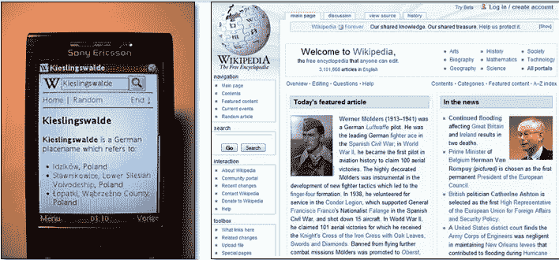
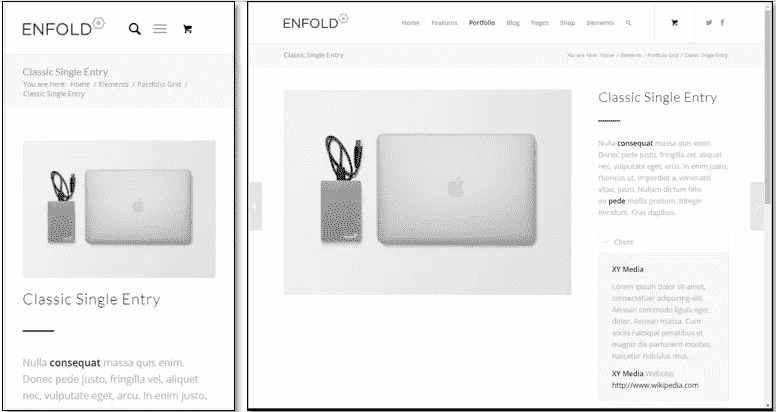
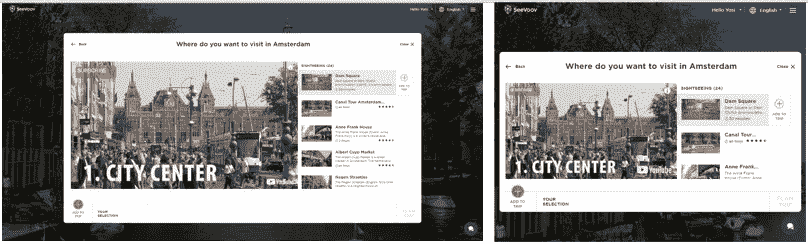
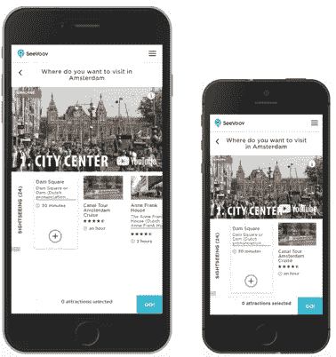
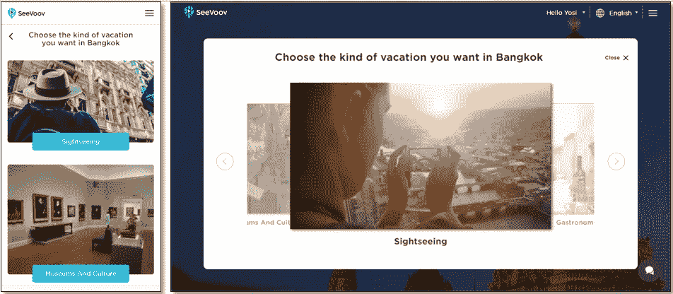
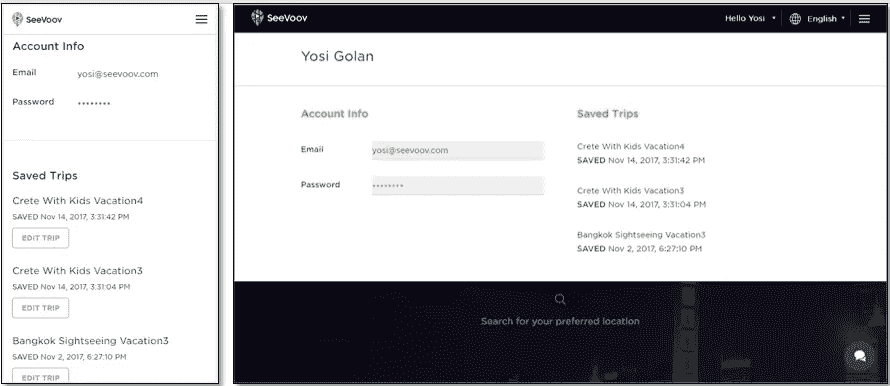
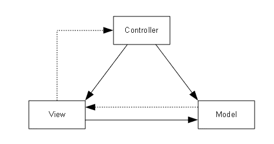
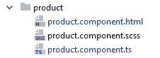
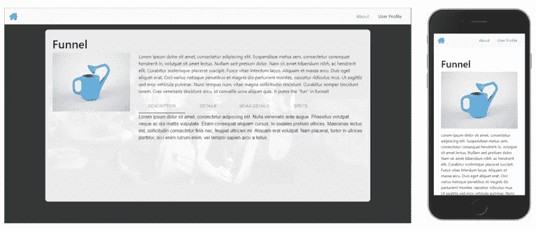

# 为多种视图和屏幕尺寸创建有角度的 Web 应用程序

> 原文：<https://betterprogramming.pub/creating-angular-webapp-for-multiple-views-and-screen-sizes-50fe8a83c433>


## 如何在 Angular 中创建一个在各种屏幕尺寸下看起来和感觉都很棒的 web 应用程序

Angular 可能是创建优秀 web 应用程序的最佳平台。但是，我们如何才能创建一个在任何分辨率下看起来都令人惊叹的 web 应用程序呢？在本文中，我们将学习如何使用传统的软件架构和设计模式来利用 Angular 平台的力量创建一个最先进的 web 应用程序，可以在任何设备上以任何分辨率查看。

我们将使用的技术要求角度为 4°及以上。

所描述的示例应用程序可在[https://github.com/yosigolan/angular-multi-view](https://github.com/yosigolan/angular-multi-view)获得

# 动机

HTML 和 web 资源被设计为可以在任何具有互联网浏览器的设备上查看。在过去的几年里，各种设备和屏幕尺寸(和分辨率)呈指数级增长。当第一批带有互联网浏览器的手机出现时，网站创建者对不同屏幕尺寸的反应是*适应性网站*。

*自适应站点*是指根据屏幕宽度调整站点视图，但在特定的阈值。例如，桌面版本将被调整为高于 768 px 的分辨率，而移动版本将被调整为较低的分辨率。如果我们使用移动设备浏览页面，将会显示移动版本；如果我们使用桌面 pc 浏览页面，将会显示桌面版本。



维基百科旧的适应性网站——移动视图与桌面视图

但随后，随着智能手机的诞生，出现了更多屏幕尺寸更大的设备(手机、平板电脑等)。HTML 支持不同屏幕尺寸的答案是*响应*。网站创建者使用 CSS 技术来创建一个响应式网站，该网站可以在任何分辨率下根据屏幕宽度进行自我调整。一个响应式站点意味着 HTML 通常使用网格来编写。然后，使用 CSS，网格根据屏幕大小呈现 HTML，这样每当两个元素不能并排(水平)时，它们就会一个接一个地出现(垂直)，例如:



响应站点—移动视图与桌面视图

虽然一个响应式网站可以节省很多工作(你只需编写一次 HTML)，但这并不总是足够的。随着 Angular 等强大网络平台的出现，今天的网站越来越像网络应用程序，可以做的远不止是向用户提供数据。用户期望看到一个外观和行为都像手机应用程序的网页。移动应用程序的外观通常与桌面网站完全不同。因此，我们必须对它有一个完全不同的看法，不能使用响应式的方法。

听起来好像，对于一个现代的 web 应用程序，我们需要旧的自适应方法。但这仍然不够。原因是屏幕尺寸仍然超出了我们的支持范围。我们无法为每个屏幕尺寸创建自适应视图。

答案是适应性方法和反应性方法的混合。我们真正想要的是一个 web 应用程序，它有几个视图用于几个屏幕大小级别，例如，一个视图用于所有高于 768 px 的分辨率，一个视图用于所有低于 768 px 的分辨率。到目前为止，这是一种适应性方法。在每个视图中，我们希望它能够响应，这样所有高于 768 px 的分辨率都会显示相同的视图，但会响应当前的分辨率。这样，我们覆盖了整个分辨率范围，同时最大限度地减少了我们创建的视图版本。



[SeeVoov](https://www.seevoov.com/plan-trip/amsterdam/where-to-go) 高分辨率视图响应



[SeeVoov](https://www.seevoov.com/plan-trip/amsterdam/where-to-go) 低分辨率视图响应

# 使用角度的选项

让我们来看看如何在角坐标下实现。Angular 是基于组件的，因此在最低级别，我们希望更改组件的视图。让我们回顾一下根据屏幕大小改变组件视图的可能选项。

**选项 1:组件视图是响应式的。**

在这种情况下，我们不需要本文中的任何技术。我们可以使用众所周知的 CSS 方法使页面具有响应性。

**选项 2:组件根据屏幕大小有不同的视图，但是视图之间的组件逻辑不同。**

这是一个有问题的案例。从业务的角度来看，这意味着用户在视图之间获得不同的体验，包括不同的逻辑。这可能会令人困惑。这里唯一共同的是页面的路径。我建议避免这种情况，但有时这是必须的。

**选项 3:组件根据屏幕大小有不同的视图，而组件逻辑在所有视图中都是相同的。**

这是大樱桃。在这种情况下，我们需要为每个屏幕尺寸使用不同的 HTML 和 CSS。然而，其背后的逻辑对于所有大小都是相同的，我们希望对所有视图重用相同的代码。有关示例，请参见 SeeVoov 网站:



[SeeVoov](https://www.seevoov.com/plan-trip/bangkok/choose-travel-kind) —移动与桌面

现在我们已经列出了所有的选项，让我们来弄清楚如何为每个选项实现视图更改。

在本文中，出于演示目的，我们将创建一个在首页展示产品的示例应用程序。点击产品将进入产品详情页面。此外，我们将有一个关于页面和用户资料区。示例应用程序将涵盖上面讨论的所有选项。代码可以在这里找到:[https://github.com/yosigolan/angular-multi-view](https://github.com/yosigolan/angular-multi-view)

# 基础设施

我们首先需要关注的是基础设施。每当我们需要选择一个视图时，我们将需要当前的视图种类。为了实现这一点，我们将创建一个 ApplicationStateService 来保存和设置它。

```
*application-state.service.ts:* **import** { Injectable } **from '@angular/core'**;

@Injectable()
**export class** ApplicationStateService {

  **private isMobileResolution**: **boolean**;

  **constructor**() {
    **if** (***window***.**innerWidth** < 768) {
      **this**.**isMobileResolution** = **true**;
    } **else** {
      **this**.**isMobileResolution** = **false**;
    }
  }

  **public** getIsMobileResolution(): **boolean** {
    **return this**.**isMobileResolution**;
  }
}
```

这里有几点需要注意:

*   例如，我只处理两种视图:移动和桌面。但是，使用 enum 可以很容易地将其转换为几种不同的视图(例如，桌面、平板和移动，每种视图都有不同的宽度大小)。
*   我根据分辨率选择当前视图。我发现这是最准确的方法，但还有其他选择。例如，您可以使用 user-agent 头，它可以告诉您哪个设备正在使用该站点。
*   我选择在 768 px 中分离两个视图，因为这是 iPad 的宽度，因此 iPad 和更高的将接收桌面视图，其余的(较小的分辨率)将接收移动分辨率。当然，也可以使用其他分辨率屏障，这取决于设计人员。
*   窗口元素仅在浏览器平台上可用。对于 Angular Universal 或任何其他服务器渲染，我们将不得不使用另一种机制来确定视图，例如，用户代理头。

# 方案 1 和方案 2:不同的视角，不同的路线

现在我们有了基础设施，我们可以继续实施了。
让我们先来处理不同观点之间的路线分歧。有几个原因可以解释为什么路线会在视图之间改变:

*   如果我们需要在不同的视图中使用不同的组件
*   如果我们有一个组件，它在一个视图中需要自己的路由，但在另一个视图中不需要路由或需要不同的路由，我也建议避免这个选项，原因与选项 2 相同。以上，动机下。但还是那句话，在某些情况下，这是必须的。举个例子，在 [SeeVoov](https://www.seevoov.com/) 网站，移动视图中的用户资料有自己的路线，而在桌面视图中，它是一个弹出窗口，可以在每条路线上看到。



SeeVoov 用户资料—移动与桌面

*   如果不同的视图有相同的路由，但需要一些层次结构的改变，如路由器出口

回到我们的示例应用程序，我们将添加一个路由模块并创建两个路由数组，一个用于桌面视图，一个用于移动视图:

```
**const** desktop_routes: Routes = [
  {
    **path**: **''**, **component**: DesktopFrontpageComponent, **children**:
    [
      {**path**: **'product/:productName'**, **component**: ProductComponent}
    ]
  },
  {**path**: **'about'**, **component**: AboutComponent},
  *// directs all other routes to the main page* {**path**: **'**'**, **redirectTo**: **''**}
];

**const** mobile_routes: Routes = [
  {**path**: **''**, **component**: MobileFrontpageComponent},
  {**path**: **'product/:productName'**, **component**: ProductComponent},
  {**path**: **'about'**, **component**: AboutComponent},
  {**path**: **'user-profile'**, **component**: UserProfileComponent},
  *// directs all other routes to the main page* {**path**: **'**'**, **redirectTo**: **''**}
];
```

让我们来看看上面的代码。

至于首页，我们可以看到，在选项 2 中，我们为移动和桌面使用了不同的组件。在我们的小示例应用程序中，桌面首页和移动首页之间的逻辑差异并不能证明让它们成为两个不同的组件是正确的，但是为了这个例子，我们将这样做。至于产品页面，我们可以看到，在桌面版中，它们是首页的子路线，而在移动版中，它们是独立的页面。

产品组件将有不同的视图来演示选项 3。
About 组件将用于演示选项 1。(响应视图)。用户配置文件组件仅包含在移动路线中。但是，它也将存在于桌面版本中，只是作为一个弹出窗口，而不是一个独立的路线。

使用上面的路线，我们可以演示我们之前查看的所有选项。

现在我们有了两组路线，我们如何根据当前的视图分辨率在它们之间切换呢？答案是 [Router.resetConfig](https://angular.io/api/router/Router#resetConfig) 函数。resetConfig 函数将路由器路由重置到给定的阵列。在我们的应用程序中，我们可以在路由模块构造函数中添加以下代码:

```
@NgModule({
  *// as default we set the desktop routing configuration. if mobile will be started it will be replaced below.
  // note that we must specify some routes here (not an empty array) otherwise the trick below doesn't work...* **imports**: [RouterModule.*forRoot*(desktop_routes, {**preloadingStrategy**: PreloadAllModules})],
  **exports**: [RouterModule]
})
**export class** AppRoutingModule {

  **public constructor**(**private** router: Router,
    **private** applicationStateService: ApplicationStateService) {

    **if** (applicationStateService.getIsMobileResolution()) {
      router.resetConfig(mobile_routes);
    }
  }
}
```

看起来不错！但是有一些事情需要注意:

*   如果你在你的路由器中装载一个模块而不是一个组件(例如，延迟装载)，这个模块可能会带来路由。现在，resetConfig 函数替换了整个应用程序中的所有路由器路由，因此您不能只在子模块内部调用它，并期望它只更改子模块路由。实际上，你只能在根路由模块中调用 resetConfig 函数。否则，您将损坏您的路由配置。
    这意味着，对于子模块，您需要找到不同的方式在视图路径之间切换。(这是我建议避免在视图之间配置不同路由的另一个原因，尤其是在子模块中)。例如，一种解决方案是将新路由递归注入路由器当前路由。我已经在示例 GitHub 项目中创建了一个这样的函数(在 routing 模块下)。但是要注意——它还没有经过足够的测试，不建议手动操作路线。但是很管用:)。
*   在 Angular Universal 中，有一些错误，在调用 resetConfig 函数后，突然有些 CSS 没有和 HTML 一起到达。

太好了，我们通过了路线变更挑战！这包括选项 1。第二。(参见示例应用程序)。现在我们可以继续选项 3。，这使得我们必须处理单个组件的多个视图。

# 选项 3:单个组件，多个视图

我们希望能够在运行时根据分辨率使用相同的逻辑来更改组件的视图。为了实现这一点，我们将使用一种叫做 MVC(模型-视图-控制器)的古老的软件设计模式。MVC 是一种软件[架构模式](https://en.wikipedia.org/wiki/Architectural_pattern)，用于实现[用户界面](https://en.wikipedia.org/wiki/User_interface)。它把一个给定的应用分成三个相互联系的部分——模型、视图和控制器。这样做是为了将信息的内部表示与信息的呈现方式分开。这种架构最大的优点是，它使我们能够无耻地替换视图组件(这正是我们想要的！)



MVC 模式

模型角色持有需要呈现给用户的信息。视图的作用是将当前模型中的数据呈现给显示器，并通知控制器用户的操作。控制器的角色是根据用户操作和业务逻辑更新模型。一旦控制器更新完模型，它就要求视图用模型中的新数据更新显示。

一旦实现了 MVC 的三个部分，流程如下。
控制器根据业务逻辑用需要显示的数据填充模型。一旦模型准备好数据，控制器就命令视图进行自我更新。根据这个命令，视图读取新的模型数据并渲染它。如果用户与视图交互，视图将用户操作通知控制器，流程重新开始。

其实 Angular 已经是 MVC 的一种了。如果我们来看一个角度标准组件，我们会看到以下结构:



角形标准件结构

很明显，视图是 HTML 和 SCSS 文件。另外，`.ts`文件似乎是控制器，因为它保存了所有的逻辑。但是模型在哪里呢？答案是模型也隐含在`.ts`文件中。每次我们将 HTML 控件绑定到 typescript 成员值时，我们都将控件绑定到模型。

```
*product.component.html:*
Desktop View:
<**h1 class="product-title"**>
  {{**name**}}
</**h1**>

<**img [src]="imageUrl" alt="{{name}} name"**>

<**p**>
  {{**description**}}
</**p**>
...--------------------------------------------------------------------
*product.component.scss:* :**host** {
  **position**: **fixed**;
  **top**: 10**vh**;
  **right**: 10**vw**;
  **bottom**: 10**vh**;
  **left**: 10**vw**;
  **padding**: 25**px**;
  **background**: **rgba**(255, 255, 255, 0.9);
  **border-radius**: 10**px**;
}

**img** {
  **width**: 25%;
  **float**: **left**;
  **margin**: 0 30**px** 30**px** 0;
}

:**host** ::**ng-deep** .**mat-tab-label** {
  **text-transform**: **uppercase**;
}--------------------------------------------------------------------
*product.component.ts:*
**export class** ProductComponent {

  **public name**: **string**;
  **public description**: **string**;
  **public imageUrl**: SafeResourceUrl;

  **constructor**(**private** router: Router,
    **private** sanitizer: DomSanitizer) {
    **this**.loadProduct();
  }

  **private** loadProduct(): **void** {
     // fills the product parameters
     ... 
    }
}
```

我们可以稍微改变一下组件结构，使模型更加清晰:


带模型的角形构件结构

该模型如下所示:

```
*product.component.model.ts:* **export class** ProductComponentModel {
  **public name**: **string**;
  **public description**: **string**;
  **public imageUrl**: SafeResourceUrl;

  **constructor**(**private** sanitizer: DomSanitizer) {
    **this**.**name** = **''**;
    **this**.**description** = **''**;
    **this**.**imageUrl** = **this**.sanitizer.bypassSecurityTrustResourceUrl(**''**);
  }
}
```

新的控制器看起来像这样:

```
*product.component.ts:* **export class** ProductComponent {

  **private model**: ProductComponentModel;

  **constructor**(**private** router: Router,
    **private** sanitizer: DomSanitizer) {
    **this**.**model** = **new** ProductComponentModel(sanitizer);
    **this**.loadProduct();
  }

  **private** loadProduct(): **void** {
    // fills the product parameters inside the model
     ...
  }
```

让我们相应地更新视图(HTML 文件)。

```
*product.component.html:*
Desktop View:
<**h1 class="product-title"**>
  {{**model**.**name**}}
</**h1**>

<**img [src]="model.imageUrl" alt="{{model.name}} name"**>

<**p**>
  {{**model**.**description**}}
</**p**>
...
```

太好了，现在我们有了一个完美的 MVC！但是仍然缺少一些东西。正如我之前解释的那样，保存视图和模型的控制器还控制视图何时将模型重新呈现给显示器(使用 UpdateView 命令)。这意味着，即使控制器更改了模型，视图也不应该呈现新的更改，直到控制器命令 view: UpdateView。

这种方法的优点是，在许多情况下，更新模型需要时间。让我们假设控制器向服务器发送几个调用，每个调用更新模型中的某个成员。如果我们不使用 UpdateView 方法，每当某个请求完成时，视图将显示其结果，然后用户有可能会看到一个不完整的状态(有些数据被更新，有些没有)。

使用 UpdateView 方法，每当某个请求结束时，控制器都会更新模型。完成所有请求后，它调用 UpdateView 命令，然后视图呈现新的模型，用户收到数据的整体情况。正如我们所知，Angular 使用区域来检测变化，并在每次变化时自动渲染视图。那么我们将如何实现 UpdateView 方法呢？答案是*克隆*。让我们按如下方式更改控制器代码:

```
*product.component.ts:* **export class** ProductComponent {

  **private model**: ProductComponentModel;
  **public myViewModel**: ProductComponentModel;

  **constructor**(**private** router: Router,
    **private** sanitizer: DomSanitizer) {
    **this**.**model** = **new** ProductComponentModel(sanitizer);
    **this**.**myViewModel** = **new** ProductComponentModel(sanitizer);
    **this**.loadProduct();
  }

  **private** loadProduct(): **void** {
    // fills the product parameters inside the model
     ...
  }
}
```

以及如下视图:

```
*product.component.html:*
Desktop View:
<**h1 class="product-title"**>
  {{**myViewModel**.**name**}}
</**h1**>

<**img [src]="myViewModel.imageUrl" alt="{{myViewModel.name}} name"**>

<**p**>
  {{**myViewModel**.**description**}}
</**p**>
...
```

现在视图被绑定到实例 myViewModel，而不是模型实例。当控制器更新模型时，显示不会改变。剩下的工作就是在每次使用控制器命令 UpdateView 时用模型内部的数据更新 myViewModel 的实例。

我们将这样做:

```
*product.component.model.ts:*
**export class** ProductComponentModel {

  **public name**: **string**;
  **public description**: **string**;
  **public imageUrl**: SafeResourceUrl;

  **constructor**(**private** sanitizer: DomSanitizer) {
    **this**.**name** = **''**;
    **this**.**description** = **''**;
    **this**.**imageUrl** = **this**.sanitizer.bypassSecurityTrustResourceUrl(**''**);
  }

  **public** clone(): ProductComponentModel {
    **let** clonedModel: ProductComponentModel = **new** ProductComponentModel(**this**.sanitizer);
    clonedModel.**name** = **this**.**name**;
    clonedModel.**description** = **this**.**description**;
    clonedModel.**imageUrl** = **this**.**imageUrl**;
    **return** clonedModel;
  }
}-------------------------------------------------------------------
*product.component.ts:***export class** ProductComponent {

  **private model**: ProductComponentModel;
  **public myViewModel**: ProductComponentModel;

  **constructor**(**private** router: Router,
    **private** sanitizer: DomSanitizer) {
    **this**.**model** = **new** ProductComponentModel(sanitizer);
    **this**.**myViewModel** = **new** ProductComponentModel(sanitizer);
    **this**.loadProduct();
    **this**.updateView();
  }

  **private** loadProduct(): **void** {
    // fills the product parameters inside the model
     ...
  } **private** updateView(): **void** {
    **this**.**myViewModel** = **this**.**model**.clone();
  }}
```

现在控制器可以随心所欲地更新模型，而视图不会被更新。只有当控制器调用函数 UpdateView 时，视图才会被更新。

这里有一些关于这项技术的注意事项。

*   模型中的克隆函数必须真正克隆数据。例如，如果模型包含一个数组，仅仅做下面的事情是不够的，因为这样只会复制数组引用。

```
model.**someArray** = **this**.someArray;
```

视图仍将被绑定到模型中的阵列。要克隆阵列，我们必须这样做:

```
model.**someArray** = **this**.someArray.map(arrayElement=>{
   clone array element});
```

这将创建一个包含新元素的新数组。

*   继续第一个项目，嵌套对象也应该被克隆(与只能使用=)复制的原始类型相反)。例如，如果我们的模型拥有一个类型为 UserDetails 的成员，UserDetails 对象也应该包含一个克隆函数，并且在根模型克隆函数中应该调用它。
*   如果视图包含绑定到模型中数组的可滚动列表，那么克隆该数组可能会有问题。原因是可滚动列表在 dom 中有一些状态(它的位置),如果数组实例改变了它，就会破坏状态。在这些情况下，应该在不创建新数组的情况下更新数组元素。
*   我使用名称 *myViewModel* 作为视图绑定到的模型成员，而不是 *viewModel* ，因为 *viewModel* 出于某种原因是一个保存关键字。
*   在构造函数中用空值初始化模型，并在控制器构造函数中将其创建为空，这一点很重要。否则，Angular 将在组件加载时抱怨 HTML 中的空值。

既然我们已经根据 MVC 架构设计了组件，我们就可以替换视图了。因为我们的视图(HTML)绑定到一个定义良好的模型，如果我们编写一个新的视图，它也绑定到同一个模型。它们之间的切换将是透明的。此外，我们将能够在不改变我们的业务逻辑(写在控制器中并在模型中建模)的情况下改变我们的视图。

让我们添加一个移动视图:

```
*product.component.mobile.html:*
Mobile View:
<**h3 class="product-title"**>
  {{**myViewModel**.**name**}}
</**h3**>

<**img [src]="myViewModel.imageUrl" alt="{{myViewModel.name}} name"**>

<**p**>
  {{**myViewModel**.**description**}}
</**p**>--------------------------------------------------------------------
*product.component.mobile.scss:* **img** {
  **width**: 100%;
  **margin-bottom**: 15**px**;
}
```

如你所见，我们在不同的 SCSS 和不同的 HTML 文件中创建了新的视图，这是最优雅的方式。现在我们想根据分辨率在运行时选择正确的视图文件。为此，我们将使用对象继承(感谢上帝我们有 typescript :-))。让我们对控制器(主要组件`.ts`文件)做一个小小的重构:

```
--------------------------------------------------------------------
*product.component.ts:***export abstract class** ProductComponent {

  **private model**: ProductComponentModel;
  **public myViewModel**: ProductComponentModel;

  **constructor**(**private router**: Router,
    **private sanitizer**: DomSanitizer,
    **private applicationStateService**: ApplicationStateService) {
    **this**.**model** = **new** ProductComponentModel(**sanitizer**);
    **this**.**myViewModel** = **new** ProductComponentModel(**sanitizer**);

    **this**.loadProduct();

    **this**.updateView();
  }...}--------------------------------------------------------------------
*product.component.desktop.ts:*@Component({
  **selector**:    **'app-product-desktop'**,
  **templateUrl**: **'./product.component.desktop.html'**,
  **styleUrls**:   [**'./product.component.desktop.scss'**]
})
**export class** ProductComponentDesktop **extends** ProductComponent {

  **constructor**(router: Router,
    sanitizer: DomSanitizer,
    applicationStateService: ApplicationStateService) {
    **super**(router, sanitizer, applicationStateService);
  }

}--------------------------------------------------------------------
*product.component.mobile.ts:*@Component({
  **selector**: **'app-product-mobile'**,
  **templateUrl**: **'./product.component.mobile.html'**,
  **styleUrls**: [**'./product.component.mobile.scss'**]
})
**export class** ProductComponentMobile **extends** ProductComponent {

  **constructor**(router: Router,
    sanitizer: DomSanitizer,
    applicationStateService: ApplicationStateService) {
    **super**(router,sanitizer,applicationStateService);
   }

}
```

发生了什么事？不要惊慌，这并不困难。我们所做的是将主组件文件(它是我们的控制器)改为一个抽象类，并移除了 Angular 组件装饰器。然后我们创建了两个新的`.ts`文件，一个用于桌面，一个用于移动设备。每一个都扩展了主组件文件，并由此接收所有的逻辑(包括模型)。在特定的组件文件上，我们添加回 Angular 组件装饰器。现在在每一个中，我们引用相关的 SCSS 和 HTML 文件。每个特定组件还会收到自己的选择器名称。

上述方法使我们能够完全分离两个不同的视图，同时保留了一个控制器具有单个逻辑和单个模型的优势。

剩下的工作就是在页面根据分辨率加载时加载正确的视图。因为我们分开了路线，所以很容易:

```
--------------------------------------------------------------------
app.routing.module.ts:**const** desktop_routes: Routes = [
  {**path**: **'about'**, **component**: AboutComponent},
  {
    **path**: **''**, **component**: DesktopFrontpageComponent, **children**:
    [
      {**path**: **':productName'**, **component**: ProductComponentDesktop}
    ]
  },
  *// directs all other routes to the main page* {**path**: **'**'**, **redirectTo**: **''**}
];

**const** mobile_routes: Routes = [
  {**path**: **''**, **component**: MobileFrontpageComponent},
  {**path**: **'about'**, **component**: AboutComponent},
  {**path**: **'user-profile'**, **component**: UserProfileComponent},
  {**path**: **':productName'**, **component**: ProductComponentMobile},
  *// directs all other routes to the main page* {**path**: **'**'**, **redirectTo**: **''**}
];
```

如果我们的组件没有通过 routes 加载(在 HTML 中实现),我们有两个选择:

1.  如果父组件(它引用我们的组件)也像我们的一样被分离到视图中，我们可以使用相同的技术，在父组件的正确视图中添加正确的视图选择器。
2.  如果父组件只有一个视图(例如 responsive ),我们可以对组件的主要抽象类进行一点重构，使其本身也有一个视图，并在其中使用 ngIf 根据`ViewKind`参数选择正确的视图(如下例中的`isMobileResolution`):

```
--------------------------------------------------------------------
product.component.ts:@Component({
  **selector**: **'app-product'**,
  **templateUrl**: **'./product.component.html'** })
**export class** ProductComponent {

  **private model**: ProductComponentModel;
  **public myViewModel**: ProductComponentModel;

  **public isMobileResolution**: **boolean**;

  **constructor**(**private router**: Router,
    **private sanitizer**: DomSanitizer,
    **private applicationStateService**: ApplicationStateService) {

    **this**.**model** = **new** ProductComponentModel(**sanitizer**);
    **this**.**myViewModel** = **new** ProductComponentModel(**sanitizer**);

    **this**.loadProduct();
    **this**.updateView();

    **this**.**isMobileResolution** = **applicationStateService**.getIsMobileResolution();
  }--------------------------------------------------------------------
product.component.html:<**div class="desktop-container" *ngIf="!isMobileResolution; else *mobileContainer*"**>
  <**app-product-desktop**></**app-product-desktop**>
</**div**>

<**ng-template #mobileContainer**>
  <**app-product-mobile**></**app-product-mobile**>
</**ng-template**>
```

现在，我们可以在任何需要的地方引用主组件，它将根据分辨率为我们加载正确的视图。

经过所有的努力，我们做到了！让我们运行我们的应用程序，看看它的运行情况:



应用产品页面示例—桌面视图与移动视图

以下是上面的几点说明:

*   在不同分辨率视图之间切换需要刷新页面，因为我们在构造函数中设置了`isMobile`参数。反正这不是问题，因为我们的用户从一开始就会以正确的分辨率进入站点。
*   在某些情况下，某个视图需要控制器基础模型之上的扩展模型。例如，视图包含请求接收预定义对象中的数据的第三方。因为这个第三方是依赖于视图的，控制器不知道这个结构，因此它不在基本模型中表示。在这些情况下，我们可以再次使用继承，并为扩展基本模型的特定视图创建一个模型。然后，使用抽象方法和覆盖，我们根据视图创建正确的模型并分别更新它。
*   如果视图还需要某些只与特定视图相关的逻辑(用户点击时打开下拉菜单),该逻辑可以添加到视图组件文件中，而不会干扰控制器。

就是这样——我们已经创建了一个多视角的 web 应用程序！我尝试在示例应用程序中添加上面列出的所有选项。你可以在这里找到它:[https://github.com/yosigolan/angular-multi-view](https://github.com/yosigolan/angular-multi-view)

尽情享受吧！