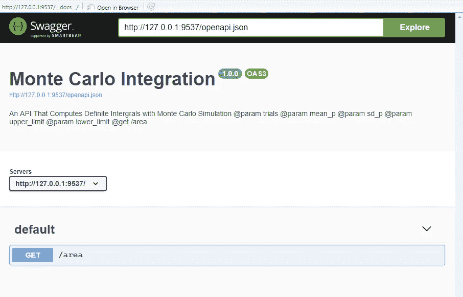
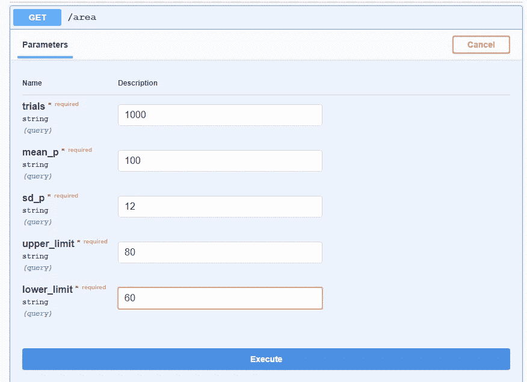
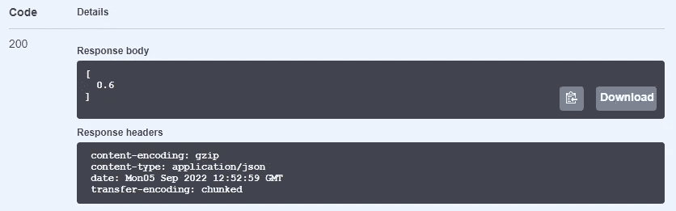

# 用 Plumber 在 R 中创建 API

> 原文：<https://betterprogramming.pub/creating-apis-in-r-with-plumber-2fb7b064619f>

## 将您的 R 代码投入生产


在 [Unsplash](https://unsplash.com?utm_source=medium&utm_medium=referral) 上由 [Jametlene Reskp](https://unsplash.com/@reskp?utm_source=medium&utm_medium=referral) 拍摄的照片

r 有一个很棒的社区。据估计，全球有超过两百万的 R 用户。来自世界各地不同领域的众多研究人员创造了奇妙的模型并分享他们的代码。我们，应用科学从业者，经常在 r。

但是下一步是什么呢？当你最终找到了最佳工作模式时会发生什么？这正是将研究人员变成软件工程师的问题。我们将模型投入生产。我们用它来控制过程和预测结果。这才是重点。但是怎么做呢？

高级生产系统可能在形状和名称上有所不同。如果你是 R 用户，想把你的代码投入生产，你有两个选择:Shiny 和 Plumber。

Shiny 是一个创建 web 应用程序的 R 框架。虽然它越来越受欢迎，但由于各种原因，我并不是 Shiny 的忠实粉丝。

第二个选择，我认为是将 R 应用程序集成到任何软件系统的最佳方式，我的意思是字面上的任何系统，不是别人，就是管道工。正如您可能很容易猜到的，本文的主题是管道工。到本文结束时，您已经用 Plumber 在 R 中创建了第一个 API。我们开始吧！

# 浅谈生产中 R 的使用

关于 R 是否是适合生产环境的语言，有一场激烈的争论。在介绍 Plumber 之前，我们需要简单地谈一下这个话题。

快速搜索后，您可以很容易地找到软件行业中最受欢迎的服务器端语言。r 根本不在那个名单上。您可以用许多其他语言创建更加健壮、可靠和可伸缩的服务器端应用程序。没有一个顶级软件团队想到在生产环境中使用 R。尽管如此，为什么我仍然喜欢水管工，为什么我还要写一篇关于它的文章呢？

因为这个世界不是非黑即白的，软件业也不是。将开发和生产环境截然分开是不可能的。这种不可分性在初创企业、中型公司、学生项目和学术界更加明显。只有少数巨头有这种奢侈，如果你不是其中之一，你将不得不在生产环境中使用像 R 和 Python 这样的语言。

# API 到底是什么？

我们谈到了将我们的模型放到生产环境中的必要性。在本节中，我们将阐明这一点。

不要把自己局限在机器学习模型上。任何工作程序都可以投入生产。想想你写的一个程序。它可能接受输入，也可能不接受输入，但是它做了一些事情，并且有一个结论。您希望共享这个工作程序，并帮助其他人自动化他们的任务。那些其他的在不同的机器上，需要和你写的程序通信才能使用。

这种交流是通过双方之间的信使来完成的。这个信使被称为“应用编程接口”，或 API。因此，API 作为两个软件实体之间的桥梁，让它们相互通信。

API 的复杂性和用途可能不同。因此，它们按照不同的特性进行分类，您可以看到不同类型的 API。我们将使用 Plumber 创建的一个 API 称为 REST API 或 RESTful API。这不是你现在应该担心的事情。但是请记住，REST APIs 使用一种叫做 HTTP 方法的非常简单的语言来与不同方进行交互。

# 水管工是怎么工作的？

我们可以把水管工的过程分为两个主要部分:

1.)首先，我们创建一个脚本，打算用作 API 的主要服务。这是我们请求 API 时将运行的脚本。脚本的准备相当容易。对于脚本的每一部分，我们都留下了特殊的注释(这与常规的 R 注释有一点不同)来表明该部分在 R 脚本中的作用。我们添加到常规工作 R 脚本中的这些注释将引导 Plumber 正确地将脚本转换成 API。

2.)安装了 Plumber 之后，我们可以使用包中的`pr()`函数将这个 R 脚本转换成一个 Plumber API。

# 让我们从一个简单的脚本开始

我们从一个只有几行的简单 R 脚本开始。就是这样。主题是蒙特卡洛模拟。你对这门学科的熟悉程度可能会因你各自的背景而有所不同，但对于大多数应用科学家来说，这是一项非常普通的工作。这里我们使用蒙特卡罗技术来解决一个定积分问题。

我们编写了一个函数，用用户提供的不同参数来寻找正常曲线下的面积。我们对自己的工作非常满意，并希望与他人分享。最快的方法是创建一个 API。现在我们要基于 R 脚本创建一个。

# 将这个脚本转换成 API

我们将在上面的小代码中添加一些特殊的注释，将它变成一个 API。那些特殊的注释被称为“注释”为了简单起见，我们将使用有限数量的注释。但是，我们可以用其他复杂的注释来制作更加复杂的 API。在 Plumber 的官方文档中可以找到注释的详细列表。

[https://www.rplumber.io/articles/annotations.html](https://www.rplumber.io/articles/annotations.html)

我们首先给这个 API 一个名称和描述。用于此目的的注释如下:

```
@apiTitle
@apiDescription
```

我们的 API 将根据我们给出的输入返回一个结果。因此，为了表示这些输入，我们将使用以下注释:

```
@param
```

最后，我们将使用一个注释来指示这个 API 执行什么类型的请求。因为我们的 API 在执行代码后返回值，所以这个 API 发出一个 GET 请求。

```
@get
```

我们代码的最终形状应该是这样的:

我们已经重新配置了源代码，做了我们必须做的一切。剩下的事情就交给这个包了。

```
mcInt <- pr("plumber2.R")
pr_run(mcInt)
```

# 现在我们检查它是否工作

运行 API 文件后，会弹出一个新窗口，我们可以看到它的基本元素。



让我们试一试，看看是否可行。您可以随意传递参数。我将对其进行如下测试:



它返回以下结果。



# 部署

到目前为止，我们已经创建了一个可用的 API。任务完成。可以说是在生产。我们这样做是为了自动化关于输入和输出的 R 脚本。但不幸的是，它只能从我们的机器上访问。最后一步是将其部署在一个平台上，以便其他人可以实现和使用它。

部署过程本身就是一个主题，不在本文讨论范围之内。但是，我们可以分享它的路线图。首要任务是为它创建一个容器，这样您就不必管理依赖项和版本。用于容器化应用程序的工具是 Docker。第二步要简单得多，就是选择一个云服务来放置你的 API。瞧，现在你已经把你的 R 脚本打开到一个自动化的生产环境中了。

# 结论

在本文中，我们讨论了如何用 R 中的 Plumber 快速创建 API。其中之一可能是 API 设计。您可能不需要用 R 构建您的整个生产环境，但是当您很着急，需要立即打开您的 R 应用程序供他人使用时，您知道如何做！