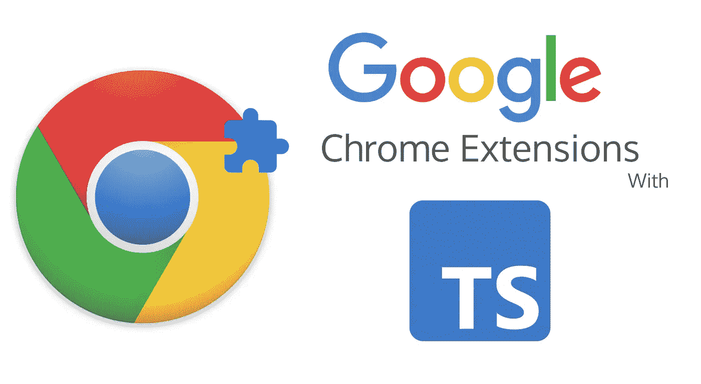
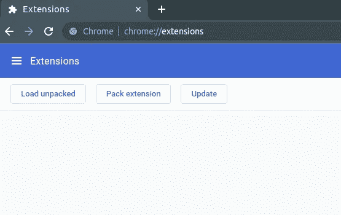
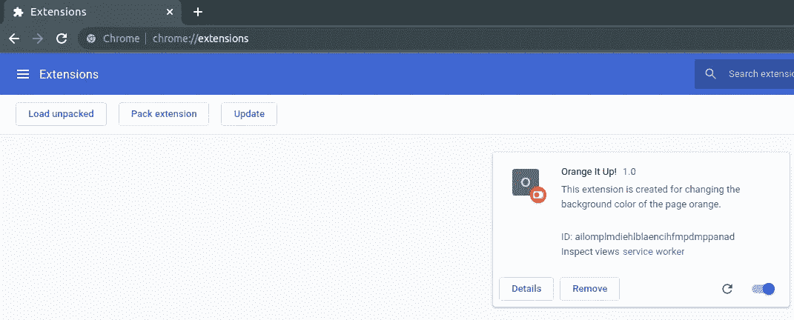
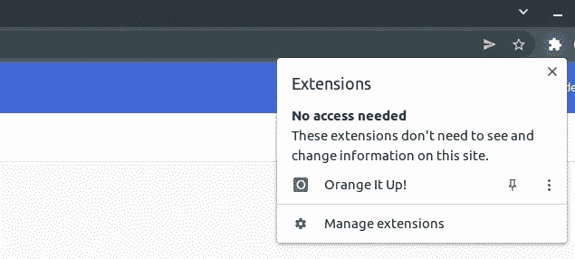
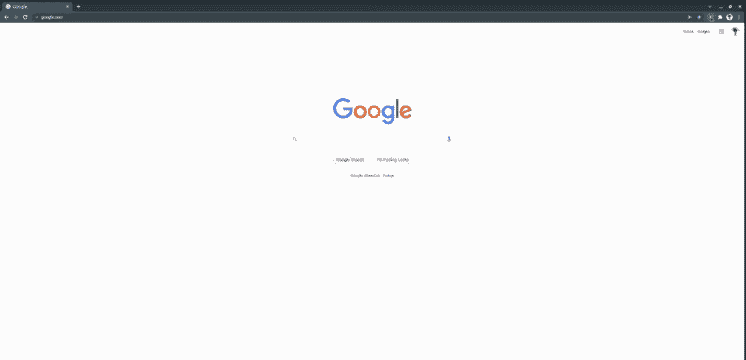

# 用 TypeScript 创建 Chrome 扩展

> 原文：<https://betterprogramming.pub/creating-chrome-extensions-with-typescript-914873467b65>

## 更改页面的背景颜色



## 在这篇文章中

我将介绍什么是扩展，TypeScript 的重要性，以及如何使用 TypeScript 创建一个简单的 chrome 扩展，一步一步地展示所需的过程。

# 什么是扩展？

> 扩展是定制浏览体验的小软件程序。他们允许用户以多种方式定制 Chrome 的功能和行为。

几乎每个人都在他们的浏览器上使用扩展，尤其是为了屏蔽那些烦人的广告。

chrome 扩展的一些例子有:

*   密码管理员
*   广告拦截器
*   待办事项列表创建者

更多信息可以在 [Chrome 网上商店](https://chrome.google.com/webstore/category/extensions)找到。

# 扩展由什么组成？

扩展是建立在 HTML、JavaScript 和 CSS 等 web 技术之上的。它们运行在一个独立的沙盒执行环境中，并与 Chrome 浏览器交互。扩展让您通过使用 API 来修改浏览器行为和访问 web 内容，从而"*扩展*"浏览器。

# 为什么打字稿？

首先，TypeScript 是 JavaScript 的 ***超集*** ，这意味着它 ***扩展了*** JavaScript。因此，它解决了一些 JavaScript 不能解决的问题。

> 许多 JavaScript 应用程序由成千上万的文件组成。对一个单独文件的单个更改可以影响任何数量的其他文件的行为，就像将一颗鹅卵石扔进池塘并引起涟漪扩散到岸边。

这并不意味着 TypeScript 必须只用于大型应用程序。如果你喜欢安全地编码类型，这是一个很好的方法。

TypeScript 通过三种方式实现其目标:

*   支持现代 JavaScript 特性
*   高级类型系统
*   开发者工具支持

在 TypeScript 的帮助下，您的应用程序突然变得类型安全、易于开发、易于调试、面向对象并且结构良好。

> 聊够了，让我们进入代码

## 先决条件

为了能够完成本教程，您需要安装节点和 npm。

## 注意

在演示过程中，您将创建一些文件夹和文件。最终的文件夹结构如下所示。

如果您愿意更改文件夹结构，您必须相应地调整配置。

## 文件夹结构


# 1.创建项目

*   创建一个空目录并通过 npm 初始化一个项目。

```
~$ mkdir medium-extension
~$ cd medium-extension
~$ npm init -y
```

*   安装所需的依赖项。

```
~$ npm install --save-dev webpack webpack-cli
~$ npm install --save-dev copy-webpack-plugin
~$ npm install --save-dev typescript ts-loader
~$ npm install --save-dev @types/chrome
```

*   创建`tsconfig.json`文件夹。`tsconfig.json`文件指定了编译项目所需的根文件和编译器选项。从[到这里](https://www.typescriptlang.org/docs/handbook/tsconfig-json.html)，您可以随意深入了解如何配置 TypeScript 项目。

## tsconfig.json

```
{
   "compilerOptions": {
      "strict": true,
      "module": "commonjs",
      "target": "es6",
      "esModuleInterop": true,
      "sourceMap": true,
      "rootDir": "src",
      "outDir": "dist/js",
      "noEmitOnError": true,
      "typeRoots": [ "node_modules/@types" ]
   }
}
```

*   在项目文件夹中创建名为`src`、`webpack`和`public`的目录。

在`webpack`文件夹中创建一个`webpack.config.js`文件，在 src 文件夹中创建一个`background.ts`文件。

## 网络包.配置. js

```
const ***path*** = require('path');
const ***CopyPlugin*** = require('copy-webpack-plugin');
module.exports = {
   mode: "production",
   entry: {
      background: ***path***.resolve(__dirname, "..", "src", "background.ts"),
   },
   output: {
      path: ***path***.join(__dirname, "../dist"),
      filename: "[name].js",
   },
   resolve: {
      extensions: [".ts", ".js"],
   },
   module: {
      rules: [
         {
            test: /\.tsx?$/,
            loader: "ts-loader",
            exclude: /node_modules/,
         },
      ],
   },
   plugins: [
      new ***CopyPlugin***({
         patterns: [{from: ".", to: ".", context: "public"}]
      }),
   ],
};
```

这将引导 webpack 通过`ts-loader`加载所有`.ts`文件，并输出一个`dist`文件夹，其中包含我们项目中捆绑的`.js`文件。

*   在`package.json`文件中添加`build`脚本。

## package.json

```
{
  "name": "medium-extension",
  "version": "1.0.0",
  "description": "",
  "main": "index.js",
 **"scripts": {
    "build": "webpack --config webpack/webpack.config.js"
  },**
  "keywords": [],
  "author": "",
  "license": "ISC",
  "dependencies": {},
  "devDependencies": {
    "ts-loader": "^9.2.6",
    "typescript": "^4.5.4",
    "webpack": "^5.66.0",
    "webpack-cli": "^4.9.1"
  }
}
```

# 2.创建清单

每个扩展都有一个 JSON 格式的清单文件。清单文件包含整个扩展应用程序的元数据，包括名称、版本、描述、内容脚本、权限等等。

创建一个名为`manifest.json`的文件。清单文件中各字段的用途和用法可以在[正式文件](https://developer.chrome.com/docs/extensions/mv3/manifest/#overview)中找到。

## manifest.json

```
{
   "name": "Medium Extension",
   "description": "This extension is made for demonstration purposes",
   "version": "1.0",
   "manifest_version": 3,
   "permissions": [
      "activeTab",
      "scripting"
   ],
   "background": {
      "service_worker": "background.js"
   }
}
```

在此清单文件中:

`name`、`description`、`version`顾名思义。

`manifest_version` : 决定了清单文件的版本。这是目前最新和推荐的版本。

`permissions` : 这些是您的扩展的基本功能所需的权限。

`service_worker` : 扩展一般在第一次初始化的时候注册它们的后台服务工作者。这种配置允许`background.js`作为服务人员。服务人员是您的浏览器在后台运行的脚本。您的扩展功能将通过注册服务人员处理。

# 3.实现服务工作者

我们在清单文件中描述了`background.js`。我们将创建一个名为`background.ts`的文件，并安全地编写我们的代码类型，将捆绑和 ts - > js 转换交给`webpack`。

## 背景. ts

```
let ***active*** = false;

function makeOrange(color: string): void {
    ***document***.body.style.backgroundColor = color;
}

chrome.action.***onClicked***.addListener((tab) => {
    ***active*** = !***active***;
    const color = ***active*** ? 'orange' : 'white';
    chrome.scripting.executeScript({
        target: {tabId: tab.id ? tab.id : -1},
        func: makeOrange,
        args: [color]
    }).then();
});
```

在这个代码块中，在 chrome API 的帮助下，我们监听扩展动作按钮上的 click 事件，并改变当前活动标签的背景颜色。

# 4.捆绑代码

在项目的根目录中，运行以下脚本。

```
~$ npm run build
```

这将在项目中创建一个包含`manifest.json`和`background.js`的`dist`文件夹。

# 5.加载扩展

*   在您的 chrome 浏览器中导航至`chrome://extensions`。并确保屏幕右上方的开发者模式被激活。



*   单击 Load Unpacked 并将目标指向项目中的`dist`文件夹。



它会在屏幕上显示您的分机号码。

*   点击 Chrome 工具栏右侧的扩展图标。并将扩展固定到工具栏上。



# 6.享受



# **源代码**

[](https://github.com/enisfr/orange-it-up-chrome-extension) [## GitHub-enisfr/orange-it-up-chrome-extension:Google chrome extension 用于操纵…

### 此时您不能执行该操作。您已使用另一个标签页或窗口登录。您已在另一个选项卡中注销，或者…

github.com](https://github.com/enisfr/orange-it-up-chrome-extension) 

# 资源

[](https://developer.chrome.com/docs/extensions/) [## 扩展- Chrome 开发者

### 扩展是建立在 web 技术(如 HTML、CSS 和 JavaScript)之上的软件程序，它使用户能够…

developer.chrome.com](https://developer.chrome.com/docs/extensions/) [](https://www.typescriptlang.org/docs/handbook/migrating-from-javascript.html) [## 文档-从 JavaScript 迁移

### 如何从 JavaScript 迁移到 TypeScript

www.typescriptlang.org](https://www.typescriptlang.org/docs/handbook/migrating-from-javascript.html)