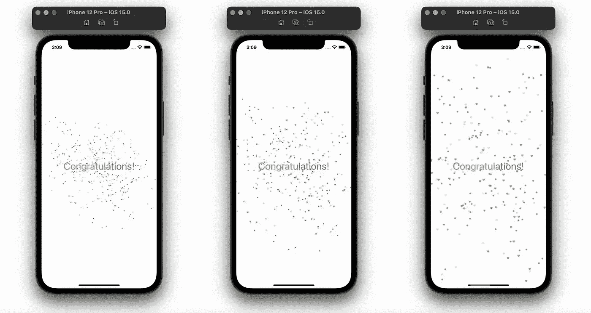
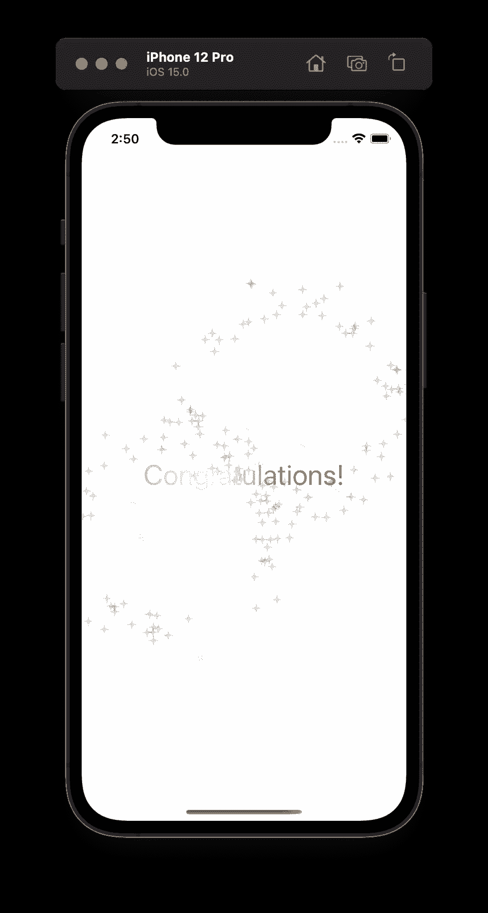
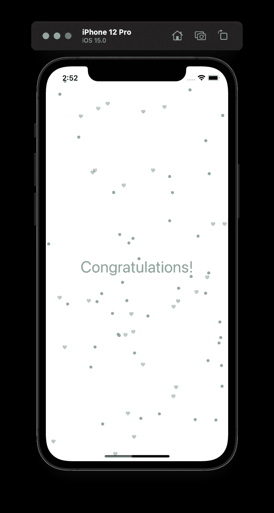
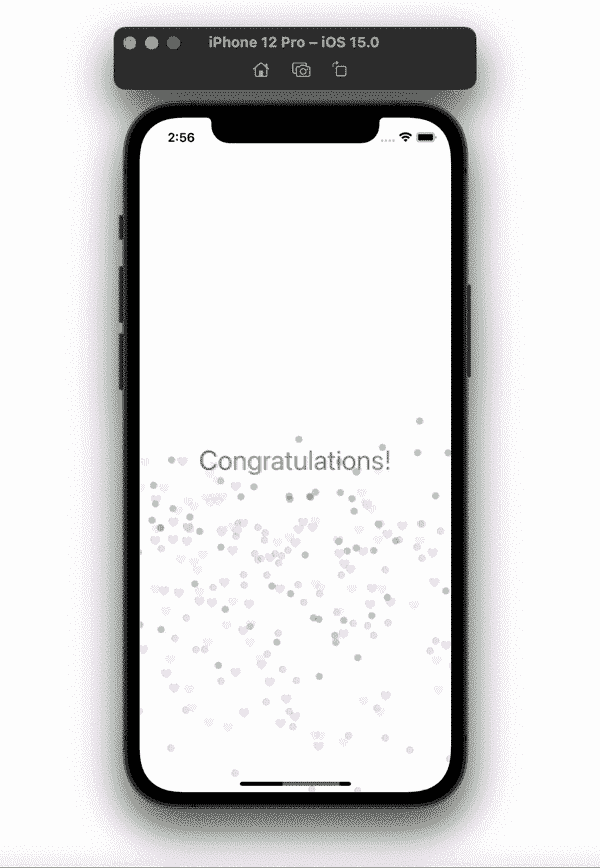
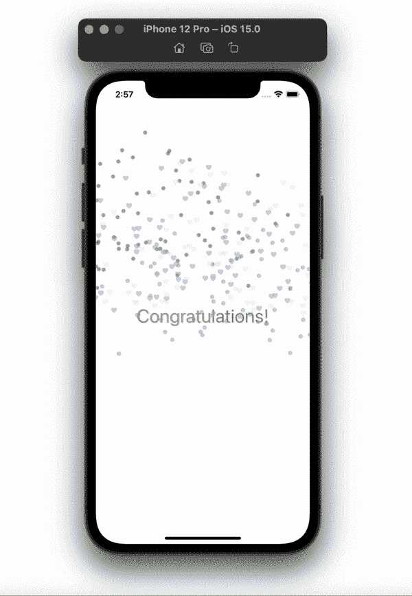
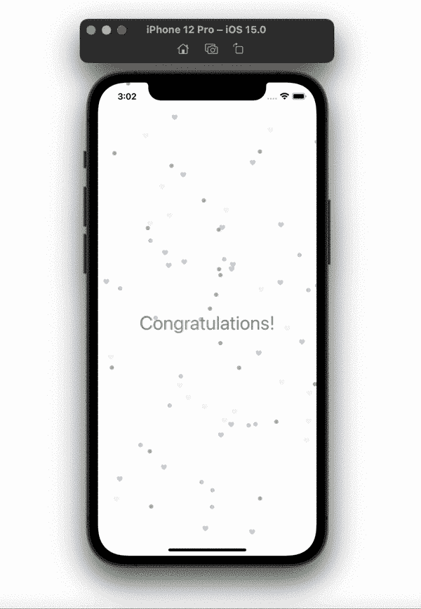
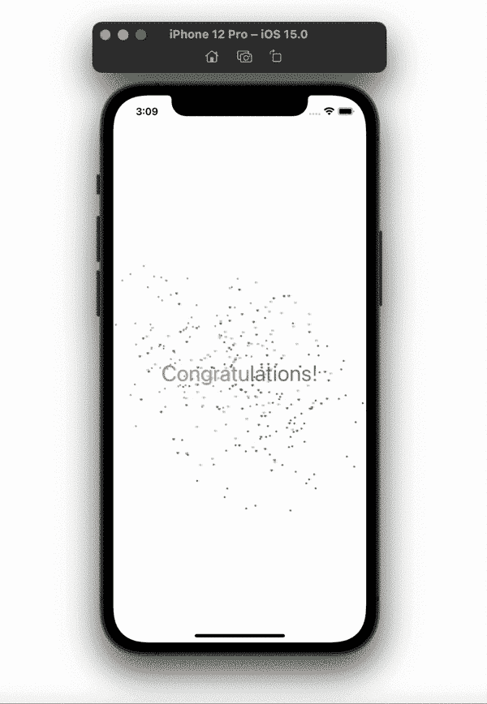
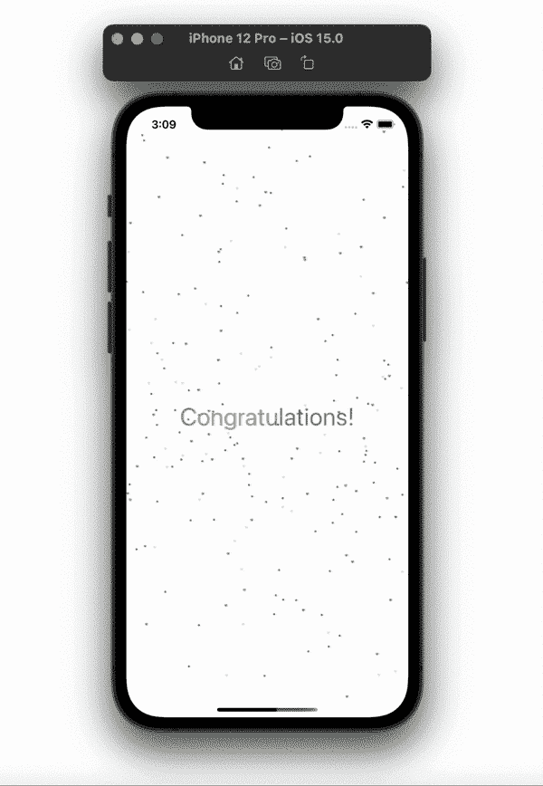
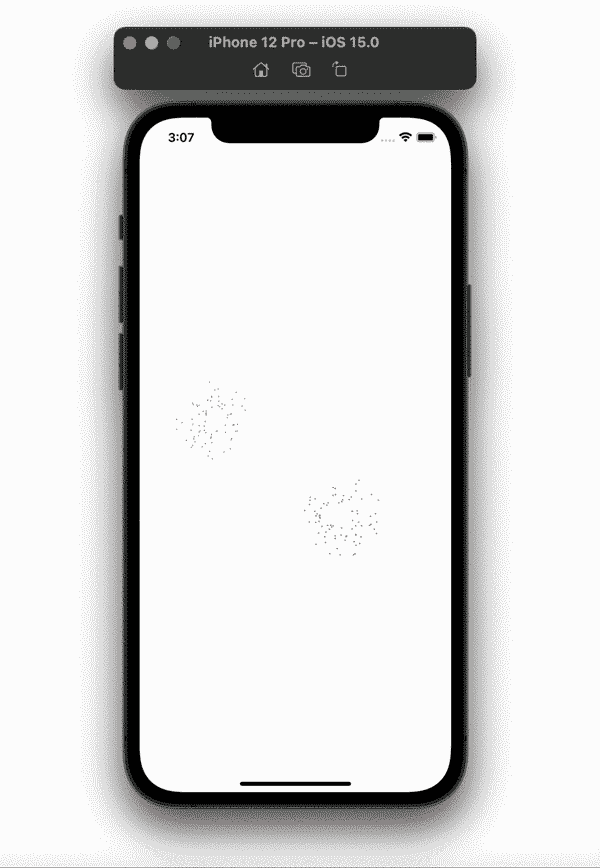

# 使用 SwiftUI 创建五彩纸屑粒子效果

> 原文：<https://betterprogramming.pub/creating-confetti-particle-effects-using-swiftui-afda4240de6b>

## 向您的 SwiftUI 应用程序添加焰火和五彩纸屑

作者图片

首先，创建一个类型为`GeometryEffect`的结构。

我们需要为粒子定义时间、速度和方向。使速度变量成为 20 到 200 之间的随机数。如果你尝试一个小的数值范围(例如 10 … 30)，粒子的爆炸将会被更好的控制并且不那么剧烈。

左侧速度范围在 20–30 之间，右侧速度范围在 20–100 之间

对于方向，使用-pi 和 pi 之间的值。这个范围会给我们一个完整的圆。

如果你将数值范围在 0 到π之间改变，粒子将以半圆的形状向下移动。如果您现在将数字范围更改为-pi 到 0 之间，将会产生相反的效果。

左边的方向范围在 0-pi 和右边的范围-pi-0 之间

使用`animatableData`增加时间值。`animatableData`是一个特殊的变量，不要重命名，否则动画将无法工作。如果你移除`animatableData`，你将有粒子固定在随机的地方。

没有时间动画的粒子

通过执行`effectValue`功能符合`GeometryEffect`协议。

我们需要计算出所有粒子的平移/位置。使用速度、时间以及方向的余弦和正弦值计算平移。仿射变换矩阵用于转换您在图形环境中绘制的对象。

用我们的翻译创建一个`CGAffineTransform`，然后用我们创建的`CGAffineTransform`返回一个`ProjectionTransform`。

# 粒子修改器

创建一个视图修改器，通过循环复制其内容。下面你可以看到我选择循环到 80，但是你可以根据你想要多少个粒子来增加或减少这个数字。

添加要应用于粒子的修改器。但最重要的是，添加自定义几何效果的`.modifier()`，我们创建了上面的`.scaleEffect()`和下面的`opacity()`。

最后，在嵌入内容循环的`ZStack`上添加`onAppear()`。在内部，动画显示时间和比例的值。对于不透明度，我们希望它在动画结束时淡出。

查看下面的图像，看看将持续时间值从 5 更改为 15 会如何影响粒子的大小和不透明度。

持续时间值左边是 5，右边是 15

# 内容视图

在类型为`View`的结构中，将`ParticleModifier`添加到您想要的任何形状或图像中！

下面，我用圆形来表示粒子的形状。我还为它的位置添加了一个偏移量。

内容视图—圆圈()粒子

这就结束了。感谢阅读。