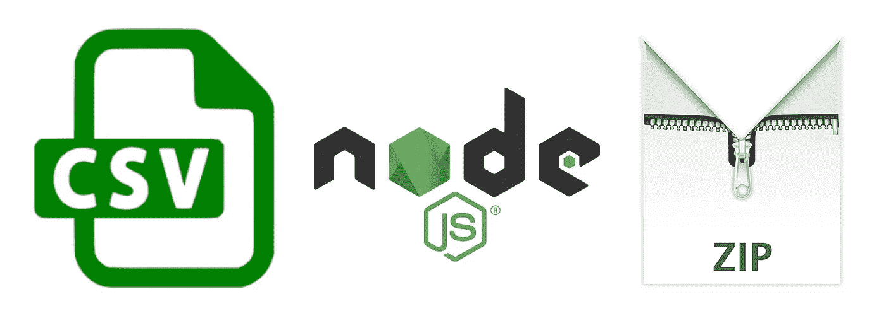
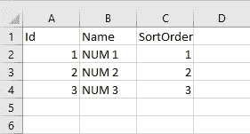
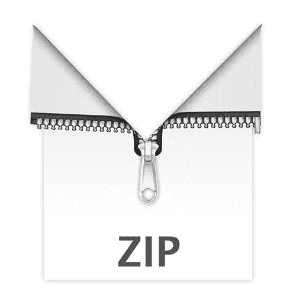

# 用 Node.js 创建 CSV 和 ZIP 文件

> 原文：<https://betterprogramming.pub/creating-csv-and-zip-files-with-node-js-4ca136852019>

## 详细的指南



Node.js 有一个非常健壮的文件管理系统，有很多本地文件操作功能。除了 Node 强大的原生特性， [JSZip](https://stuk.github.io/jszip/) 是一个方便的 JavaScript 库，用于创建、读取和编辑 Zip 文件。我将在这篇文章的后面更深入地讨论它，但是现在，这里是文件生成的一些上下文。

用户需要能够生成一个裸数据模板，以便稍后提交。该模板由不同的 [CSV 文件](https://www.lifewire.com/csv-file-2622708)组成，将用于数据处理。总共有六个 CSV 文件，但是需要根据用户输入动态生成一个文件。姑且称之为`nums.csv`。

*注意:由于我们的其他文件是静态的，所以它们会保存在项目中自己的模板目录中，以供参考。稍后会详细介绍。*

`nums.csv`需要能够拥有从 1 到 10 的行，这取决于用户的输入。行数在如何处理数据方面起着关键作用。在我们处理这个文件之前，让我们看看我们的 UI，它是使用 [React](https://reactjs.org/) 和 [Ant Design](https://ant.design/) 构建的。


我们将使用 Ant Design 的[按钮](https://ant.design/components/button/)和[输入数字](https://ant.design/components/input-number/)组件

这里我们有一个按钮，当点击时，显示我们的数字输入和提交按钮。


当输入/提交按钮打开时，我们原来的按钮的文本变为关闭。

用户选择想要生成多少个`nums` (对应于行数和这些行中的值)。他们输入的数字存储在 state 中。当他们点击*下载*时，`createTemplate`被执行。见下文。

为了创建可行的 CSV 内容，我们需要为每一行创建数组。数组中的信息将与行相对应。在第一行，我们初始化一个名为`rows`的数组，包含一个字符串数组( *Id* 、 *Name* 和 *SortOrder* )。这些将是我们的`nums.csv` 文件中的列标题。

然后，`createTemplate`使用`this.state.nums`来决定为我们的 rows 变量生成多少行。如果`this.state.nums`是三，那么该函数将添加一个包含 Id、Name 和 SortOrder 值的数组(行)三次。第一行的 Id 为 1，名称为`NUM 1`，排序顺序为 1。

一旦我们有了数组(行)的数组，我们就声明变量`csvContent`。`csvContent`将以字符串的形式存储 CSV 数据。我们需要映射`rows`，并对每个数组元素执行`.join(",")`。这将把每个数组转换成一个字符串。为什么我们用逗号连接数据？逗号是 CSV 文件分隔列值的方式。事实上，CSV 代表*逗号分隔值*。


现在，我们有一个字符串数组。最终确定 CSV 字符串内容的最后一步是对字符串数组执行另一个`.join()`。我们的字符串数组目前看起来像这样:

```
["Id,Name,SortOrder", "1,NUM 1,1", "2,NUM 2,2", "3,NUM 3,3"]
```

我们用`\n`连接我们的数据，因为这个字符表示换行符。如果我们不包括这一点，我们所有的数据将出现在同一行。`\n`允许我们在移动到下一个元素时开始新的一行。所以`\n`会在 Id，Name，SortOrder 和 before 1，NUM 1，1 之间开始一个新行。在这一切的最后，`csvContent`看起来会是这样的:

```
"Id,Name,SortOrder
1,NUM 1,1
2,NUM 2,2
3,NUM 3,3"
```

接下来的几个步骤将把我们从上面笨拙的字符串带到下面有组织的数据。



现在我们有了我们的`csvContent`，我们可以把它传递给`this.props.createTemplate`。该功能将`{csv: csvContent}`传递给动作。当动作被分派时，一个请求被发送到控制器。我们将在控制器中创建文件。

在我们进入函数之前，我们需要这些本地节点依赖关系:

```
path = require(“path”),
fs = require(“fs”) 
//don’t need npm install for either of these
```

以及用于创建 zip 文件的 npm 包 JSZip。

```
JSZip = require(“jszip”); //npm install needed
```

现在我们可以开始创建所有文件的函数了，`createTemplate`。

这个函数有很多代码，我们一行一行来看。

```
const dir = path.resolve(__dirname) + '/template/';
```

这一行声明了前面提到的其他五个 CSV 文件所在的目录。见下文。


路径可以表示为{PROJECT_DIRECTORY}/template/…

我们需要这个路径来读取其他文件的文件数据并压缩它们，以及传递的`nums.csv`数据。`path.resolve()`将当前模块的目录名(`__dirname`)解析为绝对路径(`/template/`)。这样我们就不必根据环境改变路径，它总是相对于项目目录。

```
var zip = new JSZip();

zip.file('nums.csv', req.body.body.csv) 
```

这几行代码创建了 JSZip(我们的 Zip 文件)的一个实例，然后将我们的`nums.csv`文件添加到其中。`.file()`是一个 JSZip 函数，允许我们向 Zip 文件中添加一个文件，并给它一个文件名。`req.body.body.csv`是我们作为有效载荷发送的 `csvContent`。

现在，让我们继续进行`[fs.readdir](https://nodejs.org/api/fs.html#fs_fs_readdir_path_options_callback)()`。

`fs`是节点与[文件系统](https://nodejs.org/api/fs.html)交互的模块。`fs.readdir()`读取给定的目录，并执行回调函数。这个回调包含两个参数，文件(文件名及其扩展名)和`err`，这代表了`fs.readdir`可能遇到的错误。对于我们的例子，我们使用这个函数读取我们的`dir`变量来访问`/template/`中的文件。回调函数之前的`[async](https://developer.mozilla.org/en-US/docs/Web/JavaScript/Reference/Statements/async_function#Simple_example)`至关重要，因为我们希望异步读取文件。这确保了我们不会在之前返回数据*我们已经能够读取所有的文件并将它们添加到我们的 zip 中。接下来，我们需要看一下`[promises](https://developer.mozilla.org/en-US/docs/Web/JavaScript/Reference/Global_Objects/Promise)`。*

```
var promises = files.map(function(_path){...} 
```

我们映射文件并为每个文件名返回一个`Promise`，因为我们想要执行另一个异步动作`[fs.readFile()](https://nodejs.org/api/fs.html#fs_fs_readfile_path_options_callback)`。在文件的*数据*(不仅仅是文件名和扩展名)被读取之前，我们不想返回任何数据。

如果没有承诺，该函数将返回一个空对象作为响应，因为该函数将继续运行，而不会等待`fs.readFile()`。我们一会儿将重温承诺，但是现在，让我们继续讨论`fs.readFile()`。

```
fs.readFile(dir + _path, 'utf8', function(err, data){ if(err){
    *console*.log(err);
    resolve("");
  } else {
    resolve({filename: _path, content: data});
  }});
```

我们连接`dir + _path`来创建访问我们目录中的文件所需的绝对路径。如果是`dir === 'ROOT_PROJECT_DIRECTORY/template/'`和`_path === file.csv`，那么连接两者将得到`'ROOT_PROJECT_DIRECTORY/template/file.csv'`，这是该文件的绝对路径。`['utf8'](https://www.w3schools.com/charsets/ref_html_utf8.asp)`指定编码格式，我们接受`err`和`data`的回调函数将解析或拒绝当前的`Promise`。

`data`是读取的文件数据(文件的实际内容)。当我们有了这些数据，我们就把它作为一个对象。该对象将包含文件名以及文件内容。当我们想把它添加到我们的 zip 中时，这是很重要的。在那之前，我们还有一步。就一次，我保证。

看看这部分街区:

```
}.bind(this, _path));
```

这一行允许我们维护`this`和`_path`的[词法](https://whatis.techtarget.com/definition/lexical-scoping-static-scoping)值，否则它们会在我们的异步函数中丢失。我们的`_path`将是`undefined`，我们的`Promise`将被拒绝。在这一行之后，我们应该有一个可以传递给`[Promise.all()](https://developer.mozilla.org/en-US/docs/Web/JavaScript/Reference/Global_Objects/Promise/all)`的`Promises`数组。

`[Promise.all()](https://developer.mozilla.org/en-US/docs/Web/JavaScript/Reference/Global_Objects/Promise/all)`接收数组，当数组中的所有`Promises`都被解析后，返回一个解析的`Promise`。现在我们终于可以开始向 JSZip 实例添加文件数据了。这是从`Promise.all()`之后的`[.then()](https://developer.mozilla.org/en-US/docs/Web/JavaScript/Reference/Global_Objects/Promise/then)`开始的。

`.then()`使我们能够执行一个回调函数来处理我们的`Promise`，无论它是已解决的还是被拒绝的。我们可以从这里开始向 zip 文件添加文件。

```
results.forEach((obj)=>{
   zip.file(obj.filename,obj.content);
})
```



这里，我们迭代数组并使用 JSZip 的`.file()`。这个函数接受两个参数，文件名和文件内容。这将在用户提取 zip 文件时使用。`obj.filename`将指向`obj.content`(很像 Mac 的 Finder 或 Window 的文件浏览器中文件名与实际文件的对应关系)。最后，我们转移到回调的`try`和`catch`部分。

这个 [try and catch](https://developer.mozilla.org/en-US/docs/Web/JavaScript/Reference/Statements/try...catch) 语句将 *try* 一个语句(在我们的例子中是 Promise ),如果这个尝试失败了，*将会捕获*错误并相应地处理它。

在我们的尝试中，我们将使用`[.generateAsync()](https://stuk.github.io/jszip/documentation/howto/write_zip.html)`来异步设置 zip 的文件类型。`[base64](https://developer.mozilla.org/en-US/docs/Web/API/WindowBase64/Base64_encoding_and_decoding)`是编码/解码二进制数据的标准类型，旨在通过媒体存储和传输。我们添加了另一个`.then()`，其中我们将把生成的 zip 文件作为 JSON 响应发送回去。在我们的对象中，我们传递了*标题*(我们希望我们的 zip 被命名的内容)和*内容*(zip 数据)。

回到动作，接收响应并下载 zip 文件。

见下文。

```
var file_path = "data:application/zip;base64," + payload.content;
var a = *document*.createElement("A");
a.href = file_path;
a.download = payload.title;
*document*.body.appendChild(a);
a.click();
*document*.body.removeChild(a);
```

这里我们创建一个锚标签，有一个`download`属性，一个`href`等于`file_path`。

`file_path`利用一个[数据 URL](https://developer.mozilla.org/en-US/docs/Web/HTTP/Basics_of_HTTP/Data_URIs) 。在这个 URL 中，我们包含了`application/zip`来指定 [MIME 类型](https://developer.mozilla.org/en-US/docs/Web/HTTP/Basics_of_HTTP/MIME_types)，以及一个`base64`标记(表示文件不是文本的)，然后我们从响应中追加实际的文件数据。`download`属性被赋予`title`(也来自响应)，一旦文件数据被下载，它将被应用于文件数据。

接下来，我们将 anchor 标记附加到我们的文档主体，在 anchor 上执行`.click()`，模拟一个触发下载的 click 事件。下载完成后，该元素将从我们的文档体中删除，以避免其他人使用相同的下载。

# 摘要

这是开发步骤的分解。

*   获取用户输入以生成 CSV 文件数据，存储为字符串。
*   在请求中将该字符串发送到我们控制器中的`createTemplate`。
*   实例化一个 JSZip 实例。
*   将 CSV 字符串添加到 JSZip 实例中。
*   异步遍历项目目录，将每个文件的数据存储在一个`Promise`中。
*   将所有的`Promises`分解成一个。
*   我们遍历了 Promise 中的文件，并使用`.file()`将它们附加到 JSZip 实例中。
*   使用`.generateAsync()`从我们的 JSZip 实例中异步生成 zip 内容。
*   发回了一个包含压缩文件数据和文件名的 JSON 响应。
*   创建了一个带有`download`属性的锚点标签。
*   从响应数据 URL 中追加的文件数据在我们的锚标签的`href`中。
*   使用`.click()`启动下载，然后从 DOM 中删除锚标记，以防止未经授权的使用。

如果你喜欢这篇文章或者需要澄清任何提到的事情，请在评论中告诉我！

在此 *将您的免费媒体会员升级为付费会员，每月只需 5 美元，您就可以收到来自各种出版物上数千名作家的无限量无广告故事。这是一个附属链接，你的会员资格的一部分帮助我为我创造的内容获得奖励。谢谢大家！*

# 参考

 [## JSZip

### 创造。使用 JavaScript 压缩文件。提供一个简单的 API 将 JavaScript 生成的任何内容放入一个. zip 文件…

stuk.github.io](https://stuk.github.io/jszip/) [](https://www.lifewire.com/csv-file-2622708) [## 什么是 CSV 文件，如何打开它？

### CSV 文件是逗号分隔值文件。所有 CSV 文件都是纯文本文件，只能包含数字和字母…

www.lifewire.com](https://www.lifewire.com/csv-file-2622708)  [## 文件系统| Node.js v12.4.0 文档

### 在 POSIX 系统上，对于每个进程，内核维护一个当前打开的文件和资源的表。每个打开的文件…

nodejs.org](https://nodejs.org/api/fs.html) [](https://developer.mozilla.org/en-US/docs/Web/JavaScript/Reference/Global_Objects/Promise) [## 承诺

### Promise 对象表示异步操作的最终完成(或失败),及其结果…

developer.mozilla.org](https://developer.mozilla.org/en-US/docs/Web/JavaScript/Reference/Global_Objects/Promise)  [## 文件系统| Node.js v12.4.0 文档

### 在 POSIX 系统上，对于每个进程，内核维护一个当前打开的文件和资源的表。每个打开的文件…

nodejs.org](https://nodejs.org/api/fs.html#fs_fs_readfile_path_options_callback) [](https://developer.mozilla.org/en-US/docs/Web/JavaScript/Reference/Statements/async_function#Simple_example) [## 异步功能

### 异步函数声明定义了一个异步函数，该函数返回一个异步函数对象。

developer.mozilla.org](https://developer.mozilla.org/en-US/docs/Web/JavaScript/Reference/Statements/async_function#Simple_example)  [## 文件系统| Node.js v12.4.0 文档

### 在 POSIX 系统上，对于每个进程，内核维护一个当前打开的文件和资源的表。每个打开的文件…

nodejs.org](https://nodejs.org/api/fs.html#fs_fs_readfile_path_options_callback) [](https://whatis.techtarget.com/definition/lexical-scoping-static-scoping) [## 什么是词法范围(静态范围)？-WhatIs.com 的定义

### 词法作用域(有时称为静态作用域)是许多编程语言使用的一种约定，它设置了…

whatis.techtarget.com](https://whatis.techtarget.com/definition/lexical-scoping-static-scoping) [](https://developer.mozilla.org/en-US/docs/Web/JavaScript/Reference/Global_Objects/Promise/all) [## Promise.all()

### Promise.all()方法返回一个承诺，当作为 iterable 传递的所有承诺都有…

developer.mozilla.org](https://developer.mozilla.org/en-US/docs/Web/JavaScript/Reference/Global_Objects/Promise/all) [](https://developer.mozilla.org/en-US/docs/Web/JavaScript/Reference/Global_Objects/Promise/then) [## Promise .原型. then()

### then()方法返回一个承诺。它需要两个参数:成功和失败情况下的回调函数…

developer.mozilla.org](https://developer.mozilla.org/en-US/docs/Web/JavaScript/Reference/Global_Objects/Promise/then) [](https://developer.mozilla.org/en-US/docs/Web/JavaScript/Reference/Statements/try...catch) [## 尝试...捕捉

### 尝试...catch 语句标记要尝试的语句块，并指定在引发异常时的响应。

developer.mozilla.org](https://developer.mozilla.org/en-US/docs/Web/JavaScript/Reference/Statements/try...catch)  [## 如何编写文件/将文件交给用户

### 创造。使用 JavaScript 压缩文件。提供一个简单的 API 将 JavaScript 生成的任何内容放入一个. zip 文件…

stuk.github.io](https://stuk.github.io/jszip/documentation/howto/write_zip.html) [](https://developer.mozilla.org/en-US/docs/Web/API/WindowBase64/Base64_encoding_and_decoding) [## Base64 编码和解码

### Base64 是一组类似的二进制到文本的编码方案，它们通过…

developer.mozilla.org](https://developer.mozilla.org/en-US/docs/Web/API/WindowBase64/Base64_encoding_and_decoding) [](https://developer.mozilla.org/en-US/docs/Web/HTTP/Basics_of_HTTP/Data_URIs) [## 数据 URL

### 数据 URL，即以 data: scheme 为前缀的 URL，允许内容创建者在文档中内嵌小文件。

developer.mozilla.org](https://developer.mozilla.org/en-US/docs/Web/HTTP/Basics_of_HTTP/Data_URIs) [](https://developer.mozilla.org/en-US/docs/Web/HTTP/Basics_of_HTTP/MIME_types) [## MIME 类型(IANA 媒体类型)

### 媒体类型(也称为多用途互联网邮件扩展或 MIME 类型)是一种标准，表示…

developer.mozilla.org](https://developer.mozilla.org/en-US/docs/Web/HTTP/Basics_of_HTTP/MIME_types)