# 创建自定义 Eslint 规则

> 原文：<https://betterprogramming.pub/creating-custom-eslint-rules-cdc579694608>

## 如何像专业人士一样使用 Eslint


[廷杰伤害律师事务所](https://unsplash.com/@tingeyinjurylawfirm?utm_source=medium&utm_medium=referral)在 [Unsplash](https://unsplash.com?utm_source=medium&utm_medium=referral) 上的照片

# **简介**

ESLint 是一个静态代码分析工具，用于识别 JavaScript 代码中的问题模式。尼古拉斯·c·扎卡斯在 2013 年创建了它。ESLint 规则是可配置的，并且可以定义和加载定制规则。

ESLint 涵盖了代码质量和编码风格问题。简而言之，ESLint 是一个代码分析工具，用于代码格式化、错误检查、强制代码样式等。它用于在整个项目中强制实施代码样式。ESLint 中有一些标准的代码风格。这些格式和样式被称为规则。

本文将解释如何创建您自己的定制 ESLint 规则，并使用 ESLint 模块创建一个脚本，用于 Lint 文件。

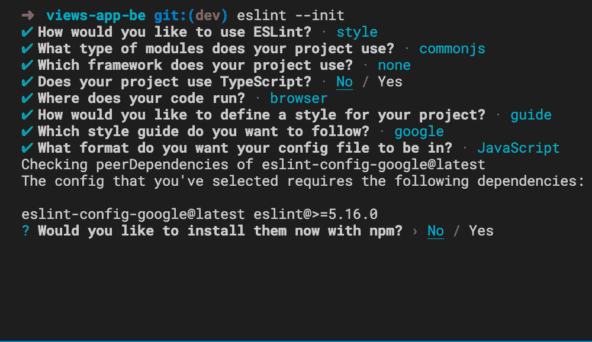

# **项目设置**

我们将创建一个简单的 TypeScript 项目。这将是准系统，只是几个文件来测试我们的自定义规则。

运行以下命令来设置 typescript 项目:

```
npm init –ytsc — init
```

这些命令将为我们创建`package.json` 和`tsconfig.json` 文件。

将`tsconfig.json` 文件替换为以下内容:

接下来，让我们为我们的项目设置 ESLint。

使用以下命令为您的项目安装 ESLint:

```
npm install eslint — save-dev
```

接下来，使用以下命令为项目设置 ESLint:

```
npm init @eslint/config
```

按照提示，回答如下图所示的问题:

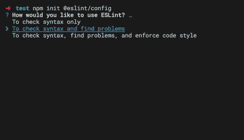

我们的`eslintrc.js` 文件应该看起来像下面这个:

现在我们的项目已经完全设置好了，我们可以编译我们添加的任何文件并 lint 这些文件。

# 创作我们的林挺剧本

接下来，我们需要创建脚本来 lint 我们的文件。我们将从我们的节点脚本中使用`eslint` 模块来完成这个魔术，而不是运行`eslint` ***。*** 来自我们的终点站。我们将使用`glob` 包来获取这个脚本中的文件，所以我们需要安装它。您可以运行以下命令来安装它:

```
npm i glob
```

我们还需要安装一些类型的定义。运行以下命令进行安装:

```
npm i -D @types/eslint @types/node @types/glob
```

现在，我们可以创建一个名为`lint_files.ts` 的文件，并在其中插入以下内容:

这个文件非常容易理解。我们有四个助手功能用于改变我们的控制台的颜色。这样，我们可以在必要的地方添加信息、成功、警告和错误日志。

当这个脚本被调用时，最后一个函数被调用。在这个函数中，首先，我们使用`glob`模块获取所有的 TypeScript 和 JavaScript 文件。接下来，我们过滤从`glob` 返回的文件，只返回 TypeScript 和 JavaScript 文件，因为这些是我们想要 lint 的文件。接下来，我们创建一个 eslint 对象。

根据[文档](https://eslint.org/docs/developer-guide/nodejs-api#-new-eslintoptions)，我们传递一些我们需要的参数，比如扩展名、`errorOnUnmatchedPattern`和`baseConfig`，也就是`eslintrc.js`文件(ESLint 配置)。我们还传递另一个重要参数:`rulePaths`。该选项告诉 ESLint 查找该目录，并检查该目录中定义的任何 ESLint 规则。

我们遍历所有文件，然后调用`lintFiles`方法，该方法执行林挺并修复问题(如果可以修复的话)。然后我们遍历从林挺得到的结果，这是一个 lint 结果数组，包含每个被 lint 的文件。`message`属性是每个文件中每个错误的错误消息对象。`message`属性的`severity`属性可以是 1 表示警告，也可以是 2 表示错误。

在运行这个脚本之前，我们需要创建我们指定为`rulePaths`的目录。在根项目中创建一个名为`lint_rules`的文件夹，并在其中创建任何文件，然后编译代码。如果运行该脚本，您应该会看到以下内容:

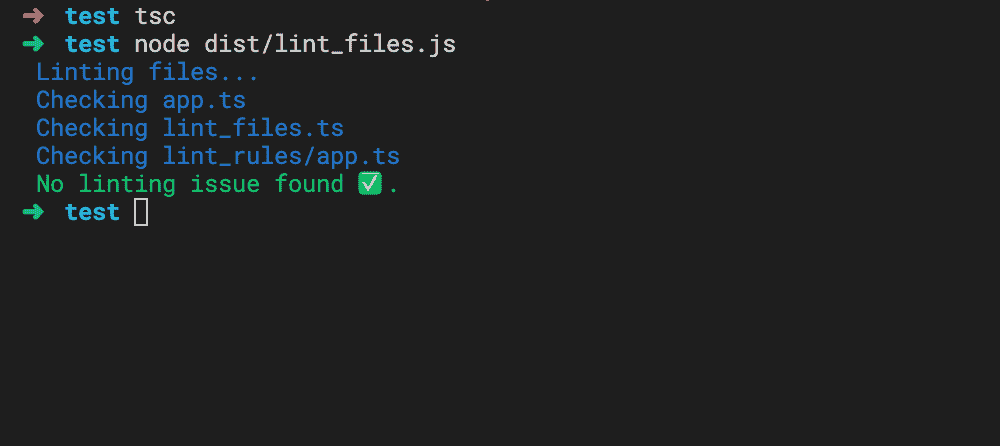

正如我们所期望的，我们不应该有任何错误。

# 创建我们的第一条规则

这一部分将集中于创建我们的第一个定制规则，但是在此之前，我们需要理解代码是如何构造的。我们通过使用 AST explorer，抽象语法树来做到这一点。AST explorer 有助于解释我们代码的分解。让我们来看看下面的代码示例:

我们将使用 [AST explorer](https://astexplorer.net/) 网站，如下所示:

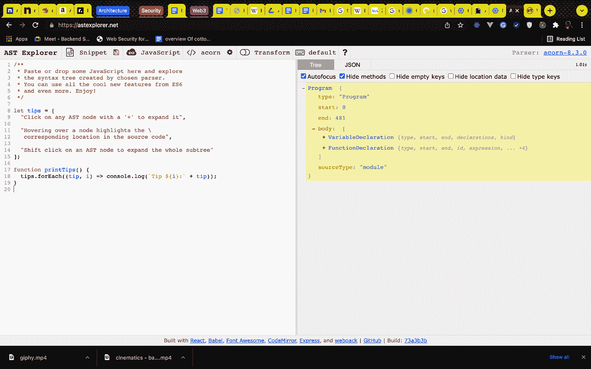

如果我们将鼠标指向代码的任何部分，我们就可以遍历该节点。让我们以 `printTips`函数为例。

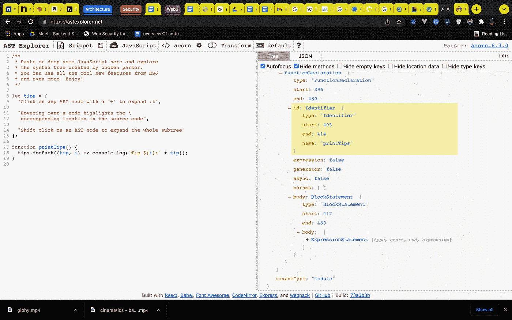

我们可以使用`FunctionDeclaration`节点访问`printTips`函数声明。我们可以使用`parent` 属性访问类似`type`、`id`、`name` 甚至是父节点的属性。

让我们再举一个例子，假设我们有下面的代码片段:

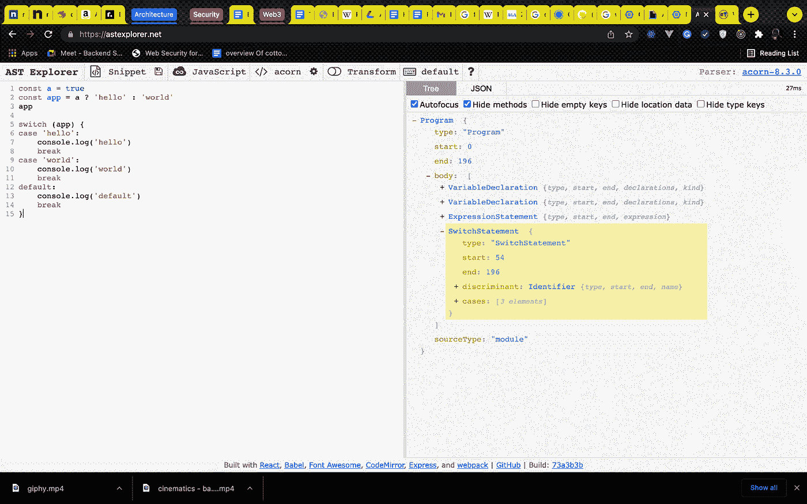

我们可以通过使用`SwitchCase`节点并检查节点的`test.value`属性是否是我们想要的来访问任何案例。例如，如果我们正在处理第一种情况，我们可以使用`SwitchCase`节点并检查`node.test.value`是否与`hello`相同。

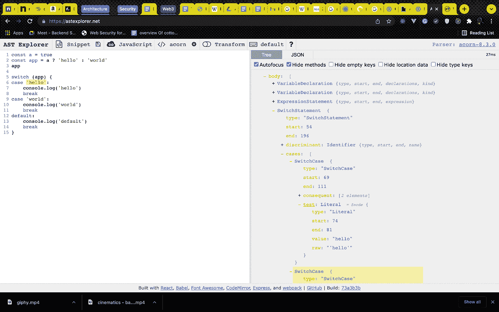

现在，回到我们的[自定义规则](https://eslint.org/docs/developer-guide/working-with-rules)。为了创建自定义规则，我们将在之前创建的`lint_rules`文件夹中创建一个文件。文件名应该是规则名。我们将在本文中创建的规则将禁止在我们项目的`dangerous`目录之外命名函数`dangerous`。

在`lint_rules`目录下创建一个文件名`no_dangerous_function.js`，并粘贴以下内容:

首先，我们创建了一个助手函数，它接受两个参数，`context` 和`node` ，并检查被链接的文件是否在根项目的`dangerous` 目录中。如果它在这个目录中，我们就退出这个函数，但是如果文件不在`dangerous` 目录中，我们就报告一个错误`context.report`，它需要一些选项。第一个是有错误的节点，第二个是将显示为林挺消息的消息，而`fix`是可用于修复错误的函数，是可选的。

我们还导出了一个传递给 ESLint 的对象，该对象描述了规则的元数据。如果你想让 ESLint 修正这个规则，你需要将`fixable` 属性传递给`meta`，它可以是`code` 或者`whitespace`。

`create` 属性是一个接受`context` 对象的函数，这里是我们进行实际工作的地方。我们有三种节点:

1.  调用表达式:该节点检查函数何时被调用
2.  函数声明:该节点检查何时使用`function`关键字声明函数。
3.  箭头函数表达式:该节点检查何时使用箭头函数声明函数。

我们的用例需要这三个节点，因为我们想确保名为`dangerous` 的函数不会在`dangerous` 目录之外以任何方式被调用或声明。

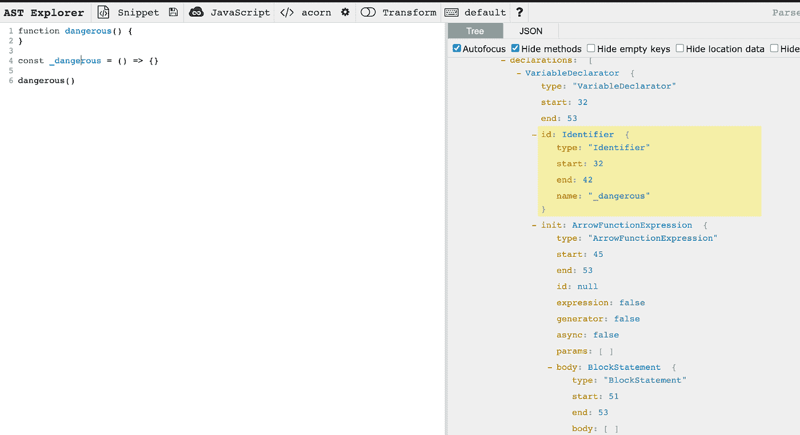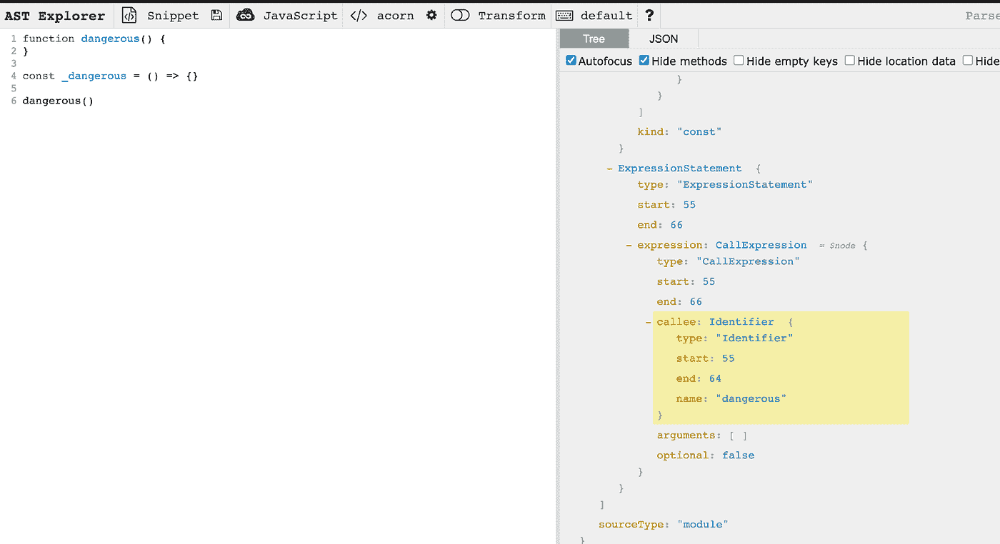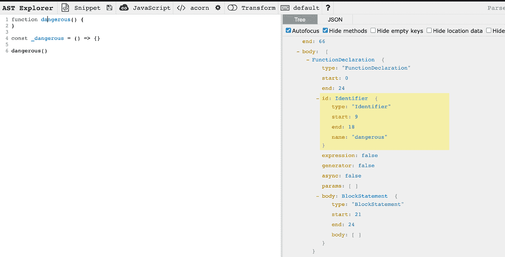

从上面的图片中，我们可以看到我们选择每个节点的原因，以及我们能够访问`node.parent.id.name`获取箭头函数表达式、`node.id.name`获取函数声明以及`node.callee.name`获取调用表达式的原因。接下来，我们需要启用这个规则，通过添加这个规则来编辑`eslintrc.js`文件的规则属性。

将其作为另一个属性添加到您的`eslintrc.js`文件的规则属性中:

```
no_dangerous_function: ‘error’,
```

现在，您的所有文件都应该会给您一条如下所示的错误消息:

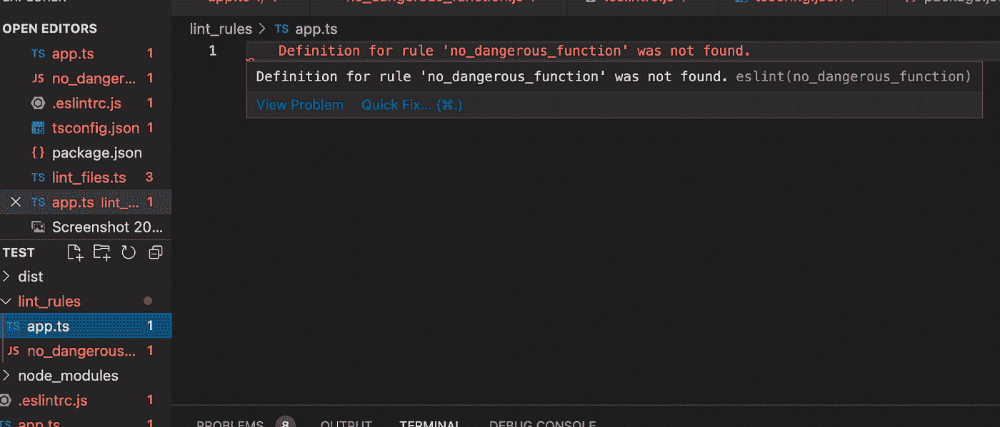

这是因为 VSCode 的 ESLint 扩展找不到此规则。我们稍后会解决这个问题。现在让我们测试我们的规则。在您的`app.ts`文件中，添加以下内容:

```
export {}function dangerous () { console.log(‘dangerous’)}dangerous()
```

如果您再次清理文件，您应该会收到以下错误消息。这证明了，即使我们的编辑器给出了一个错误信息，说它看不到规则，我们还是把它添加到了`eslintrc.js`文件中，我们没有收到警告，告诉我们不要在 `app.ts`文件中命名函数“`dangerous`，所以我们的规则运行得很好。

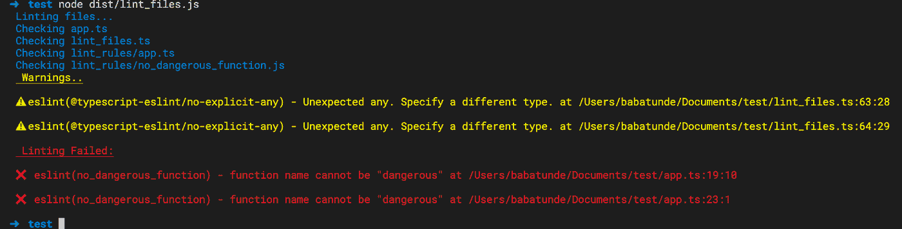

让我们创建一个名为`dangerous` 的目录，并在其中创建一个文件。之后，我们最终可以将相同的代码粘贴到我们的`app.ts`文件里面，如下图所示:

```
export {}function dangerous () { console.log(‘dangerous’)}dangerous()
```

如果我们再次丢弃我们的文件代码，只有`app.ts`文件会产生错误。

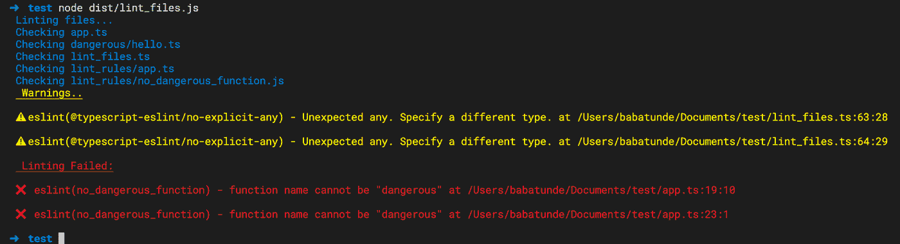

让我们在项目的根目录下创建另一个文件，通过在这个文件中创建一个名为`dangerous` 的函数来测试 arrow 函数。

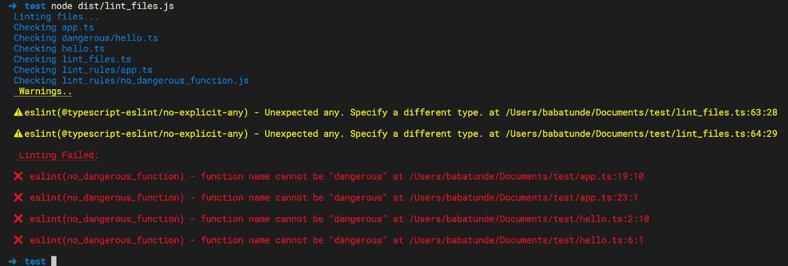

# 配置我们的编辑器和 Eslint

若要修复警告“找不到规则‘no _ dangerous _ function’的定义。eslint(no_dangerous_function)，"我们需要告诉 VSCode 检查特定目录中的自定义规则。为此，我们需要为我们的项目创建 VSCode 设置。这是通过在我们项目的`.vscode`目录中创建一个`settings.json`文件来完成的。将以下内容粘贴到该文件中:

```
// Place your settings in this file to overwrite default and user settings.{ “eslint.options”: { “rulePaths”: [“lint_rules”], }}
```

所有这些错误应该会消失，而且 VSCode 也足够聪明，可以在林挺我们的文件之前警告我们。

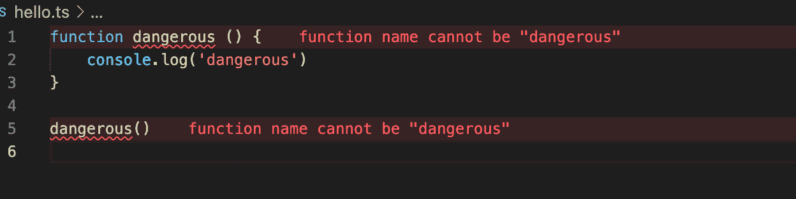

# 为我们的规则添加修复程序

如果我们悬停在该错误上并单击修复按钮，我们只能禁用该规则。但这还不够。我们可能想让 ESlint 为我们自动修复一些规则的问题。

例如，对于这条规则，如果 ESLint 的 fix 选项为真，或者当我们单击**快速修复**按钮时，我们可以决定我们想要自动将函数名更改为`notDangerous`或其他名称。


我们已经将`context.report`中的`fix`方法注释掉了，取消对该方法的注释，现在点击快速修复选项会给我们带来更多有趣的功能。此外，当我们 lint 时，文件会自动修复，因为我们已经将 fix 设置为 true。

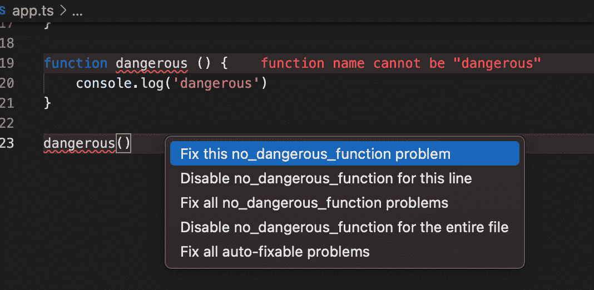

如果我们点击按钮，功能名称将变为`notDangerous`。让我们再次 lint 我们的文件，但我们所有的错误将被自动修复。


如果你检查你的源代码，`dangerous` 函数应该变成了`notDangerous`。

# **接下来的步骤**

本文通过 typescript 帮助您设置和使用 ESLint，使用 ESLint 模块而不是 CLI 工具，并为您的项目创建您自己的定制 ESLint 规则。

您可以使用第一个规则背后的思想，创建更多的规则来实施您和与您一起工作的开发人员想要遵循的样式。

你可以在 [Github](https://github.com/Babatunde13/eslint-rules) 上查看这篇文章的源代码，或者在 [Twitter](https://twitter.com/bkoiki950) 上联系我。