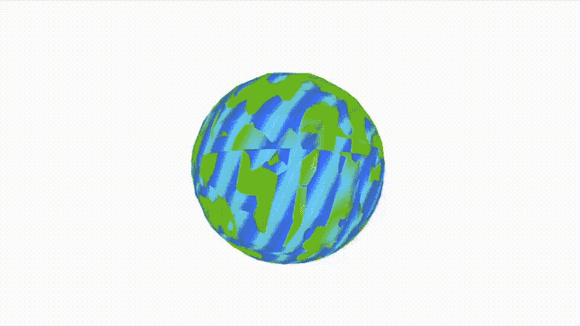
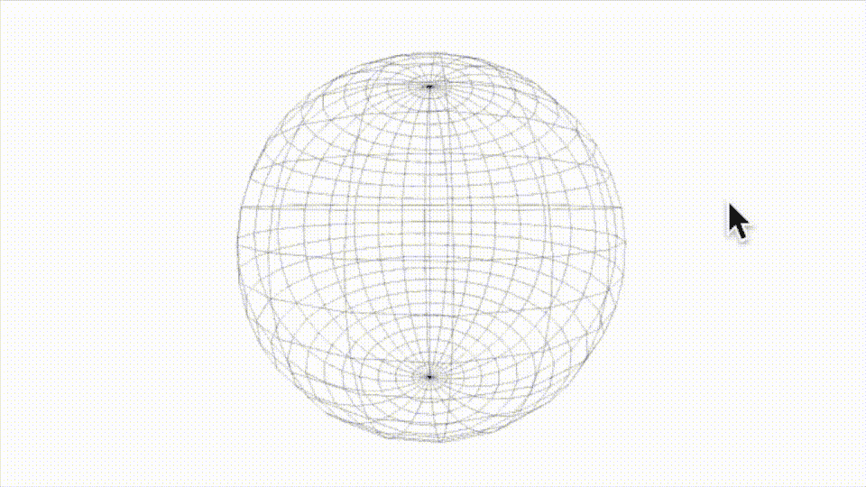
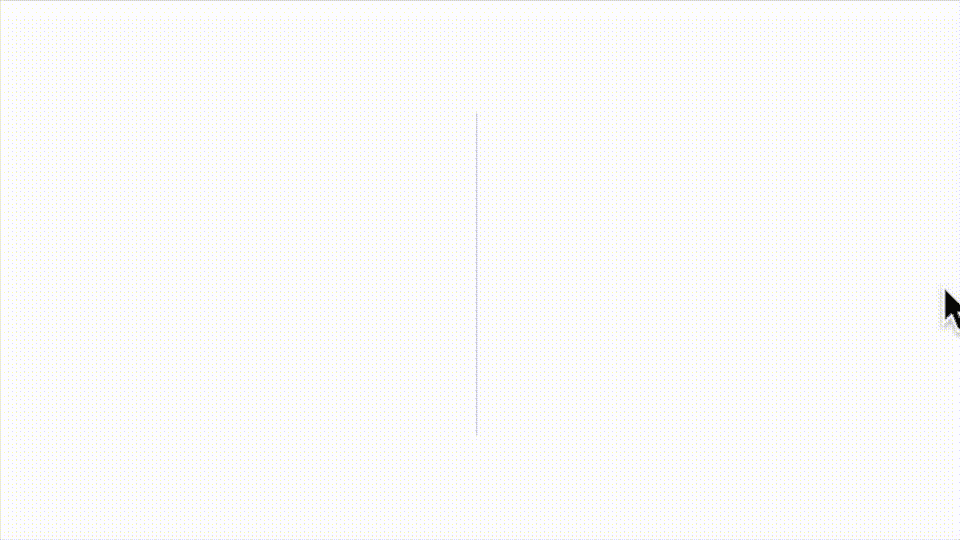
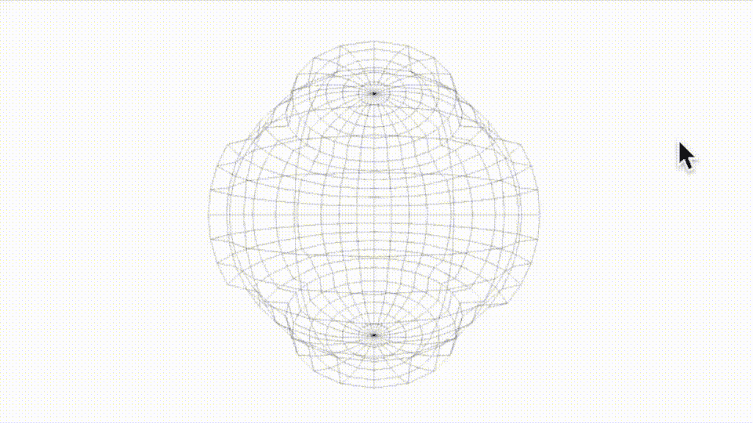
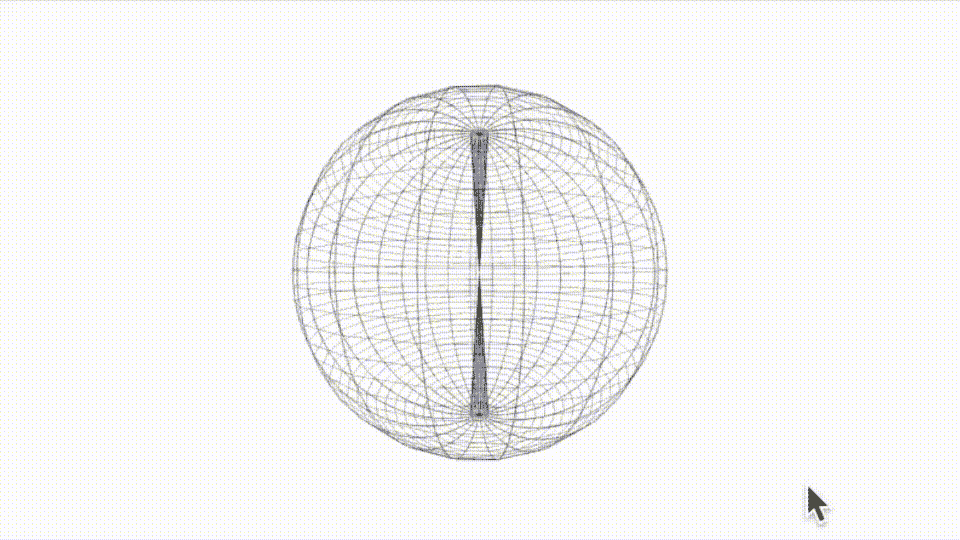
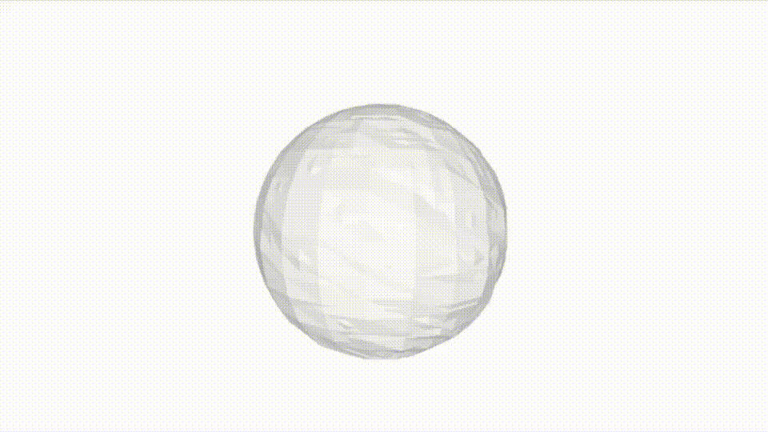

# 在 SwiftUI 下的 SceneKit 中使用标准形状创建自定义几何体

> 原文：<https://betterprogramming.pub/creating-custom-geometry-with-standard-shapes-in-scenekit-under-swiftui-48f38743454f>

## 继续我对 SceneKit 的调查



一个虚构的星球——一个自定义形状，使用球面作为基础绘制

不久前，我写了一篇关于 Swift 算法库的[文章](/8-algorithms-destined-for-the-standard-library-in-swift-d5a407ae625a)。苹果开发的一套代码原语，嗯，有一天可能会成为核心的 Swift 语言。这些实现可能是比你我有时间精心制作的代码更好的代码。像堆栈和双端数组这样的数据结构——你应该使用而不是重新发明代码。

同样，我想继续探索自定义几何网格和形状，即重用苹果已经编写的代码，尽管可能与 Swift 算法库略有不同。

现在，在 SceneKit 中，你可以构建六个预定义的形状，比如`SCNSphere`、`SCNCylinder`和`SCNBox`。他们都很好，但有时你想要/需要更多。

此外，通过在您的自定义几何体中使用这些预定义的形状，您可能会变得更容易一些——和我一起看看如何使用 SceneKit 来构建您的模型的基本框架，然后在以后添加到它。请注意，我计划使用本月早些时候在本文中发表的 createGeometry 例程。

和以前一样，我想从一些代码开始，通过扩展提取顶点模板来构建给定的形状。提前为这段代码道歉，它与其他一些 scene kit snip-let 一样，看起来属于计算机科学类。

为 Swift 5.5 从对象的几何图形中返回顶点的扩展

现在几个音符；正如我说的，这是一个模板，所以在标准对象的情况下，我得到的是 1x1x1 的东西，不管我放进去的是什么大小。

为了使结果更加实用，我添加了代码来潜在地增加模板的大小。这是我在 SceneKit 中作为自定义对象重新导入和重绘的数据的图像。



从 SceneKit 中计算的顶点构造的自定义球体

澄清一下，我没有计算这个球体的顶点。SceneKit 做了所有的计算。我只是提取它们，然后用它们来构建你在这里看到的自定义球体。将所有这些放在一起的代码如下所示。

如果您运行这段代码并仔细观察，您可能会注意到一些奇怪的事情，您得到了超过 600 个顶点；它有 625——超过 600 的顶点形成这个形状。



您将在球体集中找到其他数据

bon——现在你可能会问，在这一点上我们要做什么。毕竟，我所做的不仅仅是简单地做了一件我本可以用线条材料更难完成的工作。所以和我一起去找点乐子。假设您有了坐标，在重建几何图形之前，通过添加以下行代码来修改其中的一些坐标—

```
**if** vectors![i].y > 1.5 || vectors![i].y < -1.5 || vectors![i].x > 1.5 || vectors![i].x < -1.5 {**let** newVector = **SCNVector3**(vectors![i].x * 1.1, vectors![i].y * 1.1, vectors![i].z * 1.1)vectors![i] = newVector
}
```

之后你会得到这个——宇宙岩石形状。



一组改变的球体

当然，你可以享受几个小时的乐趣；尝试一下——添加这段代码使顶点数量翻倍，并尝试一下我在这篇文章[中展示的魔山代码。](/build-a-mesh-using-custom-geometry-in-scenekit-under-swiftui-44cadaa3727d)

当然，600 个顶点并不算多，用这段简短的代码将它们翻倍。

产生这种情况的代码——不，我不太清楚内核发生了什么——我让您去研究。



一个有更多顶点的球体集合，这次是我计算的[使用 SCNSphere 作为模板]

事实上，你也可以对经线做同样的事情，但是说够了——真正的乐趣开始于你不使用线，而是弄清楚如何使用三角形。

```
for i in stride(from: 0, to: 3600, by: 1) {
  indices.append(Int32(i + 0))
  indices.append(Int32(i + 1))
  indices.append(Int32(i + 25)) indices.append(Int32(i + 1))
  indices.append(Int32(i + 26))
  indices.append(Int32(i + 25))
}
```

现在我们可以创造一个充满神奇山脉的星球。



覆盖着三角形和魔山的球体

随着“fait au complet”改变我们的几何着色方法，根据土地的高度改变颜色。我这样做是因为这篇文章中的图片。

当然，这并不完美——要达到这一点，你需要更加努力，更加努力地匹配边缘，这是这篇[论文](/build-a-mesh-using-custom-geometry-in-scenekit-under-swiftui-44cadaa3727d)中描述的任务。

所有这些都让我想到了这篇短文的结尾。希望你觉得有用。尝试一些其他形状，尝试鬼混的颜色和顶点返回…这是一个真正的兔子洞。