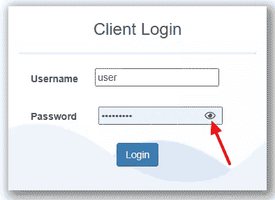

# 为 Power Platform 创建自定义密码 PCF 组件

> 原文：<https://betterprogramming.pub/creating-custom-password-pcf-component-for-the-power-platform-591ab6645b28>

## UI/UX 设计、现成软件和编码的集合


杰里米·贝赞格在 [Unsplash](https://unsplash.com?utm_source=medium&utm_medium=referral) 上拍摄的照片

无论是仅仅因为设计、功能缺失，还是两者兼而有之，每个使用 Dynamics 365 的编码人员都会在某个时候遇到需要创建 PCF 的特性。所有创建过 PCF 组件的人都知道，第一次时(甚至第二次时)可能会头疼。).

因此，我决定为所有有抱负和不情愿的 PCF 开发人员创建一个教程，引导他们创建一个经常被请求的组件——一个能够通过单击一个眼睛形状的按钮来切换可见性的密码输入字段。下面可以看到一个例子:



来源:[https://www . CSE stack . org/hide-show-password-eye-icon-html-JavaScript/](https://www.csestack.org/hide-show-password-eye-icon-html-javascript/)

令人惊讶的是，像这样的输入控件在 dynamics 生态系统中是不存在的，而且该特性看似简单，但与实现的容易程度毫无关系。我花了几个小时才弄明白这个问题。

我们将从一些样板 PCF 代码开始，这些代码可以通过遵循微软文档[上的说明获得。只需用`PasswordInputControl`替换所有对名称`LinearInputControl`的引用，并用您选择的名称空间替换名称空间。](https://docs.microsoft.com/en-us/powerapps/developer/component-framework/implementing-controls-using-typescript)

我们的起点是五个私有变量的声明。特别值得注意的是变量`_eye`和`isVisible`，它们是非标准的。`_eye`将成为我们的状态切换按钮，`isVisible`将是一个布尔变量，对应于(你猜对了)输入字段中文本的可见性。

接下来，我们将在`PasswordInputControl`中创建一个名为 css 的子文件夹，我们将下面的代码放在一个名为`style.css`的文件中，以便将`_eye`按钮设计成眼睛。

下面，在`init`函数中，我们将把所有组件添加到主容器中。

更重要的是，我们将为`_eye`添加一个带有函数`toggleState`(我们将在后面定义)的事件监听器，并将`isVisible`布尔值设置为 false，因为密码字段中的文本应该以不可见开始。

toggle state 实际上所做的只是切换布尔值`isVisible`(假变为真，真变为假)。

完成此更改后，调用`_notifyOutput`功能，触发`updateView`功能。

`UpdateView`负责根据 isVisible 切换可见性(参见第 14–19 行)…。令人尴尬的是，我花了很长时间才弄明白是`notifyOutputChanged`触发了`updateView`。如果你和我一样是新手，我希望这会给你带来一些麻烦。

一旦实现了这段代码，只需导航到`src`文件夹并运行这三个命令:

```
npm install -g
npm run build
npm start
```

这将在浏览器中启动您的组件，并允许您使用开发工具测试和调试它。完整的代码可以在下面我的 GitHub 文件夹中找到。

[](https://github.com/AleksaZatezalo/PasswordPCF/blob/main/PasswordInputControl/) [## 主 AleksaZatezalo 的密码 PCF/密码输入控制/密码 PCF

### 在 GitHub 上创建一个帐户，为 AleksaZatezalo/PasswordPCF 开发做出贡献。

github.com](https://github.com/AleksaZatezalo/PasswordPCF/blob/main/PasswordInputControl/)