# 在 CSS 中的 Flexbox 中创建骰子

> 原文：<https://betterprogramming.pub/creating-dice-in-flexbox-in-css-a02a5d85e516>

## 了解如何使用 flexbox 在 CSS 中创建骰子

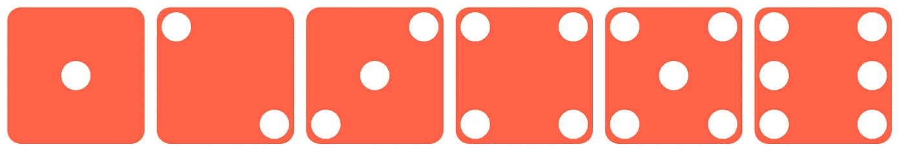

用 CSS 中的 flexbox 创建的骰子

# 第一张脸

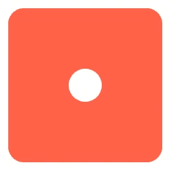

div 的第一面

骰子的`first-face`中心会有一个点。

```
<div class="dice first-face"><span class="dot"> </span></div>
```

这里，我们有`dice`和`dot`分类的元素。现在我们可以给骰子添加一些 CSS。

```
.dice {  
    padding: 4px;  
    background-color: tomato;  
    width: 104px;  
    height: 104px;  
    border-radius: 10%;
}
```

现在，它创造了一个像这样的盒子。

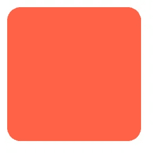

现在，让我们给这个点添加一些样式。

```
.dot {display: block;
   width: 24px;
   height: 24px;
   border-radius: 50%;
   background-color:white;}
```

这将在`dice` div 中添加一个圆。现在，骰子容器看起来像:

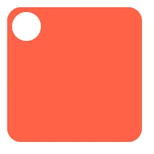

现在，让我们让`dot`容器出现在`dice`容器的中心。为此，我们需要将`first-face` 设为`flexbox`，并应用:

`justify-content:center` →将使点对准主轴中心(水平)。

`align-items:center` →将使点对准横轴的中心(垂直)。

```
.first-face {**display: flex;****justify-content: center;****align-items: center;**}
```

# 第二张脸

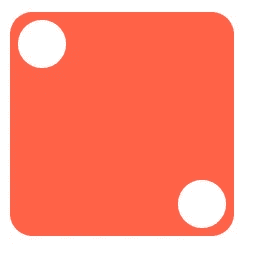

模具的第二面

现在，我们需要创建一个有两个点的骰子——一个点在左上角，另一个点在右下角。

```
<div class="dice second-face"><span class="dot"> </span><span class="dot"> </span></div>
```

制作第二个面为`flex`，并添加:

`justify-content: space-between` →这将把孩子放在`flex-container`的开头和结尾。

```
.second-face{display: flex;

   justify-content : space-between;}
```

上面的代码将创建一个这样的骰子:

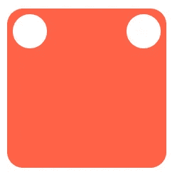

第一个点在正确的位置:左上角。现在，我们需要将第二个点与右下角对齐。为此，将`align-self`属性应用于骰子的第二个点。

`align-self: flex-end` →将项目与柔性容器的末端对齐。

```
.second-face .dot:nth-of-type(2) {align-self: flex-end;}
```

# 第三张脸

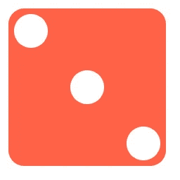

为了实现第三个面，我们有三个点:一个在骰子的左上角，一个在中心，一个在右下角。

```
<div class="dice third-face"><span class="dot"></span>
  <span class="dot"></span>
  <span class="dot"></span></div>
```

我们可以通过在`second-face`上放置另一个点中心来实现`third-face`。

`justify-content: space-between` →这将把孩子放在`flex-container`的开头和结尾。

```
.second-face{display: flex;

   justify-content : space-between;}
```

现在，我们需要将最后一个点(第三个点)放在右下角。

```
.second-face .dot:nth-of-type(3) {align-self: flex-end;}
```

将中间点(`second dot`)对准父节点的中心。

```
.second-face .dot:nth-of-type(2) {align-self: center;}
```

如果我们希望第一个点在右上角，最后一个点在左下角，那么将第一个点的`align-self`更改为`flex-end` ——第三个点将自动放置在左下角，因为`align-self`的默认属性是`flex-start`。


第三张脸改变了

```
.third-face .dot:nth-of-type(1) {align-self :flex-end;}.third-face .dot:nth-of-type(2) {align-self :center;}
```

# 第四张脸

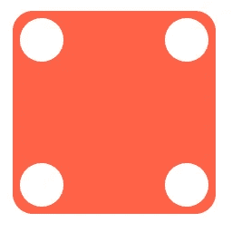

在我们的第四个面中，我们可以把它分成两行，每行包含两列。一排在`flex-start`，另一排在`flex-end`。

```
<div class="fourth-face dice">**<div class="column">
    <span class="dot"></span>
    <span class="dot"></span>
  </div>****<div class="column">
    <span class="dot"></span>
    <span class="dot"></span>
  </div>**</div>
```

上面的代码将创建一个这样的骰子:

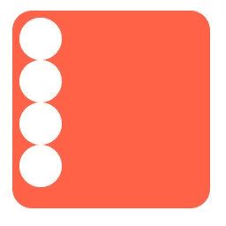

现在应用`display: flex`。

```
.fourth-face {display: flex;}
```

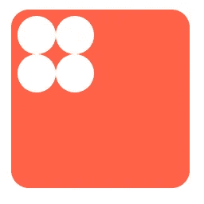

添加`justify-content`属性`space-between`，这样它将被放置在骰子的左边和右边。

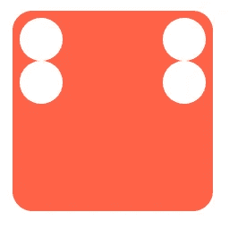

现在，我们需要在顶部和底部的列元素中制作点。为此:

*   将`column`设置为`flex`
*   将`flex-direction`作为`column`使用，使`dots`位于柱轴上
*   添加`justify-content`为`space-between` ——它将使第一个点在顶部，第二个点在底部。

```
.fourth-face .column {display: flex;
  flex-direction: column;
  justify-content: space-between;}
```

# 第六张脸

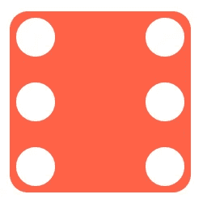

第六张脸

从第四个面开始，我们可以通过向每列添加一个单点 div 来实现第六个面。

```
<div class="fourth-face dice">**<div class="column">
    <span class="dot"></span>
    <span class="dot"></span>
    <span class="dot"></span>
  </div>****<div class="column">
    <span class="dot"></span>
    <span class="dot"></span>
    <span class="dot"></span>
 </div>**</div>
```

# 第五张脸

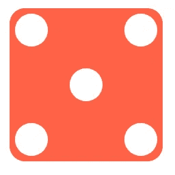

第五张脸

我们可以通过添加另一个带一个点的列，并将点(`justify-content`)放在`center`处，从第四个面再次创建`fifth-face`。

```
<div class="fifth-face dice">

  <div class="column">
    <span class="dot"></span>
    <span class="dot"></span>
  </div>

  **<div class="column">
    <span class="dot"></span>
  </div>**

  <div class="column">
    <span class="dot"></span>
    <span class="dot"></span>
  </div></div>
```

将应用于`.fourth-face`和`.fourth-face .column`的所有属性应用于`.fifth-face`和`.fifth-face .column`。会产生这样一个骰子:

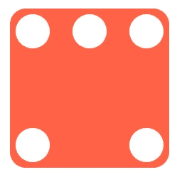

现在，我们需要将第二个点与垂直方向的中心对齐。为此，我们可以将`justify-content`作为`center`应用于`column`。

```
.fifth-face .column:nth-of-type(2) {**justify-content: center;**}
```

那会让骰子看起来像五面骰子。

最终模具

感谢阅读。希望你喜欢这个。