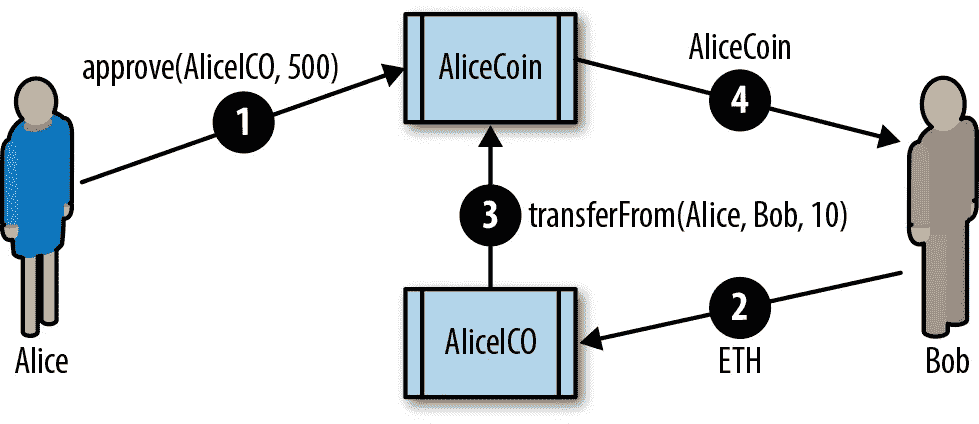
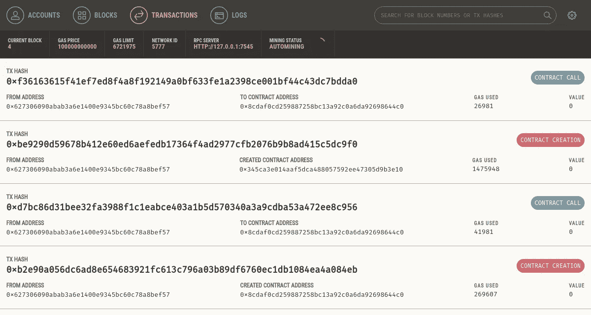
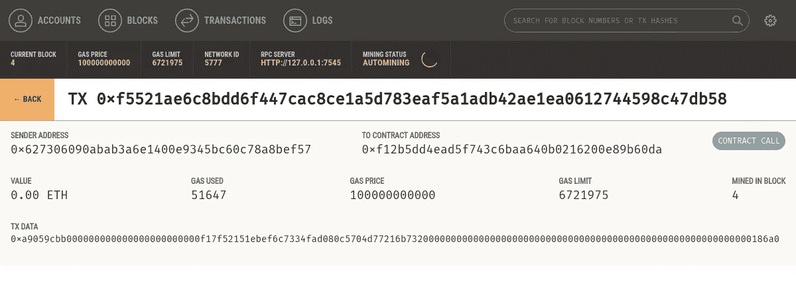

# 在以太坊上创建和部署令牌

> 原文：<https://betterprogramming.pub/creating-erc20-token-on-ethereum-35e109dd96e0>

## 通过创建一个 ERC20 令牌来深入了解它


资料来源:Undraw.co

# erc20 令牌标准

第一个标准由 Fabian Vogelsteller 于 2015 年 11 月作为以太坊征求意见稿(ERC)推出。它被自动分配到 GitHub 发行号 20，由此得名“ERC20 令牌”。目前绝大多数令牌都基于 ERC20 标准。ERC20 征求意见稿最终成为以太坊改进提案 20 (EIP-20)，但它大部分仍被称为原始名称 ERC20。

ERC20 是可替换令牌的标准，这意味着 ERC20 令牌的不同单元是可互换的，并且没有唯一的属性。

[ERC 20 标准](https://github.com/ethereum/EIPs/blob/master/EIPS/eip-20.md)为实现令牌的合同定义了一个公共接口，因此任何兼容的令牌都可以以相同的方式访问和使用。该接口由许多函数组成，这些函数必须出现在标准的每个实现中，还包括一些可选的函数和属性，这些函数和属性可以由开发人员添加。

# ERC20 所需的功能和事件

符合 ERC20 的令牌合约必须至少提供以下功能和事件:

`totalSupply` : 返回当前存在的该令牌的总单位。ERC20 令牌可以有固定或可变的供应。

`balanceOf`*:**给定一个地址，返回该地址的令牌余额。*

*`transfer` : 给定一个地址和金额，将该金额的代币从执行转账的地址的余额中转账到该地址。*

*`transferFrom` : 给定汇款人、收款人、金额将代币从一个账户转账到另一个账户。与 approve 结合使用。*

*`approve` : 给定收款人地址和金额，授权该地址从发出批准的账户执行不超过该金额的多次转账。*

*`allowance` : 给定一个拥有者地址和一个支出者地址，返回支出者被批准从拥有者处提取的剩余金额。*

*转账:事件——转账成功时触发(调用 to transfer 或 transferFrom)(即使是零值转账)。*

*审批:成功调用审批时记录的事件。*

# *ERC20 可选功能*

*`name` : 返回令牌的可读名称(如“美元”)。*

*`symbol` : 返回令牌的可读符号(如“USD”)。*

*`decimals` : 返回用于划分代币金额的小数位数。例如，如果 decimals 是 2，那么令牌数量除以 100 就得到它的用户表示。*

*Solidity 中定义的 ERC20 接口*

*下面是 ERC20 接口规范在 Solidity 中的样子:*

# *ERC20 数据结构*

*如果您检查任何 ERC20 实现，您将看到它包含两个数据结构，一个用于跟踪余额，另一个用于跟踪津贴。实际上，它们是通过*数据映射*实现的。*

*第一个数据映射允许令牌契约跟踪谁拥有令牌。每次转帐都是从一个余额中扣除，并增加到另一个余额中:*

```
*mapping(address => uint256) balances;*
```

*第二数据结构是津贴的数据映射。正如我们将在下一节中看到的，使用 ERC20 代币，代币的所有者可以将权力委托给支出者，允许他们从所有者的余额中支出特定的金额(津贴)。*

*ERC20 契约通过二维映射跟踪津贴，主键是代币所有者的地址，映射到支出者地址和津贴金额:*

```
*mapping (address => mapping (address => uint256)) public allowed;*
```

# *ERC20 工作流程:“转移”和“批准和转移自”*

*ERC20 令牌标准有两个传递函数。你可能想知道为什么。*

*ERC20 允许两种不同的工作流程。第一种是使用转移函数的单一事务、简单的工作流。钱包使用此工作流向其他钱包发送令牌。*

*执行转让合同非常简单。如果 Alice 想要发送 10 个令牌给 Bob，她的钱包发送一个交易到令牌契约的地址，调用`*transfer*`函数，以 Bob 的地址和 10 作为参数。令牌契约调整 Alice 的余额(–10)和 Bob 的余额(+10)，并发出一个转移事件。*

*第二个工作流是一个双事务工作流，使用 approve 后跟`transferFrom`。此工作流允许令牌所有者将其控制权委托给另一个地址。它最常用于将控制权委托给令牌分发合同，但也可用于交易所。*

*例如，如果一家公司正在为 ICO 销售令牌，他们可以批准一个众筹合同地址来分发一定数量的令牌。然后，众卖合同可以将代币合同所有者的余额`transferFrom`给代币的每个购买者，如图所示。*

> ***注:**An*Initial Coin Offering*(ICO)是公司和组织用来通过出售代币筹集资金的众筹机制。该术语源于首次公开发行(IPO)，即上市公司在证券交易所向投资者出售股票的过程。与高度监管的 IPO 市场不同，ico 是开放的、全球化的、混乱的。本书中关于 ico 的例子和解释并不是对这种筹款方式的认可。*

**

*ERC20 工作流程*

# *ERC20 实施*

*虽然可以用大约 30 行 Solidity 代码实现一个 ERC20 兼容的令牌，但大多数实现要复杂得多。这是为了说明潜在的安全漏洞。EIP-20 标准中提到了两种实现方式:*

*[**Consensys EIP 20**](https://github.com/ConsenSys/Tokens/blob/master/contracts/eip20/EIP20.sol)**—**ERC 20 兼容令牌的简单易读的实现。*

*[**OpenZeppelin standard token**](https://github.com/OpenZeppelin/openzeppelin-contracts/blob/v1.12.0/contracts/token/ERC20/StandardToken.sol)**—**该实现与 ERC20 兼容，并具有额外的安全防范措施。它构成了 OpenZeppelin 库实现更复杂的 ERC20 兼容令牌的基础，这些令牌具有筹款上限、拍卖、授权时间表和其他功能。*

# *🚀推出我们自己的 ERC20 令牌*

*让我们创建并发布我们自己的令牌。对于这个例子，我们将使用 Truffle 框架。该示例假设您已经安装了 truffle，如果没有使用 npm 安装它。*

```
*npm i truffle*
```

*我们将称我们的令牌为“掌握以太坊令牌”，符号为“MET”*

> ***注**:你可以在本书的 GitHub 资源库中找到这个例子[。](https://github.com/ac12644/METoken.git)*

*首先，让我们创建并初始化一个 Truffle 项目目录。运行这四个命令，并接受任何问题的默认答案:*

```
*$ mkdir METoken
$ cd METoken
METoken $ truffle init
METoken $ npm init*
```

*现在，您应该拥有以下目录结构:*

```
*METoken/
+---- contracts
|   `---- Migrations.sol
+---- migrations
|   `---- 1_initial_migration.js
+---- package.json
+---- test
`---- truffle-config.js*
```

*编辑`truffle-config.js`配置文件来设置您的 Truffle 环境，或者从[库](https://github.com/ac12644/METoken/blob/main/truffle-config.js)中复制后者。*

*如果使用示例`truffle-config.js`，记得创建一个文件*。在`METoken`文件夹中的 env* 包含您的测试私钥，用于在公共以太坊测试网络上进行测试和部署，比如 Ropsten 或 Kovan。您可以从 MetaMask 导出您的测试网络私钥。*

*之后，您的目录应该如下所示:*

```
*METoken/
+---- contracts
|   `---- Migrations.sol
+---- migrations
|   `---- 1_initial_migration.js
+---- package.json
+---- test
+---- truffle-config.js
`---- .env *new file**
```

## *⚠️ **警告***

*仅使用*而非*用于在主以太网上保存资金的测试密钥或测试助记符。*千万不要*使用装有真钱的钥匙进行测试。*

*对于我们的示例，我们将导入 OpenZeppelin 库，它实现了一些重要的安全检查，并且易于扩展:*

```
*$ npm install openzeppelin-solidity@1.12.0+ openzeppelin-solidity@1.12.0
added 1 package from 1 contributor and audited 2381 packages in 4.074s*
```

*`openzeppelin-solidity`包将在`node_modules`目录下添加大约 250 个文件。OpenZeppelin 库包含的远不止 ERC20 令牌，但我们将只使用其中的一小部分。*

*接下来，让我们编写我们的令牌契约。创建一个新文件 *METoken.sol* ，并从 [GitHub](https://github.com/ac12644/METoken/blob/main/contracts/METoken.sol) 中复制示例代码。*

*我们的契约，如`[METoken.sol](https://github.com/ac12644/METoken/blob/main/contracts/METoken.sol)` [所示:一个实现 ERC20 令牌](https://github.com/ac12644/METoken/blob/main/contracts/METoken.sol)的 Solidity 契约，非常简单，因为它继承了 OpenZeppelin 库的所有功能。*

***例一**。`METoken.sol`:实现 ERC20 令牌的可靠性合同*

*这里，我们定义可选变量名称、符号和小数。我们还定义了一个`_initial_supply`变量，设置为 2100 万令牌；两位小数的细分给出了 21 亿个单位。在契约的初始化(构造函数)函数中，我们将`totalSupply`设置为等于`_initial_supply`，并将所有的`_initial_supply`分配给创建`METoken`契约的账户(`msg.sender`)的余额。*

*我们现在使用 truffle 来编译 METoken 代码:*

```
*$ truffle compile
Compiling ./contracts/METoken.sol...
Compiling ./contracts/Migrations.sol...
Compiling openzeppelin-solidity/contracts/math/SafeMath.sol...
Compiling openzeppelin-solidity/contracts/token/ERC20/BasicToken.sol...
Compiling openzeppelin-solidity/contracts/token/ERC20/ERC20.sol...
Compiling openzeppelin-solidity/contracts/token/ERC20/ERC20Basic.sol...
Compiling openzeppelin-solidity/contracts/token/ERC20/StandardToken.sol...*
```

*如您所见，truffle 包含了来自 OpenZeppelin 库的必要依赖项，并且也编译了这些契约。*

*让我们设置一个迁移脚本来部署`METoken`契约。在`METoken/migrations`文件夹中创建一个名为`2_deploy_contracts.js`的新文件。将示例[中的内容复制到 GitHub 库](https://github.com/ac12644/METoken/blob/main/migrations/2_deploy_contracts.js)中:*

*在我们部署以太坊测试网络之前，让我们启动一个本地区块链来测试一切。使用`ganache-cli`从命令行或图形用户界面启动 ganache 区块链。*

*一旦 ganache 启动，我们就可以部署我们的 METoken 合同，并查看一切是否按预期运行:*

```
*$ truffle migrate --network ganache
Using network 'ganache'.Running migration: 1_initial_migration.js
  Deploying Migrations...
  ... 0xb2e90a056dc6ad8e654683921fc613c796a03b89df6760ec1db1084ea4a084eb
  Migrations: 0x8cdaf0cd259887258bc13a92c0a6da92698644c0
Saving successful migration to network...
  ... 0xd7bc86d31bee32fa3988f1c1eabce403a1b5d570340a3a9cdba53a472ee8c956
Saving artifacts...
Running migration: 2_deploy_contracts.js
  Deploying METoken...
  ... 0xbe9290d59678b412e60ed6aefedb17364f4ad2977cfb2076b9b8ad415c5dc9f0
  METoken: 0x345ca3e014aaf5dca488057592ee47305d9b3e10
Saving successful migration to network...
  ... 0xf36163615f41ef7ed8f4a8f192149a0bf633fe1a2398ce001bf44c43dc7bdda0
Saving artifacts...*
```

*在 ganache 控制台上，我们应该看到我们的部署已经创建了四个新事务。*

**

*掼奶油*

## *🖥️使用松露控制台与梅托肯互动*

*我们可以使用松露控制台与加纳切区块链上的合同进行交互。这是一个交互式 JavaScript 环境，提供对 Truffle 环境的访问，并通过 web3 访问区块链。在这种情况下，我们将松露控制台连接到 ganache 区块链:*

```
*$ truffle console --network ganache
truffle(ganache)>*
```

*truffle(ganache)>提示符显示我们已连接到 ganache 区块链，并准备好键入我们的命令。truffle 控制台支持所有的 Truffle 命令，所以我们可以从控制台编译和迁移。*

*我们已经运行了这些命令，所以让我们直接进入契约本身。`METoken`契约作为一个 JavaScript 对象存在于 Truffle 环境中。在提示符下键入**METoken**，它将转储整个合同定义:*

```
*truffle(ganache)> METoken
{ [Function: TruffleContract]
  _static_methods:[...]currentProvider:
 HttpProvider {
   host: 'http://localhost:7545',
   timeout: 0,
   user: undefined,
   password: undefined,
   headers: undefined,
   send: [Function],
   sendAsync: [Function],
   _alreadyWrapped: true },
network_id: '5777' }*
```

*`METoken`对象还公开了几个属性，比如契约的地址(由 migrate 命令部署):*

```
*truffle(ganache)> METoken.address
'0x345ca3e014aaf5dca488057592ee47305d9b3e10'*
```

*如果我们想要与部署的契约进行交互，我们必须使用一个异步调用，以 JavaScript“promise”的形式。我们使用已部署的函数来获取契约实例，然后调用`totalSupply`函数:*

```
*truffle(ganache)> METoken.deployed().then(instance => instance.totalSupply())
BigNumber { s: 1, e: 9, c: [ 2100000000 ] }*
```

*接下来，让我们使用 ganache 创建的帐户来检查我们的 METoken 余额，并将一些 METoken 发送到另一个地址。首先，让我们获得客户地址:*

```
*truffle(ganache)> let accounts
undefined
truffle(ganache)> web3.eth.getAccounts((err,res) => { accounts = res })
undefined
truffle(ganache)> accounts[0]
'0x627306090abab3a6e1400e9345bc60c78a8bef57'*
```

*帐户列表现在包含了由加纳切创建的所有帐户，而`accounts[0]`是部署了`METoken`合同的帐户。它应该有一个余额`METoken`，因为我们的 METoken 构造函数将整个令牌提供给创建它的地址。让我们检查一下:*

```
*truffle(ganache)> METoken.deployed().then(instance =>
                  { instance.balanceOf(accounts[0]).then(console.log) })
undefined
truffle(ganache)> BigNumber { s: 1, e: 9, c: [ 2100000000 ] }*
```

*最后，让我们通过调用合同的转移函数将 1000.00 METoken 从`accounts[0]`转移到`accounts[1]`:*

```
*truffle(ganache)> METoken.deployed().then(instance =>
                  { instance.transfer(accounts[1], 100000) })
undefined
truffle(ganache)> METoken.deployed().then(instance =>
                  { instance.balanceOf(accounts[0]).then(console.log) })
undefined
truffle(ganache)> BigNumber { s: 1, e: 9, c: [ 2099900000 ] }
undefined
truffle(ganache)> METoken.deployed().then(instance =>
                  { instance.balanceOf(accounts[1]).then(console.log) })
undefined
truffle(ganache)> BigNumber { s: 1, e: 5, c: [ 100000 ] }*
```

> ***提示** : METoken 的精度有 2 位小数，表示 1 METoken 在合同中是 100 个单位。当我们传输 1，000 METoken 时，我们在对传输函数的调用中将该值指定为 100000。*

*如你所见，在控制台中，帐户[0]现在有 20，999，000 MET，`accounts[1]`有 1，000 MET。*

**

*掼奶油*

# *✉️向合同地址发送 ERC20 令牌*

*到目前为止，我们已经设置了一个 ERC20 令牌，并将一些令牌从一个帐户转移到另一个帐户。我们在这些演示中使用的所有帐户都是外部拥有的帐户，这意味着它们由私钥控制，而不是由合同控制。如果我们将 MET 发送到合同地址会发生什么？让我们来了解一下！*

*首先，让我们在测试环境中部署另一个契约。对于这个例子，我们将使用我们的第一个合同，`Faucet.sol`。让我们通过将它复制到`contracts`目录来将其添加到 METoken 项目中。我们的目录应该如下所示:*

```
*METoken/
+---- contracts
|   +---- Faucet.sol
|   +---- METoken.sol
|   `---- Migrations.sol*
```

*我们还将添加一个迁移，以便与 METoken 分开部署水龙头:*

```
*var Faucet = artifacts.require("Faucet");module.exports = function(deployer) {
  // Deploy the Faucet contract as our only task
  deployer.deploy(Faucet);
};*
```

*让我们从 Truffle 控制台编译和迁移合同:*

```
*$ truffle console --network ganache
truffle(ganache)> compile
Compiling ./contracts/Faucet.sol...
Writing artifacts to ./build/contractstruffle(ganache)> migrate
Using network 'ganache'.Running migration: 1_initial_migration.js
  Deploying Migrations...
  ... 0x89f6a7bd2a596829c60a483ec99665c7af71e68c77a417fab503c394fcd7a0c9
  Migrations: 0xa1ccce36fb823810e729dce293b75f40fb6ea9c9
Saving artifacts...
Running migration: 2_deploy_contracts.js
  Replacing METoken...
  ... 0x28d0da26f48765f67e133e99dd275fac6a25fdfec6594060fd1a0e09a99b44ba
  METoken: 0x7d6bf9d5914d37bcba9d46df7107e71c59f3791f
Saving artifacts...
Running migration: 3_deploy_faucet.js
  Deploying Faucet...
  ... 0x6fbf283bcc97d7c52d92fd91f6ac02d565f5fded483a6a0f824f66edc6fa90c3
  Faucet: 0xb18a42e9468f7f1342fa3c329ec339f254bc7524
Saving artifacts...*
```

*太好了。现在让我们把一些遇见的合同送到水龙头:*

```
*truffle(ganache)> METoken.deployed().then(instance =>
                  { instance.transfer(Faucet.address, 100000) })
truffle(ganache)> METoken.deployed().then(instance =>
                  { instance.balanceOf(Faucet.address).then(console.log)})
truffle(ganache)> BigNumber { s: 1, e: 5, c: [ 100000 ] }*
```

*好的，我们已经把 1000 公吨转到水龙头合同上了。现在，我们如何收回那些代币？*

*记住，`Faucet.sol`是一个相当简单的契约。它只有一个功能，`withdraw`就是吸乙醚。它没有提取 MET 或任何其他 ERC20 令牌的功能。如果我们使用`withdraw`，它将尝试发送乙醚，但由于水龙头没有平衡乙醚，它将失败。*

*METoken 合同知道水龙头有余额，但是它转移余额的唯一方法是从合同地址接收转移调用。我们需要让水龙头契约调用`METoken`中的传递函数。*

*如果你不知道下一步该做什么，不要。这个问题没有解决办法。送到水龙头的水表永远卡死了。只有水龙头合约可以调用它，水龙头合约没有代码调用一个 ERC20 令牌合约的调用函数。*

*也许你预料到了这个问题。很可能，你没有。事实上，数百名以太坊用户也没有，他们意外地将各种代币转移到没有任何 ERC20 功能的合同中。根据一些估计，价值超过大约 250 万美元的代币(在撰写本文时)已经像这样被“卡住”并永远丢失了。*

*ERC20 令牌的用户在转账过程中可能会无意中丢失令牌，其中一个原因是他们试图转账到交易所或其他服务。他们从一个交易所的网站上复制了一个以太坊地址，认为他们可以简单地向它发送代币。但是很多交易所公布的收货地址其实是合同！这些合同只意味着接受乙醚，而不是 ERC20 代币，最常见的是将发送给他们的所有资金转移到“冷库”或另一个中央钱包。尽管有许多警告说“不要发送代币到这个地址”，但许多代币还是这样丢失了。*

# *🚩ERC20 令牌的问题*

*ERC20 令牌标准的采用确实具有爆炸性。数以千计的代币已经推出，既用于试验新功能，也用于在各种“众筹”拍卖和 ico 中筹集资金。然而，有一些潜在的陷阱，正如我们在将令牌转移到契约地址的问题上看到的那样。*

*ERC20 令牌的一个不太明显的问题是，它们暴露了令牌和以太本身之间的细微差别。当以太网由以接收者地址为目的地的交易传输时，令牌传输发生在*特定令牌契约状态*内，并且以令牌契约为目的地，而不是接收者的地址。令牌契约跟踪余额并发布事件。在令牌传输中，实际上没有事务被发送给令牌的接收者。取而代之的是，接收者的地址被添加到令牌契约本身内的地图中。向地址发送以太网的事务改变了地址的状态。将令牌传输到某个地址的事务仅会更改令牌协定的状态，而不会更改接收方地址的状态。即使支持 ERC20 令牌的钱包也不会知道令牌余额，除非用户明确地将特定的令牌合约添加到“watch”一些钱包观察最受欢迎的令牌合同，以检测他们控制的地址持有的余额，但这仅限于现有 ERC20 合同的一小部分。*

*事实上，用户不太可能*希望*跟踪所有可能的 ERC20 代币合约中的所有余额。许多 ERC20 令牌更像垃圾邮件，而不是可用的令牌。为了吸引用户，他们会自动为有交易活动的账户创建余额。如果你有一个活动历史很长的以太坊地址，特别是如果它是在预售中创建的，你会发现它充满了不知从哪里冒出来的“垃圾”令牌。当然，这个地址并不是真的充满了令牌；代币合同上有你的地址。只有当您用来查看地址的 block explorer 或 wallet 正在监视这些令牌合同时，您才能看到这些余额。*

*令牌的行为方式与以太不同。以太网由 send 函数发送，并由合同中的任何应付款函数或任何外部拥有的地址接受。令牌使用仅在 ERC20 合同中存在的`*transfer*`或`*approve*` & `*transferFrom*`函数发送，并且不会(至少在 ERC20 中)触发接收方合同中的任何应付函数。代币的功能就像以太等加密货币一样，但它们有一些不同之处，打破了这种错觉。*

*考虑另一个问题。要发送以太或使用任何以太坊合同，您需要以太支付汽油费用。要发送代币，你*还需要以太*。你不能用代币支付交易的汽油费，代币合同也不能为你支付汽油费。在遥远的将来，这种情况可能会发生变化，但与此同时，这会导致一些非常奇怪的用户体验。*