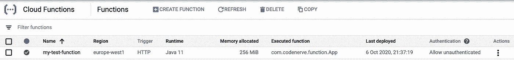

# 用 Kotlin 创建谷歌云功能

> 原文：<https://betterprogramming.pub/creating-google-cloud-functions-with-kotlin-c9fd552d6b20>

## 构建一个 Kotlin HTTP 函数，并将其部署到 GCP


照片由 [p j](https://unsplash.com/@pjrvs?utm_source=medium&utm_medium=referral) 在 [Unsplash](https://unsplash.com?utm_source=medium&utm_medium=referral) 上拍摄。

2020 年 5 月，谷歌宣布 Java 11 即将到来[谷歌云功能](https://cloud.google.com/blog/products/application-development/introducing-java-11-on-google-cloud-functions)。很自然，我的第一个想法是“太好了，但是我能用其他基于 JVM 的语言编写函数吗，比如 Kotlin？”

谢天谢地，没有这样的限制。事实上，您可以用自己选择的任何 JVM 语言编写函数。

*这个例子的源代码可以在 GitHub 上找到:*

[](https://github.com/mwhyte-dev/kotlin-google-cloud-function) [## mwh yte-dev/kot Lin-Google-cloud-function

### grad Lew run function-prun function . target = com . code neural . function . app-prun function . port = 8080g cloud 配置集…

github.com](https://github.com/mwhyte-dev/kotlin-google-cloud-function) 

# 先决条件

这个例子需要一些东西:

*   Java 11
*   格拉德勒
*   访问 GCP 并创建一个示例[项目](https://cloud.google.com/resource-manager/docs/creating-managing-projects)
*   gcloud [已安装](https://cloud.google.com/sdk/#Quick_Start)并通过认证
*   克隆并导入到您选择的 IDE 中的源代码

# 主要功能

主函数很简单，可以让我们开始使用——一个基本的 HTTP 端点，当被触发时，它将返回字符串`“FUNCTION COMPLETE”`:

这个类从[函数-框架](https://cloud.google.com/functions/docs/functions-framework)库中扩展了`HttpFunction`，`service`函数以一个`HttpRequest`和一个`HttpResponse`对象作为参数。

对于非 HTTP 方式[触发云函数](https://cloud.google.com/functions/docs/calling)，可以使用`RawBackgroundFunction`或类型化变量。

例如:

```
BackgroundFunction<PubSubMessage>
```

触发功能的一些其他选项包括云发布/订阅、云存储、云 Firestore 和各种基于 Firebase 的触发器。

你可以在[functions-framework-Java](https://github.com/GoogleCloudPlatform/functions-framework-java)readme 中找到其他触发机制的例子。

# Gradle 构建文件

对于这个例子，我们使用 [Gradle 的 Kotlin DSL](https://docs.gradle.org/current/userguide/kotlin_dsl.html) 来配置我们的项目。

## 属国

有几个关键的依赖因素。

*   [Functions-framework-api](https://github.com/GoogleCloudPlatform/functions-framework-java) 允许我们编写在许多不同环境下运行的轻量级函数，包括 Google Cloud Functions 和 cloud-run。
*   Java-function-invoker 使我们能够在本地运行函数进行测试。

## 运行功能任务

Gradle 构建文件中的`runFunction`任务触发了 java-function-invoker，它封装了函数并使用 jetty web 服务器提供服务。

要在本地运行该函数，使用 Gradle 包装器调用`runFunction`:

(为了可读性，日志记录被缩短)

或者，您可以覆盖一些参数:

(为了可读性，日志记录被缩短)

## buildFunction 任务

Gradle 构建文件中的`buildFunction`任务与 [Gradle Shadow](https://github.com/johnrengelman/shadow) 插件一起创建一个胖 jar，并将其复制到构建/部署目录，准备上传到 GCP 云存储。

要执行此操作，请使用 Gradle 包装器:

# 使用 gcloud 部署

因此，您已经在本地测试了您的功能，构建了它，现在是时候部署了。使用 [gcloud 命令行实用程序](https://cloud.google.com/sdk/docs/downloads-interactive)可以轻松实现部署。

首先，确保您正在部署您选择的 GCP 项目:

```
gcloud config get-value project my-functions-project
```

然后选择您希望部署到的地区:

```
gcloud config set functions/region europe-west1
```

最后，部署功能:

注意:`entry-point`参数是函数的全限定类名，来源是我们 fat jar 的位置。

如果您打开 GCP 控制台并导航至云功能，您将看到该功能:



从这里，您可以打开它并查看各种信息，包括触发器。或者，您可以从 gcloud 运行一个`describe`:

```
gcloud functions describe my-test-function
```

点击触发 URL，您将看到函数返回预期的响应:

```
❯ curl https://europe-west1-slice-poc.cloudfunctions.net/my-test-function 
FUNCTION COMPLETE%
```

不是中等会员？支持我成为其中一员:

[](https://mwhyte.dev/membership) [## 加入媒体与我的推荐链接-迈克尔威特

### 作为一个媒体会员，你的会员费的一部分会给你阅读的作家，你可以完全接触到每一个故事…

mwhyte.dev](https://mwhyte.dev/membership) 

# 参考

我们已经看到将 Kotlin 函数部署到 GCP 是多么容易。为了进一步探索这个主题，我推荐以下文档:

[](https://github.com/mwhyte-dev/kotlin-google-cloud-function) [## mwh yte-dev/kot Lin-Google-cloud-function

### grad Lew run function-prun function . target = dev . mwh yte . function . app-prun function . port = 8080g cloud 配置集…

github.com](https://github.com/mwhyte-dev/kotlin-google-cloud-function) [](https://cloud.google.com/functions/docs) [## 云函数文档|云函数文档

### 亲自尝试云功能创建一个帐户来评估我们的产品在真实场景中的表现。新…

cloud.google.com](https://cloud.google.com/functions/docs) [](https://github.com/GoogleCloudPlatform/functions-framework-java) [## Google cloud platform/functions-framework-Java

### 一个用于编写可移植 Java 函数的开源 FaaS(函数即服务)框架

github.com](https://github.com/GoogleCloudPlatform/functions-framework-java) [](https://github.com/GoogleCloudPlatform/functions-framework-java/issues/35) [## 使用 Gradle & Kotlin (build.gradle.kts)运行函数第 35 期…

### 谢谢你把这些放在一起！我试图让本地调用者在我的本地机器上工作，这是设置…

github.com](https://github.com/GoogleCloudPlatform/functions-framework-java/issues/35)