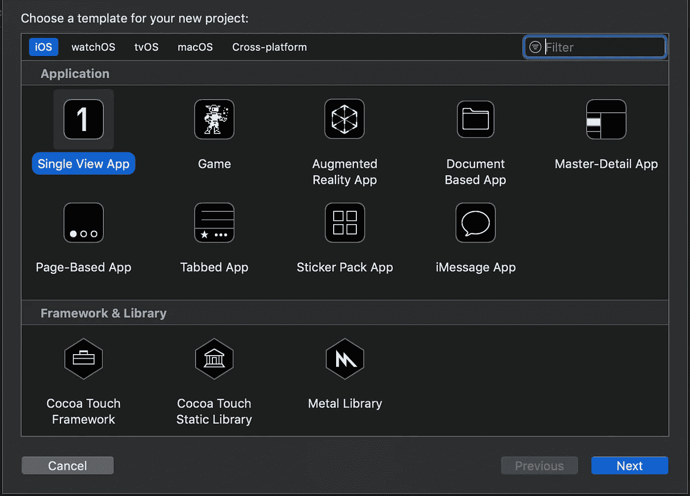
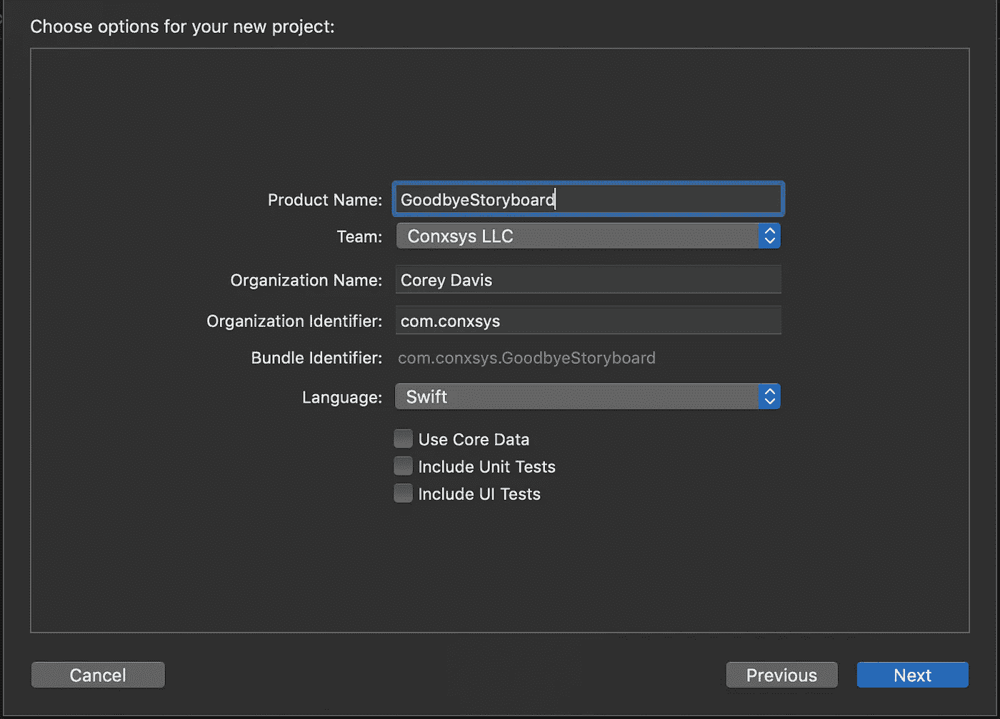
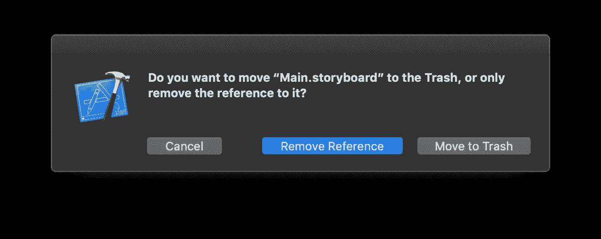
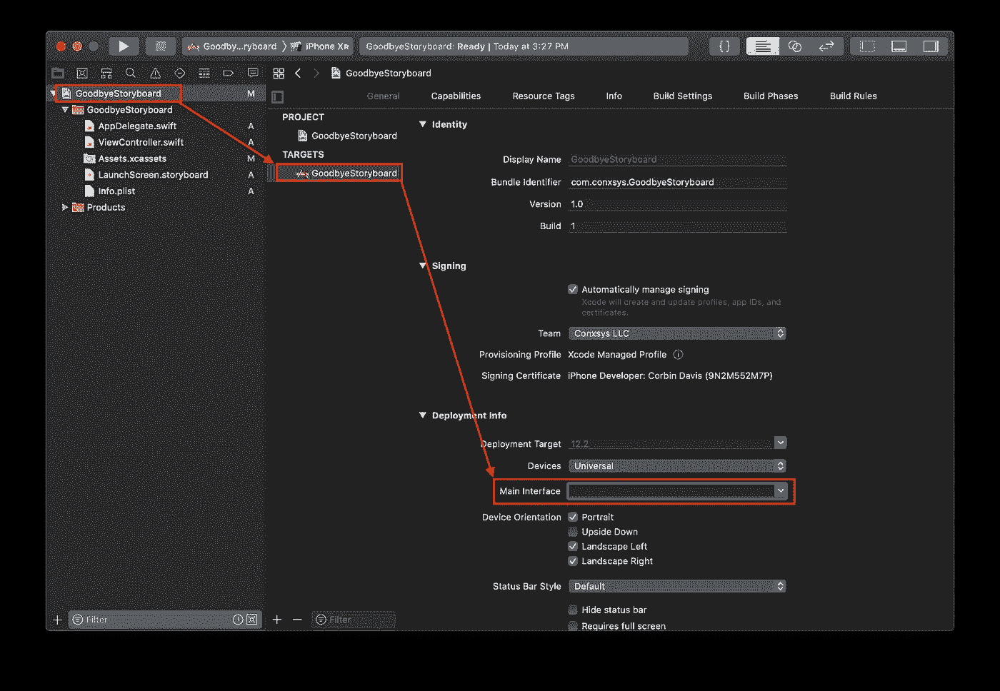
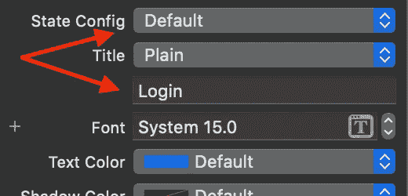

# 创建没有故事板的 iOS 应用程序

> 原文：<https://betterprogramming.pub/creating-ios-apps-without-storyboards-42a63c50756f>

## 它们真的会成为过去


哈尔·盖特伍德在 [Unsplash](https://unsplash.com?utm_source=medium&utm_medium=referral) 上拍摄的照片

许多 iOS 开发文章和教程使用故事板来创建用户界面。这是有意义的，因为它们是创建和修改你的设计的非常直观的方式，并且有助于加速你的学习过程。但是，除非你发现自己是一个应用程序的唯一开发者，否则这不是团队环境中专业 iOS 开发的完全现实的观点。当你第一次面对一个只有很少或者没有故事板的应用时，它可能会对系统造成冲击。让我们通过了解在没有故事板的情况下如何设计一个应用程序来为这种可能性做好准备。

# 使用编程布局的情况

我是一个非常视觉化的人，我个人反对这种方法，所以我可以理解你是否也有这种想法。如果你曾经在团队环境中工作过，你可能会有一些非常困难的尝试来解决故事板的合并冲突。你可能还会被同事阻止，他们需要在你完成特定任务之前修改故事板。如果这些事情还没有发生在你身上，它们会发生的。有一些方法可以缓解这些问题，比如拆分故事板和[xib](https://docs.elementscompiler.com/Platforms/Cocoa/XIB/)，但它们并不是万无一失的，一旦你习惯了没有故事板，你就会开始看到好处。到目前为止，最大的好处是比你坚持故事板更好地理解 UIKit。而且，正如我们在 [WWDC2019](https://developer.apple.com/wwdc19/) 上看到的 [SwiftUI](https://developer.apple.com/xcode/swiftui/) 的首次亮相，故事板真的将成为过去。

那么，为什么这么多的团队环境趋向于去除故事板和 xib 呢？除了合并冲突和阻塞问题，团队远离故事板的主要原因之一是大多数属性值不容易被审查。从故事板 XML 中挑选代码很容易出错，因此您最好重做这项工作，这消除了拥有代码存储库的一个优势。让我们看一个例子。

我有一个简单的单视图应用程序，其表单包含两个文本字段和一个按钮。按钮对其中一个文本字段有一个垂直约束，该约束有一个常量`20`。


设计师要求我们将这个数字增加到`40`。我进行了更改，提交了一份 PR，并指定您为审核人。您可以在 PR 中看到以下变化。

原始代码:

```
<rect key="frame" x="20" y="383" width="374" height="30"/>
<rect key="frame" x="20" y="333" width="374" height="30"/>
<constraint firstItem="pYg-JC-an0" firstAttribute="top" secondItem="Kfc-mn-gVn" secondAttribute="bottom" constant="20" id="r92-HL-ecY"/>
```

修改代码:

```
<rect key="frame" x="20" y="363" width="374" height="30"/>
<rect key="frame" x="20" y="313" width="374" height="30"/>
<constraint firstItem="pYg-JC-an0" firstAttribute="top" secondItem="Kfc-mn-gVn" secondAttribute="bottom" constant="40" id="r92-HL-ecY"/>
```

我在这里改变了什么？你知道它应该是按钮控件和文本字段之间的约束，但是你确定`pYg-JC-an0`和`Kfc-mn-gVn`是正确的控件吗？您可以浏览 XML 来找到这两个值，但是如果这是一个包含许多控件的复杂视图，并且我修改了所有控件的间距，那该怎么办呢？你真的有时间把他们都找出来吗？如果代码就在您面前，在视图控制器中，包含所有其他视图逻辑，不是更容易吗？

那么，在这个例子中，编程布局中的这种修改会是什么样子呢？

原始约束:

```
loginButton.topAnchor.constraint(equalTo: passwordTextField.bottomAnchor, constraint: 20)
```

修改的约束:

```
loginButton.topAnchor.constraint(equalTo: passwordTextField.bottomAnchor, constraint: 40)
```

是啊。差别很大。

这不仅会使 PRs 更容易审查，而且追踪与布局相关的 bug 也变得更加容易。所有与布局相关的设置都将在代码中呈现在你面前，而不是隐藏在 Xcode 检查器的几十个地方。所以，让我们看看没有故事板的情况下需要做些什么。

# 入门指南

为了开始学习编程布局，让我们在 Xcode 中创建新项目。

首先，创建单视图应用程序。



将其命名为`GoodbyeStoryboard`，并将其保存在适当的地方。



## 删除故事板

在 Xcode 中创建并打开项目后，选择`Main.storyboard`文件并删除它。从确认对话框中选择“移到废纸篓”。



拜拜故事板！

在项目导航器中，选择项目。在 Deployment Info 部分下的`GoodbyeStoryboard`目标中，从主界面字段中删除单词`Main`并按⌘S 保存更改。



如果您现在构建并运行，项目将成功构建，应用程序将运行，但您只会看到一个黑屏。这是因为您的应用程序不再有窗口。而且，即使这样，Xcode 为您创建的`ViewController.swift`也不再被设定为窗口的根视图控制器。这些都是故事板自动处理的事情，而你却没有意识到。虽然这听起来像是积极的，但这也意味着使用 UIKit 的一些方面您还没有意识到。

只需要少量代码就可以补救这种情况。打开`AppDelegate.swift`。您将看到一个`UIWindow?`类型的`window`属性，除了一些空函数，唯一真正的代码在方法`application(_:didFinishLaunchingWithOptions:)`中，并且只包含一个`return true`语句。用此代码修改`application(_:didFinishLaunchingWithOptions:)`:

```
func application(_ application: UIApplication, didFinishLaunchingWithOptions launchOptions: [UIApplication.LaunchOptionsKey: Any]?) -> Bool {
   //Create a window that is the same size as the screen
   window = UIWindow(frame: UIScreen.main.bounds)
   // Create a view controller
   let viewController = ViewController()
   // Assign the view controller as `window`'s root view controller
   window?.rootViewController = viewController
   // Show the window
   window?.makeKeyAndVisible()

   return true
 }
```

`application(_:didFinishLaunchingWithOptions:)`方法是在应用程序即将运行时执行的，所以这是您想要进行最后调整的地方。这是实例化我们的应用程序窗口并使`ViewController`成为该窗口的根视图控制器的最佳位置。让我们一行一行地检查上面的代码:

```
window = UIWindow(frame: UIScreen.main.bounds)
```

第一步是创建窗口。通过使用`UIWindow(frame: UIScreen.main.bounds)`，我们创建了一个新窗口，并将其大小设置为设备的屏幕大小。

```
let viewController = ViewController()
window?.rootViewController = viewController
```

接下来，我们初始化一个新的视图控制器。然后我们将它分配给窗口的`rootViewController`属性。根视图控制器只是一个窗口内容的容器。

```
window?.makeKeyAndVisible()
```

最后，我们使窗口可见。`makeKeyAndVisible()`方法只是一个方便的方法，它强制窗口成为关键窗口(换句话说，它把它放在所有其他窗口的前面——在这一点上，没有其他窗口),并使它可见。

构建并运行，你应该会看到…一个黑色的视图占据了整个屏幕。这不是很令人印象深刻，我们写代码之前有一个黑屏，所以这甚至工作吗？

打开`ViewController.swift`并将以下内容添加到`viewDidLoad()`方法的`super.viewDidLoad()`行之后:

```
view.backgroundColor = .white
```

构建并再次运行，您现在应该会看到一个完整的白屏，证明我们现在有一个窗口，并且`ViewController`实际上是可见的。祝贺您，您现在已经构建了一个没有故事板的应用程序！而且只用了四行代码。

总结一下我们到目前为止所做的工作，我们移除了故事板，修改了项目，使它不再寻找故事板，创建了我们的主应用程序窗口，并使`ViewController`成为窗口的根视图控制器。很简单的东西。但是，您将拖放到故事板中并连接到`IBOutlets`和`IBActions`的所有视图和控件呢？我们接下来会看看这些。

# 添加 UI 元素

现在我们有了一个可以再次使用的视图，让我们深入研究如何添加 UI 元素。在故事板中，我们只需将一个文本字段或按钮拖到视图上，并创建出口和动作，这样我们就可以用代码与它进行交互，但是没有故事板，这是如何实现的呢？让我们从单个控件开始，慢慢来。

如果尚未打开，打开`ViewController.swift`。

在`viewDidLoad()`函数上方添加以下内容:

```
var loginButton: UIButton!
```

接下来，通过在`viewDidLoad()`中的`view.backgroundColor = .white`行之后添加以下代码，实例化并配置按钮控件:

```
loginButton = UIButton(type: .system)
loginButton.setTitle("Login", for: .normal)
loginButton.translatesAutoresizingMaskIntoConstraints = false
view.addSubview(loginButton)
```

让我们一行一行地看看这个:

```
loginButton = UIButton(type: .system)
```

这相当于在“身份”检查器中设置“类”值，在“属性”检查器中设置“类型”值。


```
loginButton.setTitle("Login", for: .normal)
```

我们将按钮的标题设置为正常状态。这相当于在属性检查器中设定这些值。



```
loginButton.translatesAutoresizingMaskIntoConstraints = false
```

现在事情变得有趣了；这可能是你从未见过的。这里我们声明我们将使用 AutoLayout。这看起来不像是我们正在做的事情，而且显式地设置这一点看起来很奇怪，但是这实际上是在你每次向故事板添加视图或控件时为你做的。所以不管你知不知道，你一直都在这么做。下面是按钮的脚本 XML 的一部分:

```
<button opaque="NO" contentMode="scaleToFill" fixedFrame="YES" 
   contentHorizontalAlignment="center"     
   contentVerticalAlignment="center" 
   buttonType="roundedRect"
   lineBreakMode="middleTruncation" 
   translatesAutoresizingMaskIntoConstraints="NO" 
   id="DLu-Zl-IKU">
```

最后你会看到`translatesAutoresizingMaskIntoConstraints="NO"`一直都在那里。所以，是的，为你添加的每一个视图或控件都这样做是很乏味的，但是你做得越多，它就会变得越自动化。

```
view.addSubview(loginButton)
```

当你把一个控件拖到故事板上时，很明显它已经变成了它的父控件的子视图，即使你从来没有想过它。与代码中的大多数事情一样，我们需要明确地说明这一点。

现在让我们来处理按钮的定位。现在，我们就把它放在中间。在`viewDidLoad()`功能后增加以下功能:

```
func constraintsInit() {
    NSLayoutConstraint.activate([
      loginButton.centerXAnchor.constraint(equalTo: view.centerXAnchor),
      loginButton.centerYAnchor.constraint(equalTo: view.centerYAnchor)
    ])
}
```

我们在这里所做的是将`loginButton`的中心 X 和中心 Y 锚点分别与`view`的中心 X 和中心 Y 锚点对齐。如果你对主播不熟悉，我强烈推荐找一个主播教程。它们非常易于阅读和理解，但是深入解释它们超出了本文的范围。我们将在本文中更多地使用它们，所以如果它们对您来说是新的，现在就跟随它们吧。

回到`viewDidLoad()`中，在`view.addSubview(loginButton)`后添加这一行:

```
constraintsInit()
```

构建并运行，您应该看到您的登录按钮就在视图的中央。

现在让我们加快进度，添加简单登录表单的剩余部分。在`var loginButton: UIButton!`行的正下方添加以下代码:

```
var nameTextField: UITextField!
var passwordTextField: UITextField!
```

接下来，在`view.addSubview(loginButton)`线之后`constraintsInit()`线之前的`viewDidLoad()`中添加:

```
nameTextField = UITextField(frame: .zero)
nameTextField.placeholder = "Login Name"
nameTextField.borderStyle = .roundedRect
nameTextField.translatesAutoresizingMaskIntoConstraints = false
view.addSubview(nameTextField)

passwordTextField = UITextField(frame: .zero)
passwordTextField.placeholder = "Password"
passwordTextField.isSecureTextEntry = true
passwordTextField.borderStyle = .roundedRect
passwordTextField.translatesAutoresizingMaskIntoConstraints = false
view.addSubview(passwordTextField)
```

在这一点上，这里唯一应该是新的是在我们将框架设置为`.zero`的实例化行中。如果这对您来说是新的，它确实如其名:它将控件的大小设置为零。如果保持这种方式，在运行应用程序时，您将看不到该控件，因为它的高度和宽度都为零。这将通过添加我们接下来要做的约束来解决。

在`constraintsInit()`中，在`loginButton.centerYAnchor.constraint(equalTo: view.centerYAnchor)`行的末尾添加一个逗号，然后添加:

```
passwordTextField.bottomAnchor.constraint(equalTo: loginButton.topAnchor, constant: -20),passwordTextField.leadingAnchor.constraint(equalTo: view.readableContentGuide.leadingAnchor, constant: 20),passwordTextField.trailingAnchor.constraint(equalTo: view.readableContentGuide.trailingAnchor, constant: -20),

nameTextField.bottomAnchor.constraint(equalTo: passwordTextField.topAnchor, constant: -20),nameTextField.leadingAnchor.constraint(equalTo: view.readableContentGuide.leadingAnchor, constant: 20),nameTextField.trailingAnchor.constraint(equalTo: view.readableContentGuide.trailingAnchor, constant: -20)
```

除了指出我们使用`readableContentGuide`作为文本字段的水平布局之外，我不打算在此详述。在使用约束条件时，可以使用一些指南，可读内容指南是一种在视图中定义可读区域的指南，该区域不会被系统控件(如滚动条)遮挡。它还通过考虑设备宽度和动态文本大小来调整可读宽度。这是一个需要注意的重要指南，尤其是在调整用户界面的可访问性时。

构建并运行，您应该会看到一个非常基本的登录表单，它是以完全编程的方式创建的，没有故事板！

还有最后一件事要处理:行动。

# 添加操作

当使用故事板时，你可能会将登录按钮连接到一个`IBAction`来处理点击事件。因为我们没有使用界面构建器，所以没有`IBAction`可以利用。相反，我们将使用一个目标动作。

在`constraintsInit()`功能后添加这个新功能:

```
@objc func handleLoginTouchUpInside() {
    print("Login has been tapped")
    if nameTextField.isFirstResponder {
      nameTextField.resignFirstResponder()
    }
    if passwordTextField.isFirstResponder {
      passwordTextField.resignFirstResponder()
    }
  }
```

因为用户可能会关注任一文本字段，所以我们将简单地查询每个字段，并询问它是否是第一个响应者。如果是这样，我们将放弃第一响应者的身份。如果这对你来说是新的，在一个文本字段上重新签名将隐藏键盘。此外，请注意，还有其他方法可以做到这一点，但这是一个足够好的演示方法。

现在，要为按钮上的点击事件添加一个动作，就在`viewDidLoad()`中的`view.addSubview(loginButton)`行下面添加以下内容:

```
loginButton.addTarget(self, 
                      action: #selector(handleLoginTouchUpInside), 
                      for: .touchUpInside)
```

这将为登录按钮添加一个目标，该按钮将在检测到内部触发动作时运行`handleLoginTouchUpInside()`功能。

构建和运行，你应该看到一切工作了！如果您有任何问题，`ViewController`代码的完整列表在本文的底部。

# 结论

如你所见，移除故事板并不困难。它揭示了视图和视图控制器的一些工作方式，尤其是布局，这些都是通过使用故事板隐藏起来的。这种接触是一件好事，因为您将更加熟悉视图、控制器和约束是如何工作的。现在，有了工具带中的编程布局，所有 UI 代码都将完全公开，并且更容易审查和调试。

## 完整列表

```
class ViewController: UIViewController {

  var loginButton: UIButton!
  var nameTextField: UITextField!
  var passwordTextField: UITextField!

  override func viewDidLoad() {
    super.viewDidLoad()
    view.backgroundColor = .white

    loginButton = UIButton(type: .system)
    loginButton.setTitle("Login", for: .normal)
    loginButton.translatesAutoresizingMaskIntoConstraints = false
    view.addSubview(loginButton)
    loginButton.addTarget(self, action: #selector(handleLoginTouchUpInside), for: .touchUpInside)

    nameTextField = UITextField(frame: .zero)
    nameTextField.placeholder = "Login Name"
    nameTextField.borderStyle = .roundedRect
    nameTextField.translatesAutoresizingMaskIntoConstraints = false
    view.addSubview(nameTextField)

    passwordTextField = UITextField(frame: .zero)
    passwordTextField.placeholder = "Password"
    passwordTextField.isSecureTextEntry = true
    passwordTextField.borderStyle = .roundedRect
    passwordTextField.translatesAutoresizingMaskIntoConstraints = false
    view.addSubview(passwordTextField)

    constraintsInit()
  }

  func constraintsInit() {
    NSLayoutConstraint.activate([
      loginButton.centerXAnchor.constraint(equalTo: view.centerXAnchor),
      loginButton.centerYAnchor.constraint(equalTo: view.centerYAnchor),

      passwordTextField.bottomAnchor.constraint(equalTo: loginButton.topAnchor, constant: -20),
      passwordTextField.leadingAnchor.constraint(equalTo: view.readableContentGuide.leadingAnchor, constant: 20),
      passwordTextField.trailingAnchor.constraint(equalTo: view.readableContentGuide.trailingAnchor, constant: -20),

      nameTextField.bottomAnchor.constraint(equalTo: passwordTextField.topAnchor, constant: -20),
      nameTextField.leadingAnchor.constraint(equalTo: view.readableContentGuide.leadingAnchor, constant: 20),
      nameTextField.trailingAnchor.constraint(equalTo: view.readableContentGuide.trailingAnchor, constant: -20)
    ])
  }

  @objc func handleLoginTouchUpInside() {
    print("Login has been tapped")
    if nameTextField.isFirstResponder {
      nameTextField.resignFirstResponder()
    }
    if passwordTextField.isFirstResponder {
      passwordTextField.resignFirstResponder()
    }
  }
}
```