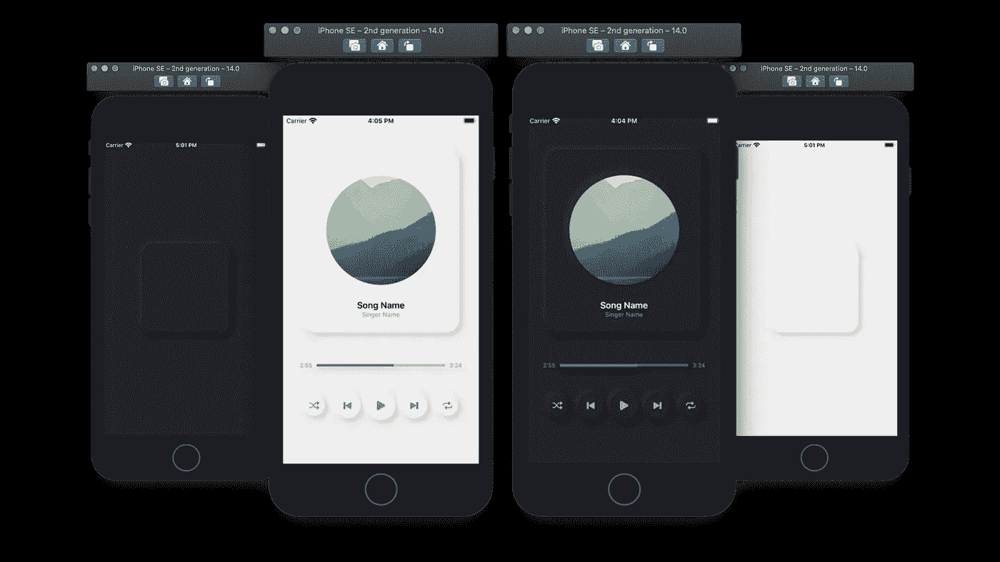
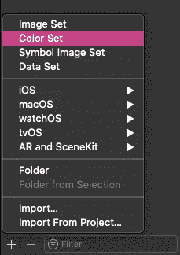
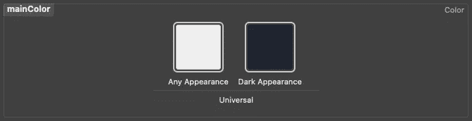
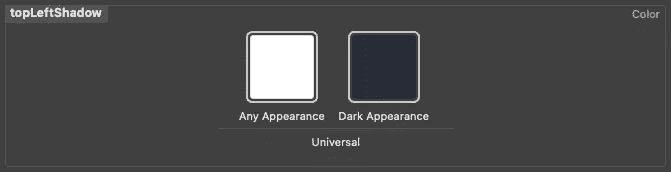
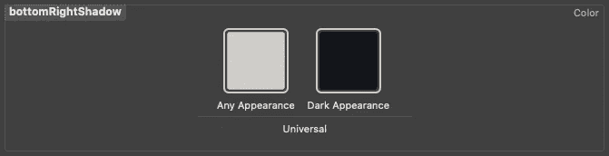
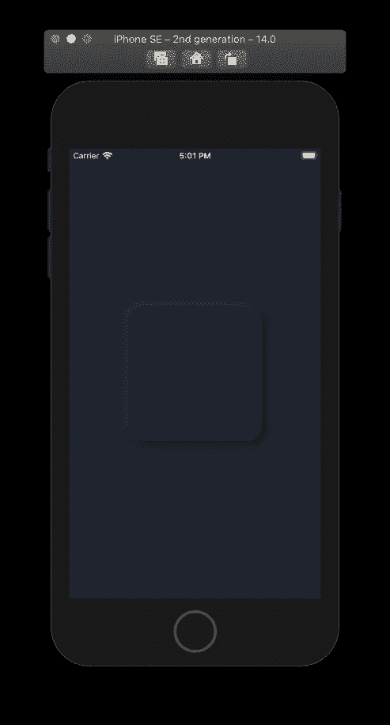
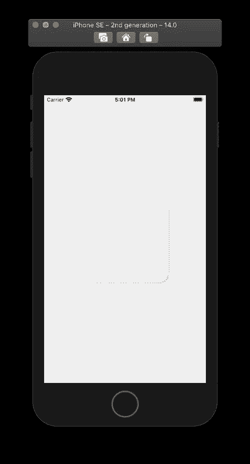
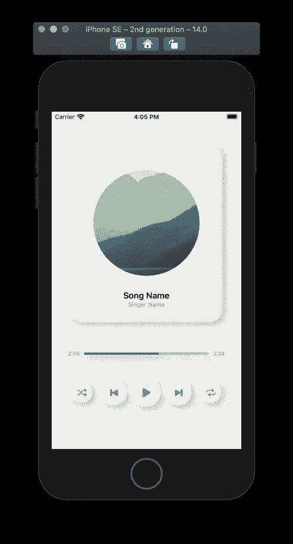
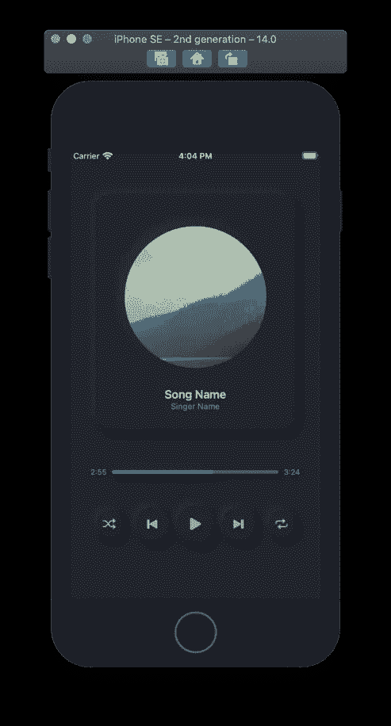

# 在 SwiftUI 中创建神经形态设计

> 原文：<https://betterprogramming.pub/creating-neuromorphic-designs-in-swiftui-290c01331738>

## 打造时尚简约的音乐播放器

神经形态设计。作者照片。

神经形态设计由从背景突出的 UI 组件组成。UI 元素是用与背景相同的材料和颜色制成的形状。

 [## 用户界面中的神经形态

### UI 趋势如何将灵感带入现实世界，我们必须解决什么问题才能让这些趋势…

uxdesign.cc](https://uxdesign.cc/neumorphism-in-user-interfaces-b47cef3bf3a6) 

在上面的文章中，[迈克尔·马莱维奇](https://medium.com/u/fde1eb3eb589)解释了如何实现这种极简风格。您需要在负值和正值中使用阴影。背景和 UI 元素应该有相同的色调。你应该选择一种不遮盖明暗阴影的颜色，这样设计才能奏效。

# SwiftUI 中的神经形态设计

## 颜色集

通过单击+号，向项目的“资源”文件夹添加三个新颜色集。下面，我们将为暗模式和亮模式添加颜色:

制作你的第一个颜色集，命名为`mainColor`。这个颜色集用于背景和 UI 元素。浅色的十六进制颜色值为# EFEEEE，深色的十六进制颜色值为#1F242F。

第二个颜色集用于左上角的阴影。浅色的十六进制颜色值是#FFFFFF，深色是#292D38。

最后一组颜色将用于右下角的阴影。浅色色调为#D1CDC7，深色为#14151C。

## SwiftUI 代码

下面，我使用`ViewBuilder`为我们的神经形态设计创建了一个容器。您可以在代码中看到如何以及在哪里使用颜色。您可以根据自己的喜好调整阴影半径:

我们可以用下面的简单代码来测试这个设计:

你可以看到，我们通过用`ViewBuilder`为它构建一个容器，成功地创建了一个极简的神经形态卡设计。

# 神经形态音乐播放器设计

下面的代码是一个非功能性的音乐播放器。我添加这个示例是为了向您展示如何使用上面的容器来构建复杂的设计:

这个例子使用了一个由 gujci 制作的自定义滑块作为歌曲的持续时间滑块:

最后，将玩家视图添加到您的`ContentView`中，然后运行应用程序:

仅此而已。感谢阅读！