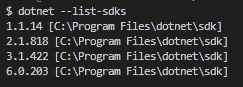
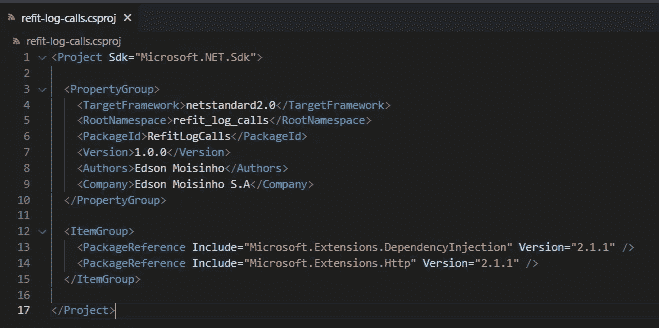
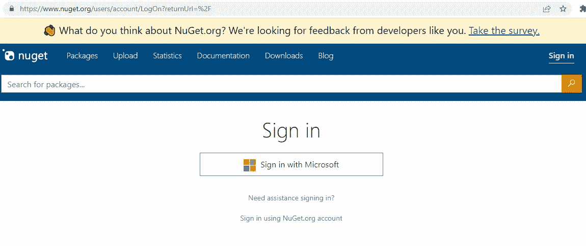
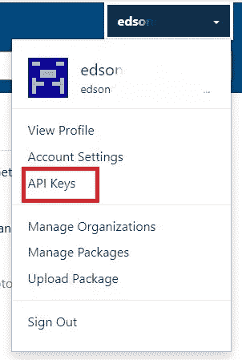
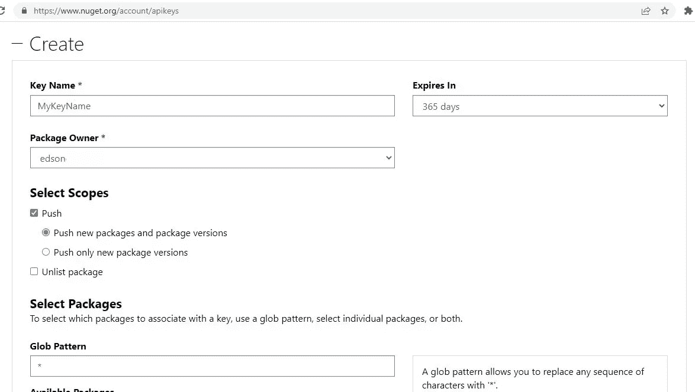
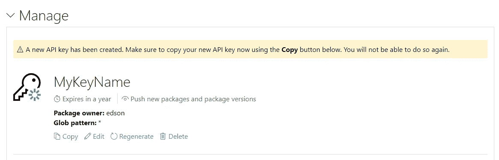
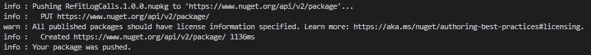
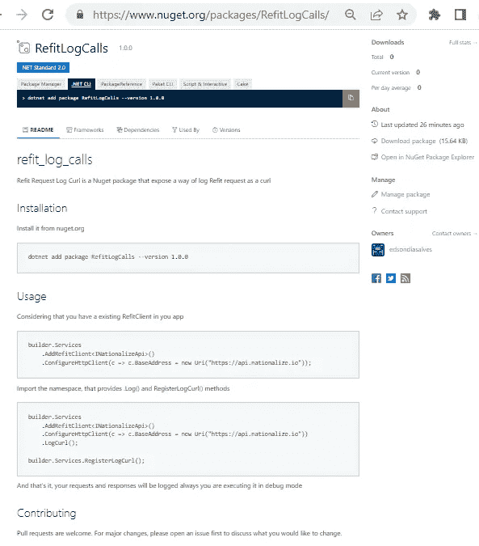

# 创建 NuGet 包以共享代码

> 原文：<https://betterprogramming.pub/creating-nuget-packages-9192d34255e7>

## 使用包共享有用的代码


照片由[坎普斯制作](https://www.pexels.com/@kampus/)在[像素](https://www.pexels.com/)上拍摄

如今，大多数框架都提供了一组足以构建优秀应用程序的组件，但另一方面，它们也提供了一种方式来共享我们的定制组件，以解决特定的问题，这在大多数情况下允许社区协作来改进这些部分。

[。Net framework](https://dotnet.microsoft.com/en-us/) 使用本机 [NuGet](https://www.nuget.org/) 作为库的包管理器，例如 [Newtonsoft](https://www.nuget.org/packages/Newtonsoft.Json/13.0.2-beta1) 、 [Moq](https://www.nuget.org/packages/Moq) 、 [Automapper](https://www.nuget.org/packages/AutoMapper) 以及许多其他库。

许多开发人员可能不知道的是，用我们的代码创建和共享一个 NuGet 包是非常简单快捷的，这也是我将在本文中解释的。

# 我们要打包什么？

几天前，我写了一篇关于[我们如何拦截使用 Refit 发出的 HTTP 请求并将它们记录为 curl](/debugging-http-requests-in-net-core-2d26cb5d4295) 的文章，现在我将使用这些代码来创建我们新的 NuGet 包。

我们可以在我的个人资料下找到 GitHub repo 的全部代码。

我将修改这段代码，以便其他开发人员在他们的项目中轻松使用。

# 准备包

要创建一个 NuGet 包，我们需要首先创建一个类库项目，编写代码，然后运行命令来生成`.nupkg`文件，这个包已经准备好上传到 nuget.org

首先，在终端上运行命令`mkdir refit-log-calls`来创建一个新文件夹，并运行`cd refit-log-calls`来访问它。

> 在创建 NuGet 包之前，重要的是要考虑。net 核心版本，我们将针对您的库。
> 
> 如果您使用最新版本的。net core，使用旧版本的项目将无法使用您的包。
> 
> 您可以通过运行命令`dotnet --list-sdks`在本地检查已安装的 dotnet 版本，在我的例子中，我有以下四个版本:



Dotnet 核心安装版本

运行`dotnet new classlib`创建一个新的类库项目，默认情况下将使用最新版本，如果你想覆盖它并使用一个旧版本，你必须在根文件夹中创建一个`global.json`文件并选择你想要的版本。在下面的`global.json`文件中，我选择了。网络核心 2.1

```
{
    "sdk": {
        "version": "2.1.818"
    }
}
```

## 编写代码

接下来，我将添加我从前面提到的现有项目中复制的第一个类。

HttpToCurlHandler 类

然后，我将创建一个扩展方法来方便该类的使用。

HttpHandlerExtension 扩展方法

因为我使用的是类库和. Net Core 2.1 项目，所以我需要添加一些 NuGet 包来提供`IServiceCollection`和`IHttpClientBuilder`

我将在终端中运行`dotnet add package Microsoft.Extensions.DependencyInjection --version 2.1.1`和`dotnet add package Microsoft.Extensions.Http --version 2.1.1`命令

现在运行`dotnet build`将会工作，并将成功构建一个类库

# 配置包

NuGet 包需要额外的信息，可以通过在。csproj 文件。

```
<PackageId>NugetPackageIdentification</PackageId> 
<Version>1.0.0</Version> 
<Authors>your_name</Authors> 
<Company>your_company</Company>
```

添加这些信息后，您的包应该如下所示:



NuGet 包。csproj 文件

最后，运行命令`dotnet pack`，如果一切正常，它将生成。文件夹`bin\Debug\RefitLogCalls.1.0.0.nupkg`中的 nupkg 文件

为了避免必须运行`dotnet pack`，您可以将属性`<GeneratePackageOnBuild>true</GeneratePackageOnBuild>`添加到`<PropertyGroup>`标签中，下一个`dotnet build`将自动生成包。

基本上就是这样，我们得到了一个 NuGet 包。

# 上传到 NuGet 组织

要上传您的软件包，我们需要在 nuget.org 上创建一个免费帐户。首先，这非常简单，您可以使用您的 Microsoft 帐户。



NugetOrg 门户

接下来点击页面右上角的 API keys 选项



API 密钥选项

1.  选择`Create`，如下图所示填写所有字段。



按下`Create`按钮，我们将看到如下页面:



新密钥已创建

复制密钥并保存在安全的地方，刷新页面后您将无法复制它。

现在，让我们将包上传到 nuget.org，首先，转到生成包的目录，运行命令`dotnet nuget push RefitLogCalls.1.0.0.nupkg --api-key aaaaaaaa --source [https://api.nuget.org/v3/index.json](https://api.nuget.org/v3/index.json)`不要忘记替换 API-key 和 appId 参数的值。

如果一切正常，您将看到如下消息:



包发布成功

当点击 nuget.org 上的`Manage Packages`选项时，您将能够在列表中看到它，请注意，可能需要一些时间才能在已发布的列表中看到它，直到它仅出现在未列出的部分。

# 使用您的包

现在，这个包已经发布了，它是公开的并且正在工作，要把它添加到你的项目中，只需运行`dotnet add package RefitLogCalls version --1.0.0`你就可以在 nuget.org 的这个[链接](https://www.nuget.org/packages/RefitLogCalls/#readme-body-tab)上看到它。

您可以通过访问 nuget.org 的`Manage Package`部分来编辑您的软件包，我在库中添加了一个 README.me 部分，如下所示:



README.md 库部分

# 最终考虑

如果你想查看我用来构建这个包的代码，你可以在我的 GitHub 个人资料的这个库上看到。

发布之后，我意识到我可以改进很多东西，比如名称空间模式和一些选项，只记录请求或响应，或者两者都记录，但是我肯定会在下一个版本中进行调整。

我希望它能对你的项目有所帮助，我也希望你喜欢这篇文章，谢谢你的阅读，下次再见。