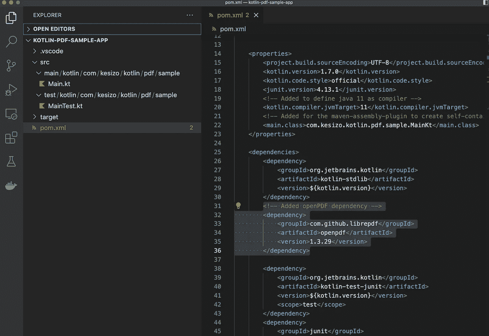
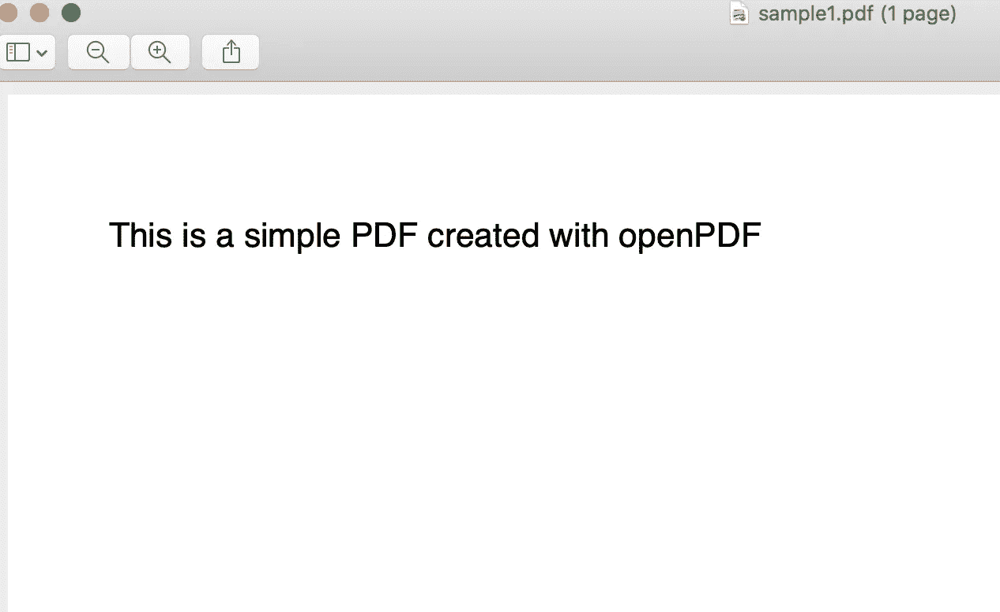
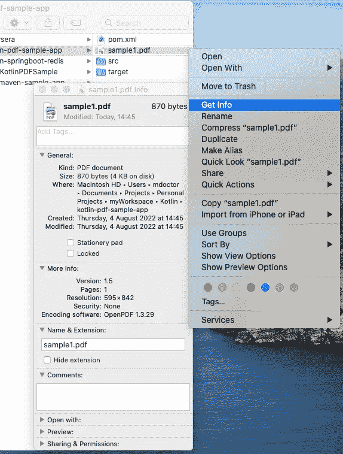
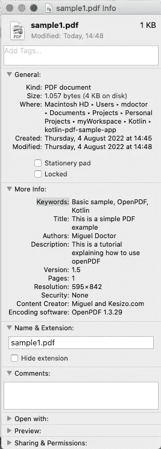
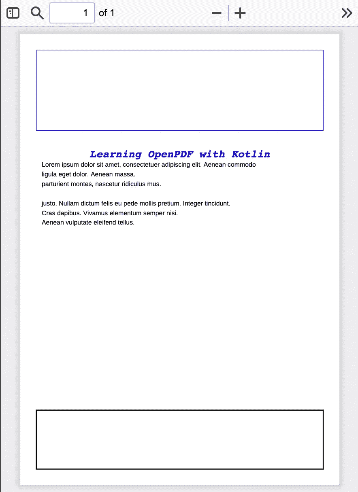
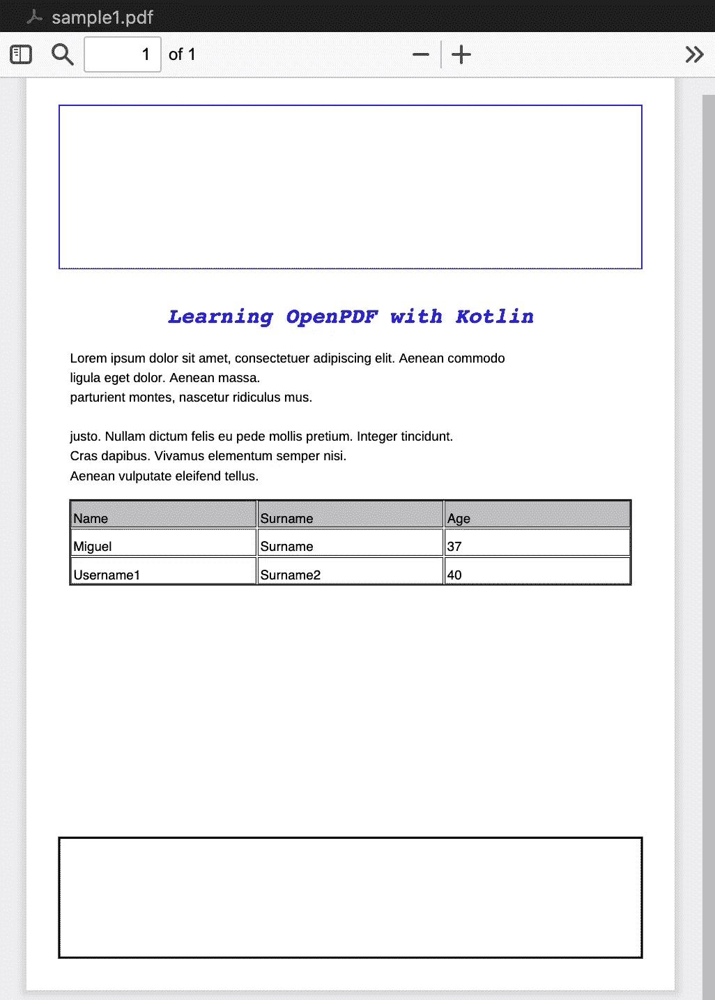
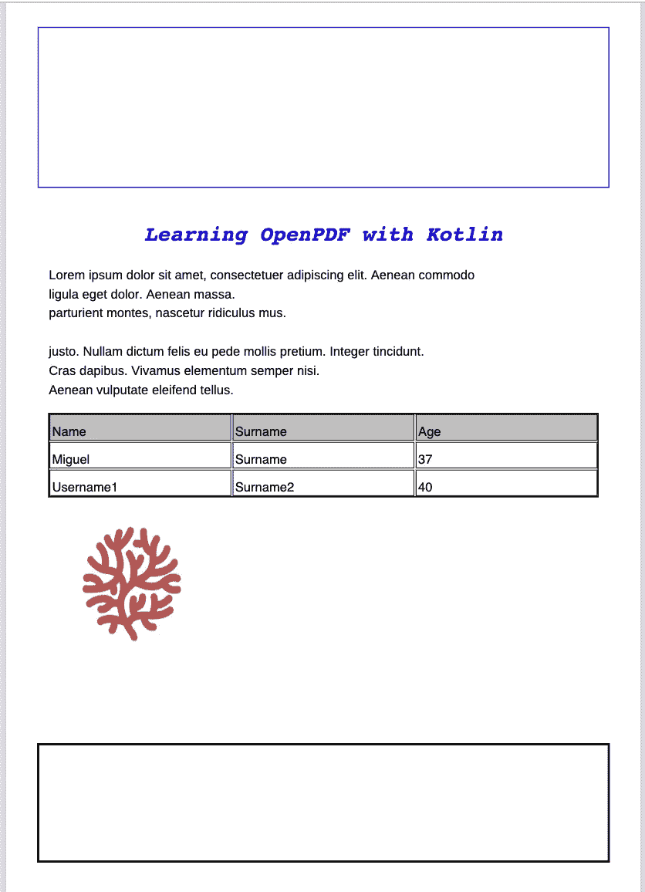

# 使用 Kotlin 和 OpenPDF 创建 PDF 文件

> 原文：<https://betterprogramming.pub/creating-pdf-files-with-kotlin-and-openpdf-af0e0700e2b7>

## OpenPDF 指南，这是用 Kotlin 创建 PDF 文档的一个免费的开源替代方案



作者图片

# 环境

本分步指南是根据以下要求编写的:

*   操作系统:MacOS Catalina 10.15.7
*   Maven:版本:3.3.9
*   Java 版本:OpenJDK 11.0.10，供应商:AdoptOpenJDK
*   Visual Studio 代码:版本:1.69.2
*   科特林:1.7.10
*   OpenPDF:版本 1.3.29

# 目标

本教程旨在提供一个快速的实践参考，在 [OpenPDF](https://github.com/LibrePDF/OpenPDF) 的帮助下使用 Kotlin 语言创建和编辑 PDF 文件。

> 根据该项目的 GitHub 官方页面介绍， [OpenPDF](https://github.com/LibrePDF/OpenPDF) 是一个免费的 Java 库，用于创建和编辑 PDF 文件，拥有 LGPL 和 MPL 开源许可证。

好的，那很好，但是如果你曾经搜索过关于 PDF 和 Java 或者任何其他基于 JVM 的语言，我肯定你找到的第一个选项是 [iText](https://itextpdf.com/en) 。那么为什么我们不应该用 iText，而应该用 OpenPDF 呢？

# OpenPDF 与 iText

让我们从一开始就弄清楚… [iText](https://itextpdf.com/en) 是在 Java 或任何其他 JVM 中寻找 PDF 生成库的最佳选择之一，这不在讨论范围之内。然而，它有一个巨大的障碍… iText 是使用 [AGPL](https://www.gnu.org/licenses/agpl-3.0.en.html) 许可开源的，这意味着一旦在您的应用程序中使用，您需要在相同的 AGPL 许可下完全免费共享您的应用程序。对于您可能正在从事的大多数项目来说，这不是一个有效的方法…所以这里是 OpenPDF 的救星:)

值得一提的是 [OpenPDF](https://github.com/LibrePDF/OpenPDF) 是从 iText 分叉出来的……等等，是不是说我们有同样的 AGPL 限制？不尽然…因为 OpenPDF 是基于 iText 第 4 版的，并且由于商业模式的变化，当项目被转移到 AGPL 许可时，它是与 iText 5.0 一起使用的。因此，在使用 OpenPDF 时，您只需遵守 LGPL 和 MPL 许可证，这两个许可证比 AGPL 的更广泛、更灵活。

# 创建项目和管理依赖项

让我们首先创建一个基于 Maven 的 Kotlin 项目。您可以使用 IntelliJ IDEA 或 maven 原型来实现它。如果你有疑问或者想知道如何通过三个简单的步骤轻松地建立项目，请看看这里的。

一旦创建了项目，我们需要将 OpenPDF maven 依赖项添加到我们的 `pom.xml`中。

```
<dependency>
  <groupId>com.github.librepdf</groupId>
  <artifactId>openpdf</artifactId>
  <version>1.3.29</version>
</dependency>
```

所以你的`pom.xml`应该是下图这样的:


带有 openPDF 依赖项的 pom.xml 文件(图片由作者提供)

# 生成包含简单文本的基本 PDF

一旦项目被正确设置，我们可以开始编码我们的样本。让我们创建一个名为`sample1.pdf`的简单 PDF。输出文件将只包含一段话，“这是用 open PDF 创建的简单 PDF。”

科特林计划 1

我们来解释一下上面的代码。我们需要从以下类创建两个对象:

*   `java.io.FileOutputStream`:这个类允许向一个文件发送字节流(文件的名字作为一个参数在构造函数中传递)
*   `com.lowagie.text.Document`:来自这个类的对象将代表生成的 PDF 文件，所以这个对象将被用于向文件添加内容。

实例化这两个对象后，我们得到一个 PDFWriter 实例，它将处理这两个对象一起工作(即，PDFWriter 监听文档并将 PDF 流定向到一个文件)。

最后，如代码所示，打开文件，添加内容(本例中是一个简单的段落)，关闭文件，然后关闭 PDFWriter。这很简单，对吗？编译并运行此代码后，项目文件夹中会生成一个 PDF 文件，内容如下图所示:



Kotlin 示例 1 生成的 PDF 文件(图片由作者提供)

# 向我们的 PDF 添加元数据

我们的第一个文档非常简单，OpenPDF 允许我们创建更丰富的内容。但是，在深入研究更复杂的内容元素之前，有必要解释一下 openPDF 如何定义生成文件的元数据信息。

> PDF 文件中的元数据是用于描述 PDF 文件的信息。这些“数据”并不是参考文件主要内容的一部分。该信息通常存储在文件类型的代码中，并且可以通过不同的工具来查阅，例如操作系统的文件属性视图。

例如，作者、创建日期、修改日期和文件大小是基本的文档文件元数据示例。

为了说明 openPDF 是如何在 PDF 文件上指定元数据的，让我们看一下上一节中生成的文件。转到文件所在的文件夹，并访问其属性，如下图所示:



访问没有自定义元数据的 PDF 的文件属性视图(按作者分类的图像)

如图所示，文件元数据分区域显示(常规、更多信息、注释等。).现在我们将修改我们的程序，向我们创建的 PDF 文件添加元数据信息。

科特林样品 2

`Document`类提供了一组方法，如`addTitle`、`addSubject`、`addAuthor` …等等。它允许开发者定制创建的 PDF 的元数据。编译并运行新代码后，生成的 PDF 将显示相同的内容。但是，如果我们访问该文件的属性，我们将在“更多信息”部分看到如下所示的差异:



包括自定义元数据的文件属性(按作者分类的图像)

既然我们已经演示了如何向我们的文档添加元数据，让我们继续编辑 PDF 的内容。

# 文本格式

字体系列、大小、颜色……让我们的文档在视觉上吸引读者或让读者感到愉悦，有无限的可能性。OpenPDF 提供了方便的类和方法来操作这些和其他特征。让我们看看下面的例子:PDF 中包含了一个标题和几个段落。

科特林样品 3

在这个例子中有三个重要的特征需要提及:

*   `com.lowagie.text.Font`:实例化这个类的一个对象允许我们定义应用于一个段落的字体类型。如第 53 行所示，这个类的构造函数在构建对象时接受所有这些参数。之后，对象被传递给段落构造函数，如第 55 行所示。
*   `com.lowagie.text.Paragraph` : Paragraph 类提供了方法`*setAlignment()*`，该方法从 class 元素接收常量，以自定义文本显示的位置。
*   `com.lowagie.text.Chunk`:`Chunk`类包含字段`*NEWLINE*` ，该字段可以作为参数传递给段落构造函数以添加空行，如第 63 行所示。

执行上述代码时生成的输出文件如下所示:


Kotlin 示例 3 生成的 PDF 文件(图片由作者提供)

# 文档布局

OpenPDF 提供了自定义与文档布局相关的一般功能的类和方法。作为这些特性的一部分，开发人员可以通过向`Document`类的构造函数传递参数来定义文档的大小和边距(参见下面的代码，即编号为 1 的片段)。

除了尺寸和页边距，文档通常有两个特殊的部分:页眉和页脚。为了说明如何用 Kotlin 和 OpenPDF 创建这些部分，下面的示例在用 2 和 3 注释的部分上定义了两个不可变变量(页脚和页眉)。这些变量是来自类`com.lowagie.text.Rectangle`的实例，它们将是它们各自部分的内容。

最后，第 4 节展示了如何使用我们前面解释过的`PdfWriter`对象将这些部分包含在文档中。这个`PdfWriter`对象注册了一个`pdfPageEventHelper`，负责通过覆盖方法`onEndPage`来添加这两个部分。

科特林样品 4

运行示例 4 时生成的 PDF 文件如下所示。我们可以检查页眉和页脚是否显示为矩形。此外，文档中的页边距现在也可见了。



Kotlin 示例 4 生成的 PDF 文件(图片由作者提供)

# 添加表格

在开发报告或产品目录等 PDF 文档时，使用表格来显示数据是一种常见的做法。用 Kotlin 可以很容易地创建这些表，如下面的代码所示。在这个示例中，我们向示例中添加了一个表。该表显示了两个用户的姓名和年龄。

创建一个空表就像从类`com.lowagie.text.Table`中实例化一个对象一样简单(参见标注为 1 的注释部分)。这个类的构造函数接收表格的列数(本例中为 3)，通过使用 scope 函数`apply`，我们可以配置宽度、间距和填充参数。

在第 2 节中，我们使用字符串创建了一个标签列表，并实例化了来自`Phrase`类的对象，该对象用作`Cell`类构造函数的参数。这些单元格对象使用`setHeader` 方法设置为标题，并通过`addCell`方法添加到表格中。

表格的内容在标有数字 3 的注释部分中定义。在那里，我们创建并添加了表中显示的两行。我们使用相同的方法和类(`addCell`、`Cell`、`Phrase`)，但是没有从内容单元格调用`setHeader`方法。

最后，在注释 4 中，我们将表变量添加到文档中。

科特林样品 5

添加表格后生成的文档如下所示:



Kotlin 示例 5 生成的 PDF 文件(图片由作者提供)

# 添加图像

我们将在示例中包含的最后一个元素是图像。向我们的 PDF 文档添加图像非常简单。我们唯一需要注意的是图片格式，因为有些格式类型需要额外的配置才能正确显示。

对于我们的示例，我们刚刚在网上拍摄了一张图片([https://kesizo . github . io/assets/images/kesizo-logo-6-832 x834 . png](https://kesizo.github.io/assets/images/kesizo-logo-6-832x834.png))，这是我们小组 png 格式的徽标。要将这张图片添加到我们的文档中，我们需要使用 OpenPDF 提供的位于包`com.lowagie.text`中的类`Image`。

这个类提供了方法`getInstance()`,如第 97 行所示。这个方法重载了几种类型的参数(`url`、`file name`、 `bytes array`等)。)来适应对象源并从`Image`类返回一个对象。这个对象可以被重新缩放到不同的大小，一旦正确配置，它就像任何其他元素一样被添加到 PDF 文档中(见第 120 行)。

科特林样品 6

我们可以看到 PDF 显示了图像和我们为本教程创建的其他元素。



Kotlin 示例 6 生成的 PDF 文件(图片由作者提供)

# 结论

这篇文章介绍了用 Kotlin 和 openPDF 库生成 PDF 文档。我们从一个简单的纯文本文档开始，并添加了更多功能(元数据、图像、表格等)。).生成的 PDF 文件与源代码及其相应的解释一起显示。

这篇文章旨在成为一个介绍性的教程。仍然有许多关于 OpenPDF 的功能和更高级的特性(如密码保护的文档、背景图像、网络浏览器渲染等)。).如果你想看文章的第二部分解释任何特定的主题，请留下评论。

如果您有任何意见或建议，或者如果您发现有什么不对的地方，我将非常感谢您的反馈。否则，我希望这篇教程帮助你开始使用 Kotlin 和 OpenPDF。

# 参考

*   [https://kotlinlang.org/docs](https://kotlinlang.org/docs/maven.html)/
*   [https://maven.apache.org/](https://maven.apache.org/)
*   [https://code.visualstudio.com/](https://code.visualstudio.com/)
*   [https://github.com/LibrePDF/OpenPDF/](https://github.com/LibrePDF/OpenPDF/)
*   [https://kesizo.github.io/](https://kesizo.github.io/)