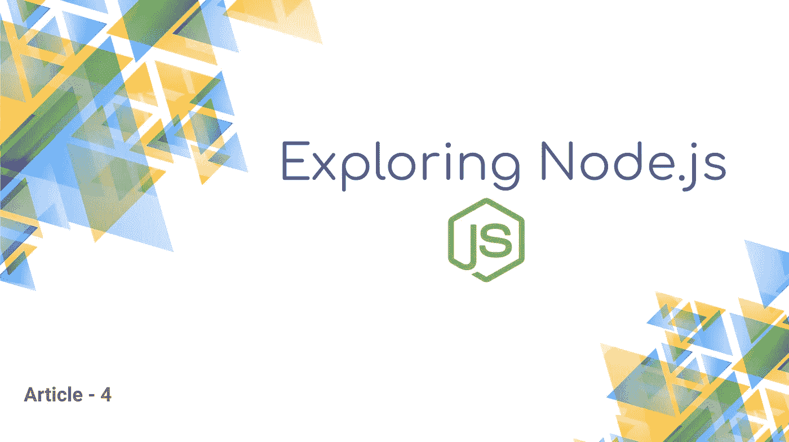
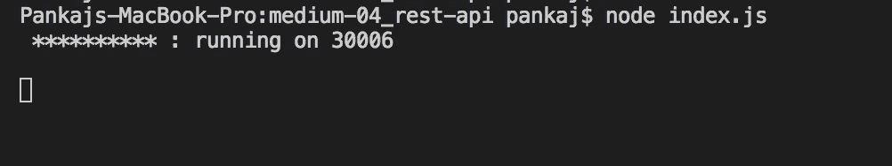
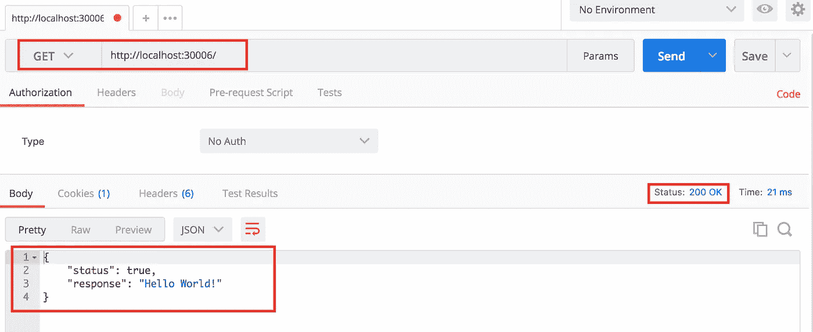
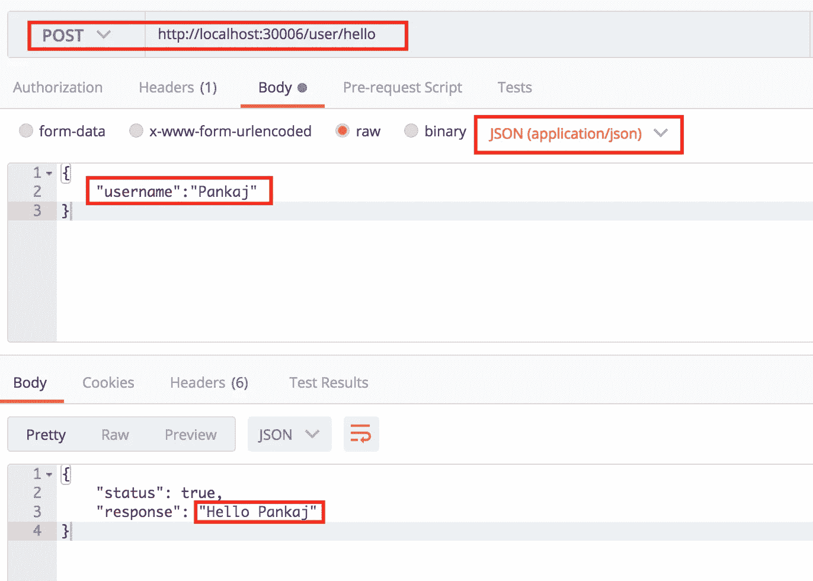
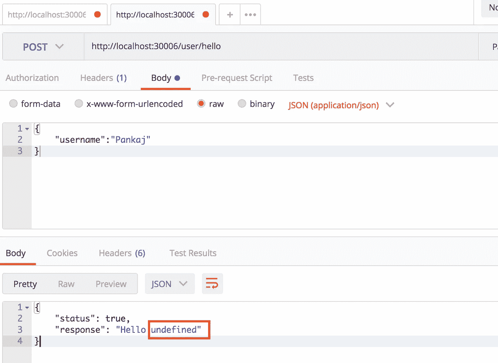

# 使用 Express 创建 Rest APIs

> 原文：<https://betterprogramming.pub/creating-rest-apis-using-express-b7b3965edd41>



这是[*系列*](https://medium.com/@pankaj.panigrahi/list-of-node-js-articles-ededa6dd304b) 的第四部分，旨在帮助您掌握 Node.js 背后的不同概念，并使您能够创建生产就绪的应用程序。

对于这篇文章，我们将使用最流行的库之一， [Express](https://www.npmjs.com/package/express) 来构建 rest APIs。我们假设读者熟悉巴别塔。如果你不是，请阅读这篇[文章](https://medium.com/@pankaj.panigrahi/using-babel-and-other-dependencies-in-node-js-18f74973c1f0)来熟悉自己！

# 快速入门

Express 是 Node 最流行的轻量级 web 应用程序框架之一，它通过路由支持帮助您响应请求，以便您可以编写对特定 URL 的响应。它是最简单和最通用的库之一。

首先，在您的 repo 中安装 Express:

```
npm i express --save
```

接下来，使用以下代码行创建一个 app.js 文件:

```
import express from 'express';
let app = express();
```

这将导入 Express 并实例化 Express 对象。

我们将使用`express.get()`方法，该方法通过指定的回调函数将 HTTP get 请求路由到指定的路径。

> `app.get(path, callback [, callback …])`
> 
> *路径:*中间件功能被调用的路径。
> 
> *回调:*中间件函数或中间件函数数组
> 
> 你可以在这里阅读更多关于 Express APIs 的信息:[http://expressjs.com/en/4x/api.html](http://expressjs.com/en/4x/api.html)

# 建立基础

在前两行之后，编写以下代码:

`req`对象表示 HTTP 请求，并具有请求查询字符串、参数、主体、HTTP 头等属性。它表示 Express 应用程序在获得 HTTP 请求时发送的 HTTP 响应。

`res`给了我们`status()`和`send()` 两个方法，可以像上面一样链接使用。`status()`用于设置响应的 HTTP 代码。`send()`设置响应体并关闭响应流。

然后我们将使用`app.listen()`:

`app.listen(path, [callback])`

这将启动一个 UNIX 套接字，并监听给定路径上的连接。该方法与节点的`[http.Server.listen()](https://nodejs.org/api/http.html#http_server_listen)`相同。

```
app.listen(30006,()=>{
   console.log(' ********** : running on 30006');
})
```

现在我们已经使用了一些 ES6 语法，让我们将这个文件导出为一个模块，并在 index.js 文件中调用它。app.js 的完整代码应该如下所示:

接下来，创建一个 index.js 文件:

并使用`node index.js` *:* 运行项目



# 实施路线

我们来学习一下如何使用 app.use() & app.route()。

`app.use([path,] callback [, callback…])`在指定路径挂载指定的[中间件](http://expressjs.com/guide/using-middleware.html)功能。当请求路径的基础与`path`匹配时，执行该功能。记住路径在这里是可选的。

安装中间件功能是 Express 最好的特性之一，它给我们带来了很大的能力和灵活性。

我们将使用另一个流行的库 [*body-parser*](https://www.npmjs.com/package/body-parser) ，它是 Node.js body 解析中间件。它在您的处理程序之前解析中间件中的传入请求体，可在`req.body`属性下获得。

让我们安装模块“body-parser ”,并在代码中导入它

```
import bodyParser from 'body-parser';
```

在本文的后面，我们将创建一个将 JSON 数据作为输入的 API。通过挂载 body-parser 提供的 API，我们可以让所有 API 解析 JSON 数据，如下所示:

像`app.get()`我们还有其他的方法像`app.post()`和`app.put()`。那我们为什么需要路线？

我们可以使用`app.get()`或`app.post()`来编写我们所有的 API，但是为了避免重复的路径或打字错误，并模块化我们的代码，我们使用 routes。

我们可以写出如下的快速路线:

在上面的实现中，任何到达`‘/events’` URL 的`get`请求将由`‘Handler 1’`中间件函数处理，任何到达`‘/events’` URL 的 post 请求将由`‘Handler 2’`处理。

但是有更好的方法来实现路由使用 [*路由器*](http://expressjs.com/en/4x/api.html#router) & `app.use()`。

一个`router`对象是中间件和路由的隔离实例。你可以把它想象成一个“迷你应用程序”,它只能执行中间件和路由功能。每个 Express 应用程序都有一个内置的应用程序路由器。

路由器本身的行为就像中间件，所以你可以把它用作`[app.use()](http://expressjs.com/en/4x/api.html#app.use)`的参数或者另一个路由器的`[use()](http://expressjs.com/en/4x/api.html#router.use)`方法的参数。

顶层的`express`对象有一个`[router()](http://expressjs.com/en/4x/api.html#express.router)`方法来创建一个新的`router`对象。

# 创建 Rest APIs

让我们创建一个为我们执行用户特定任务的路由。

首先创建一个文件夹`routes`和一个名为 user.js *的文件。*

我们可以通过以下方式获得路由器实例:

然后添加以下代码:

这里我们使用 router 的`post()`方法来处理到指定路径的 post 请求。我们将从`req.body object`获取用户输入，然后发送响应。该模块将被导出并在我们的 app.js 中使用。

所以我们最终的 routes/user.js 代码应该是这样的:

现在，在我们的 app.js 中导入模块:

```
import user from './routes/user';
```

如前所述，路由器的行为类似于中间件本身，因此您可以将它用作`app.use()`的参数。让我们将路由器安装到路径'/user ':

```
app.use('/user',user);
```

我们的 app.js 应该是这样的:

我们编写的中间件函数将处理对路径'/user/hello '的所有 POST 请求。

重启应用程序，使用 POSTMAN 点击 API。



我们将收到作为 JSON 输入的数据。我们的代码能够解析它，因为我们已经安装了以下内容:

`app.use(bodyParser.json())`

为了确认我们的理解，让我们将该行注释如下:

```
//app.use(bodyParser.json())
```

再次重启，通过 POSTMAN 打 API。



如您所见，我们的代码无法获得`req.body.username`，相反，我们在响应中收到了`undefined`。

# 结论

我希望这篇文章能帮助你清楚地理解 Express。在后面的文章中，我们将看到我们可以用 express.js 做更多的事情。

> 您可以在此处找到代码:
> 
> [https://github.com/pankaj805/medium-04_rest-api.git](https://github.com/pankaj805/medium-04_rest-api.git)


今天到此为止。

如果你喜欢这篇文章，你可以👏并与他人分享。你可以在这里找到整个 [***文章系列***](https://medium.com/@pankaj.panigrahi/list-of-node-js-articles-ededa6dd304b) 。