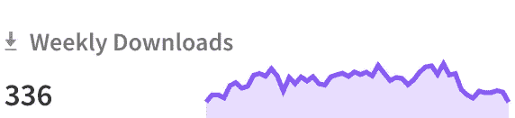

# 使用 React 创建迷你图

> 原文：<https://betterprogramming.pub/creating-sparkline-graphs-with-react-b6c349c80005>

## 制作简单的交互式折线图

照片由[алексарцибашев](https://unsplash.com/@lxrcbsv?utm_source=medium&utm_medium=referral)在 [Unsplash](https://unsplash.com?utm_source=medium&utm_medium=referral)

我目前正在做一个项目，试图跟踪某些滑雪板的价格。所以我想展示一个非常小的折线图，显示一段时间内产品的价格，没有多余的装饰。

我想看看 npm 上的每周下载图表，只是一个轻量级的图表和一些突出显示。它是交互式的，所以如果你把鼠标放在图表上，你可以看到日期和数值。在这个例子中，它是用 svg 绘制的，所以我在寻找一个类似的工具。

bulma-scss 的每周下载量线图

在谷歌上快速搜索一下，就会发现一堆不同的 js 图表解决方案:

*   [d3.js](https://d3js.org/)
*   [chart.js](https://www.chartjs.org/)
*   [CanvasJS](https://canvasjs.com/)

这些都是功能齐全的图表/图形库，您可以完全控制一个图形的所有元素，并可以以您希望的任何方式显示它。如果你想筛选大量的数据，这些就是你要找的工具。

但是对我来说，所有这些对我的项目来说都是多余的，因为我不需要在一个图中有这么多特性，我只需要一个图！我不需要获取实时信息或显示关于图表的深入细节。我所需要的是一个上面有一条线的图表，也许还有一两个工具提示。

在查看图表库的不同特性时，我发现了一种叫做“迷你图”的图表。迷你图也称为“裸”折线图。没有 x/y 轴标签，只有图像。这听起来正是我的项目所需要的。

我找到的最好的选择是[borisyanko/react-sparklines](https://github.com/borisyankov/react-sparklines)项目，它有很多灵活的定制选项，但不幸的是，它缺少我想要的一样东西，那就是像 npm 页面一样的交互式迷你图。

第二个最好的选择是 [fnando/sparklines](https://github.com/fnando/sparkline) ，当你在图形中移动鼠标时，它允许回调，从而提供交互性。这似乎是最轻量级的解决方案——它没有自己的依赖项，可以在任何框架中使用，并且支持交互模式。

下面是挂接到 React 功能组件的代码

上面的代码片段让我创建一个图形，当你移动鼠标时，它会显示一个小工具提示，看起来几乎和你在 npm 页面上看到的一样好。

请在此代码栏中查看它的运行情况。

感谢阅读！

如果你喜欢这篇文章，看看我最近的一些帖子:

 [## 如何使用 Axios 处理 Web 应用程序中的 API 错误

### 我只是控制台。记录它。这就够好了，对吧？

better 编程. pub](/how-to-handle-api-errors-in-your-web-app-using-axios-b32b6c41fd35)